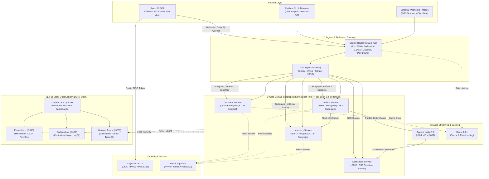

# 🏛️ Enterprise Microservices Architecture

<p align="center">
  
  
  
  
  
  
  
  
  
  
  
</p>

> **Enterprise Multi-Cloud Microservices Platform** built with **Java 21**, **Spring Boot 4.0.8**, and **React 19 + TailwindCSS v4**. Features automated **DHL tracking number generation**, real-time **Cart Abandonment Rate** telemetry, **Saga distributed transactions**, **Istio Service Mesh**, **HashiCorp Vault**, **Keycloak OAuth2/OIDC**, **KEDA v2.21.0 Event-Driven Autoscaling (Kafka Lag & Prometheus RPS)**, and full **DevSecOps automation** across AWS, Azure, GCP, and local Minikube.

**Recommended local resources:** 8 CPU cores and 14 GB RAM free — the full local stack runs ~20+ containers (5 microservices, frontend, Keycloak, Postgres, Kafka, Redis, and the Grafana LGTM observability stack).

---

## 🏛️ Master Architecture Diagram


---

## 📚 Enterprise Documentation Hub & Architecture Blueprint

In-depth architectural specifications, multi-cloud topologies, operational runbooks, and quality gates are organized into **4 specialized pillars** under [`docs/`](./docs):

### 🧭 Navigation Matrix by Role


### 📑 Master Documentation Catalog

| Pillar | Focus & Key Contents | Core Documents | Target Audience |
| :--- | :--- | :--- | :--- |
| **01. Architecture** | Domain-Driven Design (DDD), Saga compensation, Keycloak 26 IAM, Vault secrets, React 19 context, multi-cloud infrastructure topologies (AWS, Azure, GCP), formalized Architecture Decision Records (ADRs), enterprise API design (RFC 7807 & GraphQL), and Business Continuity / Disaster Recovery (BCDR). | • [ARCHITECTURE.md](./docs/01-architecture/ARCHITECTURE.md)<br/>• [DISASTER_RECOVERY_STRATEGY.md](./docs/01-architecture/DISASTER_RECOVERY_STRATEGY.md)<br/>• [API_DESIGN_AND_CONTRACTS.md](./docs/01-architecture/API_DESIGN_AND_CONTRACTS.md)<br/>• [Architecture Decision Records (ADRs)](./docs/01-architecture/adr/README.md)<br/>• [MULTI_CLOUD_INFRASTRUCTURE.md](./docs/01-architecture/MULTI_CLOUD_INFRASTRUCTURE.md) | Software Architects, Developers |
| **02. Operations** | Docker Compose (15 services), Minikube cluster setup, Istio service mesh, `platform.ps1` CLI reference, Cloudflare Zero-Trust Tunnels, Helm Canary rollouts, and lightweight deployment patterns (ECS Fargate & EC2 Ansible). | • [LOCAL_DEPLOYMENT.md](./docs/02-operations/LOCAL_DEPLOYMENT.md)<br/>• [LIGHTWEIGHT_DEPLOYMENT_PATTERNS.md](./docs/02-operations/LIGHTWEIGHT_DEPLOYMENT_PATTERNS.md)<br/>• [PLATFORM_CLI_REFERENCE.md](./docs/02-operations/PLATFORM_CLI_REFERENCE.md)<br/>• [CLOUDFLARE_TUNNELS.md](./docs/02-operations/CLOUDFLARE_TUNNELS.md)<br/>• [HELM_AND_CANARY.md](./docs/02-operations/HELM_AND_CANARY.md) | DevOps, Platform Engineers, SysAdmins |
| **03. DevSecOps & Testing** | Multi-CI/CD pipelines (GitHub Actions 12-stage, Azure DevOps 14-stage, Bitbucket 14-stage), Quality Gates (DoR/DoD), Newman contract tests, k6 load testing, OWASP ZAP DAST, Git workflows, and enterprise DevSecOps governance model & RACI matrix. | • [DEVSECOPS_GOVERNANCE_AND_MODEL.md](./docs/03-devsecops-and-testing/DEVSECOPS_GOVERNANCE_AND_MODEL.md)<br/>• [DEVSECOPS_PIPELINES.md](./docs/03-devsecops-and-testing/DEVSECOPS_PIPELINES.md)<br/>• [QUALITY_GATES_AND_DOD.md](./docs/03-devsecops-and-testing/QUALITY_GATES_AND_DOD.md)<br/>• [DYNAMIC_AND_CHAOS_TESTING.md](./docs/03-devsecops-and-testing/DYNAMIC_AND_CHAOS_TESTING.md)<br/>• [GIT_WORKFLOW_AND_COLLABORATION.md](./docs/03-devsecops-and-testing/GIT_WORKFLOW_AND_COLLABORATION.md) | SecOps, QA Engineers, Cloud Engineers, Architects |
| **04. Observability** | Full-stack LGTM telemetry handbook: PromQL queries (RED metrics, JVM, funnels), LogQL (Loki correlation), and TraceQL (Tempo distributed spans). | • [OBSERVABILITY_QUERIES.md](./docs/04-observability/OBSERVABILITY_QUERIES.md) | SRE, Operations Engineers |
| **API Collections** | Unified Newman & Postman API suite with Federation v2 queries, Keycloak login flows, and end-to-end order orchestration. | • [Postman Collection](./devsecops/testing/newman/microservices.postman_collection.json) | API Developers, QA |

### ⚡ Quick-Start Learning Pathways by Engineering Role

Select the recommended reading sequence tailored to your day-to-day responsibilities:

- **💻 Backend & Frontend Developers:**
  1. [01. System Architecture](./docs/01-architecture/ARCHITECTURE.md): Master domain boundaries, Saga transactions, and GraphQL federation schema.
  2. [02. Local Deployment Runbook](./docs/02-operations/LOCAL_DEPLOYMENT.md): Spin up the local Minikube cluster or Docker Compose stack in minutes.
  3. [03. Quality Gates & DoD](./docs/03-devsecops-and-testing/QUALITY_GATES_AND_DOD.md): Review acceptance criteria, pre-PR local maturity checks, and the unified PR template.

- **🛡️ DevSecOps, SRE & QA Engineers:**
  1. [03. DevSecOps Governance & Model](./docs/03-devsecops-and-testing/DEVSECOPS_GOVERNANCE_AND_MODEL.md): End-to-end 5-phase delivery model, BPMN lifecycle, role profiles, and organizational RACI matrix.
  2. [03. CI/CD Pipelines](./docs/03-devsecops-and-testing/DEVSECOPS_PIPELINES.md): Multi-cloud pipeline engine (GitHub Actions 12-stage, Azure DevOps 14-stage, Bitbucket 14-stage) and static checks (Gitleaks, Semgrep, Trivy, OPA).
  3. [03. Dynamic & Chaos Testing](./docs/03-devsecops-and-testing/DYNAMIC_AND_CHAOS_TESTING.md): Run Newman contract regressions, k6 performance/SLO gates, and OWASP ZAP DAST scans.
  4. [04. Observability Handbook](./docs/04-observability/OBSERVABILITY_QUERIES.md): Query metrics (PromQL), logs (LogQL), and distributed spans (TraceQL) across the Grafana LGTM stack.
  5. [02. Cloudflare Tunnels](./docs/02-operations/CLOUDFLARE_TUNNELS.md): Expose local or staging endpoints securely to remote GitHub Actions runners.

- **☁️ Cloud Platform & Infrastructure Architects:**
  1. [01. Multi-Cloud Infrastructure](./docs/01-architecture/MULTI_CLOUD_INFRASTRUCTURE.md): Review Terraform modules, provider architectures (AWS EKS, Azure AKS, GCP GKE), remote backends, and state locks.
  2. [02. Platform CLI Reference](./docs/02-operations/PLATFORM_CLI_REFERENCE.md): Single operational tool for cluster lifecycles, secrets, and canary routing.
  3. [02. Helm Chart & Canary Releases](./docs/02-operations/HELM_AND_CANARY.md): Manage Umbrella Helm chart delivery, OCI registries, and Istio canary traffic splitting.
  4. [03. Git Workflow & Rollbacks](./docs/03-devsecops-and-testing/GIT_WORKFLOW_AND_COLLABORATION.md): Release branching, hotfixes, GitOps ArgoCD syncs, and 4-tier disaster recovery.

### 🎨 Visual Architecture Blueprint

All visual architectural views are maintained in [`docs/Diagrams.drawio`](./docs/Diagrams.drawio) (viewable via [draw.io](https://app.diagrams.net/) or VS Code Draw.io extension):

| Tab # | View Name | Architectural Scope |
| :---: | :--- | :--- |
| **01** | *General Architecture & Microservices* | High-level topology across Client, Edge Nginx, Cosmo Router Gateway, Core Domain Microservices, Kafka Broker, PostgreSQL DBs, and LGTM Observability stack. |
| **02** | *HashiCorp Vault - Zero-Touch Security Architecture* | Zero-trust secrets management with Vault KV-v2 engine, Kubernetes Auth Method, AppRole authentication, dynamic secret injection, and least-privilege policies. |
| **03** | *Sequence - Dynamic Database Secret Rotation* | Detailed sequence diagram of automated dynamic PostgreSQL database credentials generation, lease lifecycle, and Spring Boot connection renewal. |
| **04** | *Istio Service Mesh & Zero-Trust mTLS* | Istio Ingress Gateway, Envoy sidecar injection, STRICT mutual TLS (`mTLS`), VirtualServices, DestinationRules, and Kiali mesh visualization. |
| **05** | *Secret Isolation & Configuration Precedence* | Three-tier configuration precedence and security boundaries across environment variables, HashiCorp Vault, and Kubernetes ConfigMaps. |
| **06** | *Kubernetes & Minikube Cluster Topology* | Multi-namespace architecture (`dev`, `istio-system`, `vault`, `observability`, `cert-manager`), NodePort mappings, resource limits, and persistent storage. |
| **07** | *End-to-End Request Flow & Order Processing Sequence* | Complete synchronous and asynchronous transaction flow: Keycloak JWT validation, Cosmo Router supergraph resolution, Saga orchestration, and Kafka notification dispatch. |
| **08** | *Mature E-Commerce Observability Architecture* | Unified LGTM telemetry pipeline: OpenTelemetry Collector, Prometheus TSDB, Grafana dashboards, Loki log streaming, and Tempo distributed tracing. |
| **09** | *Local DevSecOps Platform & GitHub Actions Delivery* | Pre-commit maturity gates, 7-step CI delivery workflow, SAST (Semgrep, Gitleaks), Trivy container scanning, OPA Conftest, and GitOps synchronization with ArgoCD. |
| **10** | *Resiliency, Secrets, Canary & Alerts* | Resilience4j circuit breakers, Istio Canary traffic shifting (10% to 100%), Alertmanager rules, and chaos resilience simulation. |
| **11** | *Multi-Cloud IaC & CLI Automation Suite* | Unified `platform.ps1` CLI command reference, multi-cloud Terraform workspaces (AWS, Azure, GCP), OpenCost monitoring, and FinOps budgeting. |
| **12** | *Multi-Cloud CI/CD & Recovery Architecture* | Cross-cloud delivery matrix: GitHub Actions (12-stage DevSecOps flow + ArgoCD GitOps), Azure DevOps (14-stage AKS delivery), Bitbucket Pipelines (14-stage GKE delivery), and 4-tier disaster recovery. |

---

## 🔌 Service, Port & Credentials Matrix

The host ports below describe the Docker Compose profile. In Minikube the microservice services are ClusterIP; use the managed frontend/Router/Keycloak port-forwards or create a service-specific `kubectl port-forward` for direct Swagger access. The Postman collection and `smoke.py` use the frontend Nginx proxy for REST routes, so they do not need host forwards for ports `8001`–`8004`. GraphQL and proxied API calls through frontend Nginx share a per-client rate limit (20 requests/second, burst 30); HTTP 429 events and the socket peer IP are written as JSON to container logs and queried from Grafana/Loki.

| Service | Technology | Port | Access URL | Default Credentials |
| :--- | :--- | :---: | :--- | :--- |
| **Keycloak IAM** | Keycloak 26.7.4 (OIDC / OAuth2) | `8181` / `9000` | [http://localhost:8181](http://localhost:8181) | `admin` / `admin` |
| **React Frontend** | React 19 + Tailwind v4 / Nginx | `5173` | [http://localhost:5173](http://localhost:5173) | `admin_user` / `admin` & `basic_user` / `password` |
| **Cosmo Router Gateway** | Cosmo Router 0.353.0 (Go / Federation v2; Orders subgraph v2.5 auth directives) | `8080` (`/graphql`) | [http://localhost:8080](http://localhost:8080) (GraphQL Playground in local mode) | Keycloak JWKS JWT validation, authenticated order fields, bounded query complexity, OTel/Prometheus |
| **Products Service** | Spring Boot 4.0.8 | `8004` | [http://localhost:8004/graphql](http://localhost:8004/graphql) & `/api/product` | Internal Subgraph & REST |
| **Orders Service** | Spring Boot 4.0.8 | `8003` | [http://localhost:8003/graphql](http://localhost:8003/graphql) & `/api/order` | Internal Subgraph & REST |
| **Inventory Service** | Spring Boot 4.0.8 | `8001` | [http://localhost:8001/graphql](http://localhost:8001/graphql) & `/api/inventory` | Internal Subgraph & REST |
| **Notification Service** | Spring Boot 4.0.8 | `8002` | [http://localhost:8002/api/notifications/stream](http://localhost:8002/api/notifications/stream) | SSE Stream |
| **Kafka Broker** | Apache Kafka (KRaft) 7.8.0 | `9092` / `9094` | `localhost:9092` / `localhost:9094` | SASL PLAIN *(Encrypted network)* |
| **Kafka Exporter** | Prometheus Kafka Exporter 1.9 | `9308` | [http://localhost:9308/metrics](http://localhost:9308/metrics) | *(No auth required)* |
| **Redis & Exporter** | Redis 8.8.1 / Exporter 1.82 | `6379` / `9121` | `localhost:6379` • [`:9121/metrics`](http://localhost:9121/metrics) | *(Password protected)* |
| **PostgreSQL DBs** | PostgreSQL 18 (DB-per-Service) | `5431`–`5435` | `localhost:5431, 5433, 5434, 5435` | `postgres` / `postgres` |
| **Postgres Exporter** | Prometheus Postgres Exporter 0.20 | `9187` | [http://localhost:9187/metrics](http://localhost:9187/metrics) | *(No auth required)* |
| **HashiCorp Vault** | Vault 2.0.4 (KV-v2 / Transit) | `8200` | [http://localhost:8200](http://localhost:8200) | Root Token: `root` |
| **OPA Gatekeeper** | Open Policy Agent Gatekeeper 3.23.0 | `8888` / `8443` | [http://localhost:8888](http://localhost:8888) | *(Admission Webhook / Metrics)* |
| **OpenTelemetry Collector** | OTel Collector Contrib 0.159 | `4317` / `4318` | `localhost:4317` (gRPC) • [`:4318`](http://localhost:4318) (HTTP) | *(OTLP Ingestion)* |
| **Grafana** | Grafana 13.2.1 | `3000` | [http://localhost:3000](http://localhost:3000) | `admin` / `admin` |
| **Prometheus** | Prometheus TSDB 3.14.0 | `9090` | [http://localhost:9090/targets](http://localhost:9090/targets) | *(No auth required)* |
| **Loki** | Grafana Loki 3.7.4 | `3100` | `localhost:3100` | *(Via Grafana datasource)* |
| **Tempo** | Grafana Tempo 3.0.3 | `3200` | `localhost:3200` | *(Via Grafana datasource)* |
| **Alloy** | Grafana Alloy 1.19.1 | `3300` | `localhost:3300` (Compose UI) | *(Log collector; not a Grafana datasource)* |
| **Istio Ingress Gateway** | Envoy Proxy (Istio 1.31.1) | `80` / `443` | [http://localhost](http://localhost) | Mesh Ingress |
| **Kiali Dashboard** | Kiali 2.31.0 | `20001` | [http://localhost:20001](http://localhost:20001) | *(No auth required)* |
| **OpenCost Dashboard** | OpenCost 2.5.32 | `7000` | [http://localhost:7000](http://localhost:7000) | *(No auth required)* |

> 📘 **Cosmo Router Capabilities:** Security, complexity limits, observability, resilience settings, and deferred capabilities are tracked in [docs/01-architecture/ARCHITECTURE.md](./docs/01-architecture/ARCHITECTURE.md#-cosmo-router-hardening--gateway-capabilities).

### 📖 API Exploration & Interactive Documentation Matrix

The platform separates **Unified Federated GraphQL Supergraph exploration** from **Microservice REST API documentation**:

| Interface | Protocol / Tool | Direct Access URL | Scope & Capabilities |
| :--- | :--- | :--- | :--- |
| 🚀 **Cosmo Router local composition** | `wgc@0.132.0` + Federation v2 (Orders v2.5) | [http://localhost:8080](http://localhost:8080) | Composes local subgraph SDL without a Cosmo Cloud account; local mode exposes the GraphQL Playground and schema introspection. |
| 📖 **Products Swagger UI** | OpenAPI 3.0 (SpringDoc) | [http://localhost:8004/swagger-ui.html](http://localhost:8004/swagger-ui.html) | OpenAPI v3 interactive UI for Products REST endpoints (`/api/product/**`, `/v3/api-docs`). |
| 📖 **Orders Swagger UI** | OpenAPI 3.0 (SpringDoc) | [http://localhost:8003/swagger-ui.html](http://localhost:8003/swagger-ui.html) | OpenAPI v3 interactive UI for Orders REST endpoints, funnel telemetry (`/api/order/funnel`), and idempotency headers. |
| 📖 **Inventory Swagger UI** | OpenAPI 3.0 (SpringDoc) | [http://localhost:8001/swagger-ui.html](http://localhost:8001/swagger-ui.html) | OpenAPI v3 interactive UI for Inventory REST endpoints (`/api/inventory/**`, `/v3/api-docs`). |
| 📖 **Notification Swagger UI** | OpenAPI 3.0 (SpringDoc) | [http://localhost:8002/swagger-ui.html](http://localhost:8002/swagger-ui.html) | OpenAPI v3 interactive UI for Notifications & SSE stream endpoint (`/api/notifications/stream`). |

---

## ⚡ Core Enterprise Capabilities

### 🛒 E-Commerce & Retail Innovation
* **Automated DHL Tracking Generation:** Every successfully placed order automatically generates a trackable carrier tracking number (e.g. `DHL-A8B9C0D1`) and initial tracking event history.
* **Cart Abandonment Rate Telemetry:** Asynchronous funnel telemetry (`CART_ADD` $\rightarrow$ `CHECKOUT_START` $\rightarrow$ `CHECKOUT_STEP` $\rightarrow$ `PLACED`) published to Kafka, feeding live Prometheus gauges and Grafana BI conversion funnels.
* **Point of Sale (POS) & QR Scanner:** Dual workflow supporting standard checkout and physical POS cashier operations with Code-128 barcode scanning and instant SAT/CFDI invoice QR generation.

### 🔄 Distributed Reliability & Consistency
* **Saga Orchestration Pattern:** Graceful compensation and stock rollback when downstream payment or inventory allocation fails.
* **Distributed Idempotency:** Guaranteed once-only order processing via mandatory UUIDv4 `X-Idempotency-Key` headers backed by Redis deduplication.
* **Resilience4j Circuit Breakers:** Protects upstream callers with automatic state transitions (`CLOSED` $\rightarrow$ `OPEN` $\rightarrow$ `HALF_OPEN`) and thread-isolated bulkheads.

### 🛡️ Zero-Trust Security & DevSecOps
* **OIDC Authentication:** Public Keycloak SPA client (`microservices_frontend`) using PKCE without a browser-held `client_secret`; a native mobile app needs its own redirect URI configuration.
* **Centralized Secrets with HashiCorp Vault:** Dynamic secret generation and encryption-as-a-service (Transit Engine) replacing static environment variables.
* **Policy-as-Code (OPA & Gatekeeper):** Automated admission controller rules blocking privileged containers, enforced CPU/memory limits, and mandatory labels.

### 📊 Full-Stack Observability (LGTM Stack)
* **Pre-Provisioned Grafana Dashboards:**
  1. `🏢 Business Intelligence & Inventory Operations` (Net revenue, completed orders, AOV, Cart Abandonment Rate, SKU demand, cohort retention).
  2. `🛡️ Technical, Infrastructure & Security Operations (SRE)` (Golden signals, P95 latency, circuit breaker states, HikariCP pools, JVM Heap, threat level).
* **Deep Telemetry Correlation:** One-click drill-down in Grafana Explore linking Tempo distributed spans $\leftrightarrow$ Loki structured logs $\leftrightarrow$ Prometheus metrics.

---

## 🚀 Quick Start (Up in 3 Minutes)

### Option A: Local Docker Compose (15 Services)

The fastest way to spin up the complete ecosystem including all microservices, databases, Keycloak, Vault, and Grafana:

```powershell
# 1. Clone the repository
git clone https://github.com/georgegxx/microservices-architecture.git
cd microservices-architecture

# 2. Copy environment file if not already present and define the passwords
cp .example.env .env

# 3. Start Keycloak and its database in detached mode
docker compose up -d --build keycloak

# 4. Native PowerShell script (auto-syncs client secret into .env):
pwsh -File .\scripts\bootstrap-keycloak.ps1

# 5. Launch all 15 services in detached mode:
docker compose up -d --build

# 6. Verify healthy startup across all containers:
docker compose ps

# 7. Graceful shutdown & volume teardown
docker compose down -v
```

---

### Option B: Local Kubernetes on Minikube (Enterprise DevSecOps)

To deploy the entire production-grade stack on Minikube with **Istio Service Mesh**, **OPA Gatekeeper**, and **Helm**:

```powershell
# 1. Host CLI Audit & Automated Winget Installation
.\platform.ps1 tools

# 2. Start Minikube, initialize Istio Service Mesh, and deploy the umbrella Helm chart:
.\platform.ps1 up -Platform minikube -Environment dev -WithIstio

# 3. Audit platform health, pods, NodePorts, and Gatekeeper OPA policies:
.\platform.ps1 doctor -Platform minikube -Environment dev

# 4 Check all pods running
kubectl get pods -A
kubectl get pods -n dev # observability, auth, data, ..

# 5. Destroy the entire stack:
.\platform.ps1 down -Destroy
```

> 📘 **Step-by-step Minikube guide:** Detailed hardware allocation, network topologies, and DNS setup are available in [docs/02-operations/LOCAL_DEPLOYMENT.md](./docs/02-operations/LOCAL_DEPLOYMENT.md).
---

## 🧪 Automated Testing & Simulation Suite

The platform provides a comprehensive suite of Python and PowerShell scripts to validate health, contract integrity, load simulation, and telemetry:

```powershell
# 1. Functional smoke checks (may place one test order)
python scripts/testing/smoke.py

# 2. Legitimate E-Commerce User Traffic Simulation
python scripts/testing/simulate.py --scenario traffic --orders 15 --concurrency 3

# 3. Unified component and telemetry diagnostics (read-only)
python scripts/testing/diagnose.py all

# 4. Read-only authenticated order-list diagnostic (requires Keycloak client secret)
python scripts/testing/diagnose.py orders-readonly

# 5. Read-only deployment gate against Router and storefront independently
python scripts/testing/smoke.py --deployment --base-url http://localhost:8080 --frontend-url http://localhost:5173

# 6. Grafana dashboard generation (publishing requires explicit --push)
python scripts/grafana.py dashboards

# Seed the Grafana funnel panel with explicit demo CART_ADD events
python scripts/grafana.py funnel-demo --count 30 --category Electronics

# 7. Newman API Contract Suite (20 Requests)
npx --yes newman run devsecops/testing/newman/microservices.postman_collection.json `
  --env-var "BASE_URL=http://localhost:8080" `
  --env-var "keycloak_url=http://localhost:8181" `
  --reporters cli
```

---

## 🛍️ Modernized Storefront Architecture (React 19 & TailwindCSS v4)

The presentation layer (`http://localhost:5173`) has been re-architected following enterprise e-commerce best practices:

- **Context-Aware Search:** The header search filters the product catalog and opens the quick command palette; Orders & Tracking keeps one order-history search, and Admin has filters scoped to each management table. The header search is hidden on the Orders view to avoid showing two search fields at once.
- **Enterprise Wishlist Persistence:** Adheres to mature e-commerce identity patterns—guest users are seamlessly prompted to authenticate via Keycloak to save items, while authenticated customers have their favorites safely persisted across sessions and devices.
- **Role-Based Telemetry & Admin Controls:** Administrative tools (QR/Barcode Scanner for inventory auditing, Admin Telemetry tab, warehouse controls) are strictly restricted to users holding the `ADMIN` role.
- **Scoped Notification Feed:** Real-time Server-Sent Events (SSE) from `notification-service` are isolated per authenticated user profile to protect transactional privacy (order confirmation, DHL tracking, stock alerts).
- **Responsive Pagination:** Full, responsive pagination controls with items-per-page selectors and page counters across both the public product catalog and the administrative data tables.

---

## 📁 Repository Structure

```text
microservices-architecture/
├── .github/workflows/              # GitHub Actions service CI, registry, GitOps and Terraform workflows
├── ansible/                        # 🤖 Ansible Automation for Compact Host Deployments
│   ├── inventory/hosts.ini         # Dynamic EC2 host inventory
│   ├── playbooks/deploy-compact-stack.yml # Master Docker, UFW, Systemd deployment
│   └── templates/                  # Compose stack & multi-DB initialization
├── cosmo-router/                  # Cosmo Router 0.353.0 (Port 8080 • Federation v2)
├── argocd                          # GitOps and CD Deployments
├── azure-devops                    # Azure DevOps Pipeline YAML files
├── devsecops/                      # Centralized DevSecOps Hub
│   ├── compliance/trivy/           # Trivy container scanner configuration
|   ├── dast/zap/                   # OWASP ZAP baseline rules and profiles
│   ├── policies/                   # OPA Rego Conftest & Gatekeeper constraints
|   ├── sast/gitleaks/              # Gitleaks and Semgrep static security configs
│   └── testing/newman/             # Newman JSON export (20 requests) + Postman collection tree
├── docs/                           # 📚 Enterprise Platform Documentation (4 Specialized Pillars)
│   ├── 01-architecture/            # 🏗️ System Design, Domain Microservices, Vault & Multi-Cloud
│   │   ├── adr/                    # Architecture Decision Records (ADRs: ADR-001 - ADR-010)
│   │   ├── API_DESIGN_AND_CONTRACTS.md # RESTful OpenAPI 3.0 & RFC 7807 Problem Details standards
│   │   ├── ARCHITECTURE.md
│   │   ├── DISASTER_RECOVERY_STRATEGY.md # Business Continuity, Warm Standby DR, RTO/RPO SLAs
│   │   └── MULTI_CLOUD_INFRASTRUCTURE.md
│   ├── 02-operations/              # 🚀 Operations, Local Minikube, Platform CLI & Cloudflare Tunnels
│   │   ├── LOCAL_DEPLOYMENT.md
│   │   ├── LIGHTWEIGHT_DEPLOYMENT_PATTERNS.md # AWS ECS Fargate & EC2 Ansible patterns
│   │   ├── PLATFORM_CLI_REFERENCE.md
│   │   ├── CLOUDFLARE_TUNNELS.md
│   │   └── HELM_AND_CANARY.md
│   ├── 03-devsecops-and-testing/   # 🛡️ CI/CD Pipelines, Quality Gates, DoD, k6, Newman & DAST
│   │   ├── DEVSECOPS_PIPELINES.md
│   │   ├── QUALITY_GATES_AND_DOD.md
│   │   ├── DYNAMIC_AND_CHAOS_TESTING.md
│   │   └── GIT_WORKFLOW_AND_COLLABORATION.md
│   ├── 04-observability/           # 📊 Telemetry Handbook, Grafana, PromQL, LogQL & TraceQL
│   │   └── OBSERVABILITY_QUERIES.md
│   ├── reference/                  # 📦 Reference Schemas, IAM Backups, and Cloud Templates
│   │   ├── api-contracts/          # Canonical OpenAPI 3.0 Reference Specification
│   │   ├── iam/realm-export.json
│   │   ├── schemas/POSTGRESQL_18_SCHEMA_AND_QUERIES.sql
│   │   └── aws-eks/
│   ├── liferay-pipeline/           # Reference CI/CD pipelines for Liferay DXP deployments
│   │   ├── README.md
│   │   └── .gitlab-ci.yml
│   └── Diagrams.drawio             # 🎨 12-Page Architectural Blueprint (Draw.io)
├── frontend/                       # React 19 + TailwindCSS v4 SPA (Nginx Distroless)
├── helm/                           # Kubernetes Helm Charts (Umbrella chart & subcharts)
├── inventory-service/              # Stock allocation & verification (Port 8001)
├── k8s/                            # Kubernetes manifests & Istio routing rules
├── notification-service/           # Kafka event consumer & SSE Stream (Port 8002)
├── observability/                  # Grafana LGTM provisioning (Dashboards, Alloy, Loki, Tempo)
├── orders-service/                 # Order orchestration & Saga orchestrator (Port 8003)
├── products-service/               # Product catalog domain (Port 8004)
├── scripts/                        # Enterprise automation scripts (PowerShell & Python)
│   ├── testing/                    # Specialized testing & load simulation (simulate, smoke, verify, check)
│   ├── bootstrap-keycloak.ps1      # Keycloak 26 IAM realm bootstrapper & client secret sync
│   ├── build-all.py                # Concurrent Java & React container image compiler
│   ├── generate-secure-secrets.py  # CSPRNG cryptographic secret & JWT key generator
│   ├── generate_drawio.py          # Programmatic 12-page architectural diagram generator
│   ├── local-cost-estimator.py     # Offline illustrative AWS profile estimate and optional ceiling
│   ├── finops-rightsize.py         # Prometheus 7-day Kubernetes request sizing advisory
│   ├── terraform-cost-delta.py     # Narrow AWS plan delta estimate and unpriced type report
│   ├── validate-opencost.sh        # Render pinned OpenCost and cloud Prometheus charts
│   ├── supervise-tunnels.py        # Resilient background port-forward supervisor daemon
│   ├── grafana.py                  # Grafana dashboard and explicit demo-telemetry CLI
│   └── update_dashboards.py        # Dashboard generation implementation used by grafana.py
├── terraform/                      # Multi-Cloud IaC (AWS, Azure, GCP modules & workspaces)
├── .example.env                    # Example environment file
├── .gitattributes                  # Git attributes file
├── .gitignore                      # Git ignore file
├── .gitleaks.toml                  # Gitleaks configuration file
├── .gitleaksignore                 # Gitleaks ignore file
├── bitbucket-pipelines.yml         # Bitbucket Pipelines CI/CD configuration
├── compose.yaml                    # Local multi-service development stack (15 containers)
├── platform.ps1                    # Enterprise Platform Master CLI Orchestrator
├── pom.xml                         # Maven Multi-Module Reactor (Java 21, Spring Boot 4.0.8)
└── README.md                       # README file
```
---

## 📄 License

This project is licensed under the **MIT License** — see the [LICENSE](LICENSE) file for details.
