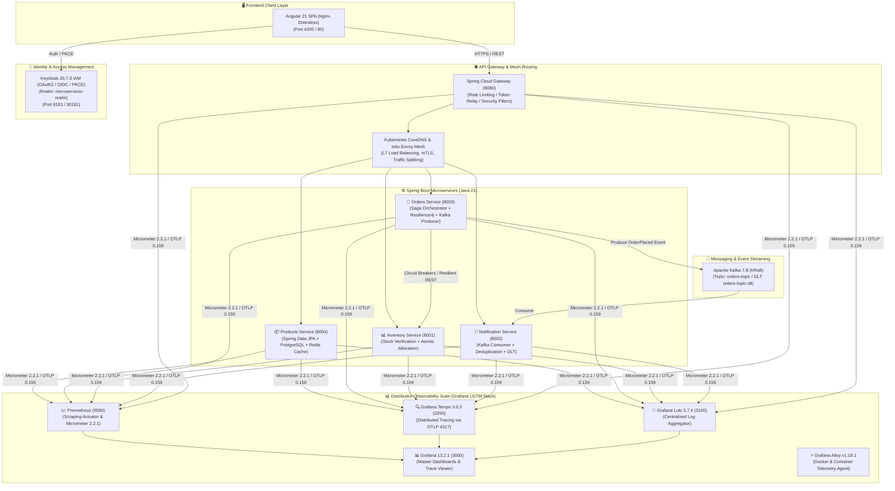
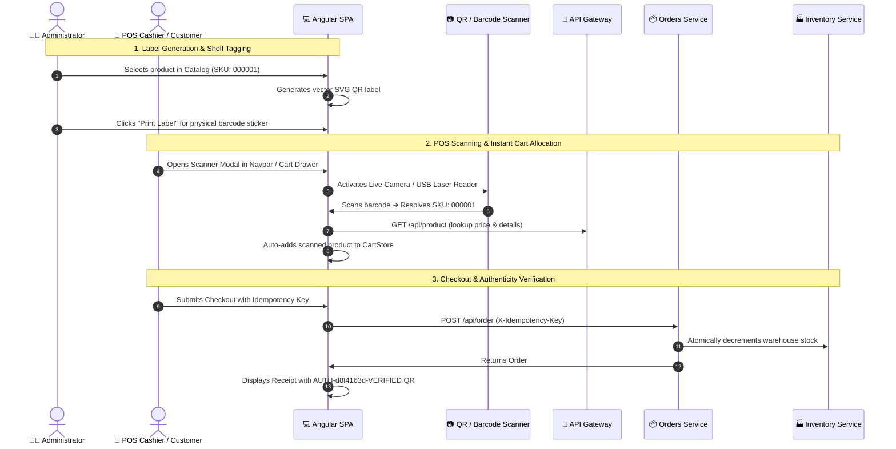
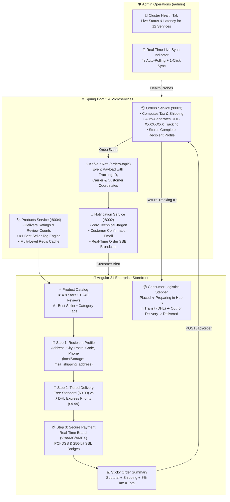
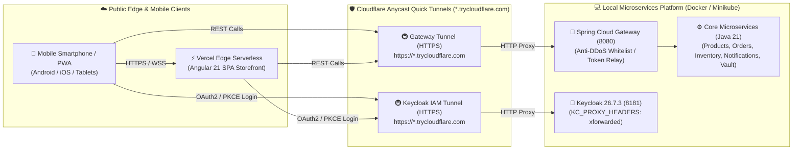
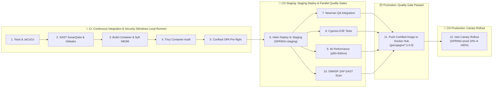
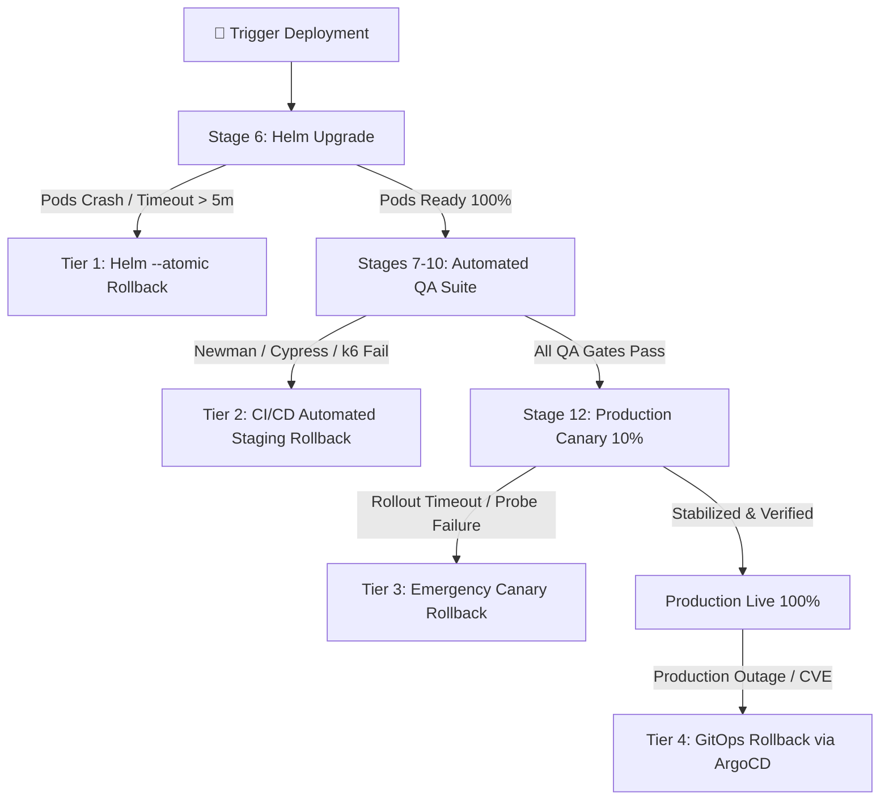

# 🏢 Microservices Architecture: Multi-Cloud (AWS, Azure, GCP) & Multi-CI/CD Platform

Enterprise-grade, distributed microservices platform built with **Java 21 (Spring Boot 4.0.8, Spring Cloud 2025, Spring Cloud Gateway, Kubernetes CoreDNS & Istio Service Mesh)** and **Angular 21 SPA (Nginx Distroless)**.

Designed for true **Multi-Cloud Portability & Multi-CI/CD Automation**:
- ☁️ **Amazon Web Services (AWS)**: Provisioned with **Terraform AWS** (EKS, ECR, RDS PostgreSQL, VPC, ALB, IAM-IRSA) and deployed via **GitHub Actions** (12-Stage Enterprise Pipeline).
- ☁️ **Microsoft Azure Cloud**: Provisioned with **Terraform Azure** (AKS, ACR, PostgreSQL Flexible Server, VNet, KeyVault) and deployed via **Azure DevOps Pipelines** (12-Stage Enterprise Pipeline).
- ☁️ **Google Cloud Platform (GCP)**: Provisioned with **Terraform GCP** (GKE Autopilot, Google Artifact Registry, Cloud SQL PostgreSQL, Cloud Memorystore, VPC) with **Bitbucket Pipelines** (CI DevSecOps) and **ArgoCD** (GitOps Continuous Delivery).

---

> [!TIP]
> 📐 **Interactive Architecture Blueprints ([`docs/Diagrams.drawio`](./docs/Diagrams.drawio)):**
> The platform includes a comprehensive 12-page Draw.io architectural blueprint viewable in VS Code (Draw.io Integration extension) or [app.diagrams.net](https://app.diagrams.net):
> 1. **General Architecture & Microservices** (Full topology: Angular 21, Gateway, Keycloak, 4 Spring Boot Microservices, DBs, Kafka KRaft, Vault, LGTM Observability)
> 2. **HashiCorp Vault - Zero-Touch Security Architecture** (KV-v2 secrets, dynamic DB credentials, Transit encryption, audit logging)
> 3. **Sequence - Dynamic Database Secret Rotation** (Ephemeral PostgreSQL credential generation, 1h lease revocation & pool recovery)
> 4. **Istio Service Mesh & Zero-Trust mTLS** (STRICT mTLS, SPIFFE IDs, Ingress Gateway, Vault PKI Intermediate CA, 90/10 Canary)
> 5. **Secret Isolation & Configuration Precedence** (Property hierarchy across `.env`, Spring Cloud Vault profile, and ESO)
> 6. **Kubernetes & Minikube Cluster Topology** (Namespace segmentation: `dev`, `data`, `auth`, `vault`, `observability`, `istio-system`)
> 7. **End-to-End Request Flow & Order Processing Sequence** (14-step transaction journey: PKCE ➔ Gateway ➔ Orders ➔ Saga/Kafka ➔ Notifications ➔ LGTM)
> 8. **Mature E-Commerce Observability Architecture** (5-dimensional BI, O(1) loyalty cohorts, logistics pipeline, curated Grafana dashboards)
> 9. **Enterprise DevSecOps Platform & 12-Stage Pipeline** (Local Minikube 12-stage CI/CD pipeline, QA/security gates, and Canary rollout)
> 10. **Resiliency, Secrets, Canary & Alerts** (Resilience4j Circuit Breakers, Vault lease renewer, Istio traffic shifting, Alertmanager matrix)
> 11. **Multi-Cloud IaC & CLI Automation Suite** (12-Module Matrix: AWS • Azure • GCP, `platform.ps1` Orchestrator & Scripts Ecosystem)
> 12. **Multi-Cloud CI/CD & Automated Rollback Architecture** (GitHub Actions CI + ArgoCD CD, Azure DevOps, Bitbucket Pipelines, 4-Tier Rollback Engine)

## 🏛️ System Architecture



---

### 🗺️ Architecture Diagrams & Vector Blueprints ([`docs/Diagrams.drawio`](./docs/Diagrams.drawio))

The platform includes a comprehensive, 12-tab architectural blueprint formatted in standard vector XML (compatible with VS Code Draw.io Integration, Diagrams.net, and Draw.io Desktop):

| Tab # | Blueprint Name | Description & Focus Areas |
| :--- | :--- | :--- |
| **Tab 1** | `1. General Architecture & Microservices` | Full ecosystem topology: Frontend SPA, API Gateway, Keycloak (Self-Registration & OIDC PKCE), 4 Spring Boot Microservices, PostgreSQL databases, Kafka KRaft, Redis, Vault, and LGTM Observability with Compulsive Buyer Telemetry. |
| **Tab 2** | `2. HashiCorp Vault - Zero-Touch Security Architecture` | Zero-touch Vault container initialization, KV-v2 secret engine, dynamic database credentials engine, Transit data encryption, file audit logging, and least-privilege policies. |
| **Tab 3** | `3. Sequence - Dynamic Database Secret Rotation` | Step-by-step sequence of ephemeral PostgreSQL user generation, automated revocation upon 1h lease expiration, and transparent connection pool recovery. |
| **Tab 4** | `4. Istio Service Mesh & Zero-Trust mTLS` | STRICT mTLS zero-trust communication across namespace `ecommerce` with SPIFFE IDs, Istio Ingress Gateway, Istiod Citadel CA signed by Vault PKI Intermediate CA, and Canary traffic shaping (90/10). |
| **Tab 5** | `5. Secret Isolation & Configuration Precedence` | Hierarchy of property sources explaining why zero collisions exist between `.env`, Spring Cloud Vault profile, and External Secrets Operator (ESO). |
| **Tab 6** | `6. Kubernetes & Minikube Cluster Topology` | Dedicated namespace isolation: `dev` (Apps & Microservices), `data` (PostgreSQL, Kafka, Redis), `auth` (Keycloak), `vault`, `observability`, and `istio-system` (Mesh Control Plane & Kiali). Includes background supervisor daemon (`platform.ps1 tunnels`). |
| **Tab 7** | `7. End-to-End Request Flow & Order Processing Sequence` | Complete 14-step transaction journey: Angular 21 SPA ➔ Keycloak PKCE (Self-Registration & JWT `sub`/`preferred_username`) ➔ Istio Ingress ➔ API Gateway (Redis Rate Limit & JWT verify) ➔ Orders Service (Multi-Tenant Order Isolation) ➔ Products & Inventory DBs ➔ Kafka Event Bus ➔ Notification Service ➔ LGTM Distributed Telemetry (Compulsive Buyer Velocity Metrics). |
| **Tab 8** | `8. Mature E-Commerce Observability Architecture` | 5-dimensional e-commerce BI, high-cardinality prevention (O(1) discrete loyalty cohorts), conversion funnel, 5-stage logistics state machine, distributed saga resilience, curated Grafana dashboards, and full-stack Prometheus exporters. |
| **Tab 9** | `9. Enterprise DevSecOps Platform & 12-Stage Pipeline` | Complete 12-stage enterprise CI/CD pipeline (Unit Tests, SonarQube/Gitleaks SAST, Syft SBOM, Trivy Soft-Gate, Conftest OPA, Staging Deploy, Newman QA, Cypress E2E, k6 Load Tests, OWASP ZAP DAST, Docker Hub Publish, and Canary Rollout) running 100% locally on Minikube with automated Platform Engineering scripts. |
| **Tab 10** | `10. Resiliency, Secrets, Canary & Alerts` | Resilience4j Circuit Breakers and Retry mechanisms, HashiCorp Vault dynamic database credential lease renewal and revocation, Istio Canary 90/10 traffic shifting, and Alertmanager routing (Slack & Jira). |
| **Tab 11** | `11. Multi-Cloud IaC & CLI Automation Suite` | 12 Core Cloud Modules Matrix across AWS, Azure, and GCP, Unified Platform CLI Orchestrator (`.\platform.ps1`), and comprehensive DevSecOps automation scripts ecosystem (`scripts/`). |
| **Tab 12** | `12. Multi-Cloud CI/CD & Automated Rollback Architecture` | GitHub Actions (CI) + ArgoCD (CD) for AWS/Minikube, Azure DevOps unified 12+ stages for Azure AKS, Bitbucket Pipelines unified 12+ stages for GCP GKE, and 4-tier automated emergency rollback matrix (IaC state locks, GitOps, Helm atomic rollback, and Istio canary fallback). |

---

## 📑 Table of Contents

- [🏢 Microservices Architecture: Multi-Cloud (AWS, Azure, GCP) \& Multi-CI/CD Platform](#-microservices-architecture-multi-cloud-aws-azure-gcp--multi-cicd-platform)
  - [🏛️ System Architecture](#️-system-architecture)
    - [🗺️ Architecture Diagrams \& Vector Blueprints (`docs/Diagrams.drawio`)](#️-architecture-diagrams--vector-blueprints-docsdiagramsdrawio)
  - [📑 Table of Contents](#-table-of-contents)
  - [📁 Repository Structure](#-repository-structure)
  - [🏛️ Domain-Driven Design (DDD) \& Microservices Tactical Patterns](#️-domain-driven-design-ddd--microservices-tactical-patterns)
    - [🧩 1. Bounded Contexts \& Aggregate Roots](#-1-bounded-contexts--aggregate-roots)
    - [🛡️ 2. Functional Programming \& RFC 7807 Error Handling](#️-2-functional-programming--rfc-7807-error-handling)
  - [📡 Microservices Catalog \& API Routing](#-microservices-catalog--api-routing)
  - [🔌 Ports \& Service Matrix](#-ports--service-matrix)
  - [🔐 Identity \& Access Management (Keycloak 26.7.3)](#-identity--access-management-keycloak-2673)
  - [🔒 Secret Management with HashiCorp Vault (Multi-Cloud \& Local)](#-secret-management-with-hashicorp-vault-multi-cloud--local)
    - [1. Approach A: Local Development with Docker Compose (Zero-Touch)](#1-approach-a-local-development-with-docker-compose-zero-touch)
    - [2. Approach B: Native Java Spring Boot Integration (All 5 Services)](#2-approach-b-native-java-spring-boot-integration-all-5-services)
    - [3. Approach C: Kubernetes External Secrets Operator (ESO - Recommended)](#3-approach-c-kubernetes-external-secrets-operator-eso---recommended)
    - [4. Approach D: Kubernetes Multi-Cloud Vault Agent Sidecar Injector](#4-approach-d-kubernetes-multi-cloud-vault-agent-sidecar-injector)
  - [🗺️ Multi-Cloud \& Multi-CI/CD Matrix](#️-multi-cloud--multi-cicd-matrix)
  - [⚡ Modern Angular 21 Reactive SPA Architecture](#-modern-angular-21-reactive-spa-architecture)
  - [🖼️ Dual-Mode Product Media \& Visual Storefront Architecture](#️-dual-mode-product-media--visual-storefront-architecture)
    - [1. 📂 Client-Side Canvas Compression \& Base64 Data URL Engine](#1--client-side-canvas-compression--base64-data-url-engine)
    - [2. 💾 PostgreSQL Unlimited TEXT Persistence \& Redis Cache](#2--postgresql-unlimited-text-persistence--redis-cache)
    - [3. 🎨 High-Fidelity Storefront Visual Integration](#3--high-fidelity-storefront-visual-integration)
  - [🏷️ End-to-End QR Code \& Point of Sale (POS) Workflow](#️-end-to-end-qr-code--point-of-sale-pos-workflow)
  - [🛒 Enterprise E-Commerce \& Logistics Architecture (Amazon \& Mercado Libre)](#-enterprise-e-commerce--logistics-architecture-amazon--mercado-libre)
    - [1. 📦 Multi-Step Checkout \& Persistent Recipient Profile](#1--multi-step-checkout--persistent-recipient-profile)
    - [2. 🚚 Real-Time Logistics Tracking \& Consumer Stepper](#2--real-time-logistics-tracking--consumer-stepper)
    - [3. ⭐ Social Proof, Verified Ratings \& Best Seller Engine](#3--social-proof-verified-ratings--best-seller-engine)
    - [4. 🛡️ Admin Operations Console, Live Sync \& Cluster Health](#4-️-admin-operations-console-live-sync--cluster-health)
    - [5. 🔔 Customer-Centric Notification Center (Zero-Jargon)](#5--customer-centric-notification-center-zero-jargon)
    - [6. 📱 Responsive Media \& Aspect-Ratio Scaling](#6--responsive-media--aspect-ratio-scaling)
  - [📱 Mobile Application \& Google Play Store Architecture Guide](#-mobile-application--google-play-store-architecture-guide)
    - [1. 🚀 Mobile Packaging Options:](#1--mobile-packaging-options)
    - [2. 🔐 Mobile Security \& OIDC Integration:](#2--mobile-security--oidc-integration)
    - [3. 📦 Google Play Store Publication Checklist:](#3--google-play-store-publication-checklist)
  - [🌐 Edge Cloud Tunneling \& Serverless Frontend (Cloudflare \& Vercel)](#-edge-cloud-tunneling--serverless-frontend-cloudflare--vercel)
    - [1. 🚇 Cloudflare Quick Tunnels Automation (`start-cloudflare-tunnels.ps1`)](#1--cloudflare-quick-tunnels-automation-start-cloudflare-tunnelsps1)
    - [2. 🚀 Vercel Monorepo Deployment \& Output Directory Configuration](#2--vercel-monorepo-deployment--output-directory-configuration)
    - [3. 📱 Full-Stack Mobile PWA Responsiveness \& Touch Optimization](#3--full-stack-mobile-pwa-responsiveness--touch-optimization)
  - [✅ Prerequisites](#-prerequisites)
    - [⚙️ Kubernetes Workload Right-Sizing \& Production Resource Allocation](#️-kubernetes-workload-right-sizing--production-resource-allocation)
  - [🛠️ Winget DevSecOps \& Platform CLI Tool Suite](#️-winget-devsecops--platform-cli-tool-suite)
    - [1. IaC \& FinOps](#1-iac--finops)
    - [2. DevSecOps \& Security](#2-devsecops--security)
    - [3. Container \& Kubernetes Orchestration](#3-container--kubernetes-orchestration)
    - [4. Runtimes, Build Tools \& Productivity](#4-runtimes-build-tools--productivity)
  - [💻 Local Standalone Development](#-local-standalone-development)
    - [1. Spring Boot Microservices (Java 21 / Maven)](#1-spring-boot-microservices-java-21--maven)
    - [2. Angular 21 SPA](#2-angular-21-spa)
  - [🚀 Quick Start with Docker Compose](#-quick-start-with-docker-compose)
    - [1. Launch Keycloak (Auth Layer)](#1-launch-keycloak-auth-layer)
    - [2. Bootstrap Keycloak (Clients, Users \& Secrets)](#2-bootstrap-keycloak-clients-users--secrets)
      - [Pre-Configured Test Users:](#pre-configured-test-users)
    - [3. Launch Full Microservices Ecosystem](#3-launch-full-microservices-ecosystem)
    - [4. Useful Docker Compose Commands:](#4-useful-docker-compose-commands)
  - [🛡️ 100% Local Enterprise DevSecOps Platform (12-Stage CI/CD \& Minikube)](#️-100-local-enterprise-devsecops-platform-12-stage-cicd--minikube)
    - [🖥️ Local Platform Endpoints \& Access Matrix](#️-local-platform-endpoints--access-matrix)
    - [⚙️ Platform Operational Lifecycle Commands (Unified Master CLI \& 4 Isolated Versions)](#️-platform-operational-lifecycle-commands-unified-master-cli--4-isolated-versions)
      - [1. Quick Start with Master CLI (`platform.ps1`)](#1-quick-start-with-master-cli-platformps1)
      - [2. Direct Execution of Platform-Specific Scripts](#2-direct-execution-of-platform-specific-scripts)
    - [🛡️ DevSecOps \& Governance Hub](#️-devsecops--governance-hub)
      - [📂 Directory Structure](#-directory-structure)
      - [⚙️ Security Operating Modes: Audit vs. Enforce](#️-security-operating-modes-audit-vs-enforce)
      - [🚀 Deployment \& Operations Guide: 100% Local Enterprise DevSecOps on Minikube](#-deployment--operations-guide-100-local-enterprise-devsecops-on-minikube)
        - [📋 1. Resource Allocation \& Minikube Startup](#-1-resource-allocation--minikube-startup)
        - [🐳 2. Docker Hub Authentication \& Secrets Configuration](#-2-docker-hub-authentication--secrets-configuration)
        - [🏗️ 3. Platform Deployment with Terraform](#️-3-platform-deployment-with-terraform)
        - [🛡️ 4. Apply Gatekeeper Templates \& Constraints](#️-4-apply-gatekeeper-templates--constraints)
        - [🏃 5. Launch the GitHub Actions Self-Hosted Runner](#-5-launch-the-github-actions-self-hosted-runner)
        - [🔄 6. The 12-Stage Enterprise Pipeline Execution](#-6-the-12-stage-enterprise-pipeline-execution)
        - [🎯 7. Transitioning to Maturity Mode (Strict Enforce / Hard-Gate)](#-7-transitioning-to-maturity-mode-strict-enforce--hard-gate)
  - [☸️ Local Kubernetes Deployment (Minikube, Istio Mesh \& Canary Operations)](#️-local-kubernetes-deployment-minikube-istio-mesh--canary-operations)
    - [1. 🚀 One-Shot Cluster Deployment](#1--one-shot-cluster-deployment)
    - [2. 🔍 Verify Mesh Health \& Zero-Trust Policies](#2--verify-mesh-health--zero-trust-policies)
    - [3. 🌐 Open Local Browser Tunnels \& Endpoint Access](#3--open-local-browser-tunnels--endpoint-access)
    - [4. 🔀 Traffic Routing \& Progressive Canary Rollouts](#4--traffic-routing--progressive-canary-rollouts)
    - [5. 🛑 Cluster Teardown \& Resource Cleanup](#5--cluster-teardown--resource-cleanup)
    - [Useful commands](#useful-commands)
  - [🧪 Automated Testing, Load Simulation \& Chaos Engineering](#-automated-testing-load-simulation--chaos-engineering)
    - [1. 🛒 Legitimate E-Commerce Traffic Generator (`simulate.py --scenario traffic`)](#1--legitimate-e-commerce-traffic-generator-simulatepy---scenario-traffic)
    - [2. ⚡ Resilience4j Circuit Breaker State Verification](#2--resilience4j-circuit-breaker-state-verification)
      - [Step-by-Step Test Procedure:](#step-by-step-test-procedure)
        - [🔴 Step A: Trip Circuit Breaker into OPEN (Red `#ef4444`)](#-step-a-trip-circuit-breaker-into-open-red-ef4444)
        - [🟡 Step B: Observe Transition into HALF\_OPEN (Yellow `#f59e0b`)](#-step-b-observe-transition-into-half_open-yellow-f59e0b)
        - [🟢 Step C: Restore Backend Health and Return to CLOSED (Green `#10b981`)](#-step-c-restore-backend-health-and-return-to-closed-green-10b981)
    - [3. 💥 Chaos Engineering \& Fault Injection (`simulate.py --scenario chaos`)](#3--chaos-engineering--fault-injection-simulatepy---scenario-chaos)
    - [4. 🛡️ DDoS \& Rate Limiting Stress Attacks (`simulate.py --scenario ddos`)](#4-️-ddos--rate-limiting-stress-attacks-simulatepy---scenario-ddos)
    - [5. 🔍 Automated Smoke Tests \& OpenAPI Auditing](#5--automated-smoke-tests--openapi-auditing)
    - [6. 📉 Cart Abandonment Rate KPI Verification \& Testing](#6--cart-abandonment-rate-kpi-verification--testing)
      - [Step-by-Step Testing Procedures (3 Verified Methods):](#step-by-step-testing-procedures-3-verified-methods)
        - [🚀 Method 1: Instant CLI / PowerShell Event Injection (Simulate Mass Abandonment)](#-method-1-instant-cli--powershell-event-injection-simulate-mass-abandonment)
        - [🖥️ Method 2: Interactive Browser Testing via Angular Frontend SPA](#️-method-2-interactive-browser-testing-via-angular-frontend-spa)
        - [⚡ Method 3: Multi-Threaded Realistic Funnel Generation (`simulate.py --scenario traffic`)](#-method-3-multi-threaded-realistic-funnel-generation-simulatepy---scenario-traffic)
    - [📦 Postman Test Suite:](#-postman-test-suite)
  - [📊 Full-Stack Observability \& Telemetry (Grafana LGTM Stack)](#-full-stack-observability--telemetry-grafana-lgtm-stack)
      - [🗄️ Standardized Grafana Datasources (Explore \& Dashboards)](#️-standardized-grafana-datasources-explore--dashboards)
    - [1. 📈 Prometheus (Metrics \& PromQL) — Datasource: `Prometheus` (UID: `prometheus-ds`)](#1--prometheus-metrics--promql--datasource-prometheus-uid-prometheus-ds)
    - [2. 📜 Grafana Loki (Centralized Logs \& LogQL) — Datasource: `Loki` (UID: `loki-ds`)](#2--grafana-loki-centralized-logs--logql--datasource-loki-uid-loki-ds)
    - [3. 🔍 Grafana Tempo (Distributed Traces \& TraceQL) — Datasource: `Tempo` (UID: `tempo-ds`)](#3--grafana-tempo-distributed-traces--traceql--datasource-tempo-uid-tempo-ds)
    - [4. 📊 Pre-Provisioned Universal Grafana Dashboards](#4--pre-provisioned-universal-grafana-dashboards)
      - [🎯 Dynamic Interactive Filtering (`Filter Microservice`)](#-dynamic-interactive-filtering-filter-microservice)
      - [🏢 A. Business Intelligence \& Inventory Operations (`business-operations-dashboard.json`)](#-a-business-intelligence--inventory-operations-business-operations-dashboardjson)
      - [🛡️ B. Technical, Infrastructure \& Security Operations (`technical-security-dashboard.json`)](#️-b-technical-infrastructure--security-operations-technical-security-dashboardjson)
  - [🛡️ Production-Grade Cluster Resiliency \& Advanced Operations](#️-production-grade-cluster-resiliency--advanced-operations)
    - [1. ⚖️ Horizontal Pod Autoscaling (HPA) \& PodDisruptionBudgets (PDB)](#1-️-horizontal-pod-autoscaling-hpa--poddisruptionbudgets-pdb)
    - [2. 🔐 External Secrets Operator (ESO) \& HashiCorp Vault Synchronization](#2--external-secrets-operator-eso--hashicorp-vault-synchronization)
    - [3. 🌐 Progressive Canary Deployments in Istio Service Mesh](#3--progressive-canary-deployments-in-istio-service-mesh)
    - [4. 🚨 Alertmanager Alert Routing (Local Default, Slack \& Jira Ready)](#4--alertmanager-alert-routing-local-default-slack--jira-ready)
  - [🔄 Automated \& Manual Rollback Operations Guide (Multi-Cloud \& Multi-CI/CD)](#-automated--manual-rollback-operations-guide-multi-cloud--multi-cicd)
    - [1. 🛡️ The 4-Tier Automated Rollback Engine](#1-️-the-4-tier-automated-rollback-engine)
    - [2. 🕹️ How to Execute Manual Rollbacks (CLI \& UI Runbooks)](#2-️-how-to-execute-manual-rollbacks-cli--ui-runbooks)
      - [A. Direct Kubernetes / Helm CLI (Universal):](#a-direct-kubernetes--helm-cli-universal)
      - [B. GitOps Rollback in ArgoCD:](#b-gitops-rollback-in-argocd)
      - [C. GitHub Actions:](#c-github-actions)
      - [D. Azure DevOps:](#d-azure-devops)
      - [E. Bitbucket Pipelines:](#e-bitbucket-pipelines)
  - [☁️ Terraform Multi-Cloud Infrastructure (AWS, Azure, GCP)](#️-terraform-multi-cloud-infrastructure-aws-azure-gcp)
    - [1. AWS Provider (Amazon EKS / RDS / VPC)](#1-aws-provider-amazon-eks--rds--vpc)
    - [2. Azure Provider (Azure AKS / ACR / PostgreSQL)](#2-azure-provider-azure-aks--acr--postgresql)
    - [3. GCP Provider (Google GKE / Artifact Registry / Cloud SQL)](#3-gcp-provider-google-gke--artifact-registry--cloud-sql)
  - [☁️ Multi-Cloud Terraform 12-Module Matrix (AWS • Azure • GCP)](#️-multi-cloud-terraform-12-module-matrix-aws--azure--gcp)
  - [☁️ Enterprise AWS Architecture Reference Suite (`devsecops/reference/aws-eks/`)](#️-enterprise-aws-architecture-reference-suite-devsecopsreferenceaws-eks)
    - [Included Reference Architecture Templates](#included-reference-architecture-templates)
    - [🛠️ AWS Blueprint Step-by-Step Activation Guide](#️-aws-blueprint-step-by-step-activation-guide)
      - [1. AWS IAM OIDC Configuration (Zero-Trust)](#1-aws-iam-oidc-configuration-zero-trust)
      - [2. Frontend S3 \& CloudFront Setup](#2-frontend-s3--cloudfront-setup)
      - [3. Deploying to Amazon EKS via GitHub Actions](#3-deploying-to-amazon-eks-via-github-actions)
      - [4. Deploying to Amazon EKS via ArgoCD](#4-deploying-to-amazon-eks-via-argocd)
  - [🤖 Multi-CI/CD \& GitOps Automation](#-multi-cicd--gitops-automation)
    - [1. GitHub Actions ➔ AWS Cloud](#1-github-actions--aws-cloud)
    - [2. Azure DevOps Pipelines ➔ Azure Cloud](#2-azure-devops-pipelines--azure-cloud)
    - [3. Bitbucket Pipelines (CI) + ArgoCD (GitOps CD) ➔ GCP](#3-bitbucket-pipelines-ci--argocd-gitops-cd--gcp)
  - [🔄 Multi-Cloud CI/CD \& Automated Rollback Architecture](#-multi-cloud-cicd--automated-rollback-architecture)
    - [1. GitHub Actions (CI) + ArgoCD (CD) - AWS \& Minikube](#1-github-actions-ci--argocd-cd---aws--minikube)
    - [2. Azure DevOps - Single Unified Pipeline (Azure Cloud)](#2-azure-devops---single-unified-pipeline-azure-cloud)
    - [3. Bitbucket Pipelines - Single Unified Pipeline (Google Cloud Platform)](#3-bitbucket-pipelines---single-unified-pipeline-google-cloud-platform)
    - [4. Automated Rollback \& Incident Recovery Summary](#4-automated-rollback--incident-recovery-summary)
  - [🚀 Enterprise Platform Unified CLI (`platform.ps1`)](#-enterprise-platform-unified-cli-platformps1)
    - [📋 Complete Combinations Reference Guide](#-complete-combinations-reference-guide)
      - [1. 🚀 Bootstrap \& Deployment (`up` / `bootstrap`)](#1--bootstrap--deployment-up--bootstrap)
      - [2. ⏸️ Teardown, Pause \& Cluster Purge (`down` / `stop` / `destroy`)](#2-️-teardown-pause--cluster-purge-down--stop--destroy)
      - [3. 📝 Terraform Infrastructure Planning \& Apply (`plan` / `apply`)](#3--terraform-infrastructure-planning--apply-plan--apply)
      - [4. 🔄 Automated Emergency Rollbacks (`rollback`)](#4--automated-emergency-rollbacks-rollback)
      - [5. 🔍 Health Diagnostics \& Verification (`doctor` / `verify` / `status`)](#5--health-diagnostics--verification-doctor--verify--status)
      - [6. 💰 FinOps Cloud Cost Breakdown \& Savings (`cost` / `finops`)](#6--finops-cloud-cost-breakdown--savings-cost--finops)
      - [7. 🛠️ Host CLI Audit \& Automated Winget Installation (`tools`)](#7-️-host-cli-audit--automated-winget-installation-tools)
      - [8. ⚡ Productivity, Security \& Verification Utilities](#8--productivity-security--verification-utilities)
  - [🛠️ Enterprise Cloud Automation \& FinOps Tooling (`scripts/cloud/`)](#️-enterprise-cloud-automation--finops-tooling-scriptscloud)
      - [Detailed Cloud Automation Script Playbooks:](#detailed-cloud-automation-script-playbooks)
        - [1. 🔍 AWS Resource Inventory \& FinOps Auditor](#1--aws-resource-inventory--finops-auditor)
        - [2. 🧹 AWS Orphan Resource \& Idle FinOps Cleaner](#2--aws-orphan-resource--idle-finops-cleaner)
        - [3. 🛡️ AWS Security Group \& Open Ingress Inspector](#3-️-aws-security-group--open-ingress-inspector)
        - [4. 📋 CloudWatch Log Retention Enforcer](#4--cloudwatch-log-retention-enforcer)
        - [5. 🔑 IAM Credential \& CIS Benchmark Auditor](#5--iam-credential--cis-benchmark-auditor)
        - [6. 🔒 ACM SSL/TLS Certificate Expiration Watcher](#6--acm-ssltls-certificate-expiration-watcher)
        - [7. 💾 Automated RDS PostgreSQL Snapshot Manager](#7--automated-rds-postgresql-snapshot-manager)
        - [8. 🔄 S3 Cross-Region Disaster Recovery \& State Sync](#8--s3-cross-region-disaster-recovery--state-sync)
        - [9. 🛡️ S3 Bucket Security Policy \& OAC Hardening](#9-️-s3-bucket-security-policy--oac-hardening)
        - [10. 🧹 GKE Persistent Disk Snapshot FinOps Cleanup (GCP)](#10--gke-persistent-disk-snapshot-finops-cleanup-gcp)
  - [🛡️ Cloud-Agnostic DevSecOps CLI Tooling (`scripts/devsecops/`)](#️-cloud-agnostic-devsecops-cli-tooling-scriptsdevsecops)
  - [📂 Comprehensive Scripts Portfolio Directory (`scripts/`)](#-comprehensive-scripts-portfolio-directory-scripts)
    - [1. `scripts/devsecops/` (Cluster Lifecycle, Security \& Verification)](#1-scriptsdevsecops-cluster-lifecycle-security--verification)
    - [2. `scripts/cloud/terraform/` (Terraform Orchestration \& FinOps)](#2-scriptscloudterraform-terraform-orchestration--finops)
    - [3. `scripts/cloud/aws/` (Unified AWS Operations \& Well-Architected Governance)](#3-scriptscloudaws-unified-aws-operations--well-architected-governance)
    - [4. `scripts/cloud/azure/` (Unified Azure Cloud Operations)](#4-scriptscloudazure-unified-azure-cloud-operations)
    - [5. `scripts/cloud/gcp/` (Unified Google Cloud Operations)](#5-scriptscloudgcp-unified-google-cloud-operations)
    - [6. `scripts/cloud/cloudflare/` (Zero-Trust Tunnels)](#6-scriptscloudcloudflare-zero-trust-tunnels)
    - [7. `scripts/istio/` (Service Mesh \& Traffic Management)](#7-scriptsistio-service-mesh--traffic-management)
    - [8. `scripts/auth/` \& `scripts/vault/` (Identity \& Secrets Provisioning)](#8-scriptsauth--scriptsvault-identity--secrets-provisioning)
    - [9. `scripts/build/` (Build \& Release Automation)](#9-scriptsbuild-build--release-automation)
    - [10. `scripts/testing/` (Enterprise Testing \& Simulation Super-Scripts)](#10-scriptstesting-enterprise-testing--simulation-super-scripts)
  - [📄 License](#-license)

---

## 📁 Repository Structure

```
microservices-architecture/
├── .github/workflows/              # GitHub Actions CI/CD to AWS Cloud (12 Stages)
│   ├── _service-ci-cd-template.yml # Reusable master template
│   ├── service-*.yml               # Service path-filtered triggers
│   └── terraform-aws.yml           # Terraform AWS automated pipeline
├── argocd/                         # ArgoCD GitOps to Google Kubernetes Engine (GKE)
│   ├── appproject.yaml             # AppProject definition
│   ├── application-dev.yaml        # Sync to GKE dev namespace
│   ├── application-staging.yaml    # Sync to GKE staging namespace
│   └── application-prod.yaml       # Sync to GKE production namespace
├── azure-devops/                   # Azure DevOps Pipelines to Azure Cloud (12 Stages)
│   ├── pipelines/                  # Microservices and Terraform pipelines
│   └── templates/                  # Reusable master templates
├── bitbucket-pipelines.yml         # Bitbucket Pipelines CI to Google Artifact Registry (GAR)
├── api-gateway/                    # Spring Cloud Gateway (Port 8080)
├── devsecops/                      # Centralized DevSecOps Hub (DAST, Policies OPA, SAST, Compliance, Testing)
│   ├── dast/zap/                   # OWASP ZAP baseline rules and profiles
│   ├── policies/                   # OPA Rego Conftest rules & Gatekeeper templates/constraints
│   ├── sast/                       # Gitleaks and Semgrep static security configs
│   ├── compliance/trivy/           # Trivy configuration and .trivyignore risk registry
│   └── testing/newman/             # microservices.postman_collection.json API integration tests
├── docs/                           # Extended IAM & Architectural Documentation (Draw.io diagrams & guides)
│   ├── Diagrams.drawio             # Multi-tab visual architecture (General, Vault, Rotations, Istio, K8s)
│   └── realm-export.json           # Keycloak 26.7.3 Realm static export backup
├── frontend/                       # Angular 21 SPA (Nginx Distroless)
├── inventory-service/              # Stock verification & allocation (Port 8001)
├── notification-service/           # Kafka event consumer (Port 8002)
├── orders-service/                 # Order orchestration & Saga (Port 8003)
├── products-service/               # Product catalog domain (Port 8004)
├── helm/                           # Helm Charts (Umbrella chart & subcharts)
├── k8s/                            # Kubernetes manifests & Istio service mesh
├── observability/                  # Observability provisioning (Grafana LGTM, Alloy, Tempo, Loki)
├── scripts/                        # Enterprise operational automation (100% PowerShell & Python)
│   ├── auth/                       # Keycloak bootstrap (bootstrap-keycloak.ps1)
│   ├── build/                      # Build (build-all.py), push, and Helm deployment
│   ├── cloud/                      # Multi-Cloud deployment helpers
│   │   ├── aws/                    # Unified AWS operations (manage-aws.ps1: ECR login, EKS deploy & audit-aws.py)
│   │   ├── azure/                  # Unified Azure operations (manage-azure.ps1: ACR login, AKS credentials & Helm deploy)
│   │   ├── gcp/                    # Unified GCP operations (manage-gcp.ps1: GAR login, GKE credentials, Helm deploy & FinOps cleanup)
│   │   └── terraform/              # Multi-Cloud Terraform plan, apply & backend bootstrap scripts
│   ├── istio/                      # Istio mesh, Canary weighting & Kiali scripts
│   ├── minikube/                   # Minikube deployment, port-forward tunnels & teardown
│   ├── testing/                    # Smoke tests, Swagger verification, Chaos & DDoS simulation (Python)
│   └── vault/                      # HashiCorp Vault local seed script (init-vault.ps1)
├── terraform/                      # Multi-Cloud Infrastructure as Code (AWS, Azure, GCP)
│   ├── environments/
│   │   ├── aws/                    # AWS Workspaces: dev, staging, prod
│   │   ├── azure/                  # Azure Workspaces: dev, staging, prod
│   │   └── gcp/                    # GCP Workspaces: dev, staging, prod
│   └── modules/
│       ├── aws/                    # Reusable AWS modules (EKS, ECR, RDS, VPC, ALB, IAM)
│       ├── azure/                  # Reusable Azure modules (AKS, ACR, PostgreSQL, VNet, KeyVault)
│       └── gcp/                    # Reusable GCP modules (GKE, GAR, Cloud SQL, VPC, Memorystore)
├── compose.yaml                    # Full local development stack (15 services)
├── pom.xml                         # Maven Multi-Module Reactor (Java 21, Spring Boot 3.4.2)
└── README.md                       # Master Multi-Cloud Architecture & Operational Guide
```

---

## 🏛️ Domain-Driven Design (DDD) & Microservices Tactical Patterns

The ecosystem adopts **Domain-Driven Design (DDD)** across all bounded contexts:

### 🧩 1. Bounded Contexts & Aggregate Roots
* **🛍️ Catalog & Multi-Currency Context (`products-service`):**
  * **Aggregate Root `Product`:** Encapsulates pricing rules across multiple currencies (USD, MXN) and guarantees catalog status invariants.
* **📦 Order Lifecycle & Fulfillment Context (`orders-service`):**
  * **Aggregate Root `Order`:** Directly guards state transitions (`cancel()`, `ship()`, `deliver()`, `assignItems()`). Prevents business conflicts such as cancelling already shipped/delivered orders or duplicate items.
* **🏭 Warehouse Stock Allocation Context (`inventory-service`):**
  * **Entity `Inventory`:** Handles atomic, thread-safe stock reservations, batch multi-item evaluations, and Saga compensations.
* **🔔 Notification & Real-Time Stream Context (`notification-service`):**
  * **Reactive Hub:** Implements idempotent event ingestion with Redis `SETNX` (7-day TTL) and dispatches real-time Server-Sent Events (SSE) to connected clients.

### 🛡️ 2. Functional Programming & RFC 7807 Error Handling
* **Monadic Try/Result Pipelines:** Elimination of procedural `try-catch` blocks in favor of Java 21 Streams and monadic Optional chains (`Optional.filter().map().ifPresentOrElse()`).
* **Typed Domain Exceptions:** `OrderNotFoundException` (404), `InsufficientStockException` (409), `ProductNotFoundException` (404), and `ServiceUnavailableException` (503).
* **RFC 7807 Problem Details:** Unified `GlobalExceptionHandler` returning consistent JSON error payloads across all 4 microservices.

---

## 📡 Microservices Catalog & API Routing

| Service | Path Prefix | Key Endpoints | Responsibilities |
| :--- | :--- | :--- | :--- |
| **API Gateway** | `/api/*` | `/actuator/health`, `/actuator/prometheus` | Reverse proxy, token validation, rate limiter |
| **Products Service** | `/api/product` | `POST /api/product`, `GET /api/product` | Product catalog, pricing, Redis caching |
| **Orders Service** | `/api/order` | `POST /api/order`, `GET /api/order`, `PUT /api/order/{id}/cancel` | Order placement & cancellation, multi-tenant user isolation, inventory validation, Kafka producer, compulsive buyer telemetry |
| **Inventory Service** | `/api/inventory`| `GET /api/inventory/{sku}`, `POST /api/inventory/in-stock`, `POST /api/inventory/decrement`, `POST /api/inventory/increment`, `PUT /api/inventory/{sku}` | Real-time SKU stock verification, $O(1)$ atomic delta allocation, Saga compensation & selective Redis cache eviction |
| **Notification Service**| N/A | Kafka Topic `orders-topic` | Consumes `OrderPlacedEvent`, customer email simulation |

---

## 🔌 Ports & Service Matrix

| Service | Local / Docker Port | Minikube Port | AWS / Azure / GCP Target | Credentials / Notes |
| :--- | :---: | :---: | :---: | :--- |
| **Angular 21 Frontend** | `4200` / `80` | `30080` | Ingress (`/`) | Modern Angular SPA UI |
| **Spring Cloud API Gateway** | `8080` | `30088` | Ingress (`/api/*`) | Edge Gateway, Token Relay, Rate Limiting |
| **Products Service** | `8004` | `30004` | ClusterIP | Product catalog domain + PostgreSQL |
| **Orders Service** | `8003` | `30003` | ClusterIP | Order orchestration + Kafka Producer |
| **Inventory Service** | `8001` | `30001` | ClusterIP | Stock control & atomic verification |
| **Notification Service** | `8002` | `30002` | ClusterIP | Kafka Consumer & customer alerts |
| **Keycloak IAM** | `8181` | `30181` | Ingress (`/auth/*`) | `admin` / `admin` |
| **HashiCorp Vault** | `8200` | `30200` | Ingress / NodePort | `root` / v2.0.4 Secret Management |
| **Kiali Visual Mesh** | `20001` | `32001` | Ingress / NodePort | Istio Service Mesh Visualizer (`/kiali`) |
| **Grafana** | `3000` | `30300` | Ingress / NodePort | `admin` / `admin` (v13.2.1) |
| **Grafana Tempo** | `3200` | ClusterIP | ClusterIP | Distributed tracing backend (v3.0.3) |
| **Prometheus** | `9090` | `30090` | Prometheus Operator | Metrics scraping engine (v3.14.0) |
| **Grafana Loki** | `3100` | `30100` | ClusterIP | Centralized logging engine (v3.7.4) |
| **Grafana Alloy** | `12345` | DaemonSet | DaemonSet | Telemetry & log collector (v1.18.1) |
| **Redis & Exporter** | `6379` / `9121` | `30379` | Managed Cache / ClusterIP | Redis 8.8 + Exporter v1.82.0 |
| **PostgreSQL Databases** | `5432` | `30432` | RDS / Flexible / Cloud SQL | Managed multi-tenant DB |
| **Apache Kafka Broker** | `9094` (SASL) / `9092` / `29092` | `30092` | KRaft Broker / Strimzi Operator | KRaft broker (SASL PLAIN, Topic: `orders-topic`) |

---

## 🔐 Identity & Access Management (Keycloak 26.7.3)

- **Protocol:** OAuth2 / OpenID Connect (OIDC) with PKCE flow in Angular 21 SPA.
- **User Self-Registration:** Public registration is fully enabled (`registrationAllowed: true`, `resetPasswordAllowed: true`) in realm configuration, enabling storefront visitors to sign up directly via the "Sign Up / Crear Cuenta" flow.
- **Default Role Assignment:** Self-registered accounts automatically receive the standard `USER` role through composite assignment on `default-roles-microservices-realm`.
- **Multi-Tenant Order Isolation & Ownership Guards:**
  - `orders-service` securely extracts the caller's JWT claims (`sub` for User ID and `preferred_username` for Customer Handle).
  - Basic users (`ROLE_USER`) only have visibility over their own placed orders (`GET /api/order` automatically filters by authenticated `userId`), strictly preventing cross-account order leaks.
  - Store administrators (`ROLE_ADMIN`) possess global visibility across all customer orders, including real-time customer handle attribution in the Admin Dashboard.
  - Order cancellation (`PUT /api/order/{id}/cancel`) enforces strict ownership validation: attempting to cancel another customer's order triggers an immediate `403 Forbidden` rejection.
- **Token Relay:** Spring Cloud Gateway validates incoming JWT tokens against Keycloak JWKS and forwards claims downstream via `Authorization: Bearer <token>`.
- **Automated Realm Import:** Configuration pre-loaded via [`docs/realm-export.json`](./docs/realm-export.json) with client `frontend-client`, roles `USER` / `ADMIN`, and default credentials.

---

## 🔒 Secret Management with HashiCorp Vault (Multi-Cloud & Local)

The platform provides enterprise-grade secret management across 4 distinct implementation patterns with **Least-Privilege Policies**:

### 1. Approach A: Local Development with Docker Compose (Zero-Touch)
- **Vault Web UI:** [http://localhost:8200](http://localhost:8200) (Dev Token: `root`)
- **Zero-Touch Auto-Initialization:** When running `docker compose up -d`, the ephemeral [`vault-init`](./compose.yaml) container automatically creates the KV-v2 engine, seeds database credentials, Kafka parameters, Keycloak secrets, and configures Least-Privilege access policies.
- **Optional Manual Reset Tool:** [`scripts/vault/init-vault.ps1`](./scripts/vault/init-vault.ps1) is available if you ever need to manually re-seed secrets and policies without restarting containers:
  ```powershell
  pwsh .\scripts\vault\init-vault.ps1
  ```

### 2. Approach B: Native Java Spring Boot Integration (All 5 Services)
- **Zero-Friction Activation:** Microservices run natively by default. To connect directly to Vault via Spring Cloud Config:
  ```powershell
  # Run any microservice with the 'vault' profile:
  cd products-service;     mvn spring-boot:run -Dspring-boot.run.profiles=vault
  cd orders-service;       mvn spring-boot:run -Dspring-boot.run.profiles=vault
  cd inventory-service;    mvn spring-boot:run -Dspring-boot.run.profiles=vault
  cd notification-service; mvn spring-boot:run -Dspring-boot.run.profiles=vault
  cd api-gateway;          mvn spring-boot:run -Dspring-boot.run.profiles=vault
  ```
- **Configuration Profile:** Managed via `application-vault.yml` in each service with support for `TOKEN` (Local), `KUBERNETES` (Cluster), and `APPROLE` (CI/CD) authentication.

### 3. Approach C: Kubernetes External Secrets Operator (ESO - Recommended)
- **Zero-Sidecar Footprint:** Synchronizes secrets directly from Vault into native Kubernetes `Secret` resources (`microservices-secrets`) without requiring sidecar containers.
- **Manifests:** Located in [`k8s/minikube/vault/external-secrets/`](./k8s/minikube/vault/external-secrets/).
  ```powershell
  # Apply SecretStore & ExternalSecret sync:
  kubectl apply -f k8s/minikube/vault/external-secrets/
  ```

### 4. Approach D: Kubernetes Multi-Cloud Vault Agent Sidecar Injector
- **Minikube:** Manifests in [`k8s/minikube/vault/`](./k8s/minikube/vault/) with RBAC and [`vault-k8s-auth-setup.ps1`](./k8s/minikube/vault/vault-k8s-auth-setup.ps1) for Least-Privilege roles (`products-service-role`, `orders-service-role`, etc.).
- **AWS EKS:** Production Helm values in [`k8s/eks/vault/vault-helm-values-eks.yaml`](./k8s/eks/vault/vault-helm-values-eks.yaml) featuring **AWS KMS Auto-Unseal** and **IRSA**.
- **Azure AKS:** Production Helm values in [`k8s/aks/vault/vault-helm-values-aks.yaml`](./k8s/aks/vault/vault-helm-values-aks.yaml) featuring **Azure Key Vault KMS Auto-Unseal** and **Workload Identity**.
- **Google Cloud GKE:** Production Helm values in [`k8s/gke/vault/vault-helm-values-gke.yaml`](./k8s/gke/vault/vault-helm-values-gke.yaml) featuring **Cloud KMS Auto-Unseal** and **GCP Workload Identity**.
- **Demo Deployment:** Test sidecar injection with [`k8s/minikube/vault/demo-vault-agent-inject.yaml`](./k8s/minikube/vault/demo-vault-agent-inject.yaml).

---

## 🗺️ Multi-Cloud & Multi-CI/CD Matrix

| Target Cloud | CI / Build Provider | CD / Deployment Tool | Container Registry | Terraform IaC Pipeline | Environments |
| :--- | :--- | :--- | :--- | :--- | :---: |
| **AWS Cloud** | **GitHub Actions** | **GitHub Actions** (Helm to EKS) | Amazon ECR | `.github/workflows/terraform-aws.yml` | `dev`, `staging`, `prod` |
| **Azure Cloud** | **Azure DevOps** | **Azure DevOps** (Helm to AKS) | Azure Container Registry (ACR) | `azure-devops/azure-pipelines-terraform.yml` | `dev`, `staging`, `prod` |
| **Google Cloud (GCP)**| **Bitbucket Pipelines** | **ArgoCD** (GitOps Sync to GKE) | Google Artifact Registry (GAR) | Bitbucket Step `terraform-gcp-apply` | `dev`, `staging`, `prod` |

---

## ⚡ Modern Angular 21 Reactive SPA Architecture

The frontend storefront is engineered with **Angular 21** utilizing state-of-the-art performance and reactive patterns:

```
┌─────────────────────────────────────────────────────────────┐
│                 Angular 21 Reactive SPA                     │
│                                                             │
│   ┌──────────────────┐  ┌──────────────────┐  ┌──────────┐  │
│   │   CartStore      │  │ ChangeDetection  │  │  @defer  │  │
│   │ (Signal Pattern) │  │     .OnPush      │  │  Chunks  │  │
│   └──────────────────┘  └──────────────────┘  └──────────┘  │
│                                                             │
│   • PreloadAllModules: 0ms background route preloading      │
│   • Modern Signal Primitives: input<T>() / output<T>()      │
└──────────────────────────────┬──────────────────────────────┘
```

1. **Signal Store Pattern (`CartStore`):** Pure immutable reactive state management using `signal()` and memoized `computed()` derivations.
2. **`ChangeDetectionStrategy.OnPush` Everywhere:** Applied across all smart and presentation components to minimize browser CPU cycles.
3. **Deferrable Views (`@defer` Pattern):** Heavy secondary UI components are partitioned into independent lazy `.js` chunks and loaded on demand:
   * `@defer (when isQuickViewOpen()) { <app-quick-view-modal> }`: Modal chunk loaded only upon user click.
   * `@defer (when isQrModalOpen()) { <app-product-qr-modal> }`: QR SVG generator loaded on demand.
   * `@defer (when selectedOrderForReceipt()) { <app-receipt-modal> }`: Printable invoice loaded upon checkout completion.
4. **Instant Route Transitions (`PreloadAllModules`):** Preloads `/orders`, `/checkout`, and `/admin` in the background with zero UI freeze.

---

## 🖼️ Dual-Mode Product Media & Visual Storefront Architecture

The system features an enterprise, zero-dependency **Media Ingestion & Rendering Engine** supporting both offline/local file uploads and external CDN URLs:


### 1. 📂 Client-Side Canvas Compression & Base64 Data URL Engine
* **Offline-First Local File Uploads:** Upload raw `.jpg`, `.png`, or `.webp` images directly from your computer or mobile device without requiring third-party cloud storage (e.g. AWS S3 buckets or Cloudinary).
* **Automated Canvas Rescaling ([`product-image.helper.ts`](./frontend/src/app/core/utils/product-image.helper.ts)):** Raw photos (5–15 MB) are scaled to a maximum dimension of $800\text{ px}$ with $82\%$ lossy quality encoding on an offscreen HTML5 Canvas element, converting large images into lightweight **Base64 Data URLs** ($40\text{--}90\text{ KB}$) in milliseconds.
* **1-Click Curated Presets:** Instant template selector for high-end hardware categories (*Apple Vision Pro, PlayStation 5 Pro, RTX 4090 OC, Dell XPS 16 OLED, Bose QC Ultra, Server Racks*).
* **Smart Keyword Fallback Resolver:** Dynamic keyword detection across product name and SKU ensures every item in the catalog always renders a high-definition photo even if no custom image was provided.

### 2. 💾 PostgreSQL Unlimited TEXT Persistence & Redis Cache
* **JPA Entity Schema ([`Product.java`](./products-service/src/main/java/com/georgegxx/products_service/model/entities/Product.java)):** Configured with `@Column(columnDefinition = "TEXT") private String imageUrl;` to support arbitrary-length Base64 strings or HTTPS URLs up to $1\text{ GB}$ in PostgreSQL without database truncation errors.
* **DTO Mapping & Seed DataLoader:** Mapped across [`ProductRequest.java`](./products-service/src/main/java/com/georgegxx/products_service/model/dtos/ProductRequest.java) and [`ProductResponse.java`](./products-service/src/main/java/com/georgegxx/products_service/model/dtos/ProductResponse.java) with initial HD seed imagery in [`DataLoader.java`](./products-service/src/main/java/com/georgegxx/products_service/utils/DataLoader.java).
* **Redis Serialization:** Full caching support in Redis 8.8 (`products-cache`) for sub-millisecond retrieval through Spring Cloud Gateway.

### 3. 🎨 High-Fidelity Storefront Visual Integration
* **Catalog Grid ([`product-list`](./frontend/src/app/features/products/)):** 16:10 responsive aspect ratio image banners (`aspect-ratio: 16 / 10; object-fit: contain;`) with hover zoom transitions, glassmorphism overlay badges, and verified customer ratings.
* **Quick View Hero Modal ([`quick-view`](./frontend/src/app/shared/components/quick-view/)):** High-resolution hero display with dynamic category labels, real-time stock indicators, 2-Year SLA guarantees, and express dispatch chips.
* **Cart, Checkout & Order History:** Consistent square visual thumbnails ($52\times52\text{ px}$ in Cart Drawer, $46\times46\text{ px}$ in Checkout Summary, and $32\times32\text{ px}$ in Order History rows).
* **Admin Dashboard ([`admin-dashboard`](./frontend/src/app/features/admin/)):** File picker, URL input, live image preview card, and product table thumbnail column.

---

## 🏷️ End-to-End QR Code & Point of Sale (POS) Workflow

The platform provides a complete hardware-agnostic **Point of Sale (POS) and QR code management system**:



---

## 🛒 Enterprise E-Commerce & Logistics Architecture (Amazon & Mercado Libre)

The storefront and backend microservices are fully aligned with tier-1 enterprise e-commerce paradigms (such as **Amazon** and **Mercado Libre**), eliminating arcade or unstandardized prototypes in favor of production-grade customer journeys, real-time logistics tracking, social proof, and operational supervision:



### 1. 📦 Multi-Step Checkout & Persistent Recipient Profile
* **3-Step Frictionless Funnel:** Replaces monolithic forms with a structured, guided sequence:
  1. **Shipping Destination & Contact:** Full Name, Email, Mobile Phone, Street Address, City, Postal Code, and Country.
  2. **Delivery Speed Tiering:** Instant choice between **Free Standard Shipping** ($0.00, 3–5 business days) and **⚡ DHL Express Priority** ($9.99, 24–48 hours) with dynamic delivery date estimates.
  3. **Payment Method & Card Brand Recognition:** Real-time IIN/BIN regex detection identifying **Visa**, **Mastercard**, and **American Express**, coupled with expiration date masking (`MM/YY`), CVV security, and PCI-DSS / 256-bit SSL compliance badges.
* **1-Click LocalStorage Persistence (`msa_shipping_address`):** Frequently returning customers have their shipping coordinates stored securely on their local device, enabling instant auto-fill upon subsequent visits.
* **Sticky Financial Summary:** Right-hand pane displaying dynamic calculations: `Subtotal + Shipping Fee + Estimated Tax (8%) = Total Order Amount`.

### 2. 🚚 Real-Time Logistics Tracking & Consumer Stepper
* **Interactive 5-Stage Live Delivery Pipeline:** Replaces static client-only status text with an interactive, end-to-end simulated parcel fulfillment journey:
  $$\text{Order Placed} \longrightarrow \text{Preparing in Hub} \longrightarrow \text{In Transit (DHL Express)} \longrightarrow \text{Out for Delivery} \longrightarrow \text{Delivered \& Signed}$$
  Triggered via the **"▶ Start Live Delivery Flow"** button on any active order in the customer dashboard.
* **Animated Courier Runner & Dynamic Icon Morphing:**
  - CSS-engineered runner (`.delivery-courier-runner`) that smoothly travels across the progress connector ($0\% \rightarrow 25\% \rightarrow 50\% \rightarrow 75\% \rightarrow 100\%$) synchronized with each fulfillment milestone.
  - Real-time icon morphing illustrating physical logistics:
    - **Stage 1 (Order Placed):** `📦` Parcel minted and inventory locked.
    - **Stage 2 (Preparing in Hub):** `📦` Warehouse sorting, pick & pack operations.
    - **Stage 3 (In Transit - DHL):** `🚚` Regional trunk line dispatch via DHL Express carrier.
    - **Stage 4 (Out for Delivery):** `🚚` Local courier vehicle en route to customer doorstep.
    - **Stage 5 (Delivered & Signed):** `✨` Delivery celebration, verified doorstep signature, and final receipt sealing.
  - Active light-beam connector animation (`.step-connector.active-pulse`) emitting a glowing pulse along the active transit segment.
* **Automated Backend State Persistence & Kafka Events:**
  - **Stage 3 Integration:** Automatically executes `PUT /api/orders/{id}/ship` against [`OrdersService`](./orders-service/src/main/java/com/georgegxx/orders_service/services/OrdersService.java), setting `orderStatus = SHIPPED`, persisting to PostgreSQL `t_orders`, and emitting an enriched event to Kafka `orders-topic`.
  - **Stage 5 Integration:** Automatically executes `PUT /api/orders/{id}/deliver`, setting `orderStatus = DELIVERED`, recording delivery timestamp, synchronizing PostgreSQL Micrometer database gauges (`syncDatabaseMetrics()`), and unlocking the **"Delivered & Signed"** seal.
* **Real-Time Customer Milestones & Multi-Channel Alerts:**
  - Milestone floating toasts dispatched at every physical handover stage (e.g. *"🚚 Package in Transit with DHL Express"*).
  - Synchronous push into the **Customer Notification Center** drawer (`msa_customer_notifications` in `sessionStorage`), updating the top navigation badge counter with zero technical jargon.
* **Automated DHL Tracking Generation:** Upon order placement, [`OrdersService`](./orders-service/src/main/java/com/georgegxx/orders_service/services/OrdersService.java) automatically mints a carrier-compliant tracking number (e.g. `DHL-A8E29C1F`) and assigns the carrier.
* **Interactive Logistics Badging & Digital Receipt:** Orders history displays a priority express pill, clickable tracking code badge, and digital invoice receipt (`AUTH-XXXX-VERIFIED`) with printable QR verification and itemized line items.

### 3. ⭐ Social Proof, Verified Ratings & Best Seller Engine
* **Customer Confidence Metrics:** Every catalog product showcases verified buyer ratings (`★ 4.8 / 5.0`), total ratings volume (`(1,240 customer ratings)`), and authenticity verification (`• 100% Authentic`).
* **Ecommerce Amber `#1 Best Seller` Badge:** Distinctive `#e67a00` badge applied to top-tier SKUs in both catalog cards and Quick View modals.
* **Backend Database Schema:** Enriched columns in [`t_products`](./products-service/src/main/resources/db/migration/V1__init.sql) persisted in PostgreSQL:
  ```sql
  ALTER TABLE t_products ADD COLUMN IF NOT EXISTS rating DOUBLE PRECISION DEFAULT 4.8;
  ALTER TABLE t_products ADD COLUMN IF NOT EXISTS review_count INTEGER DEFAULT 1200;
  ALTER TABLE t_products ADD COLUMN IF NOT EXISTS is_best_seller BOOLEAN DEFAULT false;
  ALTER TABLE t_products ADD COLUMN IF NOT EXISTS category VARCHAR(100) DEFAULT 'Electronics';
  ```

### 4. 🛡️ Admin Operations Console, Live Sync & Cluster Health
* **Cluster Health Supervision Tab:** Direct integration of [`SystemStatusComponent`](./frontend/src/app/features/status/system-status.component.ts) into the administrative dashboard, polling `/actuator/health` across all **12 system microservices and infrastructure components** (Gateway, Keycloak, Products, Orders, Inventory, Notifications, PostgreSQL clusters, Kafka, Redis, Vault).
* **Modern Live Sync Indicator:** Replaced legacy unstyled refresh buttons with an animated, pulsing glassmorphism `● LIVE SYNC` widget that auto-synchronizes catalog and warehouse stock every 4 seconds or on manual click.

### 5. 🔔 Customer-Centric Notification Center (Zero-Jargon)
* **Buyer-Oriented Messaging:** Removed internal architecture jargon (such as *"Saga orchestrator"*, *"distributed compensation"*, *"Kafka stream active"*).
* **Clear Commercial Notifications:** Buyers receive clean status updates directly in the notification drawer:
  * 📦 *"Order #d8f4163d Confirmed! We are preparing your shipment via DHL Express to Monterrey."*
  * 🚚 *"Tracking Number Assigned: DHL-A8E29C1F — Estimated delivery in 24-48h."*
  * 💳 *"Payment Verified — Secure 256-bit SSL transaction complete."*

### 6. 📱 Responsive Media & Aspect-Ratio Scaling
* **Dynamic Aspect-Ratio Optimization (`16 / 10`):** Replaced hardcoded heights (`height: 165px`) on product cards with fluid aspect ratios and `object-fit: contain;`, guaranteeing that laptops, keyboards, and accessories are 100% visible without clipping on mobile screens.
* **Single-Viewport Modal Scrolling:** Quick View modal cards enforce `max-height: 90dvh; overflow-y: auto;` with zero secondary or nested scrollbars, ensuring seamless touch momentum scrolling across iOS and Android browsers.

---

## 📱 Mobile Application & Google Play Store Architecture Guide

The backend microservices are **100% Client-Agnostic** and fully prepared for native Android / iOS or cross-platform deployment:

### 1. 🚀 Mobile Packaging Options:
* **Capacitor / Ionic (Recommended):** Wrap the existing Angular 21 codebase into native Android Studio and Xcode projects without rewriting business logic:
  ```bash
  npm install @capacitor/core @capacitor/cli @capacitor/android
  npx cap init "MicroStore" "com.georgegxx.microstore"
  npx cap add android
  npm run build && npx cap sync
  ```
* **Hardware Camera Integration:** Access native 60 fps barcode scanning with flashlight/autofocus using `@capacitor-community/barcode-scanner`.

### 2. 🔐 Mobile Security & OIDC Integration:
* **Keycloak Deep Linking:** Register custom redirect URIs (e.g. `com.georgegxx.microstore://auth/callback`) in `microservices-realm` for seamless OAuth2 PKCE login.
* **HTTPS/TLS Termination:** Android enforces `cleartextTrafficPermitted="false"`. The API Gateway must be fronted by a valid TLS certificate.

### 3. 📦 Google Play Store Publication Checklist:
1. **Google Play Console Account:** $25 USD one-time developer registration.
2. **Package Format:** Android App Bundle (`.aab`) signed via `keytool` and Google Play App Signing.
3. **Camera Permissions:** Declared in `AndroidManifest.xml`: `<uses-permission android:name="android.permission.CAMERA" />`.
4. **Testing Track:** Deploy first to **Internal Testing Track** for instant device verification without Google manual review wait times.

---

## 🌐 Edge Cloud Tunneling & Serverless Frontend (Cloudflare & Vercel)

The platform provides an out-of-the-box hybrid integration to expose local microservices (Docker Compose or Minikube) securely to public internet clients, serverless platforms (Vercel), and mobile smartphones without requiring public static IPs, router port forwarding, or firewall tampering:



### 1. 🚇 Cloudflare Quick Tunnels Automation (`start-cloudflare-tunnels.ps1`)
* **Zero-Configuration Anonymous Tunneling:** Exposes **Spring Cloud Gateway** (`:8080`) and **Keycloak IAM** (`:8181`) with valid Cloudflare TLS certificates using [`scripts/cloud/cloudflare/start-cloudflare-tunnels.ps1`](./scripts/cloud/cloudflare/start-cloudflare-tunnels.ps1).
* **Automated Frontend Environment Sync:** Running with `-UpdateFrontendEnv` automatically injects the active ephemeral HTTPS endpoints into `frontend/src/environments/environment.prod.ts` and `environment.ts`:
  ```powershell
  # For Local Use / Temporary Testing
  pwsh scripts/cloud/cloudflare/start-cloudflare-tunnels.ps1
  # For Deployment to Vercel or Remote Production, be careful, it overwrite your environment.prod.ts and environment.ts files.
  pwsh scripts/cloud/cloudflare/start-cloudflare-tunnels.ps1 -UpdateFrontendEnv
  # API Gateway with Products Endpoint Example
  https://destination-neon-ent-coral.trycloudflare.com/api/product
  ```
* **Keycloak Reverse Proxy Compliance:** Configured with `KC_PROXY_HEADERS: "xforwarded"`, `KC_HOSTNAME_STRICT: "false"`, and `KC_HOSTNAME_STRICT_HTTPS: "false"` across [`compose.yaml`](./compose.yaml) and [`keycloak.yaml`](./k8s/minikube/infra/keycloak.yaml) to eliminate untrusted proxy header rejections.

### 2. 🚀 Vercel Monorepo Deployment & Output Directory Configuration
* **Angular 21 Application Builder Output:** Configured in [`frontend/vercel.json`](./frontend/vercel.json) to point directly to `"outputDirectory": "dist/frontend/browser"` with root SPA rewrites (`"source": "/(.*)", "destination": "/index.html"`), preventing `404: NOT_FOUND` errors upon deployment.
* **Dual Client IAM Architecture:**
  * **`microservices_frontend` (Public Client / PKCE):** `client_secret: OFF` for browser Single Page Applications and mobile devices with wildcard web origins (`*`, `+`).
  * **`microservices_client` (Confidential Client):** `client_secret: ON` with dynamic Client Secret generation and sync for Spring Cloud Gateway and machine-to-machine clients.

### 3. 📱 Full-Stack Mobile PWA Responsiveness & Touch Optimization
* **Universal Smartphone & Tablet Viewports:** Dedicated responsive media queries (`max-width: 768px` and `max-width: 480px`) across all views:
  * **Floating Action Button (FAB):** Ergonomic bottom-right quick scanner trigger on mobile devices.
  * **Touch Momentum Scrolling:** Horizontal smooth scrolling for order status filter tabs without page clipping.
  * **Touch-Friendly Modals:** Responsive Quick View and QR barcode labels with unified single-viewport touch momentum scrolling (`max-height: 90dvh`).
* **Vector SVG Favicon & PWA Icons:** Crisp $512\times512\text{ px}$ vector icon ([`frontend/public/favicon.svg`](./frontend/public/favicon.svg)) integrated with Apple Touch Icons and Web App Manifest ([`frontend/public/manifest.webmanifest`](./frontend/public/manifest.webmanifest)).
* **Clean Enterprise E-Commerce Standard:** Decommissioned arcade synthesizer sound effects and 3D card gimmicks, standardizing on silent, high-performance interactions matching Amazon and Mercado Libre.
* **Resilient Network Tolerance:** Staggered health checks and automatic RxJS retry backoff (`retry({ count: 2, delay: 1000 })`) preventing false-positive connectivity drops over high-latency mobile networks.
* **API Gateway Anti-DDoS Exclusions:** [`IpBlacklistFilter.java`](./api-gateway/src/main/java/com/georgegxx/api_gateway/filters/IpBlacklistFilter.java) excludes `/actuator/**` health probes and `OPTIONS` preflight queries from rate limit ban counters with an expanded burst threshold ($120$ requests/5s).

---

## ✅ Prerequisites

| Tool | Version | Required for |
| :--- | :---: | :--- |
| Docker & Docker Compose | Latest | Quick Start (full stack) |
| Java (JDK) | 21 | Building/running Spring Boot services standalone |
| Maven | 3.9+ | Java multi-module reactor build |
| Node.js & npm | 22+ | Angular 21 frontend |
| kubectl | 1.37.0 | Kubernetes / Minikube deployment |
| Minikube | 1.39.0 | Local Kubernetes deployment |
| Istioctl | 1.31.0 | Service mesh install & Kiali dashboard |
| Terraform | 1.16.2 | AWS / Azure / GCP provisioning |
| Cloudflared CLI | 2026.9.1 | Cloudflare tunnels deployment |
| PowerShell (`pwsh`) | 7+ | Running the automation scripts in `scripts/` |
| Python3 (`python`) | 3.11+ | Running the automation scripts in `scripts/` |

**Recommended local resources:** 8+ CPU cores and 16 GB+ RAM free — the full Docker Compose stack runs ~20 containers (5 microservices, frontend, Keycloak, Postgres, Kafka, Redis, and the Grafana LGTM observability stack).

> ⚠️ **Security note:** the Keycloak realm, test users (`admin_user`/`admin`, `basic_user`/`password`), and Grafana login (`admin`/`admin`) shown throughout this README are seeded for **local development only**. Rotate all credentials and secrets before using this stack in a shared or production environment.

---

### ⚙️ Kubernetes Workload Right-Sizing & Production Resource Allocation
All microservices and infrastructure pods are pre-configured with enterprise resource requests and limits to guarantee sub-millisecond execution, prevent GC pauses, and avoid `OOMKilled` eviction (optimized for Minikube clusters running with 12 CPUs and 12 GB RAM):

| Workload / Component | CPU Request | CPU Limit | Memory Request | Memory Limit | Ephemeral Storage | Architectural Focus |
| :--- | :---: | :---: | :---: | :---: | :---: | :--- |
| **Spring Cloud API Gateway** | `200m` | `1000m` | `384Mi` | `1024Mi` | `1Gi` | Reactive reverse proxy, Token Relay & CORS |
| **Spring Boot Microservices (x4)** | `200m` | `1000m` | `384Mi` | `1024Mi` | `1Gi` | Java 21 Virtual Threads concurrency |
| **Keycloak 26.7.3 IAM** | `500m` | `3000m` | `1024Mi` | `3072Mi` | `2Gi` | Fast bootstrap & authentication spikes |
| **HashiCorp Vault 2.0.4** | `250m` | `1000m` | `256Mi` | `512Mi` | Standard | Dynamic secrets engine & KMS encryption |
| **Apache Kafka (KRaft Broker)** | `200m` | `1500m` | `512Mi` | `1536Mi` | `2Gi` | High-throughput event streaming |
| **PostgreSQL (x4 Databases)** | `100m` | `500m` | `256Mi` | `512Mi` | `512Mi` | Isolated stateful per-service persistence |
| **Redis 8 Cache & Token Bucket** | `100m` | `500m` | `128Mi` | `256Mi` | `256Mi` | Distributed rate limiting & catalog cache |
| **Frontend Angular 21 SPA (Nginx)** | `50m` | `250m` | `64Mi` | `128Mi` | `256Mi` | Distroless client asset delivery |
| **Prometheus 3 Metrics Server** | `200m` | `1500m` | `256Mi` | `1024Mi` | `2Gi` | 10s scraping & PromQL evaluation |
| **Grafana LGTM Stack (Dashboards)** | `100m` | `500m` | `128Mi` | `512Mi` | `1Gi` | Correlated trace, log & metric visualization |
| **Grafana Loki (Log Ingestion)** | `300m` | `2000m` | `512Mi` | `2048Mi` | `4Gi` | Centralized container log indexing |
| **Grafana Tempo (Tracing Backend)** | `150m` | `1000m` | `256Mi` | `1024Mi` | `2Gi` | W3C distributed trace span storage |
| **Kiali Visual Mesh Topology** | `300m` | `2000m` | `512Mi` | `1024Mi` | `1Gi` | Real-time Istio Service Mesh visualizer |

---

## 🛠️ Winget DevSecOps & Platform CLI Tool Suite

The platform standardizes **17 essential industry-standard CLI applications** managed via Windows Package Manager (`winget`):

### 1. IaC & FinOps
- **`Hashicorp.Terraform` (`terraform`)**: Multi-cloud Infrastructure as Code engine.
- **`TerraformLinters.tflint` (`tflint`)**: Framework linter enforcing module conventions and catching provider errors.
- **`Infracost.Infracost` (`infracost`)**: Cloud cost estimation engine for Terraform.
- **`Graphviz.Graphviz` (`dot`)**: Dependency graph visualization utility (`terraform graph | dot -Tpng -o graph.png`).

### 2. DevSecOps & Security
- **`Gitleaks.Gitleaks` (`gitleaks`)**: Secret scanner detecting hardcoded credentials in Git history and uncommitted changes.
- **`AquaSecurity.Trivy` (`trivy`)**: Vulnerability scanner for container images, Helm charts, and IaC files.
- **`Sigstore.Cosign` (`cosign`)**: Container image signing and supply chain verification.
- **`Hashicorp.Vault` (`vault`)**: Client for HashiCorp Vault (KV-v2 secrets, PKI engine).

### 3. Container & Kubernetes Orchestration
- **`Docker.DockerDesktop` (`docker`)**: Local container engine and runtime.
- **`Kubernetes.minikube` (`minikube`)**: Local Kubernetes cluster driver.
- **`Kubernetes.kubectl` (`kubectl`)**: Kubernetes cluster management CLI.
- **`Helm.Helm` (`helm`)**: Kubernetes package manager for umbrella chart deployment.
- **`istioctl` (`istioctl`)**: Service mesh control plane and traffic management CLI.

### 4. Runtimes, Build Tools & Productivity
- **`Apache.Maven` (`mvn`)**: Java build engine for Spring Boot microservices.
- **`OpenJS.NodeJS.LTS` (`node`)**: JavaScript runtime for Angular frontend compilation.
- **`Git.Git` (`git`)**: Distributed version control system.
- **`Cloudflare.cloudflared` (`cloudflared`)**: Zero-trust client for secure encrypted tunnels.

> ℹ️ **Explicitly Excluded Tools (Zero Overhead):**  
> To keep developer workstations lightweight and eliminate redundant tooling, the auditor **strictly ignores**: *OpenTofu, k9s, kubectx, kubens, argocd cli, kustomize, eksctl, lazygit, jq, yq*.

---

## 💻 Local Standalone Development

To develop or debug microservices individually outside Docker:

### 1. Spring Boot Microservices (Java 21 / Maven)
```powershell
# Compile entire reactor
mvn clean compile

# Run specific service with dev profile
mvn spring-boot:run -pl api-gateway
mvn spring-boot:run -pl products-service
mvn spring-boot:run -pl orders-service
mvn spring-boot:run -pl inventory-service
mvn spring-boot:run -pl notification-service
```

### 2. Angular 21 SPA
```powershell
cd frontend
npm install
npm start
```

**Key Frontend, Mobile PWA & Storefront Features (`http://localhost:4200`):**
- **Hardware-Agnostic Universal QR & Barcode Engine:**
  - 📷 **Live Camera Stream (WebRTC):** Lens switching (front/rear), flashlight/torch toggle, and real-time laser animation.
  - 📁 **Image File Upload:** Drag-and-drop or file picker decoding of QR codes and barcodes.
  - 🔌 **USB & Bluetooth Laser Scanners (HID Wedge):** Real-time keystroke burst interceptor ($< 45\text{ ms}$) enabling $100\%$ driverless plug-and-play barcode guns (Honeywell, Zebra, Tera).
  - 🎨 **Dynamic QR Vector Generation:** On-demand SVG/Canvas QR labels for product shelf tags and order pickup receipts.
- **Enterprise Multi-Step Checkout & Logistics (Amazon & Mercado Libre):**
  - 📍 **Persistent Recipient Profile:** Automatic `localStorage` persistence (`msa_shipping_address`) enabling 1-click address recall for repeat buyers.
  - 🚚 **Tiered Delivery & DHL Tracking:** Real-time choice between Free Standard Shipping (3-5 days) and ⚡ DHL Express Priority ($9.99, 24-48h) with automated `DHL-XXXXXXXX` tracking generation.
  - 💳 **Real-Time Card Brand Detection:** Instant IIN/BIN recognition (Visa, Mastercard, AMEX) with dynamic cardholder validation, CVV security, and 256-bit SSL badges.
- **Product Catalog Social Proof & Verified Ratings:**
  - Verified buyer ratings (`★ 4.8 / 5.0`), total rating count derivations (`(1,240 ratings)`), `#1 Best Seller` ecommerce amber badges (`#e67a00`), and real-time stock availability pills.
- **Admin Operations Console & Cluster Health:**
  - Centralized `/admin` dashboard with 4-second animated `LIVE SYNC` polling and a dedicated `Cluster Health` supervision tab monitoring all 12 microservices and infrastructure components in real time.
- **Order Lifecycle, Reverse Chronological Pagination & Saga Rollback:**
  - 🔄 **Reverse Chronological History:** Latest orders automatically appear on Page 1; oldest purchases are paginated to the final page.
  - 📑 **5-Stage Lifecycle Tabs:** Responsive wrapping (`flex-wrap: wrap`) for `All Orders`, `Processing` (`PLACED`), `Shipped` (`SHIPPED`), `Delivered` (`DELIVERED`), and `Cancelled` (`CANCELLED`), eliminating hidden horizontal clipping on mobile viewports.
  - 📦 **Structured Two-Tier Order Item Cards:** Upper tier displays thumbnail, full title (line-clamped), and mono SKU tag; lower tier clearly pairs quantity and unit price (`[Qty: 1] × $1,299.99`) with an emerald-highlighted subtotal.
  - ⚡ **Admin Logistics & Compensation Matrix:** Symmetrical 2x2 action grid for `Re-Order`, `View Receipt & QR`, `Dispatch (Ship)` / `Mark Delivered`, and `Cancel Order` ensuring 100% button visibility on smartphones without overflowing.
  - 📄 **Non-Clipping Mobile Pagination:** Ergonomic pagination controls with responsive button wrapping preventing `Next` button clipping.
- **Progressive Web App (PWA) & Responsive Mobile UX:**
  - 🔔 **Viewport-Bounded Notifications Drawer:** Fixed position mobile dropdown (`position: fixed; max-width: 400px;`) with auto-dismiss backdrop and word breaking for long codes.
  - 📱 **Mobile Storefront PWA:** Standalone installation (`manifest.webmanifest`), floating scan FAB button, camera WebRTC barcode scanner, and haptic vibration (`navigator.vibrate`).
- **OIDC PKCE Security:** Secure authentication flow via Keycloak 26.7.3 with automatic JWT token management and route guards.

---

## 🚀 Quick Start with Docker Compose

### 1. Launch Keycloak (Auth Layer)
Keycloak and its PostgreSQL database must be initialized first:

```powershell
# 1. Clone the repository and navigate to project directory
cd microservices-architecture

# 2. Copy environment file if not already present
cp .example.env .env

# 3. Start Keycloak and its database in detached mode
docker compose up -d --build keycloak

# 4. Verify Keycloak is healthy
docker compose ps keycloak
```

### 2. Bootstrap Keycloak (Clients, Users & Secrets)
Run the bootstrap script to create realm `microservices-realm`, configure public and confidential clients, generate passwords, and **automatically synchronize `KEYCLOAK_CLIENT_SECRET` into your `.env`**:

```powershell
# Native PowerShell script (auto-syncs client secret into .env):
pwsh -File .\scripts\auth\bootstrap-keycloak.ps1
```

#### Pre-Configured Test Users:
| Username | Password | Roles | Purpose |
| :--- | :--- | :--- | :--- |
| **`admin_user`** | `admin` | `ADMIN`, `USER` | Full administration & product management |
| **`basic_user`** | `password` | `USER` | Browsing catalog & placing orders |

### 3. Launch Full Microservices Ecosystem
Once Keycloak is bootstrapped and `.env` has the synced client secret, spin up all remaining containers (microservices, databases, messaging, LGTM observability stack, and HashiCorp Vault). 

**HashiCorp Vault v2.0.4** will auto-initialize via the [`vault-init`](./compose.yaml) container on startup:

```powershell
# Build and launch all services in detached mode
docker compose up -d --build

# Check real-time container health
# Note: It's OK if the vault-init service has exited in Docker Compose.
docker compose ps -a
```

### 4. Useful Docker Compose Commands:
```powershell
# View aggregated live logs
docker compose logs -f

# View logs for a specific service
docker compose logs -f api-gateway

# Graceful shutdown & volume teardown
docker compose down -v
```

---

## 🛡️ 100% Local Enterprise DevSecOps Platform (12-Stage CI/CD & Minikube)

The architecture includes a production-parity **DevSecOps ecosystem** designed to run **100% locally** on workstation hardware (AMD Ryzen 7, 32 GB RAM, 200 GB SSD) with **zero cloud costs** using a Windows GitHub Actions Self-Hosted Runner (`winsvc`), **Minikube** (12 CPUs / 12 GB RAM), and **Terraform**:



### 🖥️ Local Platform Endpoints & Access Matrix

All services and dashboards are automated via background port-forwarding and available on Windows `localhost`:

| Service / Tool | URL | Credentials / Auth | Role in Ecosystem |
| :--- | :--- | :--- | :--- |
| 🌐 **Frontend Angular SPA** | [`http://localhost:4200`](http://localhost:4200) | Public Storefront | Storefront UI |
| 🔌 **API Gateway (Swagger)** | [`http://localhost:8080/swagger-ui.html`](http://localhost:8080/swagger-ui.html) | Public Docs | Interactive Swagger OpenAPI documentation |
| 🔌 **API Gateway (`/api/product`)** | [`http://localhost:8080/api/product`](http://localhost:8080/api/product) | Bearer JWT (Keycloak) | Spring Cloud Gateway with Redis Rate Limiting |
| 🔑 **Keycloak IAM** | [`http://localhost:8181`](http://localhost:8181) | `admin` / `admin` | Identity Provider, OAuth2/OIDC, PKCE Realm |
| 🔒 **HashiCorp Vault UI** | [`http://localhost:8200`](http://localhost:8200) | Token: `root` | Enterprise Secrets Engine & Dynamic Credentials |
| 🧭 **Kiali Mesh Topology** | [`http://localhost:20001/kiali`](http://localhost:20001/kiali) | Anonymous (Local) | Real-time Istio Service Mesh Visualizer & mTLS |
| 🐙 **ArgoCD GitOps** | [`https://localhost:8088`](https://localhost:8088) | `admin` / `admin` | GitOps Controller & Declarative Deployments |
| 📊 **Grafana Observability** | [`http://localhost:3000`](http://localhost:3000) | `admin` / `admin` | Curated SRE & Business Intelligence Dashboards (Prometheus + Loki) |
| 📈 **Prometheus Targets** | [`http://localhost:9090/targets`](http://localhost:9090/targets) | Public Scraping | In-cluster Metric Scraping Health Verification |

### ⚙️ Platform Operational Lifecycle Commands (Unified Master CLI & 4 Isolated Versions)

The platform provides a master entrypoint [`platform.ps1`](file:///c:/Users/jorge/codegxx/microservices-architecture/platform.ps1) alongside **4 isolated platform orchestrators** covering **3 environments (`dev`, `staging`, `prod`)**:

| Platform Script | Target Environment | Git Branch | Cloud & Container Runtime | CI/CD Engine |
| :--- | :--- | :--- | :--- | :--- |
| [`platform-minikube.ps1`](./platform-minikube.ps1) | `dev` (Local) | `develop` | Minikube (containerd, 12 CPUs, 12 GB RAM) | GitHub Actions CI + ArgoCD CD |
| [`platform-aws.ps1`](./platform-aws.ps1) | `dev`, `staging`, `prod` | `develop`, `staging`, `main`/`master` | AWS EKS, ALB, RDS, ElastiCache, MSK | GitHub Actions CI + ArgoCD CD + Rollback |
| [`platform-azure.ps1`](./platform-azure.ps1) | `dev`, `staging`, `prod` | `develop`, `staging`, `main`/`master` | Azure AKS, App Gateway, Flexible PostgreSQL | Azure DevOps Unified 12+ Stages + Rollback |
| [`platform-gcp.ps1`](./platform-gcp.ps1) | `dev`, `staging`, `prod` | `develop`, `staging`, `main`/`master` | GCP GKE Autopilot, Cloud Armor, Cloud SQL | Bitbucket Pipelines Unified 12+ Stages + Rollback |

#### 1. Quick Start with Master CLI (`platform.ps1`)

```powershell
# 1. Audit and install Windows CLI tools via Winget (excluding 9 ignored tools)
.\platform.ps1 tools
.\platform.ps1 tools -Install

# 2. Bootstrap full Minikube ecosystem (Istio, Vault, Keycloak, db-keycloak, Apps, Tunnels)
.\platform.ps1 up
.\platform.ps1 up -Build        # Compile Java & Angular Dockerfiles from source & sideload to Minikube
.\platform.ps1 build            # Standalone image build & rolling update in Minikube
.\platform.ps1 up -WithIstio     # With Istio mTLS and Kiali
.\platform.ps1 up -WithoutIstio  # Pure Kubernetes native mode
.\platform.ps1 up -DeployCanary  # With products-service v2 canary (10% traffic)

# 3. Multi-Cloud Terraform Planning & Deployment
.\platform.ps1 plan -Platform aws -Environment staging
.\platform.ps1 apply -Platform aws -Environment staging -AutoApprove

.\platform.ps1 plan -Platform azure -Environment prod
.\platform.ps1 apply -Platform azure -Environment prod -AutoApprove

.\platform.ps1 plan -Platform gcp -Environment staging
.\platform.ps1 apply -Platform gcp -Environment staging -AutoApprove

# 4. Deep Diagnostic Health Check & Smoke Tests
.\platform.ps1 doctor
.\platform.ps1 smoke

# 5. Air-Gapped FinOps Cost Calculator
.\platform.ps1 cost -Environment minikube
.\platform.ps1 cost -Environment staging
.\platform.ps1 cost -Environment prod

# 6. Interactive Endpoints Table & Tunnels
.\platform.ps1 urls
.\platform.ps1 tunnels

# 7. Gracefully Pause Minikube (preserves state) or Complete Purge
.\platform.ps1 down
.\platform.ps1 down -Destroy
```

#### 2. Direct Execution of Platform-Specific Scripts

```powershell
# Minikube Direct
.\platform-minikube.ps1 up
.\platform-minikube.ps1 up -Build      # Build Dockerfiles & sideload to Minikube
.\platform-minikube.ps1 build          # Rebuild and rollout restart pods in dev
.\platform-minikube.ps1 security-scan  # Runs Gitleaks, TFLint, Trivy
.\platform-minikube.ps1 graph          # Generates visual Graphviz PNG in docs/terraform-graph.png
.\platform-minikube.ps1 down

# AWS Cloud Direct
.\platform-aws.ps1 plan staging
.\platform-aws.ps1 apply staging -AutoApprove
.\platform-aws.ps1 rollback staging    # Releases state locks and rolls back ArgoCD/EKS

# Azure Cloud Direct
.\platform-azure.ps1 plan prod
.\platform-azure.ps1 apply prod -AutoApprove
.\platform-azure.ps1 rollback prod     # Unlocks Azure Blob leases and rolls back AKS

# GCP Cloud Direct
.\platform-gcp.ps1 plan staging
.\platform-gcp.ps1 apply staging -AutoApprove
.\platform-gcp.ps1 rollback staging    # Unlocks GCS state locks and rolls back GKE
```

### 🛡️ DevSecOps & Governance Hub

This section centralizes all security, compliance, quality, and dynamic testing assets and policies for the `microservices-architecture` ecosystem, alongside the complete 100% local deployment and operations runbook on Minikube.

#### 📂 Directory Structure

```
devsecops/
├── dast/                      # 🕵️ Dynamic Application Security Testing (DAST)
│   └── zap/
│       ├── rules.tsv          # OWASP ZAP threshold calibration & alert overrides
│       └── zap-baseline.conf  # Execution parameters against Istio Ingress Gateway
│
├── policies/                  # 📜 Policy-as-Code (OPA / Rego)
│   ├── conftest/
│   │   └── kubernetes.rego    # Shift-Left: Pre-deployment Helm manifests audit (OPA v1)
│   └── gatekeeper/            # Admission Controller: Runtime enforcement on Minikube
│       ├── templates/         # ConstraintTemplates (Custom Rego CRDs)
│       └── constraints/       # Constraints applied to target namespaces (staging / prod)
│
├── sast/                      # 🔍 Static Application Security Testing (SAST & Secrets)
│   ├── gitleaks/
│   │   └── .gitleaks.toml     # Hardcoded secret, API key, and token detection
│   └── semgrep/               # Custom source code security rules
│
├── compliance/                # 🧰 Software Supply Chain Security
│   ├── trivy/
│   │   ├── trivy.yaml         # Container vulnerability scanner configuration
│   │   └── .trivyignore       # Formal risk acceptance and CVE exception registry
│   └── sbom/                  # Metadata schemas for CycloneDX / SPDX SBOMs
│
└── testing/                   # ⚡ Dynamic & Performance Testing
    ├── k6/
    │   └── load-test.js       # Stress testing & p95 latency SLO verification via Istio Gateway
    └── newman/
        └── microservices.postman_collection.json # API integration test suite
```

#### ⚙️ Security Operating Modes: Audit vs. Enforce

| Tool | Current Mode (Audit / Soft-Gate) | Maturity Mode (Enforce / Hard-Gate) |
| :--- | :--- | :--- |
| **Trivy** | `--exit-code 0` (Reports vulnerabilities without breaking initial builds). | `--exit-code 1` (Blocks on any unpatched `CRITICAL` CVE not listed in `.trivyignore`). |
| **Gitleaks** | Blocking (`exit 1` on real credentials detection). | Blocking. |
| **Conftest (OPA)** | Blocking on privileged containers or missing memory/CPU limits. | Extended blocking (enforces mandatory labels, network policies). |
| **OWASP ZAP** | Fails on rules marked `FAIL` in `rules.tsv`; advisory on `WARN`. | Strict blocking on security headers and CSP violations. |

#### 🚀 Deployment & Operations Guide: 100% Local Enterprise DevSecOps on Minikube

Deploy and operate the complete enterprise **DevSecOps** ecosystem locally on your workstation (AMD Ryzen 7, 32 GB RAM, 200 GB SSD) using **Minikube**, **Terraform**, **Docker Hub Registry (`georgegxx/*`)**, **Gatekeeper (OPA)**, **ArgoCD**, **Istio Service Mesh**, **Prometheus/Grafana/Loki/Alloy**, and **OWASP ZAP** with a **GitHub Actions Self-Hosted Runner**.

##### 📋 1. Resource Allocation & Minikube Startup

Open PowerShell as Administrator and initialize Minikube with the allocated resource budget (12 threads, 12 GB RAM, 80 GB disk):

```powershell
minikube start `
  --cpus=12 `
  --memory=12288 `
  --disk-size=80g `
  --driver=docker `
  --addons=ingress,metrics-server,dashboard
```

Verify that the cluster is healthy:
```powershell
kubectl get nodes
```

##### 🐳 2. Docker Hub Authentication & Secrets Configuration

Container images are standardized under the Docker Hub namespace `georgegxx/<service>:1.0.0`.

1. To enable automated image publishing upon passing all CI and Staging Quality Gates, ensure your GitHub repository has the following secrets configured (**Settings** -> **Secrets and variables** -> **Actions**):
   * `DOCKERHUB_USERNAME`: `georgegxx`
   * `DOCKERHUB_TOKEN`: `<your-dockerhub-access-token>`

2. If testing or pushing manually from your local terminal:
   ```powershell
   docker login -u georgegxx
   ```

##### 🏗️ 3. Platform Deployment with Terraform

Navigate to the Minikube Terraform environment:

```powershell
cd terraform\environments\local-minikube
terraform init
terraform plan
terraform apply -auto-approve
```

Terraform and bootstrap automation provision:
* **Gatekeeper (OPA)** in namespace `gatekeeper-system`
* **ArgoCD** in namespace `argocd` (Web UI at `https://localhost:8088`, credentials: `admin` / `admin`)
* **Prometheus & Grafana** in namespace `observability` (Grafana at `http://localhost:3000`, credentials: `admin` / `admin`)
* **Loki & Alloy** log aggregation daemonset in namespace `observability`
* **Vault** in namespace `vault` (Web UI at `http://localhost:8200`, dev token: `root`)
* **Keycloak IAM** in namespace `auth` (Web UI at `http://localhost:8181`, credentials: `admin` / `admin`)
* Namespaces `staging` and `prod` with Istio sidecar injection enabled (`istio-injection=enabled`).

##### 🛡️ 4. Apply Gatekeeper Templates & Constraints

Apply the centralized OPA admission policies located in `devsecops/policies/gatekeeper/`:

```powershell
# 1. Apply Rego constraint templates
kubectl apply -f devsecops/policies/gatekeeper/templates/

# 2. Apply runtime constraints to staging and prod
kubectl apply -f devsecops/policies/gatekeeper/constraints/
```

Gatekeeper validates:
- **Resource Limits**: CPU & memory requests/limits on all containers.
- **Trusted Registries**: Only images from `georgegxx/`, `docker.io/georgegxx/`, `gcr.io/distroless`, or `localhost` are admitted.

##### 🏃 5. Launch the GitHub Actions Self-Hosted Runner

In your GitHub repository:
1. Navigate to **Settings** -> **Actions** -> **Runners** -> **New self-hosted runner** (select **Windows**).
2. Download and extract the runner package to a local folder (e.g. `C:\actions-runner`).
3. Configure the runner with your token:
   ```powershell
   .\config.cmd --url https://github.com/georgegxx/microservices-architecture --token <YOUR_TOKEN>
   ```
4. Start the runner:
   ```powershell
   .\run.cmd # You can optionally configure it as a service.
   ```
5. Test Runner on Windows:
   ```powershell
   Get-Service -Name "actions.runner.*"   
   ```

The runner leverages the 16 threads of the Ryzen 7 processor to compile and test Maven/Node modules in parallel (`-T 1C`).

##### 🔄 6. The 12-Stage Enterprise Pipeline Execution

Every push to `develop`, `staging`, or `main` automatically triggers the 12-stage enterprise pipeline:

1. **🧪 Unit Tests**: Maven runs multi-threaded (`-T 1C`) and generates Surefire and JaCoCo coverage reports.
2. **🔍 SAST & Secret Scanning**: Gitleaks and Semgrep analyze code using `devsecops/sast/`.
3. **⚙️ Single Build & SBOM**: Docker Buildx builds the container image once and Trivy outputs a CycloneDX SBOM to `devsecops/compliance/sbom/`.
4. **🧰 Container Scan**: Trivy evaluates the image in **Audit Mode** (`exit-code: 0`, `--ignore-unfixed`) using `devsecops/compliance/trivy/`.
5. **🧾 Pre-flight Compliance**: Conftest audits rendered Helm manifests against `devsecops/policies/conftest/kubernetes.rego`.
6. **🚀 Deploy Staging**: Helm/ArgoCD synchronizes the deployment to the `staging` namespace with Istio sidecars injected.
7. **🔗 Integration Tests**: Newman executes the Postman test collection in `devsecops/testing/newman/` against the Istio Ingress Gateway.
8. **🧭 E2E Tests**: Cypress executes UI functional tests on the storefront.
9. **⚡ Performance Tests**: k6 runs `devsecops/testing/k6/load-test.js` validating p95 latency (< 500ms) and error rate (< 1%).
10. **🕵️ DAST Scan**: OWASP ZAP attacks the Istio Ingress Gateway using rules in `devsecops/dast/zap/rules.tsv`.
11. **📦 Push to Docker Hub**: Quality gate passed! Authenticates and publishes certified image `georgegxx/<service>:1.0.0` to Docker Hub.
12. **🚢 Canary Deploy (Prod)**: Progressive deployment to production using a 90/10 traffic split in the Istio VirtualService with Prometheus telemetry validation.

##### 🎯 7. Transitioning to Maturity Mode (Strict Enforce / Hard-Gate)

When you are ready to enforce strict blocking in production:

1. **Trivy**: Update `.github/workflows/_service-ci-cd-template.yml` or `devsecops/compliance/trivy/trivy.yaml`:
   ```yaml
   exit-code: '1' # Fails builds on unpatched critical vulnerabilities
   ```
2. **ZAP DAST**: Update Step 10 in `_service-ci-cd-template.yml`:
   ```yaml
   fail_action: true # Fails the job if ZAP encounters rules flagged with FAIL
   ```
3. **Risk Exceptions**: Document any accepted CVE in `devsecops/compliance/trivy/.trivyignore`.

---

## ☸️ Local Kubernetes Deployment (Minikube, Istio Mesh & Canary Operations)

The unified deployment orchestrator automates the complete lifecycle end-to-end: Minikube cluster provisioning, **Istio Service Mesh with Envoy sidecars**, Zero-Trust mTLS, **Kiali Visual Topology**, **Keycloak IAM bootstrap**, **HashiCorp Vault v2.0.4**, PostgreSQL databases, Kafka, and microservices:

### 1. 🚀 One-Shot Cluster Deployment
Deploy the entire infrastructure, security, mesh, and microservices in a single command:
```powershell
# Unified Enterprise CLI Orchestrator (Installs Minikube, Istio, Vault, Keycloak + db-keycloak, DBs, Apps & Tunnels):
.\platform.ps1 up

# Options & Variations:
# Deploy with Istio Service Mesh & Envoy sidecars (default):
.\platform.ps1 up -WithIstio

# Deploy in Native K8s Mode without Istio/Envoy overhead:
.\platform.ps1 up -WithoutIstio

# Deploy with canary version v2 enabled (90/10 traffic split):
.\platform.ps1 up -DeployCanary

# Fast-track bootstrap skipping security scans (Gitleaks/TFLint/Trivy):
.\platform.ps1 up -SkipScans

# Custom hardware sizing:
.\platform.ps1 up -Cpus 12 -MemoryMb 12288 -DiskSize 80g
```

> 💡 **Smart Image Synchronization & Adaptive Observability:**
> - **Zero-Rebuild Fallback:** The orchestrator automatically synchronizes any missing local Docker images into Minikube in seconds (`minikube image load`).
> - **Standardized Image Nomenclature:** Strictly enforces the production naming format `georgegxx/<service>:1.0.0` across both Docker Compose and Minikube environments, preventing untagged duplicates or namespace collisions.
> - **Adaptive Scraping:** Prometheus dynamically discovers Envoy sidecars and `istiod` when Istio is active, and cleanly monitors Actuator metrics across all microservices.

### 2. 🔍 Verify Mesh Health & Zero-Trust Policies
Audit proxy synchronization and mutual TLS enforcement without needing browser tunnels:
```powershell
# Audit platform health, pods, NodePorts, and Gatekeeper OPA policies:
.\platform.ps1 doctor
```

> 🔒 **Zero-Trust Security & In-Mesh Telemetry Architecture:**
> - **STRICT mTLS Mesh:** Enforces `PeerAuthentication: STRICT` across the `dev` namespace with short-lived X.509 SPIFFE identities issued by `istiod`.
> - **Selective Actuator Scraping:** Ports `8080` and `8001-8004` feature `portLevelMtls: PERMISSIVE` in `k8s/istio/peer-authentication-dev.yaml`, enabling Prometheus to scrape Actuator metrics without `connection reset by peer` errors while business traffic remains 100% encrypted.
> - **Kafka SASL Authentication (Port 9094):** Microservices produce and consume events through `kafka:9094` using SASL PLAIN (`app` credentials). In-mesh traffic benefits from **Defense-in-Depth** (Layer 7 SASL identification + Layer 4 Istio mTLS wire encryption).
> - **JVM & Resource Tuning:** Configured with `JAVA_TOOL_OPTIONS: -XX:+ExitOnOutOfMemoryError -XX:InitialRAMPercentage=40.0 -XX:MaxRAMPercentage=75.0 -XX:+TieredCompilation -XX:TieredStopAtLevel=1` and optimized HikariCP pools (`maximum-pool-size: 5`), accelerating cold container startup from 45s down to 10-13s.


### 3. 🌐 Open Local Browser Tunnels & Endpoint Access
Expose all internal services and web consoles to `localhost`:
```powershell
# Launch or supervise all background port-forward tunnels:
.\platform.ps1 tunnels

# Display formatted table of active URLs and credentials:
.\platform.ps1 urls
```

Once tunnels are active, access local web interfaces:
- **Frontend SPA:** [http://localhost:4200](http://localhost:4200)
- **API Gateway:** [http://localhost:8080](http://localhost:8080)
- **Keycloak Admin:** [http://localhost:8181](http://localhost:8181) (`admin` / `admin`)
- **Vault Web UI:** [http://localhost:8200](http://localhost:8200) (Token: `root`)
- **Kiali Mesh Topology:** [http://localhost:20001/kiali](http://localhost:20001/kiali)
- **Grafana Observability (Metrics, Logs & Tempo Traces):** [http://localhost:3000](http://localhost:3000) (`admin` / `admin`)
- **Prometheus Dashboard:** [http://localhost:9090](http://localhost:9090)
- **ArgoCD Web UI:** [http://localhost:8080](http://localhost:8080)

Alternatively, access services directly via Minikube NodePort without background tunnels:
- **Frontend SPA:** `http://$(minikube ip):30080`
- **API Gateway:** `http://$(minikube ip):30088`
- **Keycloak Admin:** `http://$(minikube ip):30181`
- **Vault Web UI:** `http://$(minikube ip):30820`
- **Kiali Visual Mesh:** `http://$(minikube ip):32001/kiali`
- **Grafana LGTM:** `http://$(minikube ip):30300`
- **Prometheus:** `http://$(minikube ip):30090`
- **ArgoCD Web UI:** `http://$(minikube ip):30808`

> 💡 **Production Compute Allocation:** All Kubernetes workloads and infrastructure manifests are engineered with **production-grade Right-Sizing**. Review the complete [Kubernetes Workload Right-Sizing & Production Resource Allocation](#️-kubernetes-workload-right-sizing--production-resource-allocation) matrix for detailed CPU, memory, and storage limits.

### 4. 🔀 Traffic Routing & Progressive Canary Rollouts
Execute advanced traffic shaping, Canary weight adjustments, and automated SLO rollouts:
```powershell
# Dynamically adjust Canary traffic split weights (e.g., 90/10, 50/50, 0/100):
pwsh scripts/istio/set-canary-weight.ps1 -Service products-service -WeightV1 90 -WeightV2 10
pwsh scripts/istio/set-canary-weight.ps1 -Service products-service -WeightV1 50 -WeightV2 50
pwsh scripts/istio/set-canary-weight.ps1 -Service products-service -WeightV1 0 -WeightV2 100

# Execute automated metric-driven progressive Canary rollout (SLO Analysis & Auto-Rollback):
pwsh scripts/istio/auto-canary-rollout.ps1 -Service products-service -StepDurationSeconds 15
```

### 5. 🛑 Cluster Teardown & Resource Cleanup
Clean up all background tunnels, port-forwards, and stop the Minikube cluster:
```powershell
# Stop and clean up all Minikube resources and tunnels:
pwsh scripts/minikube/stop-minikube.ps1
```

### Useful commands

```powershell
# Check running microservices in the ecommerce namespace
kubectl get pods -n ecommerce

# Check the keycloak startup
kubectl describe pod -l app=keycloak -n ecommerce | Select-String -Pattern "Startup" -Context 2,10
```
```powershell
# Verify that the Vault secrets were injected.
# Docker Compose
docker exec -it vault vault kv get secret/products-service
docker exec -it vault vault kv get secret/orders-service
docker exec -it vault vault kv get secret/inventory-service
docker exec -it vault vault kv get secret/notification-service
docker exec -it vault vault kv get secret/api-gateway

# Minikube

# View the Vault Pod and status in Minikube
kubectl get pods -n vault

# Retrieve a secret directly from the Vault Pod
kubectl exec -it -n vault deploy/vault -- vault kv get secret/products-service

# View the policies configured in Vault
kubectl exec -it -n vault deploy/vault -- vault policy list

# Access the Vault web interface on Minikube (Vault UI)
kubectl port-forward -n vault deploy/vault 8200:8200

# Open in browser
http://localhost:8200 (Token: root)

# Direct option using the Vault deployment
kubectl exec -it -n vault deploy/vault -- vault kv get secret/products-service
kubectl exec -it -n vault deploy/vault -- vault kv get secret/orders-service
kubectl exec -it -n vault deploy/vault -- vault kv get secret/inventory-service
kubectl exec -it -n vault deploy/vault -- vault kv get secret/notification-service
kubectl exec -it -n vault deploy/vault -- vault kv get secret/api-gateway
# Or by selecting the Pod using its label
kubectl exec -it -n vault (kubectl get pod -n vault -l app=vault -o jsonpath="{.items[0].metadata.name}") -- vault kv get secret/products-service

# Vault Agent Sidecar Injector
# 1. View the secrets file generated by Vault inside the container.
kubectl exec -it <pod-name> -- cat /vault/secrets/database.env
# 2. View the logs for the 'vault-agent' sidecar container.
kubectl logs <pod-name> -c vault-agent

# Verify Enterprise Vault Capabilities (Docker Compose)
# 1. Dynamic Database Credential Generation (PostgreSQL on-the-fly user):
docker exec -it vault vault read database/creds/products-db-role

# 2. Transit Encryption as a Service (Encrypt & Decrypt on-the-fly):
# Encrypt:
docker exec -it vault vault write transit/encrypt/microservices-data-key plaintext=$(echo -n "CreditCard-4111222233334444" | base64)
# Decrypt:
docker exec -it vault vault write transit/decrypt/microservices-data-key ciphertext="<ciphertext_value>"

# 3. Verify Least-Privilege Policies:
docker exec -it vault vault policy list
docker exec -it vault vault policy read products-service-policy

# 4. View Real-Time Vault Audit Log:
docker exec -it vault cat /vault/file/vault_audit.log


```

---

## 🧪 Automated Testing, Load Simulation & Chaos Engineering

Enterprise testing scripts located in `scripts/testing/`:

### 1. 🛒 Legitimate E-Commerce Traffic Generator (`simulate.py --scenario traffic`)
Simulates authentic shopping journeys: authenticates with Keycloak OIDC, browses catalog items, queries stock, places distributed purchase orders with idempotency UUIDs, cancels orders to exercise Saga compensation, and updates real-time Grafana business KPIs:

```powershell
# Run a quick batch of 15 orders with 3 worker threads:
python scripts/testing/simulate.py --scenario traffic

# Place custom number of orders with specified concurrency:
python scripts/testing/simulate.py --scenario traffic --orders 50 --concurrency 5

# Run continuous background shopper simulation:
python scripts/testing/simulate.py --scenario traffic --continuous
```

### 2. ⚡ Resilience4j Circuit Breaker State Verification
Test the automatic failure detection and self-healing lifecycle:
$$\text{🟢 CLOSED (Green)} \xrightarrow[\text{Failures}]{\text{Downstream outage}} \text{🔴 OPEN (Red, 15s window)} \xrightarrow[\text{15s timer}]{\text{Auto-recovery probe}} \text{🟡 HALF\_OPEN (Yellow)} \xrightarrow[\text{2 trial orders OK}]{\text{Health restored}} \text{🟢 CLOSED (Green)}$$

> [!NOTE]
> **Why Red only lasts 15 seconds:** `waitDurationInOpenState` is set to 15 seconds with `automaticTransitionFromOpenToHalfOpenEnabled: true`. Once tripped into **🔴 RED (`OPEN`)**, it will automatically transition to **🟡 YELLOW (`HALF_OPEN`)** after 15s of silence to test for backend recovery.

#### Step-by-Step Test Procedure:

##### 🔴 Step A: Trip Circuit Breaker into OPEN (Red `#ef4444`)
Simulate downstream outage by stopping `inventory-service` and generating continuous traffic so the Red state remains continuously visible on Grafana without expiring:
```powershell
# 1. Stop inventory dependency:
# For Docker Compose:
docker compose stop inventory-service

# For Kubernetes / Minikube:
kubectl scale deployment inventory-service --replicas=0 -n dev

# 2. Run continuous traffic to keep the circuit in steady OPEN (Red #ef4444):
python scripts/testing/simulate.py --scenario traffic --continuous
```
* **Grafana Verification:** The panel **⚡ Resilience4j Circuit Breakers Health** will display **`OPEN / TRIPPED` (🔴 Red)**.

---

##### 🟡 Step B: Observe Transition into HALF_OPEN (Yellow `#f59e0b`)
Pause incoming traffic for 15 seconds to allow Resilience4j's self-healing timer to transition into trial probe mode:
```powershell
# 1. Stop the continuous simulator in your terminal with: Ctrl + C

# 2. Wait 16 seconds (waitDurationInOpenState = 15s):
Start-Sleep -Seconds 16
```
* **Grafana Verification:** The panel automatically switches to **`HALF_OPEN / TESTING` (🟡 Yellow)**, awaiting 2 trial calls to evaluate backend health.

---

##### 🟢 Step C: Restore Backend Health and Return to CLOSED (Green `#10b981`)
Restart `inventory-service` and send 2 trial orders through the gateway to prove backend recovery:
```powershell
# 1. Restore the inventory microservice:
# For Docker Compose:
docker compose start inventory-service

# For Kubernetes / Minikube:
kubectl scale deployment inventory-service --replicas=1 -n dev

# 2. Send 2 trial orders (sequential concurrency) to satisfy the 2-call probe:
python scripts/testing/simulate.py --scenario traffic --orders 2 --concurrency 1
```
* **Grafana Verification:** Both trial orders succeed with HTTP 201, and the panel instantly resets to **`CLOSED / HEALTHY` (🟢 Green)**.


### 3. 💥 Chaos Engineering & Fault Injection (`simulate.py --scenario chaos`)
Injects artificial network latency and downstream HTTP 500 errors to validate fault tolerance and OpenTelemetry tracing:
```powershell
python scripts/testing/simulate.py --scenario chaos
```

### 4. 🛡️ DDoS & Rate Limiting Stress Attacks (`simulate.py --scenario ddos`)
Launches high-concurrency request floods against the API Gateway to trigger Redis Token Bucket rate limiting (HTTP 429) and activate the Security Threat Level gauge:
```powershell
# 1. Default: 30-second sustained flood with live terminal ticker (keeps Threat Level RED in Grafana):
python scripts/testing/simulate.py --scenario ddos

# 2. Custom sustained duration (e.g. 60 seconds):
python scripts/testing/simulate.py --scenario ddos --duration 60

# 3. Continuous flood (runs indefinitely until Ctrl + C):
python scripts/testing/simulate.py --scenario ddos --continuous

# 4. Instant fixed burst (300 requests):
python scripts/testing/simulate.py --scenario ddos --duration 10

# 5. Distributed botnet simulation (rotates 12 distinct attacker IP addresses):
python scripts/testing/simulate.py --scenario ddos --distributed

# 6. Anonymous attack without Keycloak authentication:
python scripts/testing/simulate.py --scenario ddos --no-auth
```

### 5. 🔍 Automated Smoke Tests & OpenAPI Auditing
```powershell
# Run automated HTTP smoke tests against all service endpoints:
python scripts/testing/smoke.py

# Verify OpenAPI v3 / Swagger docs availability:
python scripts/testing/verify.py --target swagger

# Verify Prometheus metrics & Grafana dashboards:
python scripts/testing/verify.py --target all
```

### 6. 📉 Cart Abandonment Rate KPI Verification & Testing
The **📉 Cart Abandonment Rate** panel in the **`🏢 Business Intelligence & Inventory Operations`** Grafana dashboard evaluates the proportion of buyer journeys where items were added to the shopping cart but never converted into finalized purchases:

$$\text{Cart Abandonment Rate (\%)} = \text{clamp}\left(\left(1 - \frac{\sum \text{Orders Completed}}{\sum \text{Cart Additions}}\right) \times 100,\, 0,\, 100\right)$$

* **🟢 0% – 50% (Green):** High sales conversion efficiency (healthy e-commerce funnel).
* **🟡 50% – 75% (Yellow):** Moderate abandonment indicating checkout friction or drop-off.
* **🔴 75% – 100% (Red):** Critical commercial warning (high drop-off rate, uncompleted purchases).

#### Step-by-Step Testing Procedures (3 Verified Methods):

##### 🚀 Method 1: Instant CLI / PowerShell Event Injection (Simulate Mass Abandonment)
Rapidly pump asynchronous "Cart Addition" funnel telemetry events (`CART_ADD`) without completing checkouts:

```powershell
# Inject 30 abandoned cart events via the public Orders Funnel API:
1..30 | ForEach-Object {
    Invoke-RestMethod -Uri "http://localhost:8080/api/order/funnel" `
      -Method POST `
      -ContentType "application/json" `
      -Body '{"eventType":"CART_ADD","category":"Electronics"}'
}
```

* **Grafana Verification:** Open **http://localhost:3000** &rarr; Dashboards &rarr; **`🏢 Business Intelligence & Inventory Operations`**.
* The **`📉 Cart Abandonment Rate`** gauge instantly spikes into the **🟡 Yellow** / **🔴 Red** zone (~70% – 85%), reflecting the sudden drop in conversion.

---

##### 🖥️ Method 2: Interactive Browser Testing via Angular Frontend SPA
1. Open the storefront in your web browser: **[http://localhost:4200](http://localhost:4200)**.
2. Browse the product catalog and click **"Add to Cart"** repeatedly on various items without proceeding to checkout (each button click emits a real-time `CART_ADD` telemetry event to `orders-service`).
3. Leave the session idle or close the shopping cart drawer (abandoning the purchase).
4. Refresh the **`🏢 Business Intelligence & Inventory Operations`** dashboard in Grafana to observe the gauge needle climb upward.
5. Next, proceed through the checkout flow and click **"Place Order & Pay"**: once the order completes with `HTTP 201 Created`, the gauge needle immediately swings back down toward the **🟢 Green** zone.

---

##### ⚡ Method 3: Multi-Threaded Realistic Funnel Generation (`simulate.py --scenario traffic`)
Run the autonomous e-commerce load generator to exercise the complete funnel stages (`CART_ADD` $\rightarrow$ `CHECKOUT_START` $\rightarrow$ `CHECKOUT_STEP` $\rightarrow$ `PLACED` $\rightarrow$ `DELIVERED`):

```powershell
# Simulate 20 realistic shopper journeys with 4 parallel threads:
python scripts/testing/simulate.py --scenario traffic --orders 20 --concurrency 4
```

* **Behavior:** The script realistically blends abandoned carts, partial checkouts, completed purchases, and Saga cancellations, dynamically balancing the abandonment metric in real time.

### 📦 Postman Test Suite & Interactive Collections:
1. **Interactive Developer Collection (Zero-Config / 1-Click Token):**
   Import [`docs/microservices.postman_collection.json`](./docs/microservices.postman_collection.json) into Postman.
   * **1-Click Login:** Run `🔑 Authentication ➔ 1. Login as Admin` to automatically fetch and save the Keycloak JWT into `{{jwt_token}}` via the public client (`microservices_frontend`). **No `client_secret` required!**
   * **E-Commerce & Telemetry Scenarios:** Includes pre-built JSON payloads for **Automated DHL Tracking Generation** (`POST /api/order`), **Cart Abandonment Rate** funnel events (`POST /api/order/funnel`), logistics milestones (`PUT /api/order/:id/ship` & `deliver`), and rich product media catalog creation.
2. **Automated CI/CD Quality Gate (Newman):**
   Use [`devsecops/testing/newman/microservices.postman_collection.json`](./devsecops/testing/newman/microservices.postman_collection.json) for automated pipeline execution and regression testing.

---

## 📊 Full-Stack Observability & Telemetry (Grafana LGTM Stack)

The architecture implements the modern **Grafana LGTM + OpenTelemetry** standard:
- **Metrics (Prometheus & Micrometer 2.2.1):** Actuator exposes JVM metrics, HTTP latencies, connection pools (HikariCP) and business metrics scraped every 5s by Prometheus. In-memory gauges avoid SQL queries during Prometheus scrapes.
- **Distributed Tracing (Tempo 3.0.3, OTel Collector 0.159.0 & Native Spring OpenTelemetry):** Services utilize `spring-boot-starter-opentelemetry` exporting to OTLP. Requests passing through Spring Cloud Gateway receive W3C `traceparent` context propagated across downstream WebClients and asynchronous Kafka topics via `observation-enabled: true` on both `KafkaTemplate` and `@KafkaListener`.
- **Centralized Logging (Loki 3.7.4 & Grafana Alloy v1.18.1):** Grafana Alloy collects container stdout/stderr logs and streams them to Loki.
- **Correlated Navigation (Grafana 13.2.1):** One-click transition from Tempo spans to corresponding Loki logs and Prometheus metrics.

### 1. 🔍 Interactive Telemetry Exploration (Grafana Explore Mode)

Access the interactive query interface at **[http://localhost:3000/explore](http://localhost:3000/explore)** (Login: `admin` / `admin`) to execute deep telemetry analysis:

> 💡 **Handbook & Cheat Sheet:** For the complete categorized catalog of PromQL formulas, LogQL filters, and TraceQL queries with practical examples, consult [`docs/OBSERVABILITY_QUERIES.md`](./docs/OBSERVABILITY_QUERIES.md).

#### 🗄️ Standardized Grafana Datasources (Explore & Dashboards)

All telemetry datasources adhere to unified naming conventions across both Docker Compose and Kubernetes (Minikube):

| Explore Display Name | Datasource Type | Datasource UID | Default | Target Service & Port | Primary Query Engine |
| :--- | :--- | :--- | :---: | :--- | :--- |
| **`Prometheus`** | `prometheus` | `prometheus-ds` | ✅ Yes | Metrics & PromQL engine (`:9090`) | **PromQL** (RED golden signals, conversion funnels, JVM, HikariCP) |
| **`Loki`** | `loki` | `loki-ds` | ❌ No | Centralized structured log streams (`:3100`) | **LogQL** (error hunting, trace ID correlation, Envoy access logs) |
| **`Tempo`** | `tempo` | `tempo-ds` | ❌ No | Distributed traces with traces-to-logs correlation (`:3200`) | **TraceQL** (end-to-end spans, latency bottlenecks, Saga journeys) |

---

### 2. 📊 Pre-Provisioned Universal Grafana Dashboards
Navigate to **Dashboards** in Grafana ([http://localhost:3000/dashboards](http://localhost:3000/dashboards)) to access the **two clean, universal specialized dashboards** (engineered to automatically monitor both Docker Compose and Kubernetes environments seamlessly):

| Dashboard Name | File | Key Features & Focus Areas |
| :--- | :--- | :--- |
| **`🏢 Business Intelligence & Inventory Operations`** | [`business-operations-dashboard.json`](./observability/grafana/dashboards/business-operations-dashboard.json) | Curated executive dashboard (4 sections, 10 high-value panels): Executive financial KPIs (Net Revenue, Orders, AOV, Abandonment), Conversion Funnel, 5-Stage Logistics Pipeline, Live Stock & Catalog Share, and Customer Retention Cohorts ($O(1)$) |
| **`🛡️ Technical, Infrastructure & Security Operations (SRE)`** | [`technical-security-dashboard.json`](./observability/grafana/dashboards/technical-security-dashboard.json) | Curated SRE dashboard (5 sections, 12 essential panels): Global Health & Golden Signals (Online services, P95 latency, threat level, circuit breakers), HTTP Traffic & Errors, Idempotency & Saga Messaging, Platform Saturation, and Filtered Incident Logs |

#### 🎯 Dynamic Interactive Filtering (`Filter Microservice`)
Both dashboards feature a top-level **`Filter Microservice`** template variable:
* **Global Overview (`All`):** Displays overall business financial volume, full-catalog stock, and cross-service latency/throughput comparisons.
* **Targeted Drilldown (e.g., `orders-service` or `api-gateway`):** Dynamically isolates individual microservice HTTP requests, P95 latency curves, JVM memory utilization, PostgreSQL HikariCP connection pools, and real-time Loki incident diagnostic logs.

#### 🏢 A. Business Intelligence & Inventory Operations (`business-operations-dashboard.json`)

| Panel Name | Category / Row | Metric / Expression | Purpose & Operational Functionality |
| :--- | :--- | :--- | :--- |
| **Net Sales Revenue (USD)** | Executive Business Summary | `sum(ecommerce_revenue_usd{service=~"$service"})` | Cumulative net monetary revenue from active completed orders |
| **Net Completed Orders** | Executive Business Summary | `sum(ecommerce_orders{status="COMPLETED", service=~"$service"})` | Total purchase orders successfully completed and active in platform |
| **Average Order Value (AOV)** | Executive Business Summary | `sum(revenue) / clamp_min(sum(orders), 1)` | Average ticket value per completed order |
| **Cart Abandonment Rate (%)** | Executive Business Summary | `(1 - (orders_completed / cart_additions)) * 100` | Percentage of created carts not converted into finished purchases. *(See [testing guide](#6--cart-abandonment-rate-kpi-verification--testing))* |
| **Conversion Funnel Stages** | Conversion & Logistics | `ecommerce_cart_additions_total` $\rightarrow$ `ecommerce_checkout_started_total` $\rightarrow$ `ecommerce_checkout_step_reached_total` $\rightarrow$ `ecommerce_orders` | Buyer journey progression: Cart Add $\rightarrow$ Checkout Start $\rightarrow$ Payment Step $\rightarrow$ Completed |
| **5-Stage Logistics Pipeline** | Conversion & Logistics | `sum by (status) (ecommerce_orders_active_in_pipeline{service=~"$service"})` | Real-time fulfillment progression: `PLACED` $\rightarrow$ `PREPARING` $\rightarrow$ `IN_TRANSIT` $\rightarrow$ `OUT_FOR_DELIVERY` $\rightarrow$ `DELIVERED` |
| **Live Stock by SKU & Low Stock** | Product & Inventory | `ecommerce_inventory_sku_stock{service=~"$service"}` | Real-time stock levels with color-coded warning thresholds (Green >20, Yellow <10, Red <5) |
| **Top Selling SKUs Market Share** | Product & Inventory | `sum by (sku) (ecommerce_sku_sales{service=~"$service"})` | Donut chart displaying product category sales distribution and catalog demand |
| **Customer Retention Cohorts** | Retention & Growth | `sum by (cohort) (ecommerce_orders_by_cohort{service=~"$service"})` | Aggregated order distribution across discrete cohorts (`first_time`, `repeat`, `loyal_vip`) without cardinality bloat |
| **Revenue & Orders Timeline** | Retention & Growth | `sum(ecommerce_revenue_usd)` / `sum(ecommerce_orders)` | Historical timeline tracking net completed orders and cumulative revenue growth |

#### 🛡️ B. Technical, Infrastructure & Security Operations (`technical-security-dashboard.json`)

| Panel Name | Category / Row | Metric / Expression | Purpose & Operational Functionality |
| :--- | :--- | :--- | :--- |
| **Core Microservices Online** | Global Health & Golden Signals | `count(count by (service) (up{service=~"api-gateway|orders-service|products-service|inventory-service|notification-service"} == 1))` | Operational count of unique core business microservices active, independent of pod replica scaling |
| **Global P95 Response Latency** | Global Health & Golden Signals | `histogram_quantile(0.95, sum by (le) (rate(...))) * 1000` | 95th percentile response time across all microservice endpoints in milliseconds |
| **Security Attack Threat Level** | Global Health & Golden Signals | `sum(rate(http_server_requests_seconds_count{status=~"429\|5.."}[1m]))` | 3-level threat indicator: `NORMAL` (<0.5 / Green), `ELEVATED` (0.5-5 / Yellow), `UNDER ATTACK` (≥5 / Red) |
| **Circuit Breakers Health** | Global Health & Golden Signals | `clamp_min(2 - 2 * max(open) - max(half_open), 0)` | 3-state resilience lifecycle: `CLOSED` (2 / Green), `HALF_OPEN` (1 / Yellow), `OPEN` (0 / Red) |
| **HTTP Request Rate & Status (RPS)** | HTTP Traffic & Latency | `sum by (service, status) (rate(http_server_requests_seconds_count{service=~"$service"}[1m]))` | Throughput and status code distribution (2xx success vs 4xx/5xx errors) |
| **P95 Latency by Microservice** | HTTP Traffic & Latency | `histogram_quantile(0.95, sum by (le, service) (rate(...{service=~"$service"}))) * 1000` | Response latency degradation tracking per individual microservice |
| **Idempotency & Saga Compensations** | Distributed Consistency | `sum(ecommerce_idempotency_hits_total)` / `sum(ecommerce_saga_compensations_total)` | Duplicate orders intercepted by Redis locks vs compensating transactions executed |
| **Kafka Event Streaming Rate** | Distributed Consistency | `notification_events_processed_total` / `spring_kafka_template_seconds_count` | Real-time event throughput (Orders Published vs Notifications Consumed) |
| **JVM Heap Memory Usage (MB)** | Platform Saturation | `sum by (service) (jvm_memory_used_bytes{area="heap", service=~"$service"}) / 1048576` | Total real-time heap memory consumption aggregated per Java 21 microservice container |
| **HikariCP Database Pools (Active vs Total)** | Platform Saturation | `hikaricp_connections_active` vs `hikaricp_connections` | Real-time active in-flight SQL query connections vs total allocated pool size across PostgreSQL databases |
| **Blocked Attacks (HTTP 429) & IPs** | Security & Diagnostics | `sum(increase(http_server_requests_seconds_count{status="429"}[15m]))` | Total botnet flood requests throttled and blocked by Spring Cloud Gateway & Redis Tarpit |
| **Incident Diagnostic Logs (Loki)** | Security & Diagnostics | `{service=~"$service"} \|~ "(?i)ERROR\|Exception\|SECURITY-AUDIT"` | Clean, noise-free log stream filtered strictly for ERROR logs and security intercept events |


---

## 🛡️ Production-Grade Cluster Resiliency & Advanced Operations

The platform includes 5 production-grade operational capabilities configured for zero-cloud cost local Minikube deployment and enterprise readiness:

```mermaid
flowchart TD
    subgraph Autoscaling["⚖️ Auto-Scaling & HA"]
        HPA[Horizontal Pod Autoscaler<br/>CPU: 70% | Memory: 80%] -->|Scale Up / Down| PODS[Microservices Pods<br/>Min: 1 | Max: 2]
        PDB[PodDisruptionBudgets<br/>minAvailable: 1] -->|Guarantees Quorum| PODS
    end

    subgraph Security["🔐 Secrets Management"]
        VAULT[(HashiCorp Vault<br/>KV-v2 Secrets Engine)] -->|Read secret/data/*| ESO[External Secrets Operator<br/>SecretStore: vault-secret-store]
        ESO -->|Synchronize & Merge| K8S_SEC[K8s Secret: microservices-secrets]
        K8S_SEC -->|Inject Env Vars| PODS
    end

    subgraph TrafficMesh["🌐 Istio Canary Traffic Splitting"]
        GW[Istio Ingress Gateway] --> VS[VirtualService<br/>products-service-vs]
        VS -->|Header: x-canary: true| SUB_V2[Subset v2 - Canary 100%]
        VS -->|Weight: 90%| SUB_V1[Subset v1 - Stable]
        VS -->|Weight: 10%| SUB_V2
        SUB_V1 --> PODS_V1[products-service v1 Pods]
        SUB_V2 --> PODS_V2[products-service v2 Pods]
    end

    subgraph ObservabilityAlerts["🚨 Alert Routing Engine"]
        PROM[Prometheus Operator<br/>release: kube-prometheus] -->|Evaluates Rules| PRULE[PrometheusRule<br/>microservices-staging-microservices-alerts]
        PRULE -->|Sends Firing Alerts| AM[Alertmanager]
        AM -->|Default Local| RECV_LOCAL[default-local-receiver]
        AM -.->|Configurable Secret| SLACK[Slack Channel #alerts]
        AM -.->|Configurable Webhook| JIRA[Jira Issue Automation]
    end
```

### 1. ⚖️ Horizontal Pod Autoscaling (HPA) & PodDisruptionBudgets (PDB)
* **Dynamic Scaling:** Configured across all 5 subcharts (`api-gateway`, `inventory-service`, `notification-service`, `orders-service`, `products-service`) targeting $70\%$ CPU utilization and $80\%$ JVM Memory utilization.
* **Controlled Limits:** Scaled between `minReplicas: 1` and `maxReplicas: 2` (locally optimized for 12 GB RAM) preventing OOM node contention while handling traffic spikes.
* **Zero-Downtime Guarantee (PDB):** Each microservice maintains `minAvailable: 1`, ensuring cluster upgrades, node drains, and evictions never cause service unavailability.
* **Verification Command:**
  ```powershell
  kubectl get hpa,pdb -n staging
  ```

### 2. 🔐 External Secrets Operator (ESO) & HashiCorp Vault Synchronization
* **Operator Engine:** External Secrets Operator deployed in `external-secrets` namespace using API `external-secrets.io/v1`.
* **SecretStore (`vault-secret-store`):** Authenticates to HashiCorp Vault using root token with `refreshInterval: 1h`.
* **ExternalSecret (`microservices-external-secret`):** Automatically maps and pulls secrets from Vault KV paths (`secret/data/application`, `secret/data/api-gateway`, `secret/data/orders-service`) and merges them directly into the staging Kubernetes secret `microservices-secrets`.
* **Vault Seeding Script:**
  ```powershell
  # Seed secrets into Kubernetes Vault pod:
  $vaultPod = (kubectl get pods -n vault -l app=vault -o jsonpath="{.items[0].metadata.name}")
  kubectl exec -n vault $vaultPod -- vault kv put secret/application spring.datasource.username=postgres spring.datasource.password=admin jwt.secret=super-secure-jwt-secret-key-for-microservices-dev-environment-12345
  kubectl exec -n vault $vaultPod -- vault kv put secret/api-gateway keycloak.client-secret=microservices-client-secret-key-12345
  ```
* **Verification Command:**
  ```powershell
  kubectl get secretstore,externalsecret -n staging
  ```

### 3. 🌐 Progressive Canary Deployments in Istio Service Mesh
* **Traffic Splitting:** Istio `VirtualService` (`products-service-vs`) and `DestinationRule` (`products-service-dr`) allow fine-grained traffic shifting between stable `v1` and canary `v2` pods.
* **Instant Header Bypass:** Requests containing header `x-canary: true` route $100\%$ to the canary subset regardless of percentage weight, enabling safe QA verification before public traffic exposure.
* **Automated Progressive Rollout Scripts:**
  ```powershell
  # Set arbitrary traffic split (e.g. 80% to v1, 20% to v2):
  .\scripts\istio\set-canary-weight.ps1 -Service "products-service" -V1Weight 80 -V2Weight 20 -Namespace "staging"

  # Run automated progressive canary promotion (10% -> 25% -> 50% -> 100%):
  .\scripts\istio\auto-canary-rollout.ps1 -Service "products-service" -Namespace "staging" -StepIntervalSeconds 30
  ```

### 4. 🚨 Alertmanager Alert Routing (Local Default, Slack & Jira Ready)
* **Prometheus Rule Discovery:** `helm/microservices-umbrella/templates/prometheus-rule.yaml` labeled with `release: kube-prometheus`, allowing the Prometheus Operator to automatically discover and monitor alerts (`ServiceDown`, `HighErrorRate`, `HighLatency`, `HighHeapUsage`, `RedisExporterDown`).
* **AlertmanagerConfig CRD (`monitoring.coreos.com/v1alpha1`):** Deployed directly in the `staging` namespace with label `release: kube-prometheus`.
* **Active Default Local Receiver:** Routes alerts cleanly to `default-local-receiver` inside Alertmanager without failing or requiring external credentials.
* **Activating Slack Notifications:**
  1. Create the Slack incoming webhook secret in namespace `staging`:
     ```powershell
     kubectl create secret generic alertmanager-slack-webhook -n staging --from-literal=url='https://hooks.slack.com/services/YOUR/SLACK/WEBHOOK'
     ```
  2. In `helm/microservices-umbrella/values.yaml`, enable Slack:
     ```yaml
     alertmanagerConfig:
       slack:
         enabled: true
         channel: "#alerts-microservices"
     ```
* **Activating Jira Issue Creation:**
  1. Set up a Jira Automation incoming webhook rule or alert forwarder URL.
  2. In `helm/microservices-umbrella/values.yaml`, enable Jira:
     ```yaml
     alertmanagerConfig:
       jira:
         enabled: true
         webhookUrl: "https://automation.atlassian.com/pro/hooks/YOUR-JIRA-WEBHOOK-KEY"
     ```
  3. All `severity: critical` alerts will automatically trigger webhook payloads creating Jira issues.

---

## 🔄 Automated & Manual Rollback Operations Guide (Multi-Cloud & Multi-CI/CD)

The platform implements an enterprise **4-Tier Automated Rollback Engine** across all CI/CD platforms (**GitHub Actions**, **Azure DevOps**, **Bitbucket Pipelines**) and GitOps (**ArgoCD**), ensuring zero downtime and immediate recovery from faulty deployments or degraded canary releases:



### 1. 🛡️ The 4-Tier Automated Rollback Engine

| Tier | Layer | Trigger Condition | Automated Action |
| :--- | :--- | :--- | :--- |
| **Tier 1** | **Helm Deploy Engine** | Pod enters `CrashLoopBackOff`, fails `readinessProbe`, or exceeds 5 min timeout. | `--atomic` and `--cleanup-on-fail` automatically abort the upgrade, clean up orphaned resources, and revert Kubernetes pods to the previous healthy revision. |
| **Tier 2** | **Post-Deploy QA Failure** | Pods start, but Newman API contract, Cypress E2E, or k6 performance tests fail. | **GitHub Actions:** Job `rollback-staging` runs `if: failure()`.<br/>**Azure DevOps:** Stage `RollbackStaging` runs `condition: failed()`.<br/>**Bitbucket:** Step `&rollback-gke-staging` executes `helm rollback`. |
| **Tier 3** | **Production Canary Health** | Canary rollout fails to stabilize within 2 minutes (`kubectl rollout status`). | CI/CD immediately executes `helm rollback microservices --namespace production --wait`, aborting traffic shift and protecting 100% of live users. |
| **Tier 4** | **GitOps & Self-Healing** | Declarative configuration drift or post-release production issue. | **ArgoCD:** Configured with `PruneLast=true` (ensures new pods are healthy before destroying old pods) and exponential backoff `retry` policy (5 retries up to 3m). |

---

### 2. 🕹️ How to Execute Manual Rollbacks (CLI & UI Runbooks)

#### A. Direct Kubernetes / Helm CLI (Universal):
To immediately inspect revision history and roll back in any cluster (Minikube, EKS, AKS, GKE):
```bash
# 1. View deployment revision history:
helm history microservices -n staging
helm history microservices -n production

# 2. Roll back to the immediately preceding revision:
helm rollback microservices -n staging
helm rollback microservices -n production

# 3. Roll back to a specific revision (e.g. revision 3):
helm rollback microservices 3 -n production --wait --timeout 5m
```

#### B. GitOps Rollback in ArgoCD:
* **The GitOps Way (Recommended):** Revert the commit in Git so that the Git history remains the single source of truth:
  ```bash
  git revert HEAD
  git push origin main
  ```
  ArgoCD will detect the revert and automatically reconcile (`selfHeal: true`) the cluster to the restored state.
* **Emergency UI / CLI Rollback:**
  * In the **ArgoCD Web Console**: Navigate to the application (`microservices-prod`) ➔ Click **History and Rollback** ➔ Select the desired revision ➔ Click **Rollback** (this temporarily pauses auto-sync until the incident is investigated).
  * Via ArgoCD CLI:
    ```bash
    argocd app rollback microservices-prod <revision-id>
    ```

#### C. GitHub Actions:
* If a release fails during staging verification, the `rollback-staging` job executes automatically.
* To redeploy an earlier release manually, open the **Actions** tab ➔ Select the service workflow ➔ Click **Run workflow** ➔ Select the target branch or tag.

#### D. Azure DevOps:
* The `RollbackStaging` stage automatically triggers whenever `IntegrationTests`, `E2ETests`, `PerformanceTests`, or `DASTScan` fail.
* To redeploy a previous build: Open **Pipelines** ➔ Select a previous successful build run ➔ Click **Run new** or **Redeploy stage**.

#### E. Bitbucket Pipelines:
* The step `&rollback-gke-staging` can be triggered or called via `after-script` with `$BITBUCKET_EXIT_CODE`.
* To deploy a known stable version: Navigate to **Pipelines** ➔ **Run pipeline** ➔ Select branch and run custom `deploy-service` with `IMAGE_TAG=<previous-sha>`.

---

## ☁️ Terraform Multi-Cloud Infrastructure (AWS, Azure, GCP)

### 1. AWS Provider (Amazon EKS / RDS / VPC)
Located in `terraform/environments/aws/` and `terraform/modules/aws/`:
```powershell
cd terraform/environments/aws
terraform init
terraform workspace select staging || terraform workspace new staging
terraform plan -var-file=staging/terraform.tfvars
terraform apply -var-file=staging/terraform.tfvars
```

### 2. Azure Provider (Azure AKS / ACR / PostgreSQL)
Located in `terraform/environments/azure/` and `terraform/modules/azure/`:
```powershell
cd terraform/environments/azure
terraform init
terraform workspace select staging || terraform workspace new staging
terraform plan -var-file=staging/terraform.tfvars
terraform apply -var-file=staging/terraform.tfvars
```

### 3. GCP Provider (Google GKE / Artifact Registry / Cloud SQL)
Located in `terraform/environments/gcp/` and `terraform/modules/gcp/`:
```powershell
cd terraform/environments/gcp
terraform init
terraform workspace select staging || terraform workspace new staging
terraform plan -var-file=staging/terraform.tfvars
terraform apply -var-file=staging/terraform.tfvars
```

---

## ☁️ Multi-Cloud Terraform 12-Module Matrix (AWS • Azure • GCP)

The infrastructure layer in `terraform/` provides **100% architectural parity** across Amazon Web Services, Microsoft Azure, and Google Cloud Platform for environments **`dev`**, **`staging`**, and **`prod`**:

```text
terraform/
├── environments/
│   ├── aws/       (locals.tf, main.tf, outputs.tf, variables.tf)
│   ├── azure/     (locals.tf, main.tf, outputs.tf, variables.tf)
│   └── gcp/       (locals.tf, main.tf, outputs.tf, variables.tf)
└── modules/
    ├── aws/       (alb, cloudfront, cloudwatch, eks, elasticache, iam_irsa, kms, msk, rds, route53_acm, s3, vpc)
    ├── azure/     (acr, aks, app_gateway, dns_zone, eventhubs, frontdoor, keyvault, monitor, postgresql, redis, storage_account, vnet, workload_identity)
    └── gcp/       (cloud_armor_lb, cloud_cdn, cloud_dns, cloud_monitoring, cloudsql, gar, gcs, gke, kms, managed_kafka, memorystore, vpc, workload_identity)
```

| Architectural Layer | AWS Native Module | Azure Native Module | GCP Native Module |
| :--- | :--- | :--- | :--- |
| **1. VPC / Networking** | `modules/aws/vpc` | `modules/azure/vnet` | `modules/gcp/vpc` |
| **2. Kubernetes (K8s)** | `modules/aws/eks` | `modules/azure/aks` | `modules/gcp/gke` |
| **3. Relational Database** | `modules/aws/rds` | `modules/azure/postgresql` | `modules/gcp/cloudsql` |
| **4. Redis Cache** | `modules/aws/elasticache` | `modules/azure/redis` | `modules/gcp/memorystore` |
| **5. Event Streaming (Kafka)** | `modules/aws/msk` | `modules/azure/eventhubs` | `modules/gcp/managed_kafka` |
| **6. Object Storage** | `modules/aws/s3` | `modules/azure/storage_account` | `modules/gcp/gcs` |
| **7. KMS / Key Management** | `modules/aws/kms` | `modules/azure/keyvault` | `modules/gcp/kms` |
| **8. Workload Identity (IRSA)** | `modules/aws/iam_irsa` | `modules/azure/workload_identity` | `modules/gcp/workload_identity` |
| **9. Application Load Balancer** | `modules/aws/alb` | `modules/azure/app_gateway` | `modules/gcp/cloud_armor_lb` |
| **10. CDN & Edge Cache** | `modules/aws/cloudfront` | `modules/azure/frontdoor` | `modules/gcp/cloud_cdn` |
| **11. Observability & Alarms** | `modules/aws/cloudwatch` | `modules/azure/monitor` | `modules/gcp/cloud_monitoring` |
| **12. DNS & Certificates** | `modules/aws/route53_acm` | `modules/azure/dns_zone` | `modules/gcp/cloud_dns` |

---

## ☁️ Enterprise AWS Architecture Reference Suite (`devsecops/reference/aws-eks/`)

This directory provides enterprise-grade reference templates for **Amazon Web Services (AWS)**, adhering to Zero-Trust security, GitOps best practices, and immutable delivery standards.

> [!NOTE]
> **Inert Reference State:** These files use the `.example` extension and are intentionally located outside `.github/workflows/`. **GitHub Actions will NOT trigger them** and **ArgoCD will NOT reconcile them** automatically. They serve as production-ready blueprints for AWS cloud deployments.

### Included Reference Architecture Templates

* **[github-actions-eks-pipeline.yml.example](./devsecops/reference/aws-eks/github-actions-eks-pipeline.yml.example):**
  * **Dynamic S3 `.tfstate` Discovery:** Queries remote Terraform S3 state and DynamoDB lock to automatically extract EKS cluster name, ECR URLs, ALB ingress endpoints, frontend S3 bucket, and CloudFront distribution ID.
  * **Zero-Trust IAM OIDC:** Uses `aws-actions/configure-aws-credentials@v4` with web identity federation (zero static keys).
  * **Frontend SPA Deployment (Angular 21):** S3 sync with immutable caching headers (`max-age=31536000, immutable`), `no-cache` for `index.html`, and atomic CloudFront CDN invalidation (`/*`).
  * **Amazon ECR Hardening:** Immutable tagging with Trivy vulnerability scanning gates.
  * **Automated Rollbacks:** Dedicated `rollback-staging-eks` job and canary health check auto-rollback.
* **[argocd-application-eks.yaml.example](./devsecops/reference/aws-eks/argocd-application-eks.yaml.example):**
  * Declarative GitOps Application manifest for external AWS EKS clusters.
  * Configures **AWS Load Balancer Controller (ALB)** with ACM TLS certificate ARN, AWS WAFv2 WebACL ARN, and SSL redirection.
  * Injects **IRSA (IAM Roles for Service Accounts)** role ARN, **EBS CSI `gp3`** storage class, and **External Secrets Operator (ESO)** AWS Secrets Manager parameters.
* **[argocd-applicationset-eks.yaml.example](./devsecops/reference/aws-eks/argocd-applicationset-eks.yaml.example):**
  * Multi-environment matrix automating both `staging` (automated sync) and `prod` (manual gate with canary routing).

### 🛠️ AWS Blueprint Step-by-Step Activation Guide

#### 1. AWS IAM OIDC Configuration (Zero-Trust)
To allow GitHub Actions to deploy to AWS without static access keys:
1. Create an OpenID Connect (OIDC) identity provider in AWS IAM with provider URL `https://token.actions.githubusercontent.com` and audience `sts.amazonaws.com`.
2. Create an IAM Role (e.g., `GitHubActions-EKS-Deployer`) with an assume role policy trusting `repo:GeorgeGxx/microservices-architecture:*`.
3. Add the ARN as a repository secret: `AWS_ROLE_ARN`.

#### 2. Frontend S3 & CloudFront Setup
* Configure an S3 Bucket with **Origin Access Control (OAC)** enabled so that direct public HTTP access to the bucket is blocked.
* CloudFront serves all traffic over HTTPS with TLS 1.3.
* During CI/CD, hashed bundles (`*.js`, `*.css`) are uploaded with `max-age=31536000, immutable`, while `index.html` is uploaded with `no-cache` to ensure instant updates.

#### 3. Deploying to Amazon EKS via GitHub Actions
1. Copy `github-actions-eks-pipeline.yml.example` to `.github/workflows/aws-eks-pipeline.yml`.
2. Commit and push to Git. The workflow can now be triggered manually via the **Actions** tab or configured for automated push/merge triggers.

#### 4. Deploying to Amazon EKS via ArgoCD
1. Register your AWS EKS cluster in ArgoCD:
   ```bash
   aws eks update-kubeconfig --region us-east-1 --name msa-aws-prod-eks
   argocd cluster add <cluster-context> --name aws-eks-prod
   ```
2. Apply the application manifest:
   ```bash
   kubectl apply -f ./devsecops/reference/aws-eks/argocd-application-eks.yaml.example
   ```

---

## 🤖 Multi-CI/CD & GitOps Automation

### 1. GitHub Actions ➔ AWS Cloud
Located in `.github/workflows/`:
- **12-Stage Master Template ([`_service-ci-cd-template.yml`](./.github/workflows/_service-ci-cd-template.yml))**:
  1. `Unit Tests` (JUnit 5 / JaCoCo) $\rightarrow$ 2. `SAST & Secrets` (SonarCloud, Semgrep, Gitleaks, Checkov) $\rightarrow$ 3. `Build & SBOM` (BuildKit, CycloneDX) $\rightarrow$ 4. `Container Scan` (Trivy) $\rightarrow$ 5. `Push to ECR` $\rightarrow$ 6. `Deploy to EKS Staging` $\rightarrow$ 7. `Integration Tests` (Postman / Newman) $\rightarrow$ 8. `E2E Tests` (Cypress) $\rightarrow$ 9. `Performance Tests` (k6) $\rightarrow$ 10. `DAST` (OWASP ZAP) $\rightarrow$ 11. `Compliance Gate` $\rightarrow$ 12. `Deploy to EKS Production` (Canary Rollout).
- **Terraform Pipeline ([`terraform-aws.yml`](./.github/workflows/terraform-aws.yml))**: Automated IaC plan, apply, and drift detection.

### 2. Azure DevOps Pipelines ➔ Azure Cloud
Located in `azure-devops/`:
- **Master Template ([`ci-cd-master-template.yml`](./azure-devops/templates/ci-cd-master-template.yml))**: Implements the same 12-stage DevSecOps cycle, adapted for Spring Boot Java 21 and Angular 21, targeting Azure Container Registry (ACR) and Azure AKS.
- **Per-Service Pipelines**: [`api-gateway.yml`](./azure-devops/pipelines/api-gateway.yml), [`inventory-service.yml`](./azure-devops/pipelines/inventory-service.yml), [`orders-service.yml`](./azure-devops/pipelines/orders-service.yml), [`products-service.yml`](./azure-devops/pipelines/products-service.yml), [`notification-service.yml`](./azure-devops/pipelines/notification-service.yml), [`frontend.yml`](./azure-devops/pipelines/frontend.yml).
- **Terraform Pipeline ([`azure-pipelines-terraform.yml`](./azure-devops/azure-pipelines-terraform.yml))**: Deploys Azure AKS / VNet / PostgreSQL Flexible infrastructure.

### 3. Bitbucket Pipelines (CI) + ArgoCD (GitOps CD) ➔ GCP
- **Bitbucket Pipelines ([`bitbucket-pipelines.yml`](./bitbucket-pipelines.yml))**:
  - Builds with Maven 3.9 / Temurin 21, static scans with Checkov and Gitleaks, OCI image build with SBOM, vulnerability audit with Trivy, and authenticated push to **Google Artifact Registry (GAR)**.
  - Runs Terraform GCP in the `terraform-gcp-apply` pipeline.
- **ArgoCD GitOps ([`argocd/`](./argocd/))**:
  - Continuous, declarative sync to **Google Kubernetes Engine (GKE)** across all 3 environments:
    - [`appproject.yaml`](./argocd/appproject.yaml)
    - [`application-dev.yaml`](./argocd/application-dev.yaml)
    - [`application-staging.yaml`](./argocd/application-staging.yaml)
    - [`application-prod.yaml`](./argocd/application-prod.yaml)

---

## 🔄 Multi-Cloud CI/CD & Automated Rollback Architecture

The project features decoupled and single-unified CI/CD pipelines across major enterprise platforms with automated emergency rollback engines:

### 1. GitHub Actions (CI) + ArgoCD (CD) - AWS & Minikube
- **GitHub Actions (`.github/workflows/`)**: Strictly governs **Continuous Integration (CI)** (Stages 1-5: Unit tests, SAST/Gitleaks, BuildKit image build, CycloneDX SBOM, Trivy vulnerability audit, Conftest OPA policy audit), image publishing to AWS ECR, and triggers declarative GitOps synchronization. Includes automated rollback (`rollback-argocd`) on sync/cluster health failure.
- **ArgoCD (`argocd/`)**: Strictly governs **Continuous Deployment (CD)** declaratively:
  - **`develop` branch**: Deploys via `application-dev.yaml` to namespace **`dev`** on Minikube with `values-minikube.yaml`.
  - **`staging` branch**: Deploys via `application-staging.yaml` to namespace **`staging`** on AWS EKS with medium-performance resources (`values-eks-staging.yaml`).
  - **`main`/`master` branch**: Deploys via `application-prod.yaml` to namespace **`production`** on AWS EKS with high-performance resources (`values-eks-prod.yaml`: 3-10 replicas with HPA, PDB, ALB, and Istio Canary 90/10).
  - **Automated Rollback**: Configured with automated prune, selfHeal, exponential retry backoff, and instant revert via `argocd app rollback`.
- **AWS Terraform Pipeline (`.github/workflows/terraform-aws.yml`)**: Provisions AWS infrastructure across `staging` and `prod` with automated state lock release (`terraform force-unlock`) on failure.

### 2. Azure DevOps - Single Unified Pipeline (Azure Cloud)
- **Unified Pipeline (`azure-devops/templates/ci-cd-master-template.yml`)**: Executes **all 12+ stages** in a single end-to-end execution:
  - Stages 1-5: Unit Tests (Maven/Angular, JaCoCo), SAST (Semgrep, Gitleaks, Checkov, SonarQube), BuildKit Container Build & CycloneDX SBOM, Trivy Scan, Conftest OPA.
  - **Dev Tier (Stage 5.5)**: Deploys to AKS namespace **`dev`** on `develop` branch with **`RollbackDev`** on failure.
  - **Staging Tier (Stage 6)**: Deploys to AKS namespace **`staging`** with full QA validation (Newman API tests, Cypress E2E, k6 latency/stress, OWASP ZAP DAST) and **`RollbackStaging`** on any test failure.
  - **Promotion**: Certified image promotion to Azure Container Registry (ACR).
  - **Production Tier (Stage 12)**: Deploys to AKS namespace **`production`** with Istio Canary progressive traffic shifting (90/10) and **`RollbackProduction`** emergency rollback on canary health check failure.
- **Azure Terraform Pipeline (`azure-devops/azure-pipelines-terraform.yml`)**: Triggers on `develop`, `staging`, `main`, `master`, dynamically manages workspaces **`dev`**, **`staging`**, **`prod`**, provisions AKS namespaces, and automatically unlocks stranded Azure Blob Storage state leases on error.

### 3. Bitbucket Pipelines - Single Unified Pipeline (Google Cloud Platform)
- **Unified Pipeline (`bitbucket-pipelines.yml`)**: Executes **all 12+ stages** in a single pipeline across Google Cloud:
  - **`develop` branch**: CI (Stages 1-5) $\rightarrow$ GCP Terraform Dev (workspace `dev`) $\rightarrow$ GKE Dev deploy (namespace `dev`) $\rightarrow$ **`rollback-gke-dev`** on error.
  - **`staging` branch**: CI (Stages 1-5) $\rightarrow$ GCP Terraform Staging (workspace `staging`, medium performance) $\rightarrow$ GKE Staging deploy (namespace `staging`) $\rightarrow$ QA Validation (Newman, Cypress, k6, ZAP DAST) $\rightarrow$ GAR Push $\rightarrow$ **`rollback-gke-staging`** on test failure.
  - **`main`/`master` branch**: CI (Stages 1-5) $\rightarrow$ GCP Terraform Production (workspace `prod`, high performance HA) $\rightarrow$ Pre-flight QA $\rightarrow$ GAR Push $\rightarrow$ GKE Production Canary with Istio traffic shifting (90/10) $\rightarrow$ **`rollback-gke-production`** on rollout health failure.

### 4. Automated Rollback & Incident Recovery Summary
| Disaster Scenario | Recovery Mechanism | Recovery Time Objective (RTO) |
| :--- | :--- | :--- |
| **Terraform State Lock** | `terraform force-unlock` in backend cleanup step | Immediate (< 10 seconds) |
| **ArgoCD Sync/Health Failure** | `argocd app rollback` to previous Git SHA | < 1 minute |
| **Staging Integration/DAST Failure** | Automated Helm rollback (`helm rollback microservices`) | < 30 seconds |
| **Production Canary Degradation** | Emergency Istio route reset (100% v1) + Helm rollback | < 15 seconds |

---

## 🚀 Enterprise Platform Unified CLI (`platform.ps1`)

The repository includes a single, master PowerShell orchestrator [`platform.ps1`](./platform.ps1) providing a standardized entrypoint for all platform operations across **4 target platforms** (`minikube`, `aws`, `azure`, `gcp`) and **3 environments** (`dev`, `staging`, `prod`):

```powershell
.\platform.ps1 <command> [-Platform minikube|aws|azure|gcp] [-Environment dev|staging|prod] [options]
```

### 📋 Complete Combinations Reference Guide

#### 1. 🚀 Bootstrap & Deployment (`up` / `bootstrap`)

| Platform | Command / Combination | Description & Effects |
| :--- | :--- | :--- |
| **Minikube** | `.\platform.ps1 up` | Default bootstrap: Minikube cluster, Istio Demo profile, Envoy sidecars, Gatekeeper OPA, Keycloak + `db-keycloak`, Vault, Data tier, Apps, Grafana/Prometheus, Tunnels & FinOps. |
| **Minikube** | `.\platform.ps1 up -Platform minikube -WithIstio` | Explicitly enables Istio service mesh, STRICT mTLS and Envoy proxy injection. |
| **Minikube** | `.\platform.ps1 up -Platform minikube -WithoutIstio` | Native Kubernetes mode without Envoy sidecars or Istio control plane overhead (saves 1.5 GB RAM). |
| **Minikube** | `.\platform.ps1 up -DeployCanary` | Provisions base microservices plus version `v2` in Canary mode with 90/10 Istio traffic routing. |
| **Minikube** | `.\platform.ps1 up -SkipScans` | Fast-track bootstrap: skips pre-flight Gitleaks, TFLint, Trivy, and Cosign validations. |
| **Minikube** | `.\platform.ps1 up -Cpus 8 -MemoryMb 8192 -DiskSize 50g` | Custom hardware allocation for lower-spec developer workstations. |
| **AWS** | `.\platform.ps1 up -Platform aws -Environment dev` | Deploys AWS Dev tier (corresponds to `develop` branch, namespace `dev`, burstable resources). |
| **AWS** | `.\platform.ps1 up -Platform aws -Environment staging` | Deploys AWS Staging tier (`staging` branch, namespace `staging`, medium performance: 2 replicas, 250m-500m CPU). |
| **AWS** | `.\platform.ps1 up -Platform aws -Environment prod` | Deploys AWS Production tier (`main`/`master` branch, namespace `production`, high performance HA: 3-10 replicas, ALB, Canary). |
| **AWS** | `.\platform.ps1 up -Platform aws -Environment <env> -AutoApprove` | Automated, non-interactive Terraform apply for CI/CD runners. |
| **Azure** | `.\platform.ps1 up -Platform azure -Environment dev` | Deploys Azure Dev tier (corresponds to `develop` branch, namespace `dev`, burstable B-series). |
| **Azure** | `.\platform.ps1 up -Platform azure -Environment staging` | Deploys Azure Staging tier (`staging` branch, namespace `staging`, medium performance D-series). |
| **Azure** | `.\platform.ps1 up -Platform azure -Environment prod` | Deploys Azure Production tier (`main`/`master` branch, namespace `production`, high performance HA, App Gateway). |
| **Azure** | `.\platform.ps1 up -Platform azure -Environment <env> -AutoApprove` | Automated non-interactive Terraform apply for Azure DevOps pipelines. |
| **GCP** | `.\platform.ps1 up -Platform gcp -Environment dev` | Deploys GCP Dev tier (corresponds to `develop` branch, namespace `dev`, e2-standard). |
| **GCP** | `.\platform.ps1 up -Platform gcp -Environment staging` | Deploys GCP Staging tier (`staging` branch, namespace `staging`, medium performance). |
| **GCP** | `.\platform.ps1 up -Platform gcp -Environment prod` | Deploys GCP Production tier (`main`/`master` branch, namespace `production`, high performance HA, Cloud Armor). |
| **GCP** | `.\platform.ps1 up -Platform gcp -Environment <env> -AutoApprove` | Automated non-interactive Terraform apply for Bitbucket Pipelines. |

---

#### 2. ⏸️ Teardown, Pause & Cluster Purge (`down` / `stop` / `destroy`)

| Command / Combination | Platform | Description & Effects |
| :--- | :--- | :--- |
| `.\platform.ps1 down` | Minikube | Gracefully terminates background tunnels and pauses Minikube. Preserves all container images, database data, and state. |
| `.\platform.ps1 down -Destroy` | Minikube | Deletes the Minikube VM/container, purges persistent volumes, and cleans local Terraform state. |
| `.\platform.ps1 destroy -Platform minikube` | Minikube | Direct alias for complete Minikube cluster and state purge. |
| `.\platform.ps1 down -Platform aws -Environment <dev\|staging\|prod>` | AWS | Runs `terraform destroy` against the specified AWS workspace. |
| `.\platform.ps1 destroy -Platform aws -Environment prod -AutoApprove` | AWS | Non-interactive purge of AWS production resources. |
| `.\platform.ps1 down -Platform azure -Environment <dev\|staging\|prod>` | Azure | Runs `terraform destroy` against the specified Azure workspace. |
| `.\platform.ps1 destroy -Platform azure -Environment prod -AutoApprove` | Azure | Non-interactive purge of Azure production resources. |
| `.\platform.ps1 down -Platform gcp -Environment <dev\|staging\|prod>` | GCP | Runs `terraform destroy` against the specified GCP workspace. |
| `.\platform.ps1 destroy -Platform gcp -Environment prod -AutoApprove` | GCP | Non-interactive purge of GCP production resources. |

---

#### 3. 📝 Terraform Infrastructure Planning & Apply (`plan` / `apply`)

| Command / Combination | Platform | Description & Effects |
| :--- | :--- | :--- |
| `.\platform.ps1 plan -Platform minikube` | Minikube | Generates the Graphviz visual dependency diagram (`docs/terraform-graph.png`). |
| `.\platform.ps1 plan -Platform aws -Environment <dev\|staging\|prod>` | AWS | Executes `terraform plan` for the selected AWS workspace and outputs plan file. |
| `.\platform.ps1 plan -Platform azure -Environment <dev\|staging\|prod>` | Azure | Executes `terraform plan` for the selected Azure workspace. |
| `.\platform.ps1 plan -Platform gcp -Environment <dev\|staging\|prod>` | GCP | Executes `terraform plan` for the selected GCP workspace. |
| `.\platform.ps1 apply -Platform aws -Environment staging -AutoApprove` | AWS | Provisions AWS staging infrastructure without interactive prompts. |
| `.\platform.ps1 apply -Platform azure -Environment prod -AutoApprove` | Azure | Provisions Azure production infrastructure without interactive prompts. |
| `.\platform.ps1 apply -Platform gcp -Environment dev -AutoApprove` | GCP | Provisions GCP dev infrastructure without interactive prompts. |

---

#### 4. 🔄 Automated Emergency Rollbacks (`rollback`)

| Command / Combination | Target | Recovery Action Performed |
| :--- | :--- | :--- |
| `.\platform.ps1 rollback` | Minikube | Rolls back the Helm umbrella release in namespace `dev` to the previous stable revision. |
| `.\platform.ps1 rollback -Platform aws -Environment staging` | AWS | Initiates emergency rollback: releases S3/DynamoDB state lock and triggers ArgoCD sync fallback. |
| `.\platform.ps1 rollback -Platform aws -Environment prod -LockId <ID>` | AWS | Forces release of a specific DynamoDB state lock (`terraform force-unlock <ID>`) and triggers rollback. |
| `.\platform.ps1 rollback -Platform azure -Environment staging` | Azure | Releases Azure Blob Storage state lease and triggers Helm rollback on AKS. |
| `.\platform.ps1 rollback -Platform azure -Environment prod -LockId <ID>` | Azure | Unlocks Azure Blob storage lease and executes production fallback. |
| `.\platform.ps1 rollback -Platform gcp -Environment staging` | GCP | Releases GCS state lock and executes GKE deployment rollback to previous replica revision. |
| `.\platform.ps1 rollback -Platform gcp -Environment prod -LockId <ID>` | GCP | Clears GCS state lock and triggers production rollback. |

---

#### 5. 🔍 Health Diagnostics & Verification (`doctor` / `verify` / `status`)

| Command / Combination | Target | Diagnostic Scope |
| :--- | :--- | :--- |
| `.\platform.ps1 doctor` | Minikube | Verifies pods across `dev`, `observability`, `auth`, `vault`, `data`, `argocd`, `gatekeeper-system`, active NodePorts, and runs synthetic OPA admission test. |
| `.\platform.ps1 doctor -Platform aws -Environment staging` | AWS | Inspects AWS EKS pod status, ALB ingress controller, and IRSA bindings. |
| `.\platform.ps1 doctor -Platform azure -Environment prod` | Azure | Inspects Azure AKS pod status, Application Gateway ingress, and Workload Identity. |
| `.\platform.ps1 doctor -Platform gcp -Environment dev` | GCP | Inspects Google GKE pod status, Cloud Armor LB, and Workload Identity. |

---

#### 6. 💰 FinOps Cloud Cost Breakdown & Savings (`cost` / `finops`)

| Command / Combination | Environment | Analysis Performed |
| :--- | :--- | :--- |
| `.\platform.ps1 cost` | Minikube | Air-gapped offline cost analysis: computes local developer cost ($0/mo) and calculates monthly savings vs. AWS ($1,864/mo), Azure ($1,792/mo), and GCP ($1,680/mo). |
| `.\platform.ps1 cost -Environment staging` | Staging | Displays medium performance tier monthly spending breakdown across compute, databases, cache, and networking. |
| `.\platform.ps1 cost -Environment prod` | Production | Displays high performance HA tier monthly cost breakdown across multi-AZ clusters, managed databases, and enterprise services. |

---

#### 7. 🛠️ Host CLI Audit & Automated Winget Installation (`tools`)

| Command / Combination | Mode | Description |
| :--- | :--- | :--- |
| `.\platform.ps1 tools` | Audit Only | Fast audit (< 1s) checking presence and version of 17 essential platform tools. Excludes 9 non-essential CLIs. |
| `.\platform.ps1 tools -Install` | Unattended Install | Automatically installs any missing tools via `winget install --id ... --silent --accept-package-agreements`. |

---

#### 8. ⚡ Productivity, Security & Verification Utilities

| Command | Action Performed |
| :--- | :--- |
| `.\platform.ps1 urls` | Prints interactive colorized dashboard of all active frontend, API Gateway, Keycloak IAM, Vault UI, Kiali, ArgoCD, Grafana, and Prometheus URLs with credentials. |
| `.\platform.ps1 smoke` | Executes automated synthetic integration smoke tests against API Gateway and microservices validating health, latency, and negative security gates. |
| `.\platform.ps1 tunnels` | Launches the resilient background port-forward supervisor daemon with automatic reconnection. |
| `.\platform.ps1 secrets [-Environment <dev\|staging\|prod>]` | Generates high-entropy CSPRNG cryptographic secrets (JWT keys, DB passwords, Keycloak client secrets) for Kubernetes manifests or `.env`. |
| `.\platform.ps1 security-scan` | Runs local pre-flight security suite: Gitleaks (secret detection), TFLint (Terraform static analysis), Trivy (chart/image vulnerabilities), and Cosign (signing validation). |
| `.\platform.ps1 graph` | Generates a visual Terraform dependency graph PNG at `docs/terraform-graph.png` using Graphviz (`dot`). |
| `.\platform.ps1 diagrams` | Synchronizes and programmatically regenerates all 12 architectural tabs in [`docs/Diagrams.drawio`](./docs/Diagrams.drawio) via Python. |

---

## 🛠️ Enterprise Cloud Automation & FinOps Tooling (`scripts/cloud/`)

The platform includes production-grade CLI tools for multi-cloud governance, disaster recovery, and storage lifecycle management:

| Tool | Cloud | Purpose | Runbook Command |
| :--- | :---: | :--- | :--- |
| **[`audit-aws-resources.py`](./scripts/cloud/aws/audit-aws-resources.py)** | ☁️ AWS | **FinOps & Resource Inventory:** Audits active EKS clusters, ECR repositories, RDS databases, ALBs, VPCs, and EBS volumes to prevent orphaned resource billing. | `python scripts/cloud/aws/audit-aws-resources.py --region us-east-1 --service all-services` |
| **[`clean-orphan-resources.py`](./scripts/cloud/aws/clean-orphan-resources.py)** | ☁️ AWS | **FinOps & Orphan Purger:** Detects and cleans unattached EBS volumes and unassociated Elastic IPs across regions to eliminate idle charges. | `python scripts/cloud/aws/clean-orphan-resources.py --region us-east-1 --apply` |
| **[`check-security-groups.py`](./scripts/cloud/aws/check-security-groups.py)** | ☁️ AWS | **DevSecOps Port Auditor:** Detects open `0.0.0.0/0` ingress rules on sensitive ports (SSH 22, RDP 3389, DBs 5432/3306, KubeAPI 6443). | `python scripts/cloud/aws/check-security-groups.py --region us-east-1 --strict` |
| **[`enforce-cloudwatch-retention.py`](./scripts/cloud/aws/enforce-cloudwatch-retention.py)** | ☁️ AWS | **FinOps Log Enforcer:** Audits Log Groups with 'Never Expire' policies and sets compliant retention (14/30/90 days) to prevent runaway costs. | `python scripts/cloud/aws/enforce-cloudwatch-retention.py --retention-days 30 --apply` |
| **[`audit-iam-credentials.py`](./scripts/cloud/aws/audit-iam-credentials.py)** | ☁️ AWS | **CIS IAM Benchmark Auditor:** Flags Access Keys older than 90 days, inactive credentials, and console users lacking MFA. | `python scripts/cloud/aws/audit-iam-credentials.py --max-key-age 90 --strict` |
| **[`acm-cert-expiration-watcher.py`](./scripts/cloud/aws/acm-cert-expiration-watcher.py)** | ☁️ AWS | **SSL/TLS Expiration Watcher:** Proactively monitors ACM certificates on ALBs and CloudFront expiring within $N$ days. | `python scripts/cloud/aws/acm-cert-expiration-watcher.py --warning-days 30 --strict` |
| **[`rds-snapshot-backup.py`](./scripts/cloud/aws/rds-snapshot-backup.py)** | ☁️ AWS | **Disaster Recovery:** Automated timestamped snapshots of RDS PostgreSQL before CI/CD migrations with automated retention purging. | `python scripts/cloud/aws/rds-snapshot-backup.py --db-instance msa-aws-prod-postgres --environment prod --wait` |
| **[`s3-state-dr-sync.py`](./scripts/cloud/aws/s3-state-dr-sync.py)** | ☁️ AWS | **Cross-Region DR:** Replicates Terraform `.tfstate` or frontend builds from `us-east-1` to a secondary disaster recovery bucket. | `python scripts/cloud/aws/s3-state-dr-sync.py --source georgegxx-ecommerce-tfstate --dest georgegxx-ecommerce-tfstate-dr` |
| **[`s3-bucket-security-policy.py`](./scripts/cloud/aws/s3-bucket-security-policy.py)** | ☁️ AWS | **Security Hardening:** Enforces strict TLS 1.2+ HTTPS-only policies, public access blocks, and CloudFront OAC policies. | `python scripts/cloud/aws/s3-bucket-security-policy.py --bucket my-bucket --mode tls-enforce` |
| **[`gke-disk-cleanup.py`](./scripts/cloud/gcp/gke-disk-cleanup.py)** | ☁️ GCP | **Persistent Disk FinOps:** Automatically purges expired GKE Persistent Disk snapshots (Kafka, PostgreSQL) older than $N$ days. | `python scripts/cloud/gcp/gke-disk-cleanup.py --project-id msa-gcp-prod --retention-days 14` |

#### Detailed Cloud Automation Script Playbooks:

##### 1. 🔍 AWS Resource Inventory & FinOps Auditor
* **File:** [`scripts/cloud/aws/audit-aws-resources.py`](./scripts/cloud/aws/audit-aws-resources.py)
* **Purpose:** Multi-region discovery and audit of active cloud resources with dedicated support for Kubernetes microservices infrastructure (EKS, ECR, RDS, ALB/ELBv2, VPC, EBS) to detect orphaned resources and optimize billing.
* **Usage Examples:**
  ```bash
  # Audit all services in the primary region:
  python scripts/cloud/aws/audit-aws-resources.py --region us-east-1 --service all-services

  # Multi-region sweep for active EKS clusters:
  python scripts/cloud/aws/audit-aws-resources.py --region all --service eks

  # Export active RDS databases to JSON:
  python scripts/cloud/aws/audit-aws-resources.py --region us-east-1 --service rds --json
  ```

##### 2. 🧹 AWS Orphan Resource & Idle FinOps Cleaner
* **File:** [`scripts/cloud/aws/clean-orphan-resources.py`](./scripts/cloud/aws/clean-orphan-resources.py)
* **Purpose:** Detects and cleans unattached EBS volumes (`status=available`) and unassociated Elastic IPs across AWS regions to eliminate wasted cloud spend.
* **Usage Examples:**
  ```bash
  # Safe dry-run audit in us-east-1:
  python scripts/cloud/aws/clean-orphan-resources.py --region us-east-1

  # Multi-region sweep with JSON reporting:
  python scripts/cloud/aws/clean-orphan-resources.py --region all --json

  # Live deletion of orphan resources:
  python scripts/cloud/aws/clean-orphan-resources.py --region us-east-1 --apply
  ```

##### 3. 🛡️ AWS Security Group & Open Ingress Inspector
* **File:** [`scripts/cloud/aws/check-security-groups.py`](./scripts/cloud/aws/check-security-groups.py)
* **Purpose:** Scans EC2 and VPC security groups for open `0.0.0.0/0` and `::/0` access to sensitive ports (SSH 22, RDP 3389, PostgreSQL 5432, MySQL 3306, Redis 6379, MongoDB 27017, Kubernetes API 6443).
* **Usage Examples:**
  ```bash
  # Scan primary region:
  python scripts/cloud/aws/check-security-groups.py --region us-east-1

  # Multi-region scan with strict exit code (fails CI/CD on violations):
  python scripts/cloud/aws/check-security-groups.py --region all --strict
  ```

##### 4. 📋 CloudWatch Log Retention Enforcer
* **File:** [`scripts/cloud/aws/enforce-cloudwatch-retention.py`](./scripts/cloud/aws/enforce-cloudwatch-retention.py)
* **Purpose:** Audits CloudWatch Log Groups configured with 'Never Expire' and applies a compliant retention policy (e.g. 14, 30, or 90 days) to prevent unexpected storage bills.
* **Usage Examples:**
  ```bash
  # Dry-run audit for infinite retention log groups:
  python scripts/cloud/aws/enforce-cloudwatch-retention.py --region us-east-1

  # Enforce 30-day retention on all groups:
  python scripts/cloud/aws/enforce-cloudwatch-retention.py --retention-days 30 --apply

  # Filter specific prefix (e.g. EKS microservices):
  python scripts/cloud/aws/enforce-cloudwatch-retention.py --prefix /aws/eks/ --retention-days 14 --apply
  ```

##### 5. 🔑 IAM Credential & CIS Benchmark Auditor
* **File:** [`scripts/cloud/aws/audit-iam-credentials.py`](./scripts/cloud/aws/audit-iam-credentials.py)
* **Purpose:** Enforces CIS AWS Foundations Benchmark by identifying Access Keys older than 90 days, inactive credentials (>90 days without use), and console users lacking MFA.
* **Usage Examples:**
  ```bash
  # Standard audit (90-day threshold):
  python scripts/cloud/aws/audit-iam-credentials.py

  # Custom 60-day threshold with strict CI/CD gate:
  python scripts/cloud/aws/audit-iam-credentials.py --max-key-age 60 --strict
  ```

##### 6. 🔒 ACM SSL/TLS Certificate Expiration Watcher
* **File:** [`scripts/cloud/aws/acm-cert-expiration-watcher.py`](./scripts/cloud/aws/acm-cert-expiration-watcher.py)
* **Purpose:** Proactively checks AWS Certificate Manager (ACM) SSL/TLS certificates on ALBs and CloudFront for expiration within $N$ days and verifies DNS renewal status.
* **Usage Examples:**
  ```bash
  # Check primary region (30-day warning threshold):
  python scripts/cloud/aws/acm-cert-expiration-watcher.py --region us-east-1

  # Multi-region monitor with 45-day threshold and strict failure:
  python scripts/cloud/aws/acm-cert-expiration-watcher.py --region all --warning-days 45 --strict
  ```

##### 7. 💾 Automated RDS PostgreSQL Snapshot Manager
* **File:** [`scripts/cloud/aws/rds-snapshot-backup.py`](./scripts/cloud/aws/rds-snapshot-backup.py)
* **Purpose:** Creates timestamped, compliance-tagged RDS snapshots before CI/CD migrations with automated retention purging.
* **Usage Examples:**
  ```bash
  # Pre-deployment snapshot of production PostgreSQL:
  python scripts/cloud/aws/rds-snapshot-backup.py --db-instance msa-aws-prod-postgres --environment prod

  # Create snapshot, wait for completion, and enforce 14-day retention:
  python scripts/cloud/aws/rds-snapshot-backup.py --db-instance ecommerce-db --retention-days 14 --wait
  ```

##### 8. 🔄 S3 Cross-Region Disaster Recovery & State Sync
* **File:** [`scripts/cloud/aws/s3-state-dr-sync.py`](./scripts/cloud/aws/s3-state-dr-sync.py)
* **Purpose:** Safely replicates Terraform `.tfstate` archives or frontend static assets from a primary region (`us-east-1`) to a disaster recovery region (`us-west-2`).
* **Usage Examples:**
  ```bash
  # Sync Terraform state bucket to DR bucket:
  python scripts/cloud/aws/s3-state-dr-sync.py --source georgegxx-ecommerce-tfstate --dest georgegxx-ecommerce-tfstate-dr --dest-region us-west-2

  # Dry-run preview:
  python scripts/cloud/aws/s3-state-dr-sync.py --source my-frontend-bucket --dest my-backup-bucket --dry-run
  ```

##### 9. 🛡️ S3 Bucket Security Policy & OAC Hardening
* **File:** [`scripts/cloud/aws/s3-bucket-security-policy.py`](./scripts/cloud/aws/s3-bucket-security-policy.py)
* **Purpose:** Enforces TLS 1.2+ HTTPS-only transmission, blocks public exposure, and attaches CloudFront Origin Access Control (OAC) policies for private frontend deployments.
* **Usage Examples:**
  ```bash
  # Attach CloudFront OAC policy to storefront S3 bucket:
  python scripts/cloud/aws/s3-bucket-security-policy.py --bucket georgegxx-frontend-prod --mode cloudfront-oac --cf-arn arn:aws:cloudfront::123456789012:distribution/E1234EXAMPLE

  # Enforce strict TLS-only requests on the Terraform state bucket:
  python scripts/cloud/aws/s3-bucket-security-policy.py --bucket georgegxx-ecommerce-tfstate --mode tls-enforce
  ```

##### 10. 🧹 GKE Persistent Disk Snapshot FinOps Cleanup (GCP)
* **File:** [`scripts/cloud/gcp/gke-disk-cleanup.py`](./scripts/cloud/gcp/gke-disk-cleanup.py)
* **Purpose:** Audits and purges expired Google Cloud Persistent Disk snapshots generated by GKE stateful workloads (Kafka, PostgreSQL) to optimize storage costs.
* **Usage Examples:**
  ```bash
  # Purge snapshots older than 14 days in GCP project:
  python scripts/cloud/gcp/gke-disk-cleanup.py --project-id msa-gcp-prod --retention-days 14

  # Simulation dry-run mode:
  python scripts/cloud/gcp/gke-disk-cleanup.py --project-id msa-gcp-prod --dry-run
  ```

---

## 🛡️ Cloud-Agnostic DevSecOps CLI Tooling (`scripts/devsecops/`)

The platform provides lightweight, cloud-agnostic tools for post-deployment verification, zero-trust credential bootstrapping, automated cluster provisioning and lifecycle management:

| Tool | Purpose | Key DevSecOps Gates | Runbook Command |
| :--- | :--- | :--- | :--- |
| **[`platform-minikube.ps1`](./platform-minikube.ps1)** | **Dedicated Minikube Orchestrator (`dev` / `develop`):** Configures Minikube, Istio, Gatekeeper OPA, Vault, Keycloak + `db-keycloak`, Prometheus, Grafana, Microservices, FinOps, and Tunnels. | • Minikube sizing (12 CPUs, 12 GB RAM)<br/>• Istio mesh injection with `-WithIstio` / `-WithoutIstio`<br/>• Shift-left security scans & Graphviz | `.\platform-minikube.ps1 up` |
| **[`verify-platform.ps1`](./scripts/devsecops/verify-platform.ps1)** | **Deep Diagnostic Health Audit:** Validates pods, active NodePorts, Prometheus targets, and Gatekeeper admission policies. | • Pod Readiness check in all namespaces<br/>• OPA Constraint validation<br/>• Health reporting table | `.\scripts\devsecops\verify-platform.ps1` |
| **[`install-cli-tools.ps1`](./scripts/devsecops/install-cli-tools.ps1)** | **Winget CLI Auditor & Installer:** Audits and silently installs 18 platform CLI tools for IaC, Security, Kubernetes and Productivity. | • Automated PATH detection<br/>• Idempotent non-interactive Winget installation<br/>• Formatted status & version table | `.\scripts\devsecops\install-cli-tools.ps1 -Install` |
| **[`endpoint-smoke-test.py`](./scripts/devsecops/endpoint-smoke-test.py)** | **Synthetic Post-Deployment Smoke Prober:** Works identically across Minikube, EKS, AKS, and GKE. | • Actuator Health (`/actuator/health`)<br/>• Prometheus Metrics (`/actuator/prometheus`)<br/>• Public Catalog API (`/api/product`)<br/>• **Negative Security Auth Gate:** Asserts 401/403 on unauthenticated routes (`/api/order`)<br/>• Latency SLO validation (< 500 ms) | `python scripts/devsecops/endpoint-smoke-test.py --base-url http://localhost:8080 --max-latency-ms 500` |
| **[`generate-secure-secrets.py`](./scripts/devsecops/generate-secure-secrets.py)** | **Zero-Trust Credential & Secret Generator:** Replaces default passwords with high-entropy cryptographic keys (CSPRNG). | • Generates database passwords, Keycloak client secrets, and 256-bit JWT keys<br/>• Exports directly to `.env`, JSON, or Kubernetes `Secret` YAML manifests | `python scripts/devsecops/generate-secure-secrets.py --format k8s-yaml --namespace staging` |
| **[`supervise-tunnels.py`](./scripts/devsecops/supervise-tunnels.py)** | **Resilient Port-Forward Tunnel Supervisor:** Maintains background port-forwarding daemons with automatic reconnects. | • Supervises frontend (4200), gateway (8080), keycloak (8181), vault (8200), grafana (3000), argo (8088)<br/>• Recovers from connection drops | `python scripts/devsecops/supervise-tunnels.py` |
| **[`teardown-local-devsecops.ps1`](./scripts/devsecops/teardown-local-devsecops.ps1)** | **Platform Teardown & Resource Release:** Pauses Minikube or completely purges cluster, state and tunnels. | • Graceful pod drain<br/>• Reclaims 12 CPUs and 12 GB RAM<br/>• Optional `-DeleteCluster` cleans 80 GB disk | `.\scripts\devsecops\teardown-local-devsecops.ps1 -DeleteCluster` |

---

## 📂 Comprehensive Scripts Portfolio Directory (`scripts/`)

Below is the complete inventory of all platform automation scripts and their operational responsibilities:

### 1. `scripts/devsecops/` (Cluster Lifecycle, Security & Verification)
- **`verify-platform.ps1`**: Deep health diagnostic verifying pod statuses, nodeports, Prometheus metrics endpoints, and active Gatekeeper OPA constraints.
- **`install-cli-tools.ps1`**: Audits installed platform CLI tools and automates non-interactive Winget installations.
- **`endpoint-smoke-test.py`**: Integration smoke tester verifying HTTP status, Actuator endpoints, latency SLOs, and negative authorization boundaries.
- **`generate-secure-secrets.py`**: Generates high-entropy cryptographic secrets (CSPRNG) for DB credentials, JWT signing, and Keycloak clients.
- **`supervise-tunnels.py`**: Resilient background port-forward daemon maintaining connections to frontend, gateway, keycloak, vault, and grafana.
- **`teardown-local-devsecops.ps1`**: Gracefully stops local platform processes, pauses Minikube, or executes full cluster deletion.

### 2. `scripts/cloud/terraform/` (Terraform Orchestration & FinOps)
- **`local-cost-estimator.py`**: Air-gapped FinOps engine calculating cloud cost baselines across `minikube` (savings), `staging`, and `prod`.
- **`terraform-bootstrap-backend.ps1`**: Creates S3 state bucket and DynamoDB locking table with SSE-KMS encryption.
- **`terraform-plan.ps1`**: Executes parameterized `terraform plan` generating environment-specific plan output files.
- **`terraform-apply.ps1`**: Applies Terraform infrastructure changes with automatic workspace selection (`dev`, `staging`, `prod`).

### 3. `scripts/cloud/aws/` (Unified AWS Operations & Well-Architected Governance)

- **`manage-aws.ps1`**: Canonical, zero-redundancy Amazon Web Services operations orchestrator consolidating ECR authentication, EKS credentials, and Helm deployments:
  - **Key Features:**
    - **Single Source of Truth:** Replaces legacy `deploy-eks.ps1` and `ecr-login.ps1` with a unified CLI maintaining 100% architectural symmetry with Azure and GCP.
    - **Multi-Environment Resolution:** Automatically targets EKS clusters (`msa-aws-$Environment-eks`), resolves AWS Account ID via STS caller identity, and deploys to namespaces `dev`, `staging`, or `production`.
    - **Amazon ECR Docker Authentication:** Seamlessly fetches authorization token (`aws ecr get-login-password`) and logs in Docker with `$AccountId.dkr.ecr.$AwsRegion.amazonaws.com`.
    - **EKS Kubeconfig Synchronization:** Auto-updates local kubeconfig (`aws eks update-kubeconfig`) ensuring immediate connectivity.
    - **Manifest & Ingress Enforcement:** Automatically validates and applies AWS GP3 `storageclass.yaml` and AWS Load Balancer Controller `ingress.yaml` from `k8s/eks/`.
    - **Umbrella Helm Deployment:** Executes `helm upgrade --install` with environment-specific values (`helm/values/values-eks-$Environment.yaml`).
    - **Audit Delegation:** Directly triggers Well-Architected governance audits via `-Action audit -AuditModule <mod>`.
    - **Cluster Diagnostics:** `-Action status` queries active EKS cluster metadata, Kubernetes version, API server endpoint, and node readiness.
  - **Syntax & Parameters:**
    ```powershell
    .\scripts\cloud\aws\manage-aws.ps1 [-Action all|deploy|login|credentials|audit|status] [-Environment dev|staging|prod] [-AwsRegion <region>] [-AccountId <id>] [-ClusterName <cluster>] [-AuditModule <mod>]
    ```
  - **Examples:**
    ```powershell
    # Full deployment to AWS Staging (ECR login + EKS credentials + Helm deploy):
    .\scripts\cloud\aws\manage-aws.ps1 -Action all -Environment staging

    # Authenticate Docker CLI with Amazon ECR:
    .\scripts\cloud\aws\manage-aws.ps1 -Action login -AwsRegion us-east-1

    # Deploy microservices to EKS Production:
    .\scripts\cloud\aws\manage-aws.ps1 -Action deploy -Environment prod

    # Trigger security & governance audit for IAM and Security Groups:
    .\scripts\cloud\aws\manage-aws.ps1 -Action audit -AuditModule security-groups

    # Display EKS cluster health and node readiness:
    .\scripts\cloud\aws\manage-aws.ps1 -Action status -Environment staging
    ```

- **`audit-aws.py`**: Enterprise AWS Well-Architected Security, Compliance & FinOps Auditor consolidating 9 specialized audit tools into a single engine:
  - **Modules Consolidated:**
    - `iam`: Audits IAM access keys for expiration (>90 days), unused credentials, and MFA compliance (`audit-iam-credentials.py`).
    - `security-groups`: Scans for overly permissive `0.0.0.0/0` ingress rules exposing internal ports (`check-security-groups.py`).
    - `orphans`: FinOps detector for unattached EBS volumes and unassociated Elastic IPs (`clean-orphan-resources.py`).
    - `acm`: SSL/TLS certificate expiration watcher alerting on certificates expiring within 30 days (`acm-cert-expiration-watcher.py`).
    - `cloudwatch`: Enforces strict retention policies (e.g. 30 days) on CloudWatch log groups to curb runaway costs (`enforce-cloudwatch-retention.py`).
    - `rds`: Automates manual snapshot backups for Amazon RDS PostgreSQL instances (`rds-snapshot-backup.py`).
    - `s3`: Enforces TLS 1.2+ bucket policies, CloudFront OAC, and S3 versioning (`s3-bucket-security-policy.py`).
    - `inventory`: Discovers active EKS, ECR, RDS, ALB, and VPC resources (`audit-aws-resources.py`).
    - `all`: Sequentially audits all 8 governance pillars.
  - **Syntax & Parameters:**
    ```powershell
    python scripts/cloud/aws/audit-aws.py [--module all|iam|security-groups|orphans|acm|cloudwatch|s3|rds|inventory] [--region <reg>] [--dry-run] [--retention-days <days>]
    ```
  - **Examples:**
    ```powershell
    # Complete multi-pillar security and governance audit:
    python scripts/cloud/aws/audit-aws.py --module all

    # FinOps: Audit and identify unattached EBS volumes and idle Elastic IPs:
    python scripts/cloud/aws/audit-aws.py --module orphans

    # Security: Detect overly permissive Security Groups open to 0.0.0.0/0:
    python scripts/cloud/aws/audit-aws.py --module security-groups

    # CloudWatch: Enforce 30-day log retention policy (preview with --dry-run):
    python scripts/cloud/aws/audit-aws.py --module cloudwatch --retention-days 30 --dry-run
    ```

### 4. `scripts/cloud/azure/` (Unified Azure Cloud Operations)

- **`manage-azure.ps1`**: Canonical, zero-redundancy Azure operations orchestrator that consolidates ACR authentication, AKS credential synchronization, and Helm deployments across all 3 cloud tiers:
  - **Key Features:**
    - **Single Source of Truth:** Replaces the legacy `acr-login.ps1` and `deploy-aks.ps1` scripts with a unified, parameter-driven workflow.
    - **Multi-Environment Resolution:** Automatically resolves resource groups (`msa-azure-$Environment-rg`), AKS clusters (`msa-azure-$Environment-aks`), ACR registries (`msaacr$Environment`), and destination namespaces (`dev`, `staging`, `production`).
    - **Zero-Touch Kubeconfig Sync:** Runs `az aks get-credentials` with `--overwrite-existing` to guarantee seamless local or CI/CD runner connectivity.
    - **Manifest & Ingress Enforcement:** Automatically validates and applies Azure-specific `storageclass.yaml` and Traefik `ingress.yaml` from `k8s/aks/`.
    - **Umbrella Helm Deployment:** Upgrades/installs the `microservices-umbrella` Helm chart with environment-tailored values (`helm/values/values-aks-$Environment.yaml`).
    - **Resilient Pipeline Fallback:** In `-Action all`, continues deployment smoothly even if direct Docker daemon access is unavailable on air-gapped or restricted runners.
    - **Cluster Diagnostics:** `-Action status` queries provisioning state, agent pool node count, and active Kubernetes nodes.
  - **Syntax & Parameters:**
    ```powershell
    .\scripts\cloud\azure\manage-azure.ps1 [-Action all|deploy|login|credentials|status] [-Environment dev|staging|prod] [-AcrName <name>] [-ResourceGroup <rg>] [-ClusterName <cluster>]
    ```
  - **Examples:**
    ```powershell
    # Full deployment to Azure Staging (ACR login + AKS credentials + Helm deploy):
    .\scripts\cloud\azure\manage-azure.ps1 -Action all -Environment staging

    # Standalone ACR Docker authentication:
    .\scripts\cloud\azure\manage-azure.ps1 -Action login -Environment prod -AcrName "mycustomacr"

    # Deploy microservices to AKS Production:
    .\scripts\cloud\azure\manage-azure.ps1 -Action deploy -Environment prod

    # Inspect AKS cluster health and node readiness:
    .\scripts\cloud\azure\manage-azure.ps1 -Action status -Environment staging
    ```

### 5. `scripts/cloud/gcp/` (Unified Google Cloud Operations)

- **`manage-gcp.ps1`**: Canonical, zero-redundancy Google Cloud Platform orchestrator consolidating Artifact Registry authentication, GKE cluster deployments, and FinOps persistent disk lifecycle management:
  - **Key Features:**
    - **Single Source of Truth:** Replaces legacy `deploy-gke.ps1`, `gar-login.ps1`, and `gke-disk-cleanup.py` with a single, production-grade CLI.
    - **Multi-Environment Resolution:** Automatically resolves GKE clusters (`msa-gcp-$Environment-gke`), GCP projects (`msa-gcp-$Environment`), Artifact Registry endpoints (`$GcpRegion-docker.pkg.dev`), and namespaces (`dev`, `staging`, `production`).
    - **Google Artifact Registry (GAR) Auth:** Configures Docker credential helper integration seamlessly via `gcloud auth configure-docker --quiet`.
    - **Kubeconfig & GKE Credentials:** Connects to GKE Autopilot or Standard clusters via `gcloud container clusters get-credentials`.
    - **Manifest & Ingress Application:** Enforces GCP Persistent Disk `storageclass.yaml` and Google Cloud HTTP(S) Load Balancer `ingress.yaml` from `k8s/gke/`.
    - **Umbrella Helm Deployment:** Executes `helm upgrade --install` with environment-specific values (`helm/values/values-gke-$Environment.yaml`).
    - **FinOps Persistent Disk Snapshot Lifecycle:** Audits and purges expired Persistent Disk snapshots generated by Kafka, PostgreSQL, and Redis workloads exceeding `-RetentionDays` (default: 30 days), preventing runaway cloud storage billing. Includes `-DryRun` preview mode.
    - **GKE Health Diagnostics:** `-Action status` retrieves master version, node pool counts, and cluster provisioning status.
  - **Syntax & Parameters:**
    ```powershell
    .\scripts\cloud\gcp\manage-gcp.ps1 [-Action all|deploy|login|credentials|disk-cleanup|status] [-Environment dev|staging|prod] [-GcpRegion <reg>] [-GcpProject <proj>] [-ClusterName <cluster>] [-RetentionDays <days>] [-DryRun]
    ```
  - **Examples:**
    ```powershell
    # Full deployment to GKE Staging (GAR login + GKE credentials + Helm deploy):
    .\scripts\cloud\gcp\manage-gcp.ps1 -Action all -Environment staging

    # Authenticate Docker CLI with Google Artifact Registry:
    .\scripts\cloud\gcp\manage-gcp.ps1 -Action login -GcpRegion us-central1

    # Deploy microservices to GKE Production:
    .\scripts\cloud\gcp\manage-gcp.ps1 -Action deploy -Environment prod

    # FinOps: Audit and purge disk snapshots older than 14 days (Preview mode):
    .\scripts\cloud\gcp\manage-gcp.ps1 -Action disk-cleanup -Environment prod -RetentionDays 14 -DryRun

    # FinOps: Execute live purge of orphaned snapshots:
    .\scripts\cloud\gcp\manage-gcp.ps1 -Action disk-cleanup -Environment prod -RetentionDays 30

    # Display GKE cluster and node status:
    .\scripts\cloud\gcp\manage-gcp.ps1 -Action status -Environment staging
    ```

### 6. `scripts/cloud/cloudflare/` (Zero-Trust Tunnels)
- **`start-cloudflare-tunnels.ps1`**: Launches Cloudflare Zero-Trust tunnels to expose services securely without opening inbound ports.

### 7. `scripts/istio/` (Service Mesh & Traffic Management)
- **`set-canary-weight.ps1`**: Dynamically adjusts traffic splitting weights (e.g., 90/10, 50/50, 0/100) on Istio VirtualServices.
- **`auto-canary-rollout.ps1`**: Automated progressive canary deployment controller that promotes v2 after verifying error rates remain < 1%.
- **`verify-mesh.ps1`**: Validates strict mTLS enforcement and sidecar proxy injection across microservices.

### 8. `scripts/auth/` & `scripts/vault/` (Identity & Secrets Provisioning)
- **`scripts/auth/bootstrap-keycloak.ps1`**: Configures Keycloak realm `microservices-realm`, OIDC clients (`angular-client`, `gateway-client`), and default `ROLE_USER`.
- **`scripts/vault/init-vault.ps1`**: Initializes HashiCorp Vault, enables KV-v2 and Transit engines, seeds secrets, and applies least-privilege policies.

### 9. `scripts/build/` (Build & Release Automation)
- **`build-all.py`**: Concurrently builds all Java microservices (Maven clean package) and Angular frontend (npm build).
- **`deploy-helm.ps1`**: Deploys the unified umbrella Helm chart to Kubernetes with environment-specific values.
- **`push-all.ps1`**: Tags and pushes container images to remote registries (Docker Hub, ECR, ACR, GAR).
- **`update_dashboards.py`**: Formats and synchronizes Grafana dashboard JSON models.
- **`generate_drawio.py`**: Programmatically generates the 12-page architectural blueprint in [`docs/Diagrams.drawio`](./docs/Diagrams.drawio).

### 10. `scripts/testing/` (Enterprise Testing & Simulation Super-Scripts)
- **`simulate.py`**: **Unified Simulation Engine** with:
  - `--scenario traffic`: E-commerce shopping journey, Keycloak JWT auth, cart additions, orders, and Kafka events.
  - `--scenario ddos`: High-concurrency 12-IP botnet request flood and Redis rate-limit (HTTP 429) stress.
  - `--scenario chaos`: Stock exhaustion, circuit breaker tripping, invalid SKUs, and fault tolerance.
  - `--scenario all`: Full end-to-end load, DDoS, and chaos drill.
- **`smoke.py`**: **Unified E2E Smoke Testing Engine**:
  - Validates API Gateway and microservice `/actuator/health` probes.
  - Queries product catalog with latency SLO assertions (< 500ms).
  - Tests authenticated order creation with Idempotency UUIDs.
  - Enforces negative security boundary (asserts 401/403 on unauthenticated routes).
- **`verify.py`**: **Platform Component Verification**:
  - `--target swagger`: Validates Swagger UI and OpenAPI 3.0 documentation across all services.
  - `--target metrics`: Queries Prometheus label names and active e-commerce / system series.
  - `--target grafana`: Audits Grafana dashboards (`business-operations`, `technical-security`) and panels.
- **`check.py`**: **Diagnostic Telemetry & PromQL Evaluator**:
  - `--check jvm`: Inspects JVM heap memory, live threads, and CPU usage.
  - `--check abandonment`: Evaluates real-time cart abandonment PromQL calculations.
  - `--check vault`: Verifies HashiCorp Vault unsealed status and scrape health.
  - `--check promql --query "<expr>"`: Evaluates arbitrary PromQL expressions with formatted series output.

---

## 📄 License

*(Add your license here — e.g. MIT, Apache 2.0 — and link a `LICENSE` file at the repo root.)*
