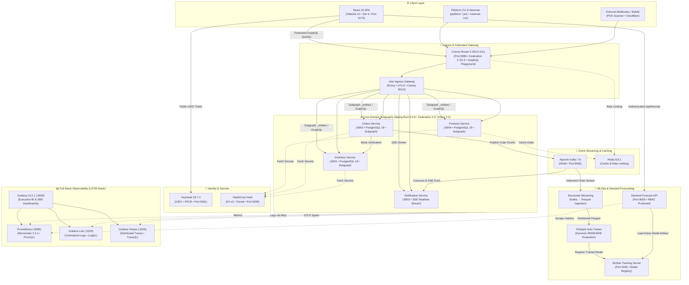
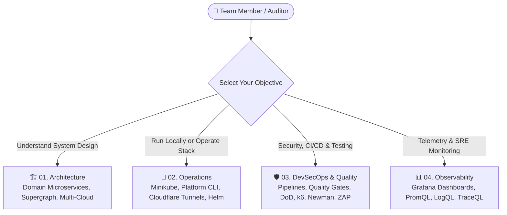

# 🏛️ Enterprise Microservices Architecture

<p align="center">
  
  
  
  
  
  
  
  
  
  
  
  
  
</p>

> **Enterprise Multi-Cloud Microservices Platform** built with **Java 21**, **Spring Boot 4.0.8**, and **React 19 + TailwindCSS v4**. Features automated **DHL tracking number generation**, observed **checkout-funnel event telemetry**, **Saga distributed transactions**, **Istio Service Mesh**, **HashiCorp Vault**, **Keycloak OAuth2/OIDC**, **KEDA v2.21.0 Event-Driven Autoscaling (Kafka Lag & Prometheus RPS)**, **Automated MLOps Demand Forecasting (PySpark Structured Streaming & MLflow)**, and full **DevSecOps & RBAC automation** across AWS, Azure, GCP, and local Minikube.

**Recommended local resources:** 8 CPU cores and 16 GB RAM free — the full local stack runs ~20+ containers.

For the canonical local host and Minikube resource profile, see [Local Deployment prerequisites](./docs/02-operations/LOCAL_DEPLOYMENT.md#-prerequisites). 

---

## 🏛️ Master Architecture Diagram


---

## 📚 Enterprise Documentation Hub & Architecture Blueprint

In-depth architectural specifications, multi-cloud topologies, operational runbooks, and quality gates are organized into **4 specialized pillars** under [`docs/`](./docs):

### 🧭 Navigation Matrix by Role



### 📑 Master Documentation Catalog

| Pillar | Focus & Key Contents | Core Documents | Target Audience |
| :--- | :--- | :--- | :--- |
| **01. Architecture** | Domain-Driven Design (DDD), Saga compensation, Keycloak 26 IAM, Vault secrets, React 19 context, multi-cloud infrastructure topologies (AWS, Azure, GCP), formalized Architecture Decision Records (ADRs), enterprise API design (RFC 7807 & GraphQL), and Business Continuity / Disaster Recovery (BCDR). | • [ARCHITECTURE.md](./docs/01-architecture/ARCHITECTURE.md)<br/>• [DISASTER_RECOVERY_STRATEGY.md](./docs/01-architecture/DISASTER_RECOVERY_STRATEGY.md)<br/>• [API_DESIGN_AND_CONTRACTS.md](./docs/01-architecture/API_DESIGN_AND_CONTRACTS.md)<br/>• [Architecture Decision Records (ADRs)](./docs/01-architecture/adr/README.md)<br/>• [MULTI_CLOUD_INFRASTRUCTURE.md](./docs/01-architecture/MULTI_CLOUD_INFRASTRUCTURE.md) | Software Architects, Developers |
| **02. Operations** | Full Docker Compose service stack, Minikube cluster setup, Istio service mesh, platform-specific PowerShell CLI entrypoints, Cloudflare Zero-Trust Tunnels, Helm Canary rollouts, and lightweight deployment patterns (ECS Fargate & EC2 Ansible). | • [LOCAL_DEPLOYMENT.md](./docs/02-operations/LOCAL_DEPLOYMENT.md)<br/>• [LIGHTWEIGHT_DEPLOYMENT_PATTERNS.md](./docs/02-operations/LIGHTWEIGHT_DEPLOYMENT_PATTERNS.md)<br/>• [PLATFORM_CLI_REFERENCE.md](./docs/02-operations/PLATFORM_CLI_REFERENCE.md)<br/>• [CLOUDFLARE_TUNNELS.md](./docs/02-operations/CLOUDFLARE_TUNNELS.md)<br/>• [HELM_AND_CANARY.md](./docs/02-operations/HELM_AND_CANARY.md) | DevOps, Platform Engineers, SysAdmins |
| **03. DevSecOps & Testing** | Multi-CI/CD pipelines (GitHub Actions 12-stage, Azure DevOps 14-stage, Bitbucket 14-stage), Quality Gates (DoR/DoD), Newman contract tests, k6 load testing, OWASP ZAP DAST, Git workflows, and enterprise DevSecOps governance model & RACI matrix. | • [DEVSECOPS_GOVERNANCE_AND_MODEL.md](./docs/03-devsecops-and-testing/DEVSECOPS_GOVERNANCE_AND_MODEL.md)<br/>• [DEVSECOPS_PIPELINES.md](./docs/03-devsecops-and-testing/DEVSECOPS_PIPELINES.md)<br/>• [QUALITY_GATES_AND_DOD.md](./docs/03-devsecops-and-testing/QUALITY_GATES_AND_DOD.md)<br/>• [DYNAMIC_AND_CHAOS_TESTING.md](./docs/03-devsecops-and-testing/DYNAMIC_AND_CHAOS_TESTING.md)<br/>• [GIT_WORKFLOW_AND_COLLABORATION.md](./docs/03-devsecops-and-testing/GIT_WORKFLOW_AND_COLLABORATION.md) | SecOps, QA Engineers, Cloud Engineers, Architects |
| **04. Observability** | Full-stack LGTM telemetry handbook: PromQL queries (RED metrics, JVM, funnels), LogQL (Loki correlation), and TraceQL (Tempo distributed spans). | • [OBSERVABILITY_QUERIES.md](./docs/04-observability/OBSERVABILITY_QUERIES.md) | SRE, Operations Engineers |
| **API Collections** | Unified Newman & Postman API suite with Federation v2 queries, Keycloak login flows, and end-to-end order orchestration. | • [Postman Collection](./devsecops/testing/newman/microservices.postman_collection.json) | API Developers, QA |

### ⚡ Quick-Start Learning Pathways by Engineering Role

Select the recommended reading sequence tailored to your day-to-day responsibilities:

- **💻 Backend & Frontend Developers:**
  1. [01. System Architecture](./docs/01-architecture/ARCHITECTURE.md): Master domain boundaries, Saga transactions, and GraphQL federation schema.
  2. [02. Local Deployment Runbook](./docs/02-operations/LOCAL_DEPLOYMENT.md): Spin up the local Minikube cluster or Docker Compose stack in minutes.
  3. [03. Quality Gates & DoD](./docs/03-devsecops-and-testing/QUALITY_GATES_AND_DOD.md): Review acceptance criteria, pre-PR local maturity checks, and the unified PR template.

- **🛡️ DevSecOps, SRE & QA Engineers:**
  1. [03. DevSecOps Governance & Model](./docs/03-devsecops-and-testing/DEVSECOPS_GOVERNANCE_AND_MODEL.md): End-to-end 5-phase delivery model, BPMN lifecycle, role profiles, and organizational RACI matrix.
  2. [03. CI/CD Pipelines](./docs/03-devsecops-and-testing/DEVSECOPS_PIPELINES.md): Multi-cloud pipeline engine (GitHub Actions 12-stage, Azure DevOps 14-stage, Bitbucket 14-stage) and static checks (Gitleaks, Semgrep, Trivy, OPA).
  3. [03. Dynamic & Chaos Testing](./docs/03-devsecops-and-testing/DYNAMIC_AND_CHAOS_TESTING.md): Run Newman contract regressions, k6 performance/SLO gates, and OWASP ZAP DAST scans.
  4. [04. Observability Handbook](./docs/04-observability/OBSERVABILITY_QUERIES.md): Query metrics (PromQL), logs (LogQL), and distributed spans (TraceQL) across the Grafana LGTM stack.
  5. [02. Cloudflare Tunnels](./docs/02-operations/CLOUDFLARE_TUNNELS.md): Expose local or staging endpoints securely to remote GitHub Actions runners.

- **☁️ Cloud Platform & Infrastructure Architects:**
  1. [01. Multi-Cloud Infrastructure](./docs/01-architecture/MULTI_CLOUD_INFRASTRUCTURE.md): Review Terraform modules, provider architectures (AWS EKS, Azure AKS, GCP GKE), remote backends, and state locks.
  2. [02. Platform CLI Reference](./docs/02-operations/PLATFORM_CLI_REFERENCE.md): Single operational tool for cluster lifecycles, secrets, and canary routing.
  3. [02. Helm Chart & Canary Releases](./docs/02-operations/HELM_AND_CANARY.md): Manage Umbrella Helm chart delivery, OCI registries, and Istio canary traffic splitting.
  4. [03. Git Workflow & Rollbacks](./docs/03-devsecops-and-testing/GIT_WORKFLOW_AND_COLLABORATION.md): Release branching, hotfixes, GitOps ArgoCD syncs, and 4-tier disaster recovery.

### 🎨 Visual Architecture Blueprint

All visual architectural views are maintained in [`docs/Diagrams.drawio`](./docs/Diagrams.drawio) (viewable via [draw.io](https://app.diagrams.net/) or VS Code Draw.io extension):

| Tab # | View Name | Architectural Scope |
| :---: | :--- | :--- |
| **01** | *General Architecture & Microservices* | High-level topology across Client, Edge Nginx, Cosmo Router Gateway, Core Domain Microservices, Kafka Broker, PostgreSQL DBs, and LGTM Observability stack. |
| **02** | *HashiCorp Vault - Zero-Touch Security Architecture* | Zero-trust secrets management with Vault KV-v2 engine, Kubernetes Auth Method, AppRole authentication, dynamic secret injection, and least-privilege policies. |
| **03** | *Sequence - Dynamic Database Secret Rotation* | Detailed sequence diagram of automated dynamic PostgreSQL database credentials generation, lease lifecycle, and Spring Boot connection renewal. |
| **04** | *Istio Service Mesh & Zero-Trust mTLS* | Istio Ingress Gateway, Envoy sidecar injection, STRICT mutual TLS (`mTLS`), VirtualServices, DestinationRules, and Kiali mesh visualization. |
| **05** | *Secret Isolation & Configuration Precedence* | Three-tier configuration precedence and security boundaries across environment variables, HashiCorp Vault, and Kubernetes ConfigMaps. |
| **06** | *Kubernetes & Minikube Cluster Topology* | Multi-namespace architecture (`dev`, `istio-system`, `vault`, `observability`, `cert-manager`), NodePort mappings, resource limits, and persistent storage. |
| **07** | *End-to-End Request Flow & Order Processing Sequence* | Complete synchronous and asynchronous transaction flow: Keycloak JWT validation, Cosmo Router supergraph resolution, Saga orchestration, and Kafka notification dispatch. |
| **08** | *Mature E-Commerce Observability Architecture* | Unified LGTM telemetry pipeline: OpenTelemetry Collector, Prometheus TSDB, Grafana dashboards, Loki log streaming, and Tempo distributed tracing. |
| **09** | *Local DevSecOps Platform & GitHub Actions Delivery* | Pre-commit maturity gates, 7-step CI delivery workflow, SAST (Semgrep, Gitleaks), Trivy container scanning, OPA Conftest, and GitOps synchronization with ArgoCD. |
| **10** | *Resiliency, Secrets, Canary & Alerts* | Resilience4j circuit breakers, Istio Canary traffic shifting (10% to 100%), Alertmanager rules, and chaos resilience simulation. |
| **11** | *Multi-Cloud IaC & CLI Automation Suite* | Independent Minikube, AWS, Azure, and GCP CLI entrypoints, multi-cloud Terraform workspaces, OpenCost monitoring, and FinOps budgeting. |
| **12** | *Multi-Cloud CI/CD & Recovery Architecture* | Cross-cloud delivery matrix: GitHub Actions (12-stage DevSecOps flow + ArgoCD GitOps), Azure DevOps (14-stage AKS delivery), Bitbucket Pipelines (14-stage GKE delivery), and 4-tier disaster recovery. |

---

## 🔌 Workload Matrix, Ports, Credentials & K8s Right-Sizing

The matrix below outlines the platform's core workloads, service ports, authentication/credential schemas, and Kubernetes resource reservations (requests and limits) calibrated for local Minikube execution (with equivalent Docker Compose mappings). In Minikube, microservices run as internal ClusterIP services by default; use the managed port-forwards or NodePorts to interact with external tools. For direct web consoles, OpenAPI Swagger specs, and interactive browser endpoints, see the complementary [Unified Endpoints, Interactive Swagger & Console Access Matrix](#-unified-endpoints-interactive-swagger--console-access-matrix) below.

| Service / Workload / Version | Port(s) | Credentials / Auth | K8s Right-Sizing (Req / Lim) | Architectural Role |
| :--- | :---: | :--- | :--- | :--- |
| **Cosmo Router Gateway**<br>`v0.353.0` | `8080` (`/graphql`)<br>`9090` (Metrics) | Keycloak JWKS JWT validation, authenticated order fields, bounded complexity | CPU: `100m` / `500m`<br>Mem: `128Mi` / `256Mi` | GraphQL Federation v2 edge router & subgraph composition gateway |
| **Products Service**<br>`Spring Boot 4.0.8` | `8004` | Internal Subgraph & REST (JWT bearer token) | CPU: `300m` / `1000m`<br>Mem: `512Mi` / `1024Mi`<br>Storage: `1Gi` | Catalog management, stock sync & product federation subgraph |
| **Orders Service**<br>`Spring Boot 4.0.8` | `8003` | Internal Subgraph & REST (JWT bearer token) | CPU: `300m` / `1000m`<br>Mem: `512Mi` / `1024Mi`<br>Storage: `1Gi` | Order lifecycle, DHL tracking, funnel telemetry & Saga coordinator |
| **Inventory Service**<br>`Spring Boot 4.0.8` | `8001` | Internal Subgraph & REST (JWT bearer token) | CPU: `300m` / `1000m`<br>Mem: `512Mi` / `1024Mi`<br>Storage: `1Gi` | Stock reservation, low-stock alerts & inventory federation subgraph |
| **Notification Service**<br>`Spring Boot 4.0.8` | `8002` | SSE stream & REST (JWT bearer token) | CPU: `300m` / `1000m`<br>Mem: `512Mi` / `1024Mi`<br>Storage: `1Gi` | Real-time SSE dispatch & transactional messaging service |
| **React Frontend SPA**<br>`React 19 / Nginx` | `5173` | `admin_user` / `admin`<br>`basic_user` / `password` | CPU: `50m` / `200m`<br>Mem: `64Mi` / `128Mi`<br>Storage: `256Mi` | Modernized Storefront UI, POS barcode scanner & telemetry client |
| **Keycloak IAM**<br>`v26.7.4` | `8181` / `9000` | `admin` / `admin` | CPU: `300m` / `800m`<br>Mem: `512Mi` / `1024Mi`<br>Storage: `1Gi` | OIDC / OAuth2 identity provider & JWT issuer (JVM heap tuned) |
| **HashiCorp Vault**<br>`v2.0.4` | `8200` | Root Token: `root` | CPU: `150m` / `500m`<br>Mem: `256Mi` / `512Mi`<br>Storage: Standard | Dynamic secrets engine, KV-v2 engine & KMS envelope encryption |
| **Apache Kafka Broker**<br>`KRaft v7.8.0` | `9092` / `29092` | PLAINTEXT (local development) | CPU: `200m` / `1000m`<br>Mem: `512Mi` / `1024Mi`<br>Storage: `2Gi` | Distributed event log & asynchronous EDA streaming backbone |
| **Kafka Exporter**<br>`v1.9` | `9308` | *(No auth required)* | CPU: `50m` / `100m`<br>Mem: `64Mi` / `128Mi` | Kafka consumer group lag and partition telemetry scraper |
| **PostgreSQL DBs (x4)**<br>`PostgreSQL 18` | `5431`–`5435` | `postgres` / `postgres` | CPU: `100m` / `500m`<br>Mem: `256Mi` / `512Mi`<br>Storage: `512Mi` each | Database-per-service isolated relational persistence |
| **Postgres Exporter**<br>`v0.20` | `9187` | *(No auth required)* | CPU: `50m` / `100m`<br>Mem: `64Mi` / `128Mi` | PostgreSQL connection pool and query performance exporter |
| **Redis & Exporter**<br>`v8.8.1 / v1.82` | `6379` / `9121` | Password protected (`redis_pass`) | CPU: `100m` / `250m`<br>Mem: `128Mi` / `256Mi`<br>Storage: `256Mi` | Distributed rate limiting, session cache & query result store |
| **MLflow Tracking**<br>`v2.x` | `5000` | *(No auth required locally)* | CPU: `200m` / `1000m`<br>Mem: `512Mi` / `1536Mi` | Experiment tracking server, model registry & artifact repository |
| **Demand Forecast API**<br>`FastAPI 0.143.0 / Python 3.12` | `8005` | Keycloak JWT Bearer (`ADMIN` role) | CPU: `100m` / `1000m`<br>Mem: `256Mi` / `768Mi`<br>Storage: `128Mi` / `512Mi` | Real-time 7-day inference serving over trained sales models (`mlops/forecast_api.py`) |
| **Kafka-to-Parquet Capture**<br>`PySpark 3.5.9 / Python 3.12` | — *(Daemon)* | Internal Kafka access | CPU: `1000m` / `4000m`<br>Mem: `2Gi` / `4Gi`<br>Storage: `1Gi` / `2Gi` | Structured Streaming consumer writing silver-tier Parquet lake (`mlops/capture_orders.py`) |
| **Model Auto-Training**<br>`PySpark 3.5.9 / Python 3.12` | — *(Scheduled)* | Internal Parquet access | CPU: `1000m` / `4000m`<br>Mem: `2Gi` / `4Gi`<br>Storage: `1Gi` / `2Gi` | Automated drift-triggered model retraining & registry promotion (`mlops/train_demand_model.py`) |
| **Prometheus TSDB**<br>`v3.14.0` | `9090` | *(No auth required)* | CPU: `200m` / `800m`<br>Mem: `512Mi` / `1024Mi`<br>Storage: `2Gi` | Time-series metrics collection, rule evaluation & alerting |
| **Grafana**<br>`v13.2.1` | `3000` | `admin` / `admin` | CPU: `100m` / `500m`<br>Mem: `128Mi` / `512Mi`<br>Storage: `1Gi` | Unified visual telemetry (metrics, logs, traces, costs) |
| **Grafana Loki**<br>`v3.7.4` | `3100` | Authenticated via Grafana datasource | CPU: `150m` / `800m`<br>Mem: `256Mi` / `1024Mi`<br>Storage: `2Gi` | Centralized container log indexing & LogQL querying |
| **Grafana Tempo**<br>`v3.0.3` | `3200` | Authenticated via Grafana datasource | CPU: `100m` / `500m`<br>Mem: `192Mi` / `512Mi`<br>Storage: `1Gi` | High-volume W3C distributed trace span storage |
| **Grafana Alloy**<br>`v1.19.1` | `3300` | *(No auth required)* | CPU: `50m` / `200m`<br>Mem: `64Mi` / `256Mi`<br>Storage: `256Mi` | OpenTelemetry & Prometheus-compatible log & telemetry collector forwarding container logs to Loki |
| **OpenTelemetry Collector**<br>`Contrib v0.159` | `4317` (gRPC)<br>`4318` (HTTP) | *(OTLP Ingestion)* | CPU: `100m` / `400m`<br>Mem: `128Mi` / `512Mi` | Trace & metric pipeline processor forwarding to Tempo & Prometheus |
| **OpenCost FinOps**<br>`v2.5.32` | `7000` (UI)<br>`9003` (API) | *(No auth required)* | UI: `25m` / `150m`, `64Mi` / `192Mi`<br>Exporter: `50m` / `300m`, `192Mi` / `512Mi` | Real-time Kubernetes cloud cost allocation & budget tracking |
| **Kiali Dashboard**<br>`v2.31.0` | `20001` | *(No auth required)* | CPU: `150m` / `600m`<br>Mem: `256Mi` / `512Mi`<br>Storage: `1Gi` | Istio service mesh topology, traffic health & mTLS inspection |
| **Istio Ingress Gateway**<br>`v1.31.1` | `80` / `443` | Mesh mTLS & RBAC | CPU: `100m` / `500m`<br>Mem: `128Mi` / `512Mi` | Envoy perimeter ingress & traffic management gateway |
| **OPA Gatekeeper**<br>`v3.23.0` | `8888` / `8443` | Admission webhook TLS certs | CPU: `100m` / `500m`<br>Mem: `256Mi` / `512Mi` | Kubernetes admission controller enforcing enterprise governance |

> 📘 **Cosmo Router Capabilities:** Security, complexity limits, observability, resilience settings, and deferred capabilities are tracked in [docs/01-architecture/ARCHITECTURE.md](./docs/01-architecture/ARCHITECTURE.md#-cosmo-router-hardening--gateway-capabilities).

### 📖 Unified Endpoints, Interactive Swagger & Console Access Matrix

The platform separates internal infrastructure orchestration from client-facing endpoints. The following matrix unifies all interactive developer portals, OpenAPI Swagger specs, and administrative consoles across both local direct port-forwards and Minikube NodePort topologies:

| Service / Interface | Direct Local Access URL (localhost) | Minikube NodePort Access | Protocol / Tool | Scope, Capabilities & Swagger Docs |
| :--- | :--- | :--- | :--- | :--- |
| 🛒 **Frontend Storefront SPA** | [http://localhost:5173](http://localhost:5173) | `http://$(minikube ip):30080` | HTTP / React 19 + Tailwind v4 | Customer Storefront, POS scanner, 7-day forecast cards, Keycloak login & telemetry |
| 🚀 **Cosmo Router Gateway** | [http://localhost:8080](http://localhost:8080) (or `/graphql`) | Internal ClusterIP (`:8080` via port-forward) | GraphQL / Cosmo Router 0.353.0 | Unified GraphQL Playground, schema introspection & federated Supergraph query execution |
| 📖 **Products Swagger UI** | [http://localhost:8004/swagger-ui.html](http://localhost:8004/swagger-ui.html) | Internal ClusterIP (`:8004` via port-forward) | OpenAPI 3.0 / SpringDoc | Interactive OpenAPI documentation for Catalog REST APIs (`/api/product/**`, `/v3/api-docs`) |
| 📖 **Orders Swagger UI** | [http://localhost:8003/swagger-ui.html](http://localhost:8003/swagger-ui.html) | Internal ClusterIP (`:8003` via port-forward) | OpenAPI 3.0 / SpringDoc | Interactive OpenAPI documentation for Orders, DHL tracking, idempotency & `/api/order/funnel` |
| 📖 **Inventory Swagger UI** | [http://localhost:8001/swagger-ui.html](http://localhost:8001/swagger-ui.html) | Internal ClusterIP (`:8001` via port-forward) | OpenAPI 3.0 / SpringDoc | Interactive OpenAPI documentation for Stock reservation, decrement/rollback & `/api/inventory/**` |
| 📖 **Notification Swagger & SSE** | [http://localhost:8002/swagger-ui.html](http://localhost:8002/swagger-ui.html) | Internal ClusterIP (`:8002` via port-forward) | OpenAPI 3.0 / SSE Stream | Interactive OpenAPI documentation for Notification history & live SSE event stream (`/api/notifications/stream`) |
| 📈 **Demand Forecast API Docs** | [http://localhost:8005/docs](http://localhost:8005/docs) | Internal ClusterIP (`:8005` via port-forward) | OpenAPI 3.0 / FastAPI 0.143.0 Swagger (Python 3.12) | Interactive Swagger UI for real-time 7-day SKU demand predictions (`/api/forecast`, `/metrics`) |
| 🧪 **MLflow Tracking UI** | [http://localhost:5000](http://localhost:5000) | Internal ClusterIP (`:5000` via port-forward) | HTTP / MLflow 2.x | Experiment tracking dashboard, model parameter comparison, metric runs & artifact store |
| 🔑 **Keycloak Admin Console** | [http://localhost:8181](http://localhost:8181) | `http://$(minikube ip):30181` | HTTP / OIDC OAuth2 | Realm administration, user provisioning (`admin_user`, `basic_user`), client scopes & JWT keys |
| 🔒 **HashiCorp Vault UI** | [http://localhost:8200](http://localhost:8200) | `http://$(minikube ip):30820` | HTTP / Vault 2.0.4 | Web UI for KV-v2 dynamic secret engines, access policies & Transit encryption (Token: `root`) |
| 📊 **Grafana LGTM Dashboards** | [http://localhost:3000](http://localhost:3000) | `http://$(minikube ip):30030` | HTTP / Grafana 13.2.1 | Pre-provisioned dashboards for microservices, Istio mesh, JVM metrics, Loki logs & Tempo traces (`admin`/`admin`) |
| 🎯 **Prometheus TSDB** | [http://localhost:9090](http://localhost:9090) (or `/targets`) | Internal ClusterIP (`:9090` via port-forward) | HTTP / Prometheus 3.14.0 | Target scrape status inspection, PromQL expression evaluation & alerting rules |
| 🔍 **Grafana Alloy UI** | [http://localhost:3300](http://localhost:3300) | Internal DaemonSet (`:3300` via port-forward) | HTTP / Grafana Alloy 1.19.1 | Interactive telemetry pipeline visualizer, component dependency graph, log agent state & `/metrics` |
| 🕸️ **Kiali Service Mesh** | [http://localhost:20001/kiali](http://localhost:20001/kiali) | `http://$(minikube ip):32001/kiali` | HTTP / Kiali 2.31.0 | Real-time Istio visual service graph, mutual TLS traffic status & canary route split verification |
| 🐙 **ArgoCD GitOps Console** | [https://localhost:8088](https://localhost:8088) | `https://$(minikube ip):30443` (HTTP NodePort: `30088`) | HTTPS / ArgoCD 2.13 | Declarative GitOps deployment sync, application health status & automated drift reconciliation |
| 💰 **OpenCost FinOps UI** | [http://localhost:7000](http://localhost:7000) | Internal ClusterIP (`:7000` via port-forward) | HTTP / OpenCost 2.5.32 | Real-time Kubernetes container compute/memory cost breakdown and allocation telemetry |

---

## ⚡ Core Enterprise Capabilities

### 🛒 E-Commerce & Retail Innovation
* **Modernized Storefront Experience (React 19 & TailwindCSS v4):** Context-aware catalog search, Keycloak-persisted wishlists, role-gated admin telemetry & QR scanner tools, 7-day demand forecasting, user-scoped SSE transactional notifications, and responsive pagination.
* **Automated DHL Tracking Generation:** Every successfully placed order automatically generates a trackable carrier tracking number (e.g. `DHL-A8B9C0D1`) and initial tracking event history.
* **Checkout Funnel Event Telemetry:** Observed `CART_ADD`, `CHECKOUT_START`, and `CHECKOUT_STEP` events feed Prometheus counters and Grafana activity panels. Events currently lack shared session identifiers, so dashboards do not claim conversion or cart-abandonment rates.
* **Point of Sale (POS) & QR Scanner:** Dual workflow supporting standard checkout and physical POS cashier operations with Code-128 barcode scanning and instant SAT/CFDI invoice QR generation.

### 🔄 Distributed Reliability & Consistency
* **Saga Orchestration Pattern:** Graceful compensation and stock rollback when downstream payment or inventory allocation fails.
* **Distributed Idempotency:** Guaranteed once-only order processing via mandatory UUIDv4 `X-Idempotency-Key` headers backed by Redis deduplication.
* **Resilience4j Circuit Breakers:** Protects upstream callers with automatic state transitions (`CLOSED` $\rightarrow$ `OPEN` $\rightarrow$ `HALF_OPEN`) and thread-isolated bulkheads.

### 🛡️ Zero-Trust Security & DevSecOps
* **OIDC Authentication:** Public Keycloak SPA client (`microservices_frontend`) using PKCE without a browser-held `client_secret`; a native mobile app needs its own redirect URI configuration.
* **Centralized Secrets with HashiCorp Vault:** Dynamic secret generation and encryption-as-a-service (Transit Engine) replacing static environment variables.
* **Policy-as-Code (OPA & Gatekeeper):** Automated admission controller rules blocking privileged containers, enforced CPU/memory limits, mandatory labels, and prohibiting default `ServiceAccount` usage.
* **Multi-Environment Least-Privilege RBAC:** Dedicated `*-sa` ServiceAccounts with `automountServiceAccountToken: false` across `dev`, `staging`, and `prod`.

### 🧪 Automated MLOps & Demand Forecasting
* **Kafka Structured Streaming to Parquet:** Real-time ingestion of `DELIVERED` orders into partitioned Parquet (`/data/sales_parquet/date=YYYY-MM-DD`) with durable Spark checkpoints and zero local CSV dependencies.
* **Continuous PySpark Auto-Training:** Automated hourly CronJob and file-watcher checking minimum date thresholds ($\ge 9$ days per SKU) with SHA-256 fingerprinting to eliminate redundant training runs.
* **MLflow Tracking & Registry:** Experiment tracking capturing RMSE/MAE metrics, hyperparameter runs, and model artifacts logging.
* **Enterprise Inference API & RBAC:** Sub-second 7-day SKU demand forecast endpoint (`/api/forecast`) protected by Keycloak `ADMIN` role, fully validated in Postman/Newman E2E test suites.

### 📊 Full-Stack Observability (LGTM Stack)
* **Pre-Provisioned Grafana Dashboards:**
  1. `🏢 Business Intelligence & Inventory Operations` (all-time delivered merchandise-value/order/AOV snapshots, cancelled orders, live SKU stock risks, observed funnel activity, and cohort retention).
  2. `🛡️ Technical, Infrastructure & Security Operations (SRE)` (Golden signals, P95 latency, circuit breaker states, HikariCP pools, JVM Heap, threat level).
  3. `MLOps Forecast Service · Operations` (Forecast API availability, request rate, p95 latency, 5xx ratio, last successful forecast, and sales-data freshness; no duplicate experiment or inventory business charts).
* **Deep Telemetry Correlation:** One-click drill-down in Grafana Explore linking Tempo distributed spans $\leftrightarrow$ Loki structured logs $\leftrightarrow$ Prometheus metrics.

---

## 🚀 Quick Start (Up in 3 Minutes)

### Option A: Local Docker Compose (Default Platform Stack)

The fastest way to spin up the complete ecosystem including all microservices, databases, Keycloak, Vault, and Grafana:

```powershell
# 1. Clone the repository
git clone https://github.com/georgegxx/microservices-architecture.git && cd microservices-architecture

# 2. Copy environment file if not already present and define the passwords
cp .env.example .env

# 3. Start Keycloak and its database in detached mode
docker compose up -d --build keycloak

# 4. Native PowerShell script (auto-syncs client secret into .env):
pwsh -File .\scripts\bootstrap-keycloak.ps1

# 5. Launch all Compose services, including MLflow and the forecast API:
docker compose up -d --build

# 6. Verify healthy startup across all containers:
docker compose ps -a
docker compose ps --format "table {{.Name}}\t{{.State}}\t{{.Ports}}"

# 7. Graceful shutdown & volume teardown
docker compose down -v
```

**Docker Compose MLOps & Demand Forecasting:**
* The default Compose stack automatically includes **MLflow** (`http://localhost:5000`) and `demand-forecast-service` (`/api/forecast`).
* Train the demo random forest on demand via containerized PySpark:
  ```powershell
  docker compose run --build --rm demand-model-training
  ```
* Stream delivered Kafka orders into partitioned Parquet (`/data/sales_parquet`):
  ```powershell
  docker compose run --build --rm demand-sales-capture
  ```
* Complete runbook: [Local MLOps Workflow with Docker Compose](docs/02-operations/LOCAL_DEPLOYMENT.md#5--local-mlops-workflow-with-docker-compose).

---

### Option B: Local Kubernetes on Minikube (Enterprise DevSecOps)

To deploy the entire production-grade stack on Minikube with **Istio Service Mesh**, **OPA Gatekeeper**, and **Helm**:

```powershell
# 1. Host CLI Audit & Automated Winget Installation
.\platform-minikube.ps1 tools

# 2. Start Minikube, initialize Istio Service Mesh, and deploy the umbrella Helm chart:
.\platform-minikube.ps1 up -Environment dev -WithIstio

# 3. Audit platform health, pods, NodePorts, and Gatekeeper OPA policies:
.\platform-minikube.ps1 doctor -Environment dev

# 4 Check all pods running
kubectl get pods -A
kubectl get pods -n dev # observability, auth, data, ..

# 5. Destroy the entire stack:
.\platform-minikube.ps1 down -Destroy
```

**Minikube GitOps MLOps & Automated Auto-Training:**
* Provisioned automatically by `.\platform-minikube.ps1 up` (or refreshed via `.\platform-minikube.ps1 mlops`) in namespace `dev` with dedicated ServiceAccounts (`mlflow-sa`, `demand-forecast-sa`).
* Persistent Parquet data is shared via the `mlops-sales-data` PVC, while the `demand-model-training-scheduler` CronJob checks hourly and trains only when $\ge 9$ days of new sales partitions change.
* Simulate and stream 14 days of delivered orders:
  ```powershell
  .\mlops\training.ps1 -Target minikube -SimulateOrders -Days 14
  ```
* Complete runbook: [Minikube MLOps Deployment](docs/02-operations/LOCAL_DEPLOYMENT.md#5--minikube-mlops-deployment--automated-dynamic-training).

> 📘 **Step-by-step Minikube guide:** Detailed hardware allocation, network topologies, and DNS setup are available in [docs/02-operations/LOCAL_DEPLOYMENT.md](./docs/02-operations/LOCAL_DEPLOYMENT.md).

---

## 🧪 Automated Testing & Simulation Suite

The platform provides an automated test and simulation suite to validate service health, contract integrity, load thresholds, and telemetry pipelines:

```powershell
# 1. Functional smoke checks across Router, REST subgraphs, and Auth
python scripts/testing/smoke.py

# 2. Legitimate E-Commerce User Traffic Simulation (Funnel events + real checkouts)
python scripts/testing/simulate.py --scenario traffic --orders 15 --concurrency 3

# 3. Unified component and telemetry diagnostics (read-only)
python scripts/testing/diagnose.py all

# 4. Read-only authenticated order-list diagnostic (requires Keycloak client secret)
python scripts/testing/diagnose.py orders-readonly

# 5. Read-only deployment gate against Router and storefront independently
python scripts/testing/smoke.py --deployment --base-url http://localhost:8080 --frontend-url http://localhost:5173

# 6. Grafana dashboard publishing and Funnel demo telemetry seeding
python scripts/update_dashboards.py dashboards
python scripts/update_dashboards.py funnel-demo --count 30 --category Electronics

# 7. Newman API Contract Suite (23 Requests, including MLOps 7-day forecast & RBAC)
# Note: Point BASE_URL to the frontend proxy (5173) or Router (8080)
npx --yes newman run devsecops/testing/newman/microservices.postman_collection.json `
  --env-var "BASE_URL=http://localhost:5173" `
  --env-var "keycloak_url=http://localhost:8181" `
  --reporters cli

# 8. Platform CLI wrappers (Minikube / DevSecOps):
.\platform-minikube.ps1 smoke          # Runs smoke checks against active cluster
.\platform-minikube.ps1 contract       # Runs Newman API collection in automated container
.\platform-minikube.ps1 performance    # Runs k6 SLO latency and throughput benchmark
.\platform-minikube.ps1 dast           # Runs OWASP ZAP baseline security scan
```

> 📖 **Comprehensive Testing Runbook:** For circuit breaker chaos drills, rate-limiting DDoS probes, and k6 SLA thresholds, see the [Dynamic Testing & Chaos Engineering Guide](docs/03-devsecops-and-testing/DYNAMIC_AND_CHAOS_TESTING.md).

---

## 📁 Repository Structure

```text
microservices-architecture/
├── .github/workflows/              # GitHub Actions service CI, registry, GitOps and Terraform workflows
├── ansible/                        # 🤖 Ansible Automation for Compact Host Deployments
│   ├── inventory/hosts.ini         # Dynamic EC2 host inventory
│   ├── playbooks/deploy-compact-stack.yml # Master Docker, UFW, Systemd deployment
│   └── templates/                  # Compose stack & multi-DB initialization
├── argocd/                         # GitOps Applications & ApplicationSet definitions
├── azure-devops/                   # Azure DevOps Pipeline YAML files
├── cosmo-router/                   # Cosmo Router 0.353.0 (Port 8080 • Federation v2)
├── devsecops/                      # Centralized DevSecOps Hub
│   ├── compliance/trivy/           # Trivy container scanner configuration
│   ├── dast/zap/                   # OWASP ZAP baseline rules and profiles
│   ├── policies/                   # OPA Rego Conftest & Gatekeeper constraints
│   ├── sast/gitleaks/              # Gitleaks and Semgrep static security configs
│   └── testing/newman/             # Newman JSON export + Postman collection tree
├── docs/                           # 📚 Enterprise Platform Documentation (4 Specialized Pillars)
│   ├── 01-architecture/            # 🏗️ System Design, Domain Microservices, Vault & Multi-Cloud
│   │   ├── adr/                    # Architecture Decision Records (ADRs: ADR-001 - ADR-010)
│   │   ├── API_DESIGN_AND_CONTRACTS.md # RESTful OpenAPI 3.0 & RFC 7807 Problem Details standards
│   │   ├── ARCHITECTURE.md
│   │   ├── DISASTER_RECOVERY_STRATEGY.md # Business Continuity, Warm Standby DR, RTO/RPO SLAs
│   │   └── MULTI_CLOUD_INFRASTRUCTURE.md
│   ├── 02-operations/              # 🚀 Operations, Local Minikube, Platform CLI & Cloudflare Tunnels
│   │   ├── LOCAL_DEPLOYMENT.md
│   │   ├── LIGHTWEIGHT_DEPLOYMENT_PATTERNS.md # AWS ECS Fargate & EC2 Ansible patterns
│   │   ├── PLATFORM_CLI_REFERENCE.md
│   │   ├── CLOUDFLARE_TUNNELS.md
│   │   └── HELM_AND_CANARY.md
│   ├── 03-devsecops-and-testing/   # 🛡️ CI/CD Pipelines, Quality Gates, DoD, k6, Newman & DAST
│   │   ├── DEVSECOPS_PIPELINES.md
│   │   ├── QUALITY_GATES_AND_DOD.md
│   │   ├── DYNAMIC_AND_CHAOS_TESTING.md
│   │   └── GIT_WORKFLOW_AND_COLLABORATION.md
│   ├── 04-observability/           # 📊 Telemetry Handbook, Grafana, PromQL, LogQL & TraceQL
│   │   └── OBSERVABILITY_QUERIES.md
│   ├── reference/                  # 📦 Reference Schemas, IAM Backups, and Cloud Templates
│   │   ├── api-contracts/          # Canonical OpenAPI 3.0 Reference Specification
│   │   ├── iam/realm-export.json
│   │   ├── schemas/POSTGRESQL_18_SCHEMA_AND_QUERIES.sql
│   │   └── aws-eks/
│   ├── liferay-pipeline/           # Reference CI/CD pipelines for Liferay DXP deployments
│   │   ├── README.md
│   │   └── .gitlab-ci.yml
│   └── Diagrams.drawio             # 🎨 13-Page Comprehensive Architectural Blueprint (Draw.io)
├── frontend/                       # React 19 + TailwindCSS v4 SPA (Nginx Distroless)
├── helm/                           # Kubernetes Helm Charts (Umbrella chart & subcharts)
├── inventory-service/              # Stock allocation & verification (Port 8001)
├── k8s/                            # Kubernetes manifests, Istio routing rules & dev RBAC
├── mlops/                          # 🧪 MLOps Pipeline & Forecasting Service
│   ├── capture_orders.py           # Unified Kafka event capture (Spark Parquet stream & Python CSV)
│   ├── train_demand_model.py       # PySpark MLlib GBT regressor, MLflow tracking & auto-train engine
│   ├── forecast_api.py             # FastAPI 7-day SKU demand inference endpoint with Keycloak OIDC RBAC
│   ├── generate_sample_sales.py    # Synthetic seasonal historical sales dataset generator
│   └── container_train.sh          # Containerized headless PySpark training entrypoint
├── notification-service/           # Kafka event consumer & SSE Stream (Port 8002)
├── observability/                  # Grafana LGTM provisioning (Dashboards, Alloy, Loki, Tempo)
├── orders-service/                 # Order orchestration & Saga orchestrator (Port 8003)
├── products-service/               # Product catalog domain (Port 8004)
├── scripts/                        # Enterprise automation scripts (PowerShell & Python)
│   ├── testing/                    # Consolidated testing engine (diagnose.py, simulate.py, smoke.py)
│   │   ├── diagnose.py             # Unified health, DB schemas, Vault, Kafka & restore verification
│   │   ├── simulate.py             # Realistic concurrent order & inventory traffic simulation
│   │   └── smoke.py                # Fast endpoint availability and HTTP smoke probes
│   ├── bcdr-simulation.ps1         # Disaster recovery GameDay simulation & backup verification runner
│   ├── bootstrap-keycloak.ps1      # Keycloak 26 IAM realm bootstrapper & client secret sync
│   ├── build-all.py                # Concurrent Java & React container image compiler
│   ├── generate-secure-secrets.py  # CSPRNG cryptographic secret & JWT key generator
│   ├── generate_drawio.py          # Programmatic 13-page architectural diagram generator
│   ├── generate_postman_collection.py # Programmatic Postman Collection v2.1 generator
│   ├── local-cost-estimator.py     # Unified FinOps suite (architecture estimates, Terraform plan-delta, K8s right-sizing)
│   ├── manage-cloudflare-tunnels.ps1 # Cloudflare Zero Trust tunnel manager and DNS record sync
│   ├── supervise-tunnels.py        # Resilient background port-forward supervisor daemon
│   ├── update_dashboards.py        # Unified Grafana dashboard generator, live publisher, and demo telemetry CLI
│   └── validate-opencost.sh        # Render pinned OpenCost and cloud Prometheus charts
├── terraform/                      # Multi-Cloud IaC (AWS, Azure, GCP modules & workspaces)
├── .env.example                    # Environment variables template
├── .gitattributes                  # Git line-ending and binary attributes configuration
├── .gitignore                      # Git ignore patterns
├── .gitleaks.toml                  # Gitleaks security scanner configuration and detection rules
├── .gitleaksignore                 # Baseline allowlist and suppressions for secrets scanner
├── bitbucket-pipelines.yml         # Bitbucket Pipelines CI/CD configuration
├── compose.yaml                    # Local multi-service development stack (15 containers)
├── LICENSE                         # MIT License file
├── platform-common.ps1             # Unified DevSecOps core engine & shared PowerShell helpers
├── platform-minikube.ps1           # Local Minikube platform CLI & lifecycle orchestrator
├── platform-multicloud.ps1         # Multi-Cloud (AWS, Azure, GCP) Enterprise Orchestrator
├── pom.xml                         # Maven Multi-Module Reactor (Java 21, Spring Boot 4.0.8)
├── README.md                       # Master architecture documentation & quickstart guide
└── sonar-monorepo-projects.json    # SonarQube / SonarCloud multi-module matrix metadata
```
---

## 📄 License

This project is licensed under the **MIT License** — see the [LICENSE](LICENSE) file for details.
