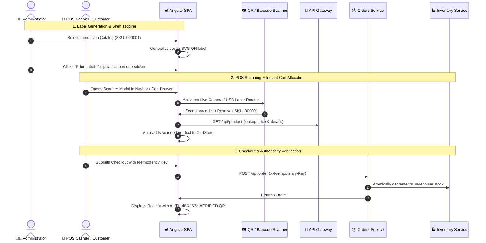
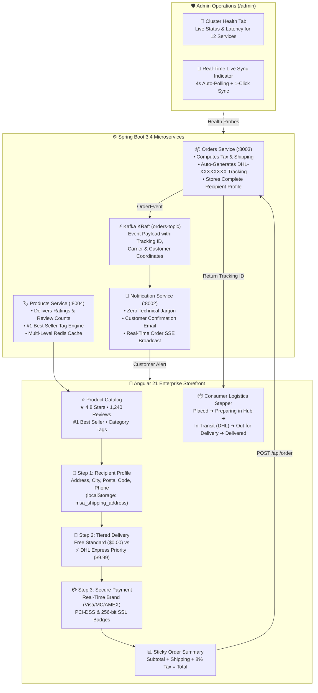
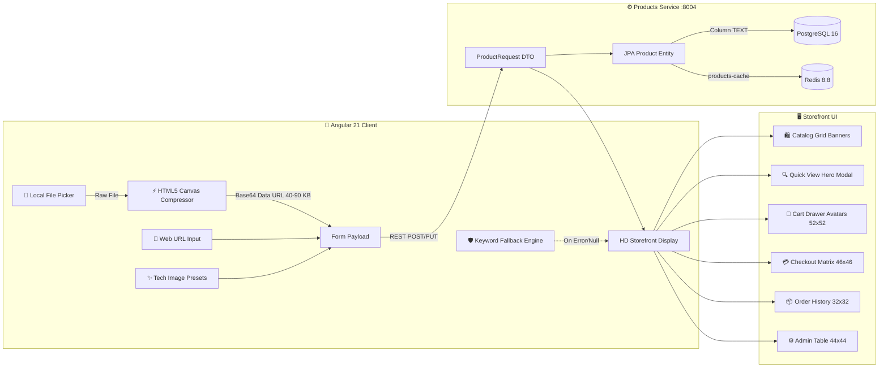

# 🏢 Microservices Architecture: Multi-Cloud (AWS, Azure, GCP) & Multi-CI/CD Platform

Enterprise-grade, distributed microservices platform built with **Java 21 (Spring Boot 3.4.2, Spring Cloud 2024, Spring Cloud Gateway, Kubernetes CoreDNS & Istio Service Mesh)** and **Angular 21 SPA (Nginx Distroless)**.

Designed for true **Multi-Cloud Portability & Multi-CI/CD Automation**:
- ☁️ **Amazon Web Services (AWS)**: Provisioned with **Terraform AWS** (EKS, ECR, RDS PostgreSQL, VPC, ALB, IAM-IRSA) and deployed via **GitHub Actions** (12-Stage Enterprise Pipeline).
- ☁️ **Microsoft Azure Cloud**: Provisioned with **Terraform Azure** (AKS, ACR, PostgreSQL Flexible Server, VNet, KeyVault) and deployed via **Azure DevOps Pipelines** (12-Stage Enterprise Pipeline).
- ☁️ **Google Cloud Platform (GCP)**: Provisioned with **Terraform GCP** (GKE Autopilot, Google Artifact Registry, Cloud SQL PostgreSQL, Cloud Memorystore, VPC) with **Bitbucket Pipelines** (CI DevSecOps) and **ArgoCD** (GitOps Continuous Delivery).

---

## 🏛️ System Architecture


---

### 🗺️ Architecture Diagrams & Vector Blueprints ([`docs/Diagrams.drawio`](./docs/Diagrams.drawio))

The platform includes a comprehensive, 10-tab architectural blueprint formatted in standard vector XML (compatible with VS Code Draw.io Integration, Diagrams.net, and Draw.io Desktop):

| Tab # | Blueprint Name | Description & Focus Areas |
| :--- | :--- | :--- |
| **Tab 1** | `1. General Architecture & Microservices` | Full ecosystem topology: Frontend SPA, API Gateway, Keycloak, 4 Spring Boot Microservices, PostgreSQL databases, Kafka KRaft, Redis, Vault, and LGTM Observability. |
| **Tab 2** | `2. HashiCorp Vault - Zero-Touch Security Architecture` | Zero-touch Vault container initialization, KV-v2 secret engine, dynamic database credentials engine, Transit data encryption, file audit logging, and least-privilege policies. |
| **Tab 3** | `3. Sequence - Dynamic Database Secret Rotation` | Step-by-step sequence of ephemeral PostgreSQL user generation, automated revocation upon 1h lease expiration, and transparent connection pool recovery. |
| **Tab 4** | `4. Istio Service Mesh & Zero-Trust mTLS` | STRICT mTLS zero-trust communication across namespace `ecommerce` with SPIFFE IDs, Istio Ingress Gateway, Istiod Citadel CA signed by Vault PKI Intermediate CA, and Canary traffic shaping (90/10). |
| **Tab 5** | `5. Secret Isolation & Configuration Precedence` | Hierarchy of property sources explaining why zero collisions exist between `.env`, Spring Cloud Vault profile, and External Secrets Operator (ESO). |
| **Tab 6** | `6. Kubernetes & Minikube Cluster Topology` | Dedicated namespace isolation: `ecommerce` (Apps & DBs), `vault` (Security & RBAC Auth Delegator), and `istio-system` (Mesh Control Plane & Kiali). |
| **Tab 7** | `7. End-to-End Request Flow & Order Processing Sequence` | Complete 14-step transaction journey: Angular 21 SPA ➔ Keycloak PKCE ➔ Istio Ingress ➔ API Gateway (Redis Rate Limit & JWT verify) ➔ Orders Service ➔ Products & Inventory DBs ➔ Kafka Event Bus ➔ Notification Service ➔ LGTM Distributed Telemetry. |
| **Tab 8** | `8. Edge Cloud Tunneling, Vercel & Mobile PWA` | Cloudflare Anycast Quick Tunnels, Vercel Serverless Edge, Keycloak PKCE, Enterprise Multi-Step Checkout, and Universal Mobile Viewports ($360\text{px}-768\text{px}$). |
| **Tab 9** | `9. Dual-Mode Media Engine & Visual Storefront` | Dual-Mode Product Media Ingestion, HTML5 Canvas Base64 Compression ($40-90\text{ KB}$), PostgreSQL TEXT persistence, Redis cache layer, and HD Visual Display. |
| **Tab 10** | `10. Enterprise E-Commerce, Logistics & Social Proof Architecture` | Multi-step checkout, address persistence (`localStorage`), tiered delivery speeds ($0.00 / $9.99), real-time card brand detection (Visa/MC/AMEX), consumer logistics lifecycle stepper, DHL tracking generation (`DHL-XXXXXXXX`), catalog social proof (★ 4.8 / 1,240 reviews / #1 Best Seller), admin Live Sync & Cluster Health supervision, and zero-jargon notifications. |

---

## 📑 Table of Contents

- [🏢 Microservices Architecture: Multi-Cloud (AWS, Azure, GCP) \& Multi-CI/CD Platform](#-microservices-architecture-multi-cloud-aws-azure-gcp--multi-cicd-platform)
  - [🏛️ System Architecture](#️-system-architecture)
    - [🗺️ Architecture Diagrams \& Vector Blueprints (`docs/Diagrams.drawio`)](#️-architecture-diagrams--vector-blueprints-docsdiagramsdrawio)
  - [📑 Table of Contents](#-table-of-contents)
  - [✅ Prerequisites](#-prerequisites)
    - [⚙️ Kubernetes Workload Right-Sizing \& Production Resource Allocation](#️-kubernetes-workload-right-sizing--production-resource-allocation)
  - [📡 Microservices Catalog \& API Routing](#-microservices-catalog--api-routing)
  - [🔌 Ports \& Service Matrix](#-ports--service-matrix)
  - [🔐 Identity \& Access Management (Keycloak 26)](#-identity--access-management-keycloak-26)
  - [🔒 Secret Management with HashiCorp Vault (Multi-Cloud \& Local)](#-secret-management-with-hashicorp-vault-multi-cloud--local)
    - [1. Approach A: Local Development with Docker Compose (Zero-Touch)](#1-approach-a-local-development-with-docker-compose-zero-touch)
    - [2. Approach B: Native Java Spring Boot Integration (All 5 Services)](#2-approach-b-native-java-spring-boot-integration-all-5-services)
    - [3. Approach C: Kubernetes External Secrets Operator (ESO - Recommended)](#3-approach-c-kubernetes-external-secrets-operator-eso---recommended)
    - [4. Approach D: Kubernetes Multi-Cloud Vault Agent Sidecar Injector](#4-approach-d-kubernetes-multi-cloud-vault-agent-sidecar-injector)
  - [🗺️ Multi-Cloud \& Multi-CI/CD Matrix](#️-multi-cloud--multi-cicd-matrix)
  - [💻 Local Standalone Development](#-local-standalone-development)
    - [1. Spring Boot Microservices (Java 21 / Maven)](#1-spring-boot-microservices-java-21--maven)
    - [2. Angular 21 SPA](#2-angular-21-spa)
  - [🚀 Quick Start with Docker Compose](#-quick-start-with-docker-compose)
    - [1. Launch Keycloak (Auth Layer)](#1-launch-keycloak-auth-layer)
    - [2. Bootstrap Keycloak (Clients, Users \& Secrets)](#2-bootstrap-keycloak-clients-users--secrets)
      - [Pre-Configured Test Users:](#pre-configured-test-users)
    - [3. Launch Full Microservices Ecosystem](#3-launch-full-microservices-ecosystem)
    - [4. Useful Docker Compose Commands:](#4-useful-docker-compose-commands)
  - [☸️ Local Kubernetes Deployment (Minikube, Istio Mesh \& Canary Operations)](#️-local-kubernetes-deployment-minikube-istio-mesh--canary-operations)
    - [1. 🚀 One-Shot Cluster Deployment](#1--one-shot-cluster-deployment)
    - [2. 🔍 Verify Mesh Health \& Zero-Trust Policies](#2--verify-mesh-health--zero-trust-policies)
    - [3. 🌐 Open Local Browser Tunnels \& Endpoint Access](#3--open-local-browser-tunnels--endpoint-access)
    - [4. 🔀 Traffic Routing \& Progressive Canary Rollouts](#4--traffic-routing--progressive-canary-rollouts)
    - [5. 🛑 Cluster Teardown \& Resource Cleanup](#5--cluster-teardown--resource-cleanup)
    - [Useful commands](#useful-commands)
  - [🧪 Automated Testing, Load Simulation \& Chaos Engineering](#-automated-testing-load-simulation--chaos-engineering)
    - [1. 🛒 Legitimate E-Commerce Traffic Generator (`simulate-traffic.py`)](#1--legitimate-e-commerce-traffic-generator-simulate-trafficpy)
    - [2. ⚡ Resilience4j Circuit Breaker State Verification](#2--resilience4j-circuit-breaker-state-verification)
    - [3. 💥 Chaos Engineering \& Fault Injection (`simulate-chaos.py`)](#3--chaos-engineering--fault-injection-simulate-chaospy)
    - [4. 🛡️ DDoS \& Rate Limiting Stress Attacks (`simulate-ddos.py`)](#4-️-ddos--rate-limiting-stress-attacks-simulate-ddospy)
    - [5. 🔍 Automated Smoke Tests \& OpenAPI Auditing](#5--automated-smoke-tests--openapi-auditing)
    - [📦 Postman Test Suite:](#-postman-test-suite)
  - [📊 Full-Stack Observability \& Telemetry (Grafana LGTM Stack)](#-full-stack-observability--telemetry-grafana-lgtm-stack)
    - [1. 📈 Prometheus (Metrics \& PromQL) — `prometheus-ds`](#1--prometheus-metrics--promql--prometheus-ds)
    - [2. 📜 Grafana Loki (Centralized Logs \& LogQL) — `loki-ds`](#2--grafana-loki-centralized-logs--logql--loki-ds)
    - [3. 🔍 Grafana Tempo (Distributed Traces \& TraceQL) — `tempo-ds`](#3--grafana-tempo-distributed-traces--traceql--tempo-ds)
    - [4. 📊 Pre-Provisioned Universal Grafana Dashboards](#4--pre-provisioned-universal-grafana-dashboards)
      - [🏢 A. Business Intelligence \& Inventory Operations (`business-operations-dashboard.json`)](#-a-business-intelligence--inventory-operations-business-operations-dashboardjson)
      - [🛡️ B. Technical, Infrastructure \& Security Operations (`technical-security-dashboard.json`)](#️-b-technical-infrastructure--security-operations-technical-security-dashboardjson)
  - [☁️ Terraform Multi-Cloud Infrastructure (AWS, Azure, GCP)](#️-terraform-multi-cloud-infrastructure-aws-azure-gcp)
    - [1. AWS Provider (Amazon EKS / RDS / VPC)](#1-aws-provider-amazon-eks--rds--vpc)
    - [2. Azure Provider (Azure AKS / ACR / PostgreSQL)](#2-azure-provider-azure-aks--acr--postgresql)
    - [3. GCP Provider (Google GKE / Artifact Registry / Cloud SQL)](#3-gcp-provider-google-gke--artifact-registry--cloud-sql)
  - [🤖 Multi-CI/CD \& GitOps Automation](#-multi-cicd--gitops-automation)
    - [1. GitHub Actions ➔ AWS Cloud](#1-github-actions--aws-cloud)
    - [2. Azure DevOps Pipelines ➔ Azure Cloud](#2-azure-devops-pipelines--azure-cloud)
    - [3. Bitbucket Pipelines (CI) + ArgoCD (GitOps CD) ➔ GCP](#3-bitbucket-pipelines-ci--argocd-gitops-cd--gcp)
  - [📁 Repository Structure](#-repository-structure)
  - [🏛️ Domain-Driven Design (DDD) \& Microservices Tactical Patterns](#️-domain-driven-design-ddd--microservices-tactical-patterns)
    - [🧩 1. Bounded Contexts \& Aggregate Roots](#-1-bounded-contexts--aggregate-roots)
    - [🛡️ 2. Functional Programming \& RFC 7807 Error Handling](#️-2-functional-programming--rfc-7807-error-handling)
  - [⚡ Modern Angular 21 Reactive SPA Architecture](#-modern-angular-21-reactive-spa-architecture)
  - [🏷️ End-to-End QR Code \& Point of Sale (POS) Workflow](#️-end-to-end-qr-code--point-of-sale-pos-workflow)
  - [🛒 Enterprise E-Commerce \& Logistics Architecture (Amazon \& Mercado Libre)](#-enterprise-e-commerce--logistics-architecture-amazon--mercado-libre)
    - [1. 📦 Multi-Step Checkout \& Persistent Recipient Profile](#1--multi-step-checkout--persistent-recipient-profile)
    - [2. 🚚 Real-Time Logistics Tracking \& Consumer Stepper](#2--real-time-logistics-tracking--consumer-stepper)
    - [3. ⭐ Social Proof, Verified Ratings \& Best Seller Engine](#3--social-proof-verified-ratings--best-seller-engine)
    - [4. 🛡️ Admin Operations Console, Live Sync \& Cluster Health](#4-️-admin-operations-console-live-sync--cluster-health)
    - [5. 🔔 Customer-Centric Notification Center (Zero-Jargon)](#5--customer-centric-notification-center-zero-jargon)
    - [6. 📱 Responsive Media \& Aspect-Ratio Scaling](#6--responsive-media--aspect-ratio-scaling)
  - [📱 Mobile Application \& Google Play Store Architecture Guide](#-mobile-application--google-play-store-architecture-guide)
    - [1. 🚀 Mobile Packaging Options:](#1--mobile-packaging-options)
    - [2. 🔐 Mobile Security \& OIDC Integration:](#2--mobile-security--oidc-integration)
    - [3. 📦 Google Play Store Publication Checklist:](#3--google-play-store-publication-checklist)
  - [🌐 Edge Cloud Tunneling \& Serverless Frontend (Cloudflare \& Vercel)](#-edge-cloud-tunneling--serverless-frontend-cloudflare--vercel)
    - [1. 🚇 Cloudflare Quick Tunnels Automation (`start-cloudflare-tunnels.ps1`)](#1--cloudflare-quick-tunnels-automation-start-cloudflare-tunnelsps1)
    - [2. 🚀 Vercel Monorepo Deployment \& Output Directory Configuration](#2--vercel-monorepo-deployment--output-directory-configuration)
    - [3. 📱 Full-Stack Mobile PWA Responsiveness \& Touch Optimization](#3--full-stack-mobile-pwa-responsiveness--touch-optimization)
  - [🖼️ Dual-Mode Product Media \& Visual Storefront Architecture](#️-dual-mode-product-media--visual-storefront-architecture)
    - [1. 📂 Client-Side Canvas Compression \& Base64 Data URL Engine](#1--client-side-canvas-compression--base64-data-url-engine)
    - [2. 💾 PostgreSQL Unlimited TEXT Persistence \& Redis Cache](#2--postgresql-unlimited-text-persistence--redis-cache)
    - [3. 🎨 High-Fidelity Storefront Visual Integration](#3--high-fidelity-storefront-visual-integration)
  - [📄 License](#-license)

---

## ✅ Prerequisites

| Tool | Version | Required for |
| :--- | :---: | :--- |
| Docker & Docker Compose | Latest | Quick Start (full stack) |
| Java (JDK) | 21 | Building/running Spring Boot services standalone |
| Maven | 3.9+ | Java multi-module reactor build |
| Node.js & npm | 22+ | Angular 21 frontend |
| kubectl | 1.35.1 | Kubernetes / Minikube deployment |
| Minikube | 1.38.1 | Local Kubernetes deployment |
| Istioctl | 1.31.0 | Service mesh install & Kiali dashboard |
| Terraform | 1.15.8 | AWS / Azure / GCP provisioning |
| Cloudflared CLI | 2026.8.30 | Cloudflare tunnels deployment |
| PowerShell (`pwsh`) | 7+ | Running the automation scripts in `scripts/` |
| Python3 (`python`) | 3.11+ | Running the automation scripts in `scripts/` |

**Recommended local resources:** 8+ CPU cores and 16 GB+ RAM free — the full Docker Compose stack runs ~20 containers (5 microservices, frontend, Keycloak, Postgres, Kafka, Redis, and the Grafana LGTM observability stack).

> ⚠️ **Security note:** the Keycloak realm, test users (`admin_user`/`admin`, `basic_user`/`password`), and Grafana login (`admin`/`admin`) shown throughout this README are seeded for **local development only**. Rotate all credentials and secrets before using this stack in a shared or production environment.

---

### ⚙️ Kubernetes Workload Right-Sizing & Production Resource Allocation
All microservices and infrastructure pods are pre-configured with enterprise resource requests and limits to guarantee sub-millisecond execution, prevent GC pauses, and avoid `OOMKilled` eviction (optimized for Minikube clusters running with 12 CPUs and 12 GB RAM):

| Workload / Component | CPU Request | CPU Limit | Memory Request | Memory Limit | Ephemeral Storage | Architectural Focus |
| :--- | :---: | :---: | :---: | :---: | :---: | :--- |
| **Spring Cloud API Gateway** | `200m` | `1000m` | `384Mi` | `1024Mi` | `1Gi` | Reactive reverse proxy, Token Relay & CORS |
| **Spring Boot Microservices (x4)** | `200m` | `1000m` | `384Mi` | `1024Mi` | `1Gi` | Java 21 Virtual Threads concurrency |
| **Keycloak 26 IAM** | `500m` | `3000m` | `1024Mi` | `3072Mi` | `2Gi` | Fast bootstrap & authentication spikes |
| **HashiCorp Vault 2.0.4** | `250m` | `1000m` | `256Mi` | `512Mi` | Standard | Dynamic secrets engine & KMS encryption |
| **Apache Kafka (KRaft Broker)** | `200m` | `1500m` | `512Mi` | `1536Mi` | `2Gi` | High-throughput event streaming |
| **PostgreSQL (x4 Databases)** | `100m` | `500m` | `256Mi` | `512Mi` | `512Mi` | Isolated stateful per-service persistence |
| **Redis 8 Cache & Token Bucket** | `100m` | `500m` | `128Mi` | `256Mi` | `256Mi` | Distributed rate limiting & catalog cache |
| **Frontend Angular 21 SPA (Nginx)** | `50m` | `250m` | `64Mi` | `128Mi` | `256Mi` | Distroless client asset delivery |
| **Prometheus 3 Metrics Server** | `200m` | `1500m` | `256Mi` | `1024Mi` | `2Gi` | 10s scraping & PromQL evaluation |
| **Grafana LGTM Stack (Dashboards)** | `100m` | `500m` | `128Mi` | `512Mi` | `1Gi` | Correlated trace, log & metric visualization |
| **Grafana Loki (Log Ingestion)** | `300m` | `2000m` | `512Mi` | `2048Mi` | `4Gi` | Centralized container log indexing |
| **Grafana Tempo (Tracing Backend)** | `150m` | `1000m` | `256Mi` | `1024Mi` | `2Gi` | W3C distributed trace span storage |
| **Kiali Visual Mesh Topology** | `300m` | `2000m` | `512Mi` | `1024Mi` | `1Gi` | Real-time Istio Service Mesh visualizer |

---

## 📡 Microservices Catalog & API Routing

| Service | Path Prefix | Key Endpoints | Responsibilities |
| :--- | :--- | :--- | :--- |
| **API Gateway** | `/api/*` | `/actuator/health`, `/actuator/prometheus` | Reverse proxy, token validation, rate limiter |
| **Products Service** | `/api/product` | `POST /api/product`, `GET /api/product` | Product catalog, pricing, Redis caching |
| **Orders Service** | `/api/order` | `POST /api/order`, `GET /api/order` | Order placement, inventory validation, Kafka producer |
| **Inventory Service** | `/api/inventory`| `GET /api/inventory?skuCode=...` | Real-time SKU stock verification & allocation |
| **Notification Service**| N/A | Kafka Topic `orders-topic` | Consumes `OrderPlacedEvent`, customer email simulation |

---

## 🔌 Ports & Service Matrix

| Service | Local / Docker Port | Minikube Port | AWS / Azure / GCP Target | Credentials / Notes |
| :--- | :---: | :---: | :---: | :--- |
| **Angular 21 Frontend** | `4200` / `80` | `30080` | Ingress (`/`) | Modern Angular SPA UI |
| **Spring Cloud API Gateway** | `8080` | `30088` | Ingress (`/api/*`) | Edge Gateway, Token Relay, Rate Limiting |
| **Products Service** | `8004` | `30004` | ClusterIP | Product catalog domain + PostgreSQL |
| **Orders Service** | `8003` | `30003` | ClusterIP | Order orchestration + Kafka Producer |
| **Inventory Service** | `8001` | `30001` | ClusterIP | Stock control & atomic verification |
| **Notification Service** | `8002` | `30002` | ClusterIP | Kafka Consumer & customer alerts |
| **Keycloak IAM** | `8181` | `30181` | Ingress (`/auth/*`) | `admin` / `admin` |
| **HashiCorp Vault** | `8200` | `30200` | Ingress / NodePort | `root` / v2.0.4 Secret Management |
| **Kiali Visual Mesh** | `20001` | `32001` | Ingress / NodePort | Istio Service Mesh Visualizer (`/kiali`) |
| **Grafana** | `3000` | `30300` | Ingress / NodePort | `admin` / `admin` (v13.1.4) |
| **Grafana Tempo** | `3200` | ClusterIP | ClusterIP | Distributed tracing backend (v3.0.3) |
| **Prometheus** | `9090` | `30090` | Prometheus Operator | Metrics scraping engine |
| **Grafana Loki** | `3100` | `30100` | ClusterIP | Centralized logging engine (v3.7.4) |
| **Grafana Alloy** | `12345` | DaemonSet | DaemonSet | Telemetry & log collector (v1.18.1) |
| **Redis & Exporter** | `6379` / `9121` | `30379` | Managed Cache / ClusterIP | Redis 8.8 + Exporter v1.82.0 |
| **PostgreSQL Databases** | `5432` | `30432` | RDS / Flexible / Cloud SQL | Managed multi-tenant DB |
| **Apache Kafka Broker** | `9092` / `29092` | `30092` | Managed / Strimzi Operator | KRaft broker (Topic: `orders-topic`) |

---

## 🔐 Identity & Access Management (Keycloak 26)

- **Protocol:** OAuth2 / OpenID Connect (OIDC) with PKCE flow in Angular 21 SPA.
- **Token Relay:** Spring Cloud Gateway validates incoming JWT tokens against Keycloak JWKS and forwards claims downstream via `Authorization: Bearer <token>`.
- **Automated Realm Import:** Configuration pre-loaded via [`docs/realm-export.json`](./docs/realm-export.json) with client `frontend-client`, roles `USER` / `ADMIN`, and default credentials.
- **Detailed Keycloak Guide:** See [`docs/KEYCLOAK_CONFIGURATION.md`](./docs/KEYCLOAK_CONFIGURATION.md) for full IAM manual.

---

## 🔒 Secret Management with HashiCorp Vault (Multi-Cloud & Local)

The platform provides enterprise-grade secret management across 4 distinct implementation patterns with **Least-Privilege Policies**:

### 1. Approach A: Local Development with Docker Compose (Zero-Touch)
- **Vault Web UI:** [http://localhost:8200](http://localhost:8200) (Dev Token: `root`)
- **Zero-Touch Auto-Initialization:** When running `docker compose up -d`, the ephemeral [`vault-init`](./compose.yaml) container automatically creates the KV-v2 engine, seeds database credentials, Kafka parameters, Keycloak secrets, and configures Least-Privilege access policies.
- **Optional Manual Reset Tool:** [`scripts/vault/init-vault.ps1`](./scripts/vault/init-vault.ps1) is available if you ever need to manually re-seed secrets and policies without restarting containers:
  ```powershell
  pwsh .\scripts\vault\init-vault.ps1
  ```

### 2. Approach B: Native Java Spring Boot Integration (All 5 Services)
- **Zero-Friction Activation:** Microservices run natively by default. To connect directly to Vault via Spring Cloud Config:
  ```powershell
  # Run any microservice with the 'vault' profile:
  cd products-service;     mvn spring-boot:run -Dspring-boot.run.profiles=vault
  cd orders-service;       mvn spring-boot:run -Dspring-boot.run.profiles=vault
  cd inventory-service;    mvn spring-boot:run -Dspring-boot.run.profiles=vault
  cd notification-service; mvn spring-boot:run -Dspring-boot.run.profiles=vault
  cd api-gateway;          mvn spring-boot:run -Dspring-boot.run.profiles=vault
  ```
- **Configuration Profile:** Managed via `application-vault.yml` in each service with support for `TOKEN` (Local), `KUBERNETES` (Cluster), and `APPROLE` (CI/CD) authentication.

### 3. Approach C: Kubernetes External Secrets Operator (ESO - Recommended)
- **Zero-Sidecar Footprint:** Synchronizes secrets directly from Vault into native Kubernetes `Secret` resources (`microservices-secrets`) without requiring sidecar containers.
- **Manifests:** Located in [`k8s/minikube/vault/external-secrets/`](./k8s/minikube/vault/external-secrets/).
  ```powershell
  # Apply SecretStore & ExternalSecret sync:
  kubectl apply -f k8s/minikube/vault/external-secrets/
  ```

### 4. Approach D: Kubernetes Multi-Cloud Vault Agent Sidecar Injector
- **Minikube:** Manifests in [`k8s/minikube/vault/`](./k8s/minikube/vault/) with RBAC and [`vault-k8s-auth-setup.ps1`](./k8s/minikube/vault/vault-k8s-auth-setup.ps1) for Least-Privilege roles (`products-service-role`, `orders-service-role`, etc.).
- **AWS EKS:** Production Helm values in [`k8s/eks/vault/vault-helm-values-eks.yaml`](./k8s/eks/vault/vault-helm-values-eks.yaml) featuring **AWS KMS Auto-Unseal** and **IRSA**.
- **Azure AKS:** Production Helm values in [`k8s/aks/vault/vault-helm-values-aks.yaml`](./k8s/aks/vault/vault-helm-values-aks.yaml) featuring **Azure Key Vault KMS Auto-Unseal** and **Workload Identity**.
- **Google Cloud GKE:** Production Helm values in [`k8s/gke/vault/vault-helm-values-gke.yaml`](./k8s/gke/vault/vault-helm-values-gke.yaml) featuring **Cloud KMS Auto-Unseal** and **GCP Workload Identity**.
- **Demo Deployment:** Test sidecar injection with [`k8s/minikube/vault/demo-vault-agent-inject.yaml`](./k8s/minikube/vault/demo-vault-agent-inject.yaml).

---

## 🗺️ Multi-Cloud & Multi-CI/CD Matrix

| Target Cloud | CI / Build Provider | CD / Deployment Tool | Container Registry | Terraform IaC Pipeline | Environments |
| :--- | :--- | :--- | :--- | :--- | :---: |
| **AWS Cloud** | **GitHub Actions** | **GitHub Actions** (Helm to EKS) | Amazon ECR | `.github/workflows/terraform-aws.yml` | `dev`, `staging`, `prod` |
| **Azure Cloud** | **Azure DevOps** | **Azure DevOps** (Helm to AKS) | Azure Container Registry (ACR) | `azure-devops/azure-pipelines-terraform.yml` | `dev`, `staging`, `prod` |
| **Google Cloud (GCP)**| **Bitbucket Pipelines** | **ArgoCD** (GitOps Sync to GKE) | Google Artifact Registry (GAR) | Bitbucket Step `terraform-gcp-apply` | `dev`, `staging`, `prod` |

---

## 💻 Local Standalone Development

To develop or debug microservices individually outside Docker:

### 1. Spring Boot Microservices (Java 21 / Maven)
```powershell
# Compile entire reactor
mvn clean compile

# Run specific service with dev profile
mvn spring-boot:run -pl api-gateway
mvn spring-boot:run -pl products-service
mvn spring-boot:run -pl orders-service
mvn spring-boot:run -pl inventory-service
mvn spring-boot:run -pl notification-service
```

### 2. Angular 21 SPA
```powershell
cd frontend
npm install
npm start
```

**Key Frontend, Mobile PWA & Storefront Features (`http://localhost:4200`):**
- **Hardware-Agnostic Universal QR & Barcode Engine:**
  - 📷 **Live Camera Stream (WebRTC):** Lens switching (front/rear), flashlight/torch toggle, and real-time laser animation.
  - 📁 **Image File Upload:** Drag-and-drop or file picker decoding of QR codes and barcodes.
  - 🔌 **USB & Bluetooth Laser Scanners (HID Wedge):** Real-time keystroke burst interceptor ($< 45\text{ ms}$) enabling $100\%$ driverless plug-and-play barcode guns (Honeywell, Zebra, Tera).
  - 🎨 **Dynamic QR Vector Generation:** On-demand SVG/Canvas QR labels for product shelf tags and order pickup receipts.
- **Enterprise Multi-Step Checkout & Logistics (Amazon & Mercado Libre):**
  - 📍 **Persistent Recipient Profile:** Automatic `localStorage` persistence (`msa_shipping_address`) enabling 1-click address recall for repeat buyers.
  - 🚚 **Tiered Delivery & DHL Tracking:** Real-time choice between Free Standard Shipping (3-5 days) and ⚡ DHL Express Priority ($9.99, 24-48h) with automated `DHL-XXXXXXXX` tracking generation.
  - 💳 **Real-Time Card Brand Detection:** Instant IIN/BIN recognition (Visa, Mastercard, AMEX) with dynamic cardholder validation, CVV security, and 256-bit SSL badges.
- **Product Catalog Social Proof & Verified Ratings:**
  - Verified buyer ratings (`★ 4.8 / 5.0`), total rating count derivations (`(1,240 ratings)`), `#1 Best Seller` ecommerce amber badges (`#e67a00`), and real-time stock availability pills.
- **Admin Operations Console & Cluster Health:**
  - Centralized `/admin` dashboard with 4-second animated `LIVE SYNC` polling and a dedicated `Cluster Health` supervision tab monitoring all 12 microservices and infrastructure components in real time.
- **Order Lifecycle & Saga Rollback:**
  - Segregated view tabs for `All Orders`, `Processing` (`PLACED`), `Shipped` (`SHIPPED`), `Delivered` (`DELIVERED`), and `Cancelled` (`CANCELLED`).
  - Interactive `Cancel Order` action triggering real-time Saga inventory compensation.
- **Progressive Web App (PWA) & Mobile UX:**
  - Standalone installation (`manifest.webmanifest`), floating mobile scan FAB button, camera barcode scanner, and haptic vibration (`navigator.vibrate`).
- **OIDC PKCE Security:** Secure authentication flow via Keycloak 26 with automatic JWT token management and route guards.

---

## 🚀 Quick Start with Docker Compose

### 1. Launch Keycloak (Auth Layer)
Keycloak and its PostgreSQL database must be initialized first:

```powershell
# 1. Clone the repository and navigate to project directory
cd microservices-architecture

# 2. Copy environment file if not already present
cp .example.env .env

# 3. Start Keycloak and its database in detached mode
docker compose up -d --build keycloak

# 4. Verify Keycloak is healthy
docker compose ps keycloak
```

### 2. Bootstrap Keycloak (Clients, Users & Secrets)
Run the bootstrap script to create realm `microservices-realm`, configure public and confidential clients, generate passwords, and **automatically synchronize `KEYCLOAK_CLIENT_SECRET` into your `.env`**:

```powershell
# Native PowerShell script (auto-syncs client secret into .env):
pwsh -File .\scripts\auth\bootstrap-keycloak.ps1
```

#### Pre-Configured Test Users:
| Username | Password | Roles | Purpose |
| :--- | :--- | :--- | :--- |
| **`admin_user`** | `admin` | `ADMIN`, `USER` | Full administration & product management |
| **`basic_user`** | `password` | `USER` | Browsing catalog & placing orders |

### 3. Launch Full Microservices Ecosystem
Once Keycloak is bootstrapped and `.env` has the synced client secret, spin up all remaining containers (microservices, databases, messaging, LGTM observability stack, and HashiCorp Vault). 

**HashiCorp Vault v2.0.4** will auto-initialize via the [`vault-init`](./compose.yaml) container on startup:

```powershell
# Build and launch all services in detached mode
docker compose up -d --build

# Check real-time container health
# Note: It's OK if the vault-init service has exited in Docker Compose.
docker compose ps -a
```

### 4. Useful Docker Compose Commands:
```powershell
# View aggregated live logs
docker compose logs -f

# View logs for a specific service
docker compose logs -f api-gateway

# Graceful shutdown & volume teardown
docker compose down -v
```

---

## ☸️ Local Kubernetes Deployment (Minikube, Istio Mesh & Canary Operations)

The unified deployment orchestrator automates the complete lifecycle end-to-end: Minikube cluster provisioning, **Istio Service Mesh with Envoy sidecars**, Zero-Trust mTLS, **Kiali Visual Topology**, **Keycloak IAM bootstrap**, **HashiCorp Vault v2.0.4**, PostgreSQL databases, Kafka, and microservices:

### 1. 🚀 One-Shot Cluster Deployment
Deploy the entire infrastructure, security, mesh, and microservices in a single command:
```powershell
# Master one-shot orchestrator (Installs Istio, Vault, Keycloak, DBs, and Microservices):
pwsh scripts/minikube/deploy-minikube.ps1

# Options:
# Skip container image rebuilds on subsequent runs:
pwsh scripts/minikube/deploy-minikube.ps1 -SkipBuild

# Deploy without Istio Service Mesh (standard Kubernetes without Envoy sidecars):
pwsh scripts/minikube/deploy-minikube.ps1 -SkipIstio

# Skip image build and Istio mesh simultaneously:
pwsh scripts/minikube/deploy-minikube.ps1 -SkipBuild -SkipIstio
```

> 💡 **Smart Image Synchronization & Adaptive Observability:**
> - **Zero-Rebuild Fallback:** When `-SkipBuild` is passed, the orchestrator automatically synchronizes any missing local Docker images into Minikube in seconds (`minikube image load`).
> - **Adaptive Scraping:** Prometheus dynamically discovers Envoy sidecars and `istiod` when Istio is active, and cleanly drops them in `-SkipIstio` mode to avoid false-positive alert states.

### 2. 🔍 Verify Mesh Health & Zero-Trust Policies
Audit proxy synchronization and mutual TLS enforcement without needing browser tunnels:
```powershell
# Audit Istio control plane synchronization, Envoy sidecars, and STRICT mTLS:
pwsh scripts/istio/verify-mesh.ps1
```

### 3. 🌐 Open Local Browser Tunnels & Endpoint Access
Expose all internal services and web consoles to `localhost`:
```powershell
# Open background port-forward tunnels for all browser endpoints:
pwsh scripts/minikube/start-tunnels.ps1
```

Once tunnels are active, access local web interfaces:
- **Frontend SPA:** [http://localhost:4200](http://localhost:4200)
- **API Gateway:** [http://localhost:8080](http://localhost:8080)
- **Keycloak Admin:** [http://localhost:8181](http://localhost:8181) (`admin` / `admin`)
- **Vault Web UI:** [http://localhost:8200](http://localhost:8200) (Token: `root`)
- **Kiali Mesh Topology:** [http://localhost:20001/kiali](http://localhost:20001/kiali)
- **Grafana Observability (Metrics, Logs & Tempo Traces):** [http://localhost:3000](http://localhost:3000) (`admin` / `admin`)
- **Prometheus Dashboard:** [http://localhost:9090](http://localhost:9090)

Alternatively, access services directly via Minikube NodePort without background tunnels:
- **Frontend SPA:** `http://$(minikube ip):30080`
- **API Gateway:** `http://$(minikube ip):30088`
- **Keycloak Admin:** `http://$(minikube ip):30181`
- **Vault Web UI:** `http://$(minikube ip):30820`
- **Kiali Visual Mesh:** `http://$(minikube ip):32001/kiali`
- **Grafana LGTM:** `http://$(minikube ip):30300`
- **Prometheus:** `http://$(minikube ip):30090`

> 💡 **Production Compute Allocation:** All Kubernetes workloads and infrastructure manifests are engineered with **production-grade Right-Sizing**. Review the complete [Kubernetes Workload Right-Sizing & Production Resource Allocation](#️-kubernetes-workload-right-sizing--production-resource-allocation) matrix for detailed CPU, memory, and storage limits.

### 4. 🔀 Traffic Routing & Progressive Canary Rollouts
Execute advanced traffic shaping, Canary weight adjustments, and automated SLO rollouts:
```powershell
# Dynamically adjust Canary traffic split weights (e.g., 90/10, 50/50, 0/100):
pwsh scripts/istio/set-canary-weight.ps1 -Service products-service -WeightV1 90 -WeightV2 10
pwsh scripts/istio/set-canary-weight.ps1 -Service products-service -WeightV1 50 -WeightV2 50
pwsh scripts/istio/set-canary-weight.ps1 -Service products-service -WeightV1 0 -WeightV2 100

# Execute automated metric-driven progressive Canary rollout (SLO Analysis & Auto-Rollback):
pwsh scripts/istio/auto-canary-rollout.ps1 -Service products-service -StepDurationSeconds 15
```

### 5. 🛑 Cluster Teardown & Resource Cleanup
Clean up all background tunnels, port-forwards, and stop the Minikube cluster:
```powershell
# Stop and clean up all Minikube resources and tunnels:
pwsh scripts/minikube/stop-minikube.ps1
```

### Useful commands

```powershell
# Check running microservices in the ecommerce namespace
kubectl get pods -n ecommerce

# Check the keycloak startup
kubectl describe pod -l app=keycloak -n ecommerce | Select-String -Pattern "Startup" -Context 2,10
```
```powershell
# Verify that the Vault secrets were injected.
# Docker Compose
docker exec -it vault vault kv get secret/products-service
docker exec -it vault vault kv get secret/orders-service
docker exec -it vault vault kv get secret/inventory-service
docker exec -it vault vault kv get secret/notification-service
docker exec -it vault vault kv get secret/api-gateway

# Minikube

# View the Vault Pod and status in Minikube
kubectl get pods -n vault

# Retrieve a secret directly from the Vault Pod
kubectl exec -it -n vault deploy/vault -- vault kv get secret/products-service

# View the policies configured in Vault
kubectl exec -it -n vault deploy/vault -- vault policy list

# Access the Vault web interface on Minikube (Vault UI)
kubectl port-forward -n vault deploy/vault 8200:8200

# Open in browser
http://localhost:8200 (Token: root)

# Direct option using the Vault deployment
kubectl exec -it -n vault deploy/vault -- vault kv get secret/products-service
kubectl exec -it -n vault deploy/vault -- vault kv get secret/orders-service
kubectl exec -it -n vault deploy/vault -- vault kv get secret/inventory-service
kubectl exec -it -n vault deploy/vault -- vault kv get secret/notification-service
kubectl exec -it -n vault deploy/vault -- vault kv get secret/api-gateway
# Or by selecting the Pod using its label
kubectl exec -it -n vault (kubectl get pod -n vault -l app=vault -o jsonpath="{.items[0].metadata.name}") -- vault kv get secret/products-service

# Vault Agent Sidecar Injector
# 1. View the secrets file generated by Vault inside the container.
kubectl exec -it <pod-name> -- cat /vault/secrets/database.env
# 2. View the logs for the 'vault-agent' sidecar container.
kubectl logs <pod-name> -c vault-agent

# Verify Enterprise Vault Capabilities (Docker Compose)
# 1. Dynamic Database Credential Generation (PostgreSQL on-the-fly user):
docker exec -it vault vault read database/creds/products-db-role

# 2. Transit Encryption as a Service (Encrypt & Decrypt on-the-fly):
# Encrypt:
docker exec -it vault vault write transit/encrypt/microservices-data-key plaintext=$(echo -n "CreditCard-4111222233334444" | base64)
# Decrypt:
docker exec -it vault vault write transit/decrypt/microservices-data-key ciphertext="<ciphertext_value>"

# 3. Verify Least-Privilege Policies:
docker exec -it vault vault policy list
docker exec -it vault vault policy read products-service-policy

# 4. View Real-Time Vault Audit Log:
docker exec -it vault cat /vault/file/vault_audit.log


```

---

## 🧪 Automated Testing, Load Simulation & Chaos Engineering

Enterprise testing scripts located in `scripts/testing/`:

### 1. 🛒 Legitimate E-Commerce Traffic Generator (`simulate-traffic.py`)
Simulates authentic shopping journeys: authenticates with Keycloak OIDC, browses catalog items, queries stock, places distributed purchase orders with idempotency UUIDs, cancels orders to exercise Saga compensation, and updates real-time Grafana business KPIs:

```powershell
# Run a quick batch of 15 orders with 3 worker threads:
python scripts/testing/simulate-traffic.py

# Place custom number of orders with specified concurrency:
python scripts/testing/simulate-traffic.py --orders 50 --concurrency 5

# Run continuous background shopper simulation:
python scripts/testing/simulate-traffic.py --continuous
```

### 2. ⚡ Resilience4j Circuit Breaker State Verification
Test the automatic failure detection and self-healing lifecycle (`CLOSED` $\rightarrow$ `OPEN` $\rightarrow$ `HALF_OPEN` $\rightarrow$ `CLOSED`):

```powershell
# Step 1: Simulate downstream dependency outage by scaling inventory to 0:
kubectl scale deployment inventory-service --replicas=0 -n ecommerce

# Step 2: Send test traffic to trip the Circuit Breaker into OPEN (Red #ef4444):
python scripts/testing/simulate-traffic.py --orders 5

# Step 3: Restore inventory service replica:
kubectl scale deployment inventory-service --replicas=1 -n ecommerce

# Step 4: Wait 15s (waitDurationInOpenState) for auto-transition to HALF_OPEN (Yellow),
# then send 2 trial orders to prove backend health and return to CLOSED (Green #10b981):
Start-Sleep -Seconds 16
python scripts/testing/simulate-traffic.py --orders 2 --concurrency 1
```

### 3. 💥 Chaos Engineering & Fault Injection (`simulate-chaos.py`)
Injects artificial network latency and downstream HTTP 500 errors to validate fault tolerance and OpenTelemetry tracing:
```powershell
python scripts/testing/simulate-chaos.py
```

### 4. 🛡️ DDoS & Rate Limiting Stress Attacks (`simulate-ddos.py`)
Launches high-concurrency request floods against the API Gateway to trigger Redis Token Bucket rate limiting (HTTP 429) and activate the Security Threat Level gauge:
```powershell
python scripts/testing/simulate-ddos.py
```

### 5. 🔍 Automated Smoke Tests & OpenAPI Auditing
```powershell
# Run automated HTTP smoke tests against all service endpoints:
pwsh scripts/testing/smoke-test.ps1

# Verify OpenAPI v3 / Swagger docs availability:
pwsh scripts/testing/verify-swagger.ps1
```

### 📦 Postman Test Suite:
Import [`MICROSERVICIOS.postman_collection.json`](./docs/MICROSERVICIOS.postman_collection.json) to execute automated end-to-end tests across OAuth2 auth flows, products CRUD, inventory reservation, and Kafka order events.

---

## 📊 Full-Stack Observability & Telemetry (Grafana LGTM Stack)

The architecture implements the modern **Grafana LGTM + OpenTelemetry** standard:
- **Metrics (Prometheus & Micrometer 1.16.6):** Actuator exposes JVM metrics, HTTP latencies, connection pools (HikariCP) and business metrics scraped every 5s by Prometheus.
- **Distributed Tracing (Tempo 3.0.3 & OTel Collector 0.159.0):** Every request entering Spring Cloud Gateway receives a W3C `traceparent` context propagated across Feign clients, Kafka event producers, and consumers.
- **Centralized Logging (Loki 3.7.4 & Grafana Alloy v1.18.1):** Grafana Alloy collects container stdout/stderr logs and streams them to Loki.
- **Correlated Navigation (Grafana 13.1.4):** One-click transition from Tempo spans to corresponding Loki logs and Prometheus metrics.

Access the interactive query interface at **[http://localhost:3000/explore](http://localhost:3000/explore)** (Login: `admin` / `admin`) to execute deep telemetry analysis:

### 1. 📈 Prometheus (Metrics & PromQL) — `prometheus-ds`
Select the **Prometheus** datasource to query real-time system metrics, throughput, latency, and security counters:

* **Real-time HTTP Request Rate by Status & Service:**
  ```promql
  sum by (status, app) (rate(http_server_requests_seconds_count[1m]))
  ```
* **Blocked Rate-Limit Attack Requests (HTTP 429 Spikes):**
  ```promql
  sum(rate(http_server_requests_seconds_count{status="429"}[1m])) or vector(0)
  ```
* **P95 Latency per Microservice Endpoint:**
  ```promql
  histogram_quantile(0.95, sum by (le, uri) (rate(http_server_requests_seconds_bucket[5m])))
  ```
* **Circuit Breaker Status (Resilience4j):**
  ```promql
  resilience4j_circuitbreaker_state
  ```
* **JVM Heap Memory Usage:**
  ```promql
  jvm_memory_used_bytes{area="heap"} / (1024 * 1024)
  ```
* **Kafka Event Ingestion Rate & Total Consumed (@KafkaListener):**
  ```promql
  spring_kafka_listener_seconds_count
  ```
* **Kafka Event Publishing Count (KafkaTemplate):**
  ```promql
  spring_kafka_template_seconds_count
  ```
* **Business Metric - Total Orders Placed:**
  ```promql
  orders_placed_total
  ```
* **HashiCorp Vault Seal Status (1 = Unsealed, 0 = Sealed):**
  ```promql
  vault_core_unsealed
  ```
* **HashiCorp Vault Secret Request Rate (Ops/sec):**
  ```promql
  sum by (code, type) (rate(vault_core_response_status_code[1m])) or (sum(up{job="vault"}) * 0)
  ```

---

### 2. 📜 Grafana Loki (Centralized Logs & LogQL) — `loki-ds`
Select the **Loki** datasource to stream and filter structured logs from all microservices and security components:

* **Stream Logs for a Specific Microservice:**
  ```logql
  {service="orders-service"}
  ```
* **Stream HashiCorp Vault Audit & Container Logs:**
  ```logql
  {app="vault"}
  ```
* **Filter Errors and Exceptions Across All Services (Regex):**
  ```logql
  {service=~".+"} |~ "ERROR|Exception"
  ```
* **Search Logs Correlated with a Distributed Trace ID:**
  ```logql
  {service=~".+"} |= "<your-trace-id>"
  ```
* **Real-Time Error Rate (Spikes per Minute):**
  ```logql
  sum by (service) (rate({service=~".+"} |= "ERROR" [1m]))
  ```
* **Filter Warning Logs for a Specific Microservice:**
  ```logql
  {service="api-gateway"} |= "WARN"
  ```

---

### 3. 🔍 Grafana Tempo (Distributed Traces & TraceQL) — `tempo-ds`
Select the **Tempo** datasource to inspect end-to-end distributed traces across API Gateway, Orders, Products, Inventory, and Kafka:

* **Search by Trace ID:** Paste any `traceId` (from API response headers or Loki logs) directly into the Search box.
* **TraceQL Query for End-to-End Microservice Traces (Active Spans):**
  ```traceql
  { resource.service.name = "api-gateway" }
  ```
* **TraceQL Query for Orders Microservice Spans:**
  ```traceql
  { resource.service.name = "orders-service" }
  ```
* **TraceQL Query for Slow Requests (> 50ms):**
  ```traceql
  { duration > 50ms }
  ```
* **TraceQL Query for Failed Transactions & Chaos Injections (HTTP >= 400 / Errors):**
  ```traceql
  { status = error || span.http.status_code >= 400 }
  ```
  *(Returns results when executing `simulate-chaos.py` or sending invalid payloads)*
* **🔗 Trace-to-Logs Live Correlation:** When viewing any trace in Tempo, click **"Logs for this span"** to automatically jump to the exact logs in Loki filtered by the span's trace ID and timestamp window.

---

### 4. 📊 Pre-Provisioned Universal Grafana Dashboards
Navigate to **Dashboards** in Grafana ([http://localhost:3000/dashboards](http://localhost:3000/dashboards)) to access the **two clean, universal specialized dashboards** (engineered to automatically monitor both Docker Compose and Kubernetes environments seamlessly):

| Dashboard Name | File | Key Features & Focus Areas |
| :--- | :--- | :--- |
| **`🏢 Business Intelligence & Inventory Operations`** | [`business-operations-dashboard.json`](./observability/grafana/dashboards/business-operations-dashboard.json) | Executive KPIs, Gross Merchandise Value (GMV), completed & refunded orders, real-time available stock per SKU, and date/time revenue velocity trends |
| **`🛡️ Technical, Infrastructure & Security Operations (SRE)`** | [`technical-security-dashboard.json`](./observability/grafana/dashboards/technical-security-dashboard.json) | DDoS attack detection, rate limiting (HTTP 429), P95 latency, circuit breakers, JVM memory, Kafka throughput, HashiCorp Vault secrets telemetry, and centralized Loki logs |

#### 🏢 A. Business Intelligence & Inventory Operations (`business-operations-dashboard.json`)

| Panel Name | Category / Row | Metric / Expression | Purpose & Operational Functionality |
| :--- | :--- | :--- | :--- |
| **Completed Sales Orders (Net)** | Executive Business KPIs | `ecommerce_orders_total{status="COMPLETED"}` | Total purchase orders successfully processed and active (deducting cancellations) |
| **Cancelled & Refunded Orders** | Executive Business KPIs | `ecommerce_orders_total{status="CANCELLED"}` | Orders cancelled or refunded (Saga inventory compensation triggered) |
| **Gross Merchandise Value (USD)** | Executive Business KPIs | `ecommerce_revenue_usd_total` | Net cumulative revenue volume generated from completed orders (GMV) |
| **Total Units Sold** | Executive Business KPIs | `ecommerce_items_sold_total` | Total physical unit count of products deducted from stock across orders |
| **Total Warehouse Stock Available** | Executive Business KPIs | `ecommerce_inventory_stock_total` | Real-time aggregated units available across all product SKUs in inventory |
| **Live Available Stock by SKU** | Inventory Intelligence | `ecommerce_inventory_sku_stock` | Horizontal Bar Gauge showing real-time units per SKU (Green >20, Yellow <10, Red 0) |
| **SKU Sales Market Share** | Inventory Intelligence | `ecommerce_sku_sales_total` | Donut/pie chart visualizing product category popularity and sales distribution |
| **Order Velocity & Revenue Trends** | Timeline Analytics | `rate(ecommerce_orders_total[1m])` / `rate(ecommerce_revenue_usd_total[1m])` | Historical timeline tracking sales velocity, revenue growth, and cancellation rates over selected date/time ranges |

#### 🛡️ B. Technical, Infrastructure & Security Operations (`technical-security-dashboard.json`)

| Panel Name | Category / Row | Metric / Expression | Purpose & Operational Functionality |
| :--- | :--- | :--- | :--- |
| **Security Attack Status & Threat Level** | Security & DDoS | `sum(rate(http_server_requests_seconds_count{status=~"429\|5.."}[1m]))` | Real-time threat gauge; switches to RED during DDoS attacks or excessive rate-limiting |
| **Blocked Attack Requests (HTTP 429)** | Security & DDoS | `sum(increase(http_server_requests_seconds_count{status="429"}[15m]))` | Total botnet flood requests throttled and blocked by Spring Cloud Gateway / Redis Token Bucket |
| **Gateway Attack & Traffic Distribution** | Security & DDoS | `sum(rate(http_server_requests_seconds_count)) by (status)` | Stacked comparison of legitimate traffic (2xx) vs throttled attacks (429) vs errors (5xx) |
| **Captured Attacker IPs & Botnets** | Security & DDoS | `topk(10, sum by (ip, reason) (security_blocked_ip_total))` | Horizontal Bar Gauge capturing each attacker IP identified and blocked by the Redis Tarpit |
| **DDoS Security & Auto-Ban Audit Logs** | Security & DDoS | `{container=~".+"} \|= "SECURITY-AUDIT"` | Live Loki log stream showing real-time AUTO-BAN and blocked request events per IP |
| **Spring Services Online** | System Status | `count(up == 1)` | Count of operational Spring Boot microservice instances scraped by Prometheus |
| **Total HTTP Requests** | System Status | `sum(http_server_requests_seconds_count)` | Cumulative request volume processed across all microservices |
| **Redis Cache Status** | System Status | `min(redis_up)` | Live connectivity state of the Redis distributed cache & token bucket instance |
| **Active JVM Live Threads** | System Status | `jvm_threads_live_threads` | Active virtual (Loom) and platform thread count across JVM runtimes |
| **P95 Latency by Microservice** | Latency & Performance | `histogram_quantile(0.95, sum by (le, service) (rate(...)))` | 95th percentile response time per microservice to detect latency degradation |
| **Circuit Breakers State** | Latency & Performance | `resilience4j_circuitbreaker_state` | Real-time state (CLOSED=Healthy, OPEN=Tripped, HALF_OPEN=Testing) per service |
| **JVM Heap Memory Usage** | Resources & Memory | `jvm_memory_used_bytes{area="heap"}` | Real-time memory consumption vs maximum allocated heap per container/pod |
| **Process CPU Utilization (%)** | Resources & Capacity | `process_cpu_usage` | CPU percentage consumed by the JVM processes |
| **HikariCP Active DB Connections** | Resources & Databases | `hikaricp_connections_active` | Multi-bar gauge of Active SQL queries and connection pool utilization |
| **Kafka Event Streaming Throughput** | Messaging & Pipelines | `spring_kafka_template_seconds_count` / `spring_kafka_listener_seconds_count` | Real-time rate of events published by Orders Service and consumed by Notification Service |
| **Centralized Live Logs (Loki)** | Live Logs & Auditing | `{container=~".+"}` | Streaming stdout/stderr container and pod logs with instant filtering and trace correlation |
| **Vault Barrier Seal Status** | HashiCorp Vault Secrets | `max(vault_core_unsealed or up{job="vault"})` | High-visibility seal status gauge: UNSEALED (Green) or SEALED (Red) |
| **Active Vault Leadership Role** | HashiCorp Vault Secrets | `max(vault_core_active or up{job="vault"})` | Cluster role indicator: ACTIVE LEADER (Blue) vs STANDBY NODE (Yellow) |
| **Vault Ops / Sec Throughput** | HashiCorp Vault Secrets | `sum(rate(vault_core_response_status_code[1m]))` | Live secrets engine read/write operations per second |
| **Vault Engine Goroutines** | HashiCorp Vault Secrets | `max(go_goroutines{job=~"vault.*"})` | Active Go runtime concurrency threads in the Vault server process |

---

## ☁️ Terraform Multi-Cloud Infrastructure (AWS, Azure, GCP)

### 1. AWS Provider (Amazon EKS / RDS / VPC)
Located in `terraform/environments/aws/` and `terraform/modules/aws/`:
```powershell
cd terraform/environments/aws
terraform init
terraform workspace select staging || terraform workspace new staging
terraform plan -var-file=staging/terraform.tfvars
terraform apply -var-file=staging/terraform.tfvars
```

### 2. Azure Provider (Azure AKS / ACR / PostgreSQL)
Located in `terraform/environments/azure/` and `terraform/modules/azure/`:
```powershell
cd terraform/environments/azure
terraform init
terraform workspace select staging || terraform workspace new staging
terraform plan -var-file=staging/terraform.tfvars
terraform apply -var-file=staging/terraform.tfvars
```

### 3. GCP Provider (Google GKE / Artifact Registry / Cloud SQL)
Located in `terraform/environments/gcp/` and `terraform/modules/gcp/`:
```powershell
cd terraform/environments/gcp
terraform init
terraform workspace select staging || terraform workspace new staging
terraform plan -var-file=staging/terraform.tfvars
terraform apply -var-file=staging/terraform.tfvars
```

---

## 🤖 Multi-CI/CD & GitOps Automation

### 1. GitHub Actions ➔ AWS Cloud
Located in `.github/workflows/`:
- **12-Stage Master Template ([`_service-ci-cd-template.yml`](./.github/workflows/_service-ci-cd-template.yml))**:
  1. `Unit Tests` (JUnit 5 / JaCoCo) $\rightarrow$ 2. `SAST & Secrets` (SonarCloud, Semgrep, Gitleaks, Checkov) $\rightarrow$ 3. `Build & SBOM` (BuildKit, CycloneDX) $\rightarrow$ 4. `Container Scan` (Trivy) $\rightarrow$ 5. `Push to ECR` $\rightarrow$ 6. `Deploy to EKS Staging` $\rightarrow$ 7. `Integration Tests` (Postman / Newman) $\rightarrow$ 8. `E2E Tests` (Cypress) $\rightarrow$ 9. `Performance Tests` (k6) $\rightarrow$ 10. `DAST` (OWASP ZAP) $\rightarrow$ 11. `Compliance Gate` $\rightarrow$ 12. `Deploy to EKS Production` (Canary Rollout).
- **Terraform Pipeline ([`terraform-aws.yml`](./.github/workflows/terraform-aws.yml))**: Automated IaC plan, apply, and drift detection.

### 2. Azure DevOps Pipelines ➔ Azure Cloud
Located in `azure-devops/`:
- **Master Template ([`ci-cd-master-template.yml`](./azure-devops/templates/ci-cd-master-template.yml))**: Implements the same 12-stage DevSecOps cycle, adapted for Spring Boot Java 21 and Angular 21, targeting Azure Container Registry (ACR) and Azure AKS.
- **Per-Service Pipelines**: [`api-gateway.yml`](./azure-devops/pipelines/api-gateway.yml), [`inventory-service.yml`](./azure-devops/pipelines/inventory-service.yml), [`orders-service.yml`](./azure-devops/pipelines/orders-service.yml), [`products-service.yml`](./azure-devops/pipelines/products-service.yml), [`notification-service.yml`](./azure-devops/pipelines/notification-service.yml), [`frontend.yml`](./azure-devops/pipelines/frontend.yml).
- **Terraform Pipeline ([`azure-pipelines-terraform.yml`](./azure-devops/azure-pipelines-terraform.yml))**: Deploys Azure AKS / VNet / PostgreSQL Flexible infrastructure.

### 3. Bitbucket Pipelines (CI) + ArgoCD (GitOps CD) ➔ GCP
- **Bitbucket Pipelines ([`bitbucket-pipelines.yml`](./bitbucket-pipelines.yml))**:
  - Builds with Maven 3.9 / Temurin 21, static scans with Checkov and Gitleaks, OCI image build with SBOM, vulnerability audit with Trivy, and authenticated push to **Google Artifact Registry (GAR)**.
  - Runs Terraform GCP in the `terraform-gcp-apply` pipeline.
- **ArgoCD GitOps ([`argocd/`](./argocd/))**:
  - Continuous, declarative sync to **Google Kubernetes Engine (GKE)** across all 3 environments:
    - [`appproject.yaml`](./argocd/appproject.yaml)
    - [`application-dev.yaml`](./argocd/application-dev.yaml)
    - [`application-staging.yaml`](./argocd/application-staging.yaml)
    - [`application-prod.yaml`](./argocd/application-prod.yaml)

---

## 📁 Repository Structure

```
microservices-architecture/
├── .github/workflows/              # GitHub Actions CI/CD to AWS Cloud (12 Stages)
│   ├── _service-ci-cd-template.yml # Reusable master template
│   ├── service-*.yml               # Service path-filtered triggers
│   └── terraform-aws.yml           # Terraform AWS automated pipeline
├── argocd/                         # ArgoCD GitOps to Google Kubernetes Engine (GKE)
│   ├── appproject.yaml             # AppProject definition
│   ├── application-dev.yaml        # Sync to GKE dev namespace
│   ├── application-staging.yaml    # Sync to GKE staging namespace
│   └── application-prod.yaml       # Sync to GKE production namespace
├── azure-devops/                   # Azure DevOps Pipelines to Azure Cloud (12 Stages)
│   ├── pipelines/                  # Microservices and Terraform pipelines
│   └── templates/                  # Reusable master templates
├── bitbucket-pipelines.yml         # Bitbucket Pipelines CI to Google Artifact Registry (GAR)
├── api-gateway/                    # Spring Cloud Gateway (Port 8080)
├── docs/                           # Extended IAM & Architectural Documentation (Draw.io diagrams & guides)
│   ├── Diagrams.drawio             # Multi-tab visual architecture (General, Vault, Rotations, Istio, K8s)
│   ├── KEYCLOAK_CONFIGURATION.md   # IAM integration and token flow documentation
│   ├── realm-export.json           # Keycloak 26 Realm static export backup
│   └── MICROSERVICIOS.postman_collection.json # Automated API test collection
├── frontend/                       # Angular 21 SPA (Nginx Distroless)
├── inventory-service/              # Stock verification & allocation (Port 8001)
├── notification-service/           # Kafka event consumer (Port 8002)
├── orders-service/                 # Order orchestration & Saga (Port 8003)
├── products-service/               # Product catalog domain (Port 8004)
├── helm/                           # Helm Charts (Umbrella chart & subcharts)
├── k8s/                            # Kubernetes manifests & Istio service mesh
├── observability/                  # Observability provisioning (Grafana LGTM, Alloy, Tempo, Loki)
├── scripts/                        # Enterprise operational automation (100% PowerShell & Python)
│   ├── auth/                       # Keycloak bootstrap (bootstrap-keycloak.ps1)
│   ├── build/                      # Build (build-all.py), push, and Helm deployment
│   ├── cloud/                      # Multi-Cloud deployment helpers
│   │   ├── aws/                    # AWS ECR authentication & EKS deployment (ecr-login.ps1, deploy-eks.ps1)
│   │   ├── azure/                  # Azure ACR authentication & AKS deployment (acr-login.ps1, deploy-aks.ps1)
│   │   ├── gcp/                    # GCP GAR authentication & GKE deployment (gar-login.ps1, deploy-gke.ps1)
│   │   └── terraform/              # Multi-Cloud Terraform plan, apply & backend bootstrap scripts
│   ├── istio/                      # Istio mesh, Canary weighting & Kiali scripts
│   ├── minikube/                   # Minikube deployment, port-forward tunnels & teardown
│   ├── testing/                    # Smoke tests, Swagger verification, Chaos & DDoS simulation (Python)
│   └── vault/                      # HashiCorp Vault local seed script (init-vault.ps1)
├── policy/                         # Open Policy Agent (OPA) / Conftest compliance rules
├── .zap/                           # OWASP ZAP DAST scan baseline rules
├── terraform/                      # Multi-Cloud Infrastructure as Code (AWS, Azure, GCP)
│   ├── environments/
│   │   ├── aws/                    # AWS Workspaces: dev, staging, prod
│   │   ├── azure/                  # Azure Workspaces: dev, staging, prod
│   │   └── gcp/                    # GCP Workspaces: dev, staging, prod
│   └── modules/
│       ├── aws/                    # Reusable AWS modules (EKS, ECR, RDS, VPC, ALB, IAM)
│       ├── azure/                  # Reusable Azure modules (AKS, ACR, PostgreSQL, VNet, KeyVault)
│       └── gcp/                    # Reusable GCP modules (GKE, GAR, Cloud SQL, VPC, Memorystore)
├── compose.yaml                    # Full local development stack (15 services)
├── pom.xml                         # Maven Multi-Module Reactor (Java 21, Spring Boot 3.4.2)
└── README.md                       # Master Multi-Cloud Architecture & Operational Guide
```

---

## 🏛️ Domain-Driven Design (DDD) & Microservices Tactical Patterns

The ecosystem adopts **Domain-Driven Design (DDD)** across all bounded contexts:

### 🧩 1. Bounded Contexts & Aggregate Roots
* **🛍️ Catalog & Multi-Currency Context (`products-service`):**
  * **Aggregate Root `Product`:** Encapsulates pricing rules across multiple currencies (USD, MXN) and guarantees catalog status invariants.
* **📦 Order Lifecycle & Fulfillment Context (`orders-service`):**
  * **Aggregate Root `Order`:** Directly guards state transitions (`cancel()`, `ship()`, `deliver()`, `assignItems()`). Prevents business conflicts such as cancelling already shipped/delivered orders or duplicate items.
* **🏭 Warehouse Stock Allocation Context (`inventory-service`):**
  * **Entity `Inventory`:** Handles atomic, thread-safe stock reservations, batch multi-item evaluations, and Saga compensations.
* **🔔 Notification & Real-Time Stream Context (`notification-service`):**
  * **Reactive Hub:** Implements idempotent event ingestion with Redis `SETNX` (7-day TTL) and dispatches real-time Server-Sent Events (SSE) to connected clients.

### 🛡️ 2. Functional Programming & RFC 7807 Error Handling
* **Monadic Try/Result Pipelines:** Elimination of procedural `try-catch` blocks in favor of Java 21 Streams and monadic Optional chains (`Optional.filter().map().ifPresentOrElse()`).
* **Typed Domain Exceptions:** `OrderNotFoundException` (404), `InsufficientStockException` (409), `ProductNotFoundException` (404), and `ServiceUnavailableException` (503).
* **RFC 7807 Problem Details:** Unified `GlobalExceptionHandler` returning consistent JSON error payloads across all 4 microservices.

---

## ⚡ Modern Angular 21 Reactive SPA Architecture

The frontend storefront is engineered with **Angular 21** utilizing state-of-the-art performance and reactive patterns:

```
┌─────────────────────────────────────────────────────────────┐
│                 Angular 21 Reactive SPA                     │
│                                                             │
│   ┌──────────────────┐  ┌──────────────────┐  ┌──────────┐  │
│   │   CartStore      │  │ ChangeDetection  │  │  @defer  │  │
│   │ (Signal Pattern) │  │     .OnPush      │  │  Chunks  │  │
│   └──────────────────┘  └──────────────────┘  └──────────┘  │
│                                                             │
│   • PreloadAllModules: 0ms background route preloading      │
│   • Modern Signal Primitives: input<T>() / output<T>()      │
└──────────────────────────────┬──────────────────────────────┘
```

1. **Signal Store Pattern (`CartStore`):** Pure immutable reactive state management using `signal()` and memoized `computed()` derivations.
2. **`ChangeDetectionStrategy.OnPush` Everywhere:** Applied across all smart and presentation components to minimize browser CPU cycles.
3. **Deferrable Views (`@defer` Pattern):** Heavy secondary UI components are partitioned into independent lazy `.js` chunks and loaded on demand:
   * `@defer (when isQuickViewOpen()) { <app-quick-view-modal> }`: Modal chunk loaded only upon user click.
   * `@defer (when isQrModalOpen()) { <app-product-qr-modal> }`: QR SVG generator loaded on demand.
   * `@defer (when selectedOrderForReceipt()) { <app-receipt-modal> }`: Printable invoice loaded upon checkout completion.
4. **Instant Route Transitions (`PreloadAllModules`):** Preloads `/orders`, `/checkout`, and `/admin` in the background with zero UI freeze.

---

## 🏷️ End-to-End QR Code & Point of Sale (POS) Workflow

The platform provides a complete hardware-agnostic **Point of Sale (POS) and QR code management system**:



---

## 🛒 Enterprise E-Commerce & Logistics Architecture (Amazon & Mercado Libre)

The storefront and backend microservices are fully aligned with tier-1 enterprise e-commerce paradigms (such as **Amazon** and **Mercado Libre**), eliminating arcade or unstandardized prototypes in favor of production-grade customer journeys, real-time logistics tracking, social proof, and operational supervision:



### 1. 📦 Multi-Step Checkout & Persistent Recipient Profile
* **3-Step Frictionless Funnel:** Replaces monolithic forms with a structured, guided sequence:
  1. **Shipping Destination & Contact:** Full Name, Email, Mobile Phone, Street Address, City, Postal Code, and Country.
  2. **Delivery Speed Tiering:** Instant choice between **Free Standard Shipping** ($0.00, 3–5 business days) and **⚡ DHL Express Priority** ($9.99, 24–48 hours) with dynamic delivery date estimates.
  3. **Payment Method & Card Brand Recognition:** Real-time IIN/BIN regex detection identifying **Visa**, **Mastercard**, and **American Express**, coupled with expiration date masking (`MM/YY`), CVV security, and PCI-DSS / 256-bit SSL compliance badges.
* **1-Click LocalStorage Persistence (`msa_shipping_address`):** Frequently returning customers have their shipping coordinates stored securely on their local device, enabling instant auto-fill upon subsequent visits.
* **Sticky Financial Summary:** Right-hand pane displaying dynamic calculations: `Subtotal + Shipping Fee + Estimated Tax (8%) = Total Order Amount`.

### 2. 🚚 Real-Time Logistics Tracking & Consumer Stepper
* **Consumer-Facing Status Lifecycle:** Replaces internal engineering orchestrator terminology with e-commerce logistics stages:
  $$\text{Order Placed} \longrightarrow \text{Preparing in Hub} \longrightarrow \text{In Transit (DHL Express)} \longrightarrow \text{Out for Delivery} \longrightarrow \text{Delivered}$$
* **Automated DHL Tracking Generation:** Upon order placement, [`OrdersService`](./orders-service/src/main/java/com/georgegxx/orders_service/services/OrdersService.java) automatically mints a carrier-compliant tracking number (e.g. `DHL-A8E29C1F`) and assigns the carrier:
  ```json
  {
    "orderNumber": "ORD-68F4A12B",
    "trackingNumber": "DHL-A8E29C1F",
    "carrier": "DHL Express",
    "deliveryMethod": "EXPRESS",
    "shippingFee": 9.99,
    "taxAmount": 47.92,
    "totalAmount": 656.91,
    "orderStatus": "PLACED"
  }
  ```
* **Interactive Logistics Badging:** Orders history displays a priority express pill, clickable tracking code badge, and digital invoice receipt (`AUTH-XXXX-VERIFIED`) with printable QR verification.

### 3. ⭐ Social Proof, Verified Ratings & Best Seller Engine
* **Customer Confidence Metrics:** Every catalog product showcases verified buyer ratings (`★ 4.8 / 5.0`), total ratings volume (`(1,240 customer ratings)`), and authenticity verification (`• 100% Authentic`).
* **Ecommerce Amber `#1 Best Seller` Badge:** Distinctive `#e67a00` badge applied to top-tier SKUs in both catalog cards and Quick View modals.
* **Backend Database Schema:** Enriched columns in [`t_products`](./products-service/src/main/resources/db/migration/V1__init.sql) persisted in PostgreSQL:
  ```sql
  ALTER TABLE t_products ADD COLUMN IF NOT EXISTS rating DOUBLE PRECISION DEFAULT 4.8;
  ALTER TABLE t_products ADD COLUMN IF NOT EXISTS review_count INTEGER DEFAULT 1200;
  ALTER TABLE t_products ADD COLUMN IF NOT EXISTS is_best_seller BOOLEAN DEFAULT false;
  ALTER TABLE t_products ADD COLUMN IF NOT EXISTS category VARCHAR(100) DEFAULT 'Electronics';
  ```

### 4. 🛡️ Admin Operations Console, Live Sync & Cluster Health
* **Cluster Health Supervision Tab:** Direct integration of [`SystemStatusComponent`](./frontend/src/app/features/status/system-status.component.ts) into the administrative dashboard, polling `/actuator/health` across all **12 system microservices and infrastructure components** (Gateway, Keycloak, Products, Orders, Inventory, Notifications, PostgreSQL clusters, Kafka, Redis, Vault).
* **Modern Live Sync Indicator:** Replaced legacy unstyled refresh buttons with an animated, pulsing glassmorphism `● LIVE SYNC` widget that auto-synchronizes catalog and warehouse stock every 4 seconds or on manual click.

### 5. 🔔 Customer-Centric Notification Center (Zero-Jargon)
* **Buyer-Oriented Messaging:** Removed internal architecture jargon (such as *"Saga orchestrator"*, *"distributed compensation"*, *"Kafka stream active"*).
* **Clear Commercial Notifications:** Buyers receive clean status updates directly in the notification drawer:
  * 📦 *"Order #d8f4163d Confirmed! We are preparing your shipment via DHL Express to Monterrey."*
  * 🚚 *"Tracking Number Assigned: DHL-A8E29C1F — Estimated delivery in 24-48h."*
  * 💳 *"Payment Verified — Secure 256-bit SSL transaction complete."*

### 6. 📱 Responsive Media & Aspect-Ratio Scaling
* **Dynamic Aspect-Ratio Optimization (`16 / 10`):** Replaced hardcoded heights (`height: 165px`) on product cards with fluid aspect ratios and `object-fit: contain;`, guaranteeing that laptops, keyboards, and accessories are 100% visible without clipping on mobile screens.
* **Single-Viewport Modal Scrolling:** Quick View modal cards enforce `max-height: 90dvh; overflow-y: auto;` with zero secondary or nested scrollbars, ensuring seamless touch momentum scrolling across iOS and Android browsers.

---

## 📱 Mobile Application & Google Play Store Architecture Guide

The backend microservices are **100% Client-Agnostic** and fully prepared for native Android / iOS or cross-platform deployment:

### 1. 🚀 Mobile Packaging Options:
* **Capacitor / Ionic (Recommended):** Wrap the existing Angular 21 codebase into native Android Studio and Xcode projects without rewriting business logic:
  ```bash
  npm install @capacitor/core @capacitor/cli @capacitor/android
  npx cap init "MicroStore" "com.georgegxx.microstore"
  npx cap add android
  npm run build && npx cap sync
  ```
* **Hardware Camera Integration:** Access native 60 fps barcode scanning with flashlight/autofocus using `@capacitor-community/barcode-scanner`.

### 2. 🔐 Mobile Security & OIDC Integration:
* **Keycloak Deep Linking:** Register custom redirect URIs (e.g. `com.georgegxx.microstore://auth/callback`) in `microservices-realm` for seamless OAuth2 PKCE login.
* **HTTPS/TLS Termination:** Android enforces `cleartextTrafficPermitted="false"`. The API Gateway must be fronted by a valid TLS certificate.

### 3. 📦 Google Play Store Publication Checklist:
1. **Google Play Console Account:** $25 USD one-time developer registration.
2. **Package Format:** Android App Bundle (`.aab`) signed via `keytool` and Google Play App Signing.
3. **Camera Permissions:** Declared in `AndroidManifest.xml`: `<uses-permission android:name="android.permission.CAMERA" />`.
4. **Testing Track:** Deploy first to **Internal Testing Track** for instant device verification without Google manual review wait times.

---

## 🌐 Edge Cloud Tunneling & Serverless Frontend (Cloudflare & Vercel)

The platform provides an out-of-the-box hybrid integration to expose local microservices (Docker Compose or Minikube) securely to public internet clients, serverless platforms (Vercel), and mobile smartphones without requiring public static IPs, router port forwarding, or firewall tampering:


### 1. 🚇 Cloudflare Quick Tunnels Automation (`start-cloudflare-tunnels.ps1`)
* **Zero-Configuration Anonymous Tunneling:** Exposes **Spring Cloud Gateway** (`:8080`) and **Keycloak IAM** (`:8181`) with valid Cloudflare TLS certificates using [`scripts/cloud/cloudflare/start-cloudflare-tunnels.ps1`](./scripts/cloud/cloudflare/start-cloudflare-tunnels.ps1).
* **Automated Frontend Environment Sync:** Running with `-UpdateFrontendEnv` automatically injects the active ephemeral HTTPS endpoints into `frontend/src/environments/environment.prod.ts` and `environment.ts`:
  ```powershell
  # For Local Use / Temporary Testing
  pwsh scripts/cloud/cloudflare/start-cloudflare-tunnels.ps1
  # For Deployment to Vercel or Remote Production, be careful, it overwrite your environment.prod.ts and environment.ts files.
  pwsh scripts/cloud/cloudflare/start-cloudflare-tunnels.ps1 -UpdateFrontendEnv
  # API Gateway with Products Endpoint Example
  https://destination-neon-ent-coral.trycloudflare.com/api/product
  ```
* **Keycloak Reverse Proxy Compliance:** Configured with `KC_PROXY_HEADERS: "xforwarded"`, `KC_HOSTNAME_STRICT: "false"`, and `KC_HOSTNAME_STRICT_HTTPS: "false"` across [`compose.yaml`](./compose.yaml) and [`keycloak.yaml`](./k8s/minikube/infra/keycloak.yaml) to eliminate untrusted proxy header rejections.

### 2. 🚀 Vercel Monorepo Deployment & Output Directory Configuration
* **Angular 21 Application Builder Output:** Configured in [`frontend/vercel.json`](./frontend/vercel.json) to point directly to `"outputDirectory": "dist/frontend/browser"` with root SPA rewrites (`"source": "/(.*)", "destination": "/index.html"`), preventing `404: NOT_FOUND` errors upon deployment.
* **Dual Client IAM Architecture:**
  * **`microservices_frontend` (Public Client / PKCE):** `client_secret: OFF` for browser Single Page Applications and mobile devices with wildcard web origins (`*`, `+`).
  * **`microservices_client` (Confidential Client):** `client_secret: ON` with dynamic Client Secret generation and sync for Spring Cloud Gateway and machine-to-machine clients.

### 3. 📱 Full-Stack Mobile PWA Responsiveness & Touch Optimization
* **Universal Smartphone & Tablet Viewports:** Dedicated responsive media queries (`max-width: 768px` and `max-width: 480px`) across all views:
  * **Floating Action Button (FAB):** Ergonomic bottom-right quick scanner trigger on mobile devices.
  * **Touch Momentum Scrolling:** Horizontal smooth scrolling for order status filter tabs without page clipping.
  * **Touch-Friendly Modals:** Responsive Quick View and QR barcode labels with unified single-viewport touch momentum scrolling (`max-height: 90dvh`).
* **Vector SVG Favicon & PWA Icons:** Crisp $512\times512\text{ px}$ vector icon ([`frontend/public/favicon.svg`](./frontend/public/favicon.svg)) integrated with Apple Touch Icons and Web App Manifest ([`frontend/public/manifest.webmanifest`](./frontend/public/manifest.webmanifest)).
* **Clean Enterprise E-Commerce Standard:** Decommissioned arcade synthesizer sound effects and 3D card gimmicks, standardizing on silent, high-performance interactions matching Amazon and Mercado Libre.
* **Resilient Network Tolerance:** Staggered health checks and automatic RxJS retry backoff (`retry({ count: 2, delay: 1000 })`) preventing false-positive connectivity drops over high-latency mobile networks.
* **API Gateway Anti-DDoS Exclusions:** [`IpBlacklistFilter.java`](./api-gateway/src/main/java/com/georgegxx/api_gateway/filters/IpBlacklistFilter.java) excludes `/actuator/**` health probes and `OPTIONS` preflight queries from rate limit ban counters with an expanded burst threshold ($120$ requests/5s).

---

## 🖼️ Dual-Mode Product Media & Visual Storefront Architecture

The system features an enterprise, zero-dependency **Media Ingestion & Rendering Engine** supporting both offline/local file uploads and external CDN URLs:



### 1. 📂 Client-Side Canvas Compression & Base64 Data URL Engine
* **Offline-First Local File Uploads:** Upload raw `.jpg`, `.png`, or `.webp` images directly from your computer or mobile device without requiring third-party cloud storage (e.g. AWS S3 buckets or Cloudinary).
* **Automated Canvas Rescaling ([`product-image.helper.ts`](./frontend/src/app/core/utils/product-image.helper.ts)):** Raw photos (5–15 MB) are scaled to a maximum dimension of $800\text{ px}$ with $82\%$ lossy quality encoding on an offscreen HTML5 Canvas element, converting large images into lightweight **Base64 Data URLs** ($40\text{--}90\text{ KB}$) in milliseconds.
* **1-Click Curated Presets:** Instant template selector for high-end hardware categories (*Apple Vision Pro, PlayStation 5 Pro, RTX 4090 OC, Dell XPS 16 OLED, Bose QC Ultra, Server Racks*).
* **Smart Keyword Fallback Resolver:** Dynamic keyword detection across product name and SKU ensures every item in the catalog always renders a high-definition photo even if no custom image was provided.

### 2. 💾 PostgreSQL Unlimited TEXT Persistence & Redis Cache
* **JPA Entity Schema ([`Product.java`](./products-service/src/main/java/com/georgegxx/products_service/model/entities/Product.java)):** Configured with `@Column(columnDefinition = "TEXT") private String imageUrl;` to support arbitrary-length Base64 strings or HTTPS URLs up to $1\text{ GB}$ in PostgreSQL without database truncation errors.
* **DTO Mapping & Seed DataLoader:** Mapped across [`ProductRequest.java`](./products-service/src/main/java/com/georgegxx/products_service/model/dtos/ProductRequest.java) and [`ProductResponse.java`](./products-service/src/main/java/com/georgegxx/products_service/model/dtos/ProductResponse.java) with initial HD seed imagery in [`DataLoader.java`](./products-service/src/main/java/com/georgegxx/products_service/utils/DataLoader.java).
* **Redis Serialization:** Full caching support in Redis 8.8 (`products-cache`) for sub-millisecond retrieval through Spring Cloud Gateway.

### 3. 🎨 High-Fidelity Storefront Visual Integration
* **Catalog Grid ([`product-list`](./frontend/src/app/features/products/)):** 16:10 responsive aspect ratio image banners (`aspect-ratio: 16 / 10; object-fit: contain;`) with hover zoom transitions, glassmorphism overlay badges, and verified customer ratings.
* **Quick View Hero Modal ([`quick-view`](./frontend/src/app/shared/components/quick-view/)):** High-resolution hero display with dynamic category labels, real-time stock indicators, 2-Year SLA guarantees, and express dispatch chips.
* **Cart, Checkout & Order History:** Consistent square visual thumbnails ($52\times52\text{ px}$ in Cart Drawer, $46\times46\text{ px}$ in Checkout Summary, and $32\times32\text{ px}$ in Order History rows).
* **Admin Dashboard ([`admin-dashboard`](./frontend/src/app/features/admin/)):** File picker, URL input, live image preview card, and product table thumbnail column.

---

## 📄 License

*(Add your license here — e.g. MIT, Apache 2.0 — and link a `LICENSE` file at the repo root.)*