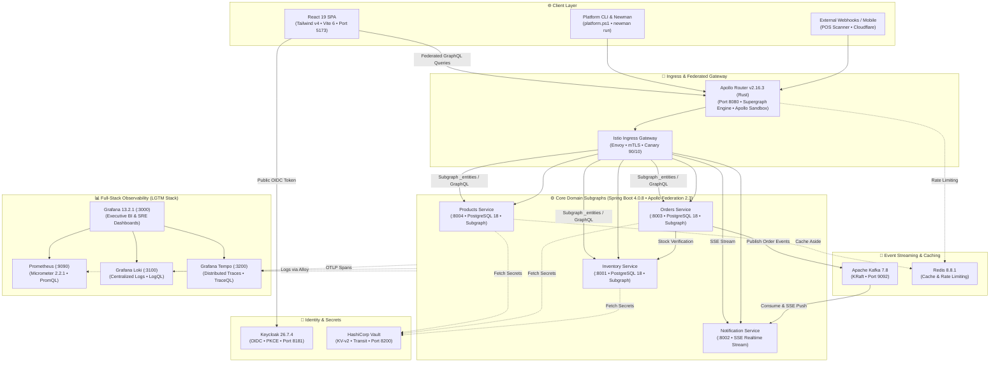

# 🏛️ Enterprise Microservices Architecture

<p align="center">
  
  
  
  
  
  
  
  
  
  
  
</p>

> **Enterprise Multi-Cloud Microservices Platform** built with **Java 21**, **Spring Boot 4.0.8**, and **React 19 + TailwindCSS v4**. Features automated **DHL tracking number generation**, real-time **Cart Abandonment Rate** telemetry, **Saga distributed transactions**, **Istio Service Mesh**, **HashiCorp Vault**, **Keycloak OAuth2/OIDC**, **KEDA v2.20.1 Event-Driven Autoscaling (Kafka Lag & Prometheus RPS)**, and full **DevSecOps automation** across AWS, Azure, GCP, and local Minikube.

---

## 🏛️ Master Architecture Diagram


---

## 📚 Specialized Documentation Hub

To keep this overview concise and practical, in-depth architectural specifications, cloud matrices, and operational manuals have been modularized into dedicated guides:

| Guide | Focus & Key Contents | Target Audience |
| :--- | :--- | :--- |
| [🏛️ **Architecture & Domain Guide**](./docs/ARCHITECTURE.md) | Domain-Driven Design (DDD), Saga compensation flow, Keycloak 26 IAM, HashiCorp Vault secrets, React 19 state context, POS QR workflows, and Amazon/Mercado Libre e-commerce models. | Software Architects, Developers |
| [☸️ **Local Deployment & Kubernetes**](./docs/LOCAL_DEPLOYMENT.md) | Docker Compose (15 services), Minikube cluster setup (6 CPUs / 12 GB RAM / 40 GB disk), Istio service mesh, Envoy sidecars, and cluster resiliency (HPA, ESO, Alertmanager). | DevOps, Platform Engineers |
| [🛡️ **DevSecOps Platform & CI/CD**](./docs/DEVSECOPS_AND_CI_CD.md) | GitHub Actions service delivery flow, 14-stage Azure DevOps and Bitbucket pipelines, Policy-as-Code, SAST, Trivy, DAST, and ArgoCD GitOps. | SecOps, Cloud Engineers |
| [📊 **Observability & Query Handbook**](./docs/OBSERVABILITY_QUERIES.md) | Comprehensive catalog and cheat sheet for PromQL (business funnels, RED signals, JVM), LogQL (Loki error hunting, trace correlation), and TraceQL (Tempo spans). | SRE, Operations Engineers |
| [🧪 **Testing, Simulation & Chaos**](./docs/TESTING_AND_CHAOS.md) | Unified simulation engine (`simulate.py`), authenticated Apollo Router load/chaos scenarios, frontend/API smoke checks, and Newman API contract testing. | QA Engineers, Developers |
| [🛡️ **Local Reliability & Delivery Gates**](./docs/LOCAL_MATURITY_GATES.md) | Bounded k6 baseline, local database restore drill, observability validation, Terraform safeguards, and offline CI checks. | Developers, Platform Engineers |
| [☁️ **Multi-Cloud Terraform & Recovery**](./docs/MULTI_CLOUD_TERRAFORM.md) | Infrastructure as Code for AWS (EKS/RDS), Azure (AKS/Postgres), and GCP (GKE/CloudSQL), reusable modules, isolated workspaces, and provider-specific recovery runbooks. | Cloud Architects, SRE |
| [🛠️ **Automation Scripts Reference**](./docs/SCRIPTS_REFERENCE.md) | Complete CLI reference for `platform.ps1`, cloud helpers (`manage-aws.ps1`, `manage-azure.ps1`, `manage-gcp.ps1`), FinOps disk cleanup, and build automation. | Platform Ops, SysAdmins |
| [📦 **Postman & Newman API Suite**](./devsecops/testing/newman/microservices.postman_collection.json) | Unified API collection aligned with Apollo Router (Federation 2.3 operations, Keycloak login flows, DHL tracking, and dynamic order chaining through frontend Nginx). | API Developers, QA |

---

## 🔌 Service, Port & Credentials Matrix

The host ports below describe the Docker Compose profile. In Minikube the microservice services are ClusterIP; use the managed frontend/Router/Keycloak port-forwards or create a service-specific `kubectl port-forward` for direct Swagger access. The Postman collection and `smoke.py` use the frontend Nginx proxy for REST routes, so they do not need host forwards for ports `8001`–`8004`. GraphQL and proxied API calls through frontend Nginx share a per-client rate limit (20 requests/second, burst 30); HTTP 429 events and the socket peer IP are written as JSON to container logs and queried from Grafana/Loki.

| Service | Technology | Port | Access URL | Default Credentials |
| :--- | :--- | :---: | :--- | :--- |
| **Keycloak IAM** | Keycloak 26.7.4 (OIDC / OAuth2) | `8181` / `9000` | [http://localhost:8181](http://localhost:8181) | `admin` / `admin` |
| **React Frontend** | React 19 + Tailwind v4 / Nginx | `5173` | [http://localhost:5173](http://localhost:5173) | `admin_user` / `admin` & `basic_user` / `password` |
| **Apollo Router Gateway** | Apollo Router v2.16.3 (Rust / Apollo Federation 2.3) | `8080` | [http://localhost:8080](http://localhost:8080) (Apollo Sandbox & `/graphql`) | Bearer JWT / Public Introspection |
| **Products Service** | Spring Boot 4.0.8 | `8004` | [http://localhost:8004/graphql](http://localhost:8004/graphql) & `/api/product` | Internal Subgraph & REST |
| **Orders Service** | Spring Boot 4.0.8 | `8003` | [http://localhost:8003/graphql](http://localhost:8003/graphql) & `/api/order` | Internal Subgraph & REST |
| **Inventory Service** | Spring Boot 4.0.8 | `8001` | [http://localhost:8001/graphql](http://localhost:8001/graphql) & `/api/inventory` | Internal Subgraph & REST |
| **Notification Service** | Spring Boot 4.0.8 | `8002` | [http://localhost:8002/api/notifications/stream](http://localhost:8002/api/notifications/stream) | SSE Stream |
| **Kafka Broker** | Apache Kafka (KRaft) 7.8.0 | `9092` / `9094` | `localhost:9092` / `localhost:9094` | SASL PLAIN *(Encrypted network)* |
| **Kafka Exporter** | Prometheus Kafka Exporter 1.9 | `9308` | [http://localhost:9308/metrics](http://localhost:9308/metrics) | *(No auth required)* |
| **Redis & Exporter** | Redis 8.8.1 / Exporter 1.82 | `6379` / `9121` | `localhost:6379` • [`:9121/metrics`](http://localhost:9121/metrics) | *(Password protected)* |
| **PostgreSQL DBs** | PostgreSQL 18 (DB-per-Service) | `5431`–`5435` | `localhost:5431, 5433, 5434, 5435` | `postgres` / `postgres` |
| **Postgres Exporter** | Prometheus Postgres Exporter 0.20 | `9187` | [http://localhost:9187/metrics](http://localhost:9187/metrics) | *(No auth required)* |
| **HashiCorp Vault** | Vault 2.0.4 (KV-v2 / Transit) | `8200` | [http://localhost:8200](http://localhost:8200) | Root Token: `root` |
| **OPA Gatekeeper** | Open Policy Agent Gatekeeper 3.23.0 | `8888` / `8443` | [http://localhost:8888](http://localhost:8888) | *(Admission Webhook / Metrics)* |
| **OpenTelemetry Collector** | OTel Collector Contrib 0.159 | `4317` / `4318` | `localhost:4317` (gRPC) • [`:4318`](http://localhost:4318) (HTTP) | *(OTLP Ingestion)* |
| **Grafana** | Grafana 13.2.1 | `3000` | [http://localhost:3000](http://localhost:3000) | `admin` / `admin` |
| **Prometheus** | Prometheus TSDB 3.14.0 | `9090` | [http://localhost:9090/targets](http://localhost:9090/targets) | *(No auth required)* |
| **Loki** | Grafana Loki 3.7.4 | `3100` | `localhost:3100` | *(Via Grafana datasource)* |
| **Tempo** | Grafana Tempo 3.0.3 | `3200` | `localhost:3200` | *(Via Grafana datasource)* |
| **Alloy** | Grafana Alloy 1.19.1 | `3300` | `localhost:3300` (Compose UI) | *(Log collector; not a Grafana datasource)* |
| **Istio Ingress Gateway** | Envoy Proxy (Istio 1.31.1) | `80` / `443` | [http://localhost](http://localhost) | Mesh Ingress |
| **Kiali Dashboard** | Kiali 2.31.0 | `20001` | [http://localhost:20001](http://localhost:20001) | *(No auth required)* |
| **OpenCost Dashboard** | OpenCost 2.5.32 | `7000` | [http://localhost:7000](http://localhost:7000) | *(No auth required)* |

### 📖 API Exploration & Interactive Documentation Matrix

The platform separates **Unified Federated GraphQL Supergraph exploration** from **Microservice REST API documentation**:

| Interface | Protocol / Tool | Direct Access URL | Scope & Capabilities |
| :--- | :--- | :--- | :--- |
| 🚀 **Apollo Sandbox** | GraphQL Federation 2.3 | [http://localhost:8080](http://localhost:8080) | Interactive supergraph explorer, schema introspection, query visualizer, and live execution across all federated subgraphs. |
| 📖 **Products Swagger UI** | OpenAPI 3.0 (SpringDoc) | [http://localhost:8004/swagger-ui.html](http://localhost:8004/swagger-ui.html) | OpenAPI v3 interactive UI for Products REST endpoints (`/api/product/**`, `/v3/api-docs`). |
| 📖 **Orders Swagger UI** | OpenAPI 3.0 (SpringDoc) | [http://localhost:8003/swagger-ui.html](http://localhost:8003/swagger-ui.html) | OpenAPI v3 interactive UI for Orders REST endpoints, funnel telemetry (`/api/order/funnel`), and idempotency headers. |
| 📖 **Inventory Swagger UI** | OpenAPI 3.0 (SpringDoc) | [http://localhost:8001/swagger-ui.html](http://localhost:8001/swagger-ui.html) | OpenAPI v3 interactive UI for Inventory REST endpoints (`/api/inventory/**`, `/v3/api-docs`). |
| 📖 **Notification Swagger UI** | OpenAPI 3.0 (SpringDoc) | [http://localhost:8002/swagger-ui.html](http://localhost:8002/swagger-ui.html) | OpenAPI v3 interactive UI for Notifications & SSE stream endpoint (`/api/notifications/stream`). |

---

## ⚡ Core Enterprise Capabilities

### 🛒 E-Commerce & Retail Innovation
* **Automated DHL Tracking Generation:** Every successfully placed order automatically generates a trackable carrier tracking number (e.g. `DHL-A8B9C0D1`) and initial tracking event history.
* **Cart Abandonment Rate Telemetry:** Asynchronous funnel telemetry (`CART_ADD` $\rightarrow$ `CHECKOUT_START` $\rightarrow$ `CHECKOUT_STEP` $\rightarrow$ `PLACED`) published to Kafka, feeding live Prometheus gauges and Grafana BI conversion funnels.
* **Point of Sale (POS) & QR Scanner:** Dual workflow supporting standard checkout and physical POS cashier operations with Code-128 barcode scanning and instant SAT/CFDI invoice QR generation.

### 🔄 Distributed Reliability & Consistency
* **Saga Orchestration Pattern:** Graceful compensation and stock rollback when downstream payment or inventory allocation fails.
* **Distributed Idempotency:** Guaranteed once-only order processing via mandatory UUIDv4 `X-Idempotency-Key` headers backed by Redis deduplication.
* **Resilience4j Circuit Breakers:** Protects upstream callers with automatic state transitions (`CLOSED` $\rightarrow$ `OPEN` $\rightarrow$ `HALF_OPEN`) and thread-isolated bulkheads.

### 🛡️ Zero-Trust Security & DevSecOps
* **OIDC Authentication:** Public Keycloak SPA client (`microservices_frontend`) using PKCE without a browser-held `client_secret`; a native mobile app needs its own redirect URI configuration.
* **Centralized Secrets with HashiCorp Vault:** Dynamic secret generation and encryption-as-a-service (Transit Engine) replacing static environment variables.
* **Policy-as-Code (OPA & Gatekeeper):** Automated admission controller rules blocking privileged containers, enforced CPU/memory limits, and mandatory labels.

### 📊 Full-Stack Observability (LGTM Stack)
* **Pre-Provisioned Grafana Dashboards:**
  1. `🏢 Business Intelligence & Inventory Operations` (Net revenue, completed orders, AOV, Cart Abandonment Rate, SKU demand, cohort retention).
  2. `🛡️ Technical, Infrastructure & Security Operations (SRE)` (Golden signals, P95 latency, circuit breaker states, HikariCP pools, JVM Heap, threat level).
* **Deep Telemetry Correlation:** One-click drill-down in Grafana Explore linking Tempo distributed spans $\leftrightarrow$ Loki structured logs $\leftrightarrow$ Prometheus metrics.

---

## 🚀 Quick Start (Up in 3 Minutes)

### Option A: Local Docker Compose (15 Services)

The fastest way to spin up the complete ecosystem including all microservices, databases, Keycloak, Vault, and Grafana:

```powershell
# 1. Clone the repository
git clone https://github.com/georgegxx/microservices-architecture.git
cd microservices-architecture

# 2. Copy environment file if not already present and define the passwords
cp .example.env .env

# 3. Start Keycloak and its database in detached mode
docker compose up -d --build keycloak

# 4. Native PowerShell script (auto-syncs client secret into .env):
pwsh -File .\scripts\bootstrap-keycloak.ps1

# 5. Launch all 15 services in detached mode:
docker compose up -d --build

# 6. Verify healthy startup across all containers:
docker compose ps

# 7. Graceful shutdown & volume teardown
docker compose down -v
```

**Recommended local resources:** 6 CPU cores and 12 GB RAM free — the full Docker Compose stack runs ~20 containers (5 microservices, frontend, Keycloak, Postgres, Kafka, Redis, and the Grafana LGTM observability stack).

---

### Option B: Local Kubernetes on Minikube (Enterprise DevSecOps)

To deploy the entire production-grade stack on Minikube with **Istio Service Mesh**, **OPA Gatekeeper**, and **Helm**:

```powershell
# 1. Host CLI Audit & Automated Winget Installation
.\platform.ps1 tools

# 2. Start Minikube, initialize Istio Service Mesh, and deploy the umbrella Helm chart:
.\platform.ps1 up -Platform minikube -Environment dev -WithIstio

# 3. Audit platform health, pods, NodePorts, and Gatekeeper OPA policies:
.\platform.ps1 doctor -Platform minikube -Environment dev

# 4 Check all pods running
kubectl get pods -A
kubectl get pods -n dev # observability, auth, data, ..

# 5. Destroy the entire stack:
.\platform.ps1 down -Destroy
```

> 📘 **Step-by-step Minikube guide:** Detailed hardware allocation, network topologies, and DNS setup are available in [docs/LOCAL_DEPLOYMENT.md](./docs/LOCAL_DEPLOYMENT.md).
---

## 🧪 Automated Testing & Simulation Suite

The platform provides a comprehensive suite of Python and PowerShell scripts to validate health, contract integrity, load simulation, and telemetry:

```powershell
# 1. End-to-End Smoke Testing (9/9 Synthetic Checks)
python scripts/testing/smoke.py

# 2. Legitimate E-Commerce User Traffic Simulation
python scripts/testing/simulate.py --scenario traffic --orders 15 --concurrency 3

# 3. Telemetry & PromQL Diagnostics (JVM, Abandonment Rate, Vault)
python scripts/testing/check.py --check all

# 4. Platform Ecosystem Verification (Apollo Router, Microservices, Grafana)
python scripts/testing/verify.py

# 5. DevSecOps Synthetic Health & Security Gate
python scripts/endpoint-smoke-test.py

# 6. Newman API Contract Suite (22 Requests)
npx --yes newman run devsecops/testing/newman/microservices.postman_collection.json `
  --env-var "BASE_URL=http://localhost:8080" `
  --env-var "keycloak_url=http://localhost:8181" `
  --reporters cli
```

---

## 🛍️ Modernized Storefront Architecture (React 19 & TailwindCSS v4)

The presentation layer (`http://localhost:5173`) has been re-architected following enterprise e-commerce best practices:

- **Context-Aware Search:** The header search filters the product catalog and opens the quick command palette; Orders & Tracking keeps one order-history search, and Admin has filters scoped to each management table. The header search is hidden on the Orders view to avoid showing two search fields at once.
- **Enterprise Wishlist Persistence:** Adheres to mature e-commerce identity patterns—guest users are seamlessly prompted to authenticate via Keycloak to save items, while authenticated customers have their favorites safely persisted across sessions and devices.
- **Role-Based Telemetry & Admin Controls:** Administrative tools (QR/Barcode Scanner for inventory auditing, Admin Telemetry tab, warehouse controls) are strictly restricted to users holding the `ADMIN` role.
- **Scoped Notification Feed:** Real-time Server-Sent Events (SSE) from `notification-service` are isolated per authenticated user profile to protect transactional privacy (order confirmation, DHL tracking, stock alerts).
- **Responsive Pagination:** Full, responsive pagination controls with items-per-page selectors and page counters across both the public product catalog and the administrative data tables.

---

## 📁 Repository Structure

```text
microservices-architecture/
├── .github/workflows/              # GitHub Actions service CI, registry, GitOps and Terraform workflows
├── apollo-router/                  # Apollo Router v2 Supergraph Gateway (Port 8080 • Federation 2.3)
├── argocd                          # GitOps and CD Deployments
├── azure-devops                    # Azure DevOps Pipeline YAML files
├── devsecops/                      # Centralized DevSecOps Hub
│   ├── compliance/trivy/           # Trivy container scanner configuration
|   ├── dast/zap/                   # OWASP ZAP baseline rules and profiles
│   ├── policies/                   # OPA Rego Conftest & Gatekeeper constraints
│   ├── reference/aws-eks/          # GHA and ArgoCDfor AWS (Lab version)
|   ├── sast/gitleaks/              # Gitleaks and Semgrep static security configs
│   └── testing/newman/             # microservices.postman_collection.json (22-request API suite)
├── docs/                           # 📚 Specialized Modular Documentation
│   ├── ARCHITECTURE.md             # Tactical DDD, Sagas, Security, POS & E-Commerce
│   ├── LOCAL_DEPLOYMENT.md         # Docker Compose, Minikube, Istio & Resiliency
│   ├── DEVSECOPS_AND_CI_CD.md      # GitHub/Azure/Bitbucket CI/CD, OPA, Trivy & DAST
│   ├── GIT_WORKFLOW_AND_COLLABORATION.md # Trunk-based / Gitflow, branch drift & rollback playbooks
│   ├── OBSERVABILITY_QUERIES.md    # PromQL, LogQL, and TraceQL Telemetry Handbook
│   ├── TESTING_AND_CHAOS.md        # Load simulation, DDoS, Chaos & Newman tests
│   ├── MULTI_CLOUD_TERRAFORM.md    # AWS, Azure, GCP Terraform & Rollback Guide
│   ├── SCRIPTS_REFERENCE.md        # Complete platform.ps1 & automation scripts manual
│   ├── Diagrams.drawio             # 12-Page Architectural Blueprint (Draw.io)
│   └── realm-export.json           # Keycloak 26 Realm configuration backup
├── frontend/                       # React 19 + TailwindCSS v4 SPA (Nginx Distroless)
├── helm/                           # Kubernetes Helm Charts (Umbrella chart & subcharts)
├── inventory-service/              # Stock allocation & verification (Port 8001)
├── k8s/                            # Kubernetes manifests & Istio routing rules
├── notification-service/           # Kafka event consumer & SSE Stream (Port 8002)
├── observability/                  # Grafana LGTM provisioning (Dashboards, Alloy, Loki, Tempo)
├── orders-service/                 # Order orchestration & Saga orchestrator (Port 8003)
├── products-service/               # Product catalog domain (Port 8004)
├── scripts/                        # Enterprise automation scripts (PowerShell & Python)
│   ├── testing/                    # Specialized testing & load simulation (simulate, smoke, verify, check)
│   ├── bootstrap-keycloak.ps1      # Keycloak 26 IAM realm bootstrapper & client secret sync
│   ├── build-all.py                # Concurrent Java & React container image compiler
│   ├── endpoint-smoke-test.py      # Synthetic post-deployment health & SLO prober
│   ├── generate-secure-secrets.py  # CSPRNG cryptographic secret & JWT key generator
│   ├── generate_drawio.py          # Programmatic 12-page architectural diagram generator
│   ├── local-cost-estimator.py     # Offline illustrative estimate (not provider billing)
│   ├── validate-opencost.sh        # Render pinned OpenCost and cloud Prometheus charts
│   ├── supervise-tunnels.py        # Resilient background port-forward supervisor daemon
│   └── update_dashboards.py        # Dashboard JSON generator; Grafana publishing is explicit
├── terraform/                      # Multi-Cloud IaC (AWS, Azure, GCP modules & workspaces)
├── .example.env                    # Example environment file
├── .gitattributes                  # Git attributes file
├── .gitignore                      # Git ignore file
├── .gitleaks.toml                  # Gitleaks configuration file
├── .gitleaksignore                 # Gitleaks ignore file
├── bitbucket-pipelines.yml         # Bitbucket Pipelines CI/CD configuration
├── compose.yaml                    # Local multi-service development stack (15 containers)
├── platform.ps1                    # Enterprise Platform Master CLI Orchestrator
├── pom.xml                         # Maven Multi-Module Reactor (Java 21, Spring Boot 4.0.8)
└── README.md                       # README file
```
---

## 📄 License

This project is licensed under the **MIT License** — see the [LICENSE](LICENSE) file for details.
