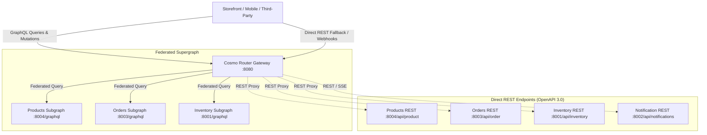

# 📐 Enterprise API Design & Contract Standards

> [!TIP]
> 🧭 **[Enterprise Platform Hub](../../README.md)** > **01. Architecture** > `API_DESIGN_AND_CONTRACTS.md`

This guide formalizes the architectural contracts, REST standards, **RFC 7807 Problem Details**, and **GraphQL Federation v2** schemas enforced across the microservices ecosystem.

---

## 🏛️ Dual-Interface API Strategy: GraphQL Federation + REST

The platform adopts a hybrid dual-interface architecture:



1. **GraphQL Federation v2 (External/BFF):** Consumed by the React 19 Storefront for low-latency batch fetching and single-roundtrip aggregations.
2. **RESTful APIs with OpenAPI 3.0 (Internal/Automation):** Consumed by Newman contract tests, automated webhooks, health checks, and service-to-service communication.

---

## 📜 RESTful Resource & URL Conventions

All REST endpoints adhere to strict RESTful URL design rules:

| Category | Convention | Good Example | Anti-Pattern (Avoid) |
| :--- | :--- | :--- | :--- |
| **Resources** | Plural nouns, lowercase, kebab-case | `/api/product`, `/api/order` | `/api/getProducts`, `/api/create_order` |
| **Identifiers** | Path parameters for entity lookup | `/api/inventory/{sku}`, `/api/order/{id}` | `/api/inventory?sku=XYZ` |
| **Sub-Resources** | Nested hierarchical paths | `/api/order/{id}/items` | `/api/getOrderItems?orderId=123` |
| **Actions** | Controller sub-paths using verbs | `/api/order/{id}/cancel` | `/api/cancelOrder/{id}` |

---

## 📄 Standard Pagination & Filtering Contract

Endpoints returning collections support deterministic pagination using standard query parameters:

```http
GET /api/product?pageNumber=0&pageSize=20&sort=name,asc
```

### Query Parameters:
* `pageNumber` *(integer, default: 0)*: Zero-indexed page number.
* `pageSize` *(integer, default: 20, max: 100)*: Number of items per page.
* `sort` *(string, optional)*: Field name followed by direction (e.g. `price,desc`).

### Standard Paged Response Schema (OpenAPI 3.0):
```json
{
  "content": [
    {
      "id": 1,
      "sku": "SKU-TECH-001",
      "name": "Mechanical Keyboard",
      "price": 129.99,
      "currency": "USD",
      "status": true
    }
  ],
  "pageable": {
    "pageNumber": 0,
    "pageSize": 20,
    "offset": 0
  },
  "totalElements": 48,
  "totalPages": 3,
  "last": false,
  "first": true,
  "empty": false
}
```

---

## 🛡️ Universal Error Handling: RFC 7807 (Problem Details)

All microservices implement **RFC 7807 Problem Details** via a centralized `GlobalExceptionHandler`. Unhandled exceptions never leak raw stack traces to clients.

### RFC 7807 Payload Structure:
```json
{
  "type": "https://api.microservices.example.com/errors/insufficient-stock",
  "title": "Insufficient Stock",
  "status": 409,
  "detail": "Requested quantity (10) exceeds available stock (3) for SKU: SKU-TECH-001.",
  "instance": "/api/order",
  "timestamp": "2026-10-02T14:10:00Z"
}
```

### HTTP Status Code Mapping:
| HTTP Status | Exception Class | RFC 7807 Title | Scenario |
| :---: | :--- | :--- | :--- |
| **400 Bad Request** | `MethodArgumentNotValidException` | Validation Failed | Missing mandatory fields (e.g. empty SKU or quantity $\le 0$). |
| **401 Unauthorized** | `AuthenticationException` | Unauthorized | Missing or expired JWT bearer token. |
| **403 Forbidden** | `AccessDeniedException` | Forbidden | Standard user attempting to cancel another customer's order. |
| **404 Not Found** | `ProductNotFoundException`, `OrderNotFoundException` | Resource Not Found | Target entity does not exist in domain repository. |
| **409 Conflict** | `InsufficientStockException` | Domain Conflict | Concurrency collision or insufficient warehouse inventory. |
| **503 Service Unavailable** | `ServiceUnavailableException` | Downstream Outage | Circuit breaker open on downstream dependency. |

---

## 🧩 Apollo Federation v2 Schema Directives

Each microservice exposes a federated subgraph schema:

```graphql
extend schema
  @link(url: "https://specs.apollo.dev/federation/v2.3",
        import: ["@key", "@shareable", "@external", "@provides"])

type Product @key(fields: "id") {
  id: ID!
  sku: String!
  name: String!
  price: Float!
  inventory: InventoryStock @provides(fields: "quantity")
}

type Order @key(fields: "id") {
  id: ID!
  orderNumber: String!
  userId: String!
  status: OrderStatus!
  items: [OrderItem!]!
}
```

---

## 🧪 Contract Testing & Automated Verification

API contracts are continuously verified in CI/CD pipelines via:
* **Newman Automated Contract Suite:** [`devsecops/testing/newman/microservices.postman_collection.json`](../../devsecops/testing/newman/microservices.postman_collection.json) executes 20 requests and 47 assertions covering both public and authenticated flows.
* **SpringDoc Swagger UI:** Available locally at `http://localhost:<port>/swagger-ui.html` and `http://localhost:<port>/v3/api-docs` on every microservice.
* **Cosmo Supergraph Execution Config:** Stored in [`helm/charts/cosmo-router/files/execution-config.json`](../../helm/charts/cosmo-router/files/execution-config.json).
