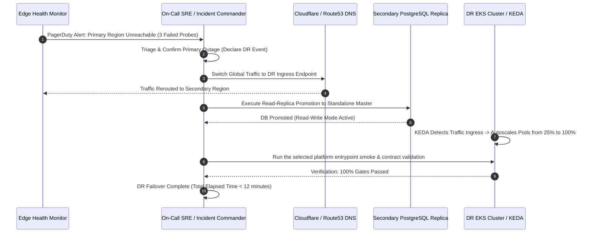

# 🛡️ Business Continuity & Disaster Recovery (BCDR) Strategy

> [!TIP]
> 🧭 **[Enterprise Platform Hub](../../README.md)** > **01. Architecture** > `DISASTER_RECOVERY_STRATEGY.md`

This document defines the formal **Business Continuity and Disaster Recovery (BCDR)** strategy for the microservices platform, aligned with **ISO 22301** (Business Continuity Management) and **NIST SP 800-34** (Contingency Planning for Federal Information Systems).

---

## 🎯 Executive Summary & Objectives

The platform guarantees service availability against catastrophic failures—such as regional cloud outages, physical datacenter destruction, ransomware encryption, or accidental administrative state loss.

### Target Service Level Objectives (SLOs)
* **High Availability (HA):** 99.95% uptime across Multi-AZ intra-region infrastructure.
* **Disaster Recovery (DR):** Cross-region **Warm Standby** architecture ensuring failover within minutes.

---

## 📊 Business Impact Analysis (BIA): RTO & RPO Tiers

Every service and stateful store is categorized by business criticality to optimize the cost-to-resilience ratio:

```mermaid
quadrantChart
    title BIA Service Criticality Matrix (RTO vs RPO)
    x-axis Low RTO (Minutes) --> High RTO (Hours)
    y-axis High RPO (Hours) --> Low RPO (Seconds)
    quadrant-1 Low Urgency
    quadrant-2 Tier 1: Mission Critical (Orders, Keycloak, Postgres)
    quadrant-3 Tier 2: Business Operational (Inventory, Products, Router)
    quadrant-4 Tier 3: Async & Observability (Notifications, LGTM)
    "Orders Service": [0.15, 0.90]
    "Keycloak IAM": [0.10, 0.95]
    "PostgreSQL Data": [0.10, 0.98]
    "Cosmo Router": [0.20, 0.70]
    "Inventory Service": [0.25, 0.75]
    "Products Service": [0.25, 0.65]
    "Kafka KRaft": [0.20, 0.85]
    "Notification Service": [0.60, 0.40]
    "Observability LGTM": [0.75, 0.30]
```

| Criticality Tier | Workload / Data Store | Maximum Tolerable Downtime (RTO) | Maximum Data Loss (RPO) | Resiliency & Recovery Architecture |
| :--- | :--- | :---: | :---: | :--- |
| **Tier 1: Mission-Critical** | • `orders-service`<br/>• `keycloak` IAM<br/>• PostgreSQL Databases | **< 15 minutes** | **< 1 minute** | Multi-AZ Primary + Cross-Region Asynchronous Read Replica with fast promotion; continuous WAL archiving to S3 WORM Object Lock. |
| **Tier 2: Business-Operational** | • `cosmo-router`<br/>• `products-service`<br/>• `inventory-service`<br/>• Apache Kafka KRaft | **< 30 minutes** | **< 5 minutes** | Active cluster standby; Kafka MirrorMaker 2.0 active topic replication; ArgoCD automated GitOps state convergence. |
| **Tier 3: Async & Observability** | • `notification-service`<br/>• Redis Cache<br/>• LGTM Stack (Loki, Tempo, Prometheus) | **< 2 hours** | **< 1 hour** | Ephemeral cache rebuilt from source DBs; asynchronous notification retries; cold storage metric snapshots. |

---

## 🏗️ Cross-Region Architecture: Warm Standby Topology

```mermaid
graph TD
    Client[Global Clients & Edge Traffic] -->|Anycast Routing| Edge[Cloudflare Zero-Trust / Route53]
    
    subgraph "Primary Region (AWS us-east-1 / Active)"
        Edge -->|Primary Active (100% Traffic)| Ingress1[Istio Ingress Gateway]
        Ingress1 --> EKS1[EKS Cluster Primary]
        EKS1 --> App1[Microservices + Router]
        App1 --> DB1[(RDS PostgreSQL 18 Multi-AZ)]
        App1 --> K1[Kafka KRaft Primary]
        App1 --> R1[(Redis ElastiCache Primary)]
    end

    subgraph "Continuous Data Replication"
        DB1 -->|Cross-Region Streaming Replication| DB2[(RDS PostgreSQL Standby Replica)]
        DB1 -->|Continuous WAL Archiving| S3WORM[S3 Immutable Backup Object Lock]
        K1 -->|MirrorMaker 2.0 Topic Sync| K2[Kafka KRaft Standby]
    end

    subgraph "Secondary DR Region (AWS us-west-2 / Warm Standby)"
        Edge -.->|Automated DNS Failover < 30s| Ingress2[Istio Ingress Gateway DR]
        Ingress2 --> EKS2[EKS Cluster DR 25% Baseline]
        EKS2 --> App2[Microservices Standby / KEDA Autoscalers]
        App2 -.->|Promoted on Failover| DB2
        App2 -.-> K2
        App2 -.-> R2[(Redis Standby Cache)]
    end
```

### Key Architectural Tenets:
1. **Edge Anycast & Health Probes:** Cloudflare Zero-Trust Anycast monitors the primary Ingress endpoint (`/health`). Upon 3 consecutive failed probes (15 seconds), traffic automatically reroutes to the secondary region.
2. **Baseline Warm Standby:** The DR EKS cluster runs 25% of standard pod replicas. When failover traffic arrives, **KEDA** (Kubernetes Event-driven Autoscaling) detects the incoming request rate and scales pods to 100% in under 45 seconds.
3. **Storage Immutability (WORM):** Database WAL backups are sent to S3 with **Object Lock** in *Compliance Mode* (Write Once, Read Many), preventing ransomware or compromised administrative credentials from wiping out historical restore points.

---

## 🔄 Disaster Recovery Runbooks

### Runbook 1: Automated / Assisted Failover Procedure



#### Detailed Execution Steps:
1. **Triage & Declaration:** Incident Commander verifies via cloud provider health status that the primary region is unrecoverable within the RTO budget.
2. **Database Promotion:**
   ```bash
   # AWS CLI RDS Promotion
   aws rds promote-read-replica \
     --db-instance-identifier microservices-prod-dr-replica \
     --region us-west-2
   ```
3. **DNS Traffic Shift:**
   Update Cloudflare DNS pool or Route53 Failover record to point `api.microservices.example.com` to the DR Network Load Balancer (NLB).
4. **Scale-up Workloads:**
   KEDA automatically scales deployments upon receiving traffic. Alternatively, manually patch replica counts:
   ```bash
   kubectl scale deployment cosmo-router --replicas=4 -n dev
   kubectl scale deployment orders-service --replicas=4 -n dev
   ```
5. **Post-Failover Verification:**
   Run the repository's smoke and contract verification jobs against the DR
   endpoint from CI. Cloud provider entrypoints manage infrastructure and
   GitOps operations, not local application test runners.

---

### Runbook 2: Failback Procedure (Return to Primary Region)

> [!CAUTION]
> Never perform failback during active peak business hours. Schedule a planned maintenance window to avoid dual-master split-brain scenarios.

1. **Re-establish Primary Infrastructure:** Verify primary region availability and apply Terraform configurations to confirm zero drift:
   ```bash
   terraform -chdir=terraform/environments/aws plan
   ```
2. **Reverse Database Synchronization:** Configure the primary database as a read-replica of the DR database to capture data generated during the outage:
   ```bash
   # Re-sync delta from us-west-2 back to us-east-1
   aws rds create-db-instance-read-replica \
     --db-instance-identifier microservices-prod-primary-resync \
     --source-db-instance-identifier arn:aws:rds:us-west-2:ACCOUNT:db:microservices-prod-dr \
     --region us-east-1
   ```
3. **Drain Traffic & Switch DNS:** Temporarily enable maintenance mode, verify replica catch-up (Replication Lag = 0 seconds), promote primary DB, and switch DNS back to `us-east-1`.
4. **Decommission DR Over-Provisioning:** Scale DR cluster back to its 25% baseline footprint.

---

## 💾 Kubernetes State Protection with Velero

While all application configurations and deployments are stored declaratively in Git (GitOps via ArgoCD), stateful PersistentVolumeClaims (PVCs) and dynamically generated Secrets/Certificates are backed up via **Velero**:

### Automated Velero Schedule Manifest:
```yaml
apiVersion: velero.io/v1
kind: Schedule
metadata:
  name: daily-cluster-backup
  namespace: velero
spec:
  schedule: "0 2 * * *" # Every day at 02:00 UTC
  template:
    includedNamespaces:
      - dev
      - auth
      - data
      - vault
    snapshotVolumes: true
    storageLocation: s3-dr-bucket
    ttl: 720h0m0s # 30 Days Retention
```

### Full Cluster Disaster Recovery Command:
```bash
# Complete restoration on a freshly provisioned cluster
velero restore create --from-backup daily-cluster-backup-20261002020000
```

---

## 🎲 Chaos Engineering & Disaster Recovery Drills (GameDays)

To validate that procedures work in reality and not just on paper, the team conducts **semi-annual DR GameDays**:

1. **Simulated Scenarios:**
   * **Chaos Drill 1:** Sudden termination of primary database instance (Failover validation).
   * **Chaos Drill 2:** Blackhole network egress on primary Kafka broker (Resilience & idempotency check).
   * **Chaos Drill 3:** Simulated entire-region loss via DNS blackhole routing.
2. **Validation Criteria:**
   * Actual RTO $\le 15$ minutes.
   * Actual RPO $\le 1$ minute (Zero lost committed orders).
   * No data corruption in PostgreSQL bounded contexts.
