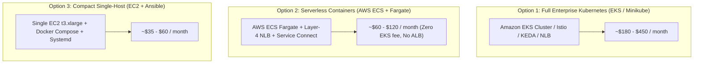

# 🚀 Lightweight & Cost-Optimized Deployment Patterns

> [!TIP]
> 🧭 **[Enterprise Platform Hub](../../README.md)** > **02. Operations** > `LIGHTWEIGHT_DEPLOYMENT_PATTERNS.md`

While full Kubernetes clusters (EKS, AKS, GKE) provide unmatched scalability and advanced traffic engineering (Istio, KEDA, GitOps), they introduce baseline overhead (~$73/mo fixed EKS control plane cost + multi-node pools). 

For startups, pilot environments, demos, staging tiers, or cost-conscious organizations, this guide introduces **two production-ready lightweight deployment alternatives**:



---

## 📊 Deployment Pattern Comparison Matrix

| Architectural Dimension | Pattern A: AWS ECS + Fargate | Pattern B: Compact EC2 + Ansible | Baseline: Kubernetes (EKS) |
| :--- | :--- | :--- | :--- |
| **Target Scale** | Small-to-Medium (1 - 50 RPS) | Small / PoC / Staging (< 20 RPS) | Enterprise (> 1,000 RPS) |
| **Estimated Monthly Cost** | **$60 - $120 USD** | **$35 - $60 USD** | $180 - $450 USD |
| **Control Plane Fee** | **$0.00** (Serverless) | **$0.00** (Direct OS) | $73.00 USD/mo (AWS EKS fee) |
| **Load Balancer Strategy** | **Layer-4 NLB** (ALB excluded) | Direct Elastic IP / Host Port | **Layer-4 NLB** fronting Istio Ingress |
| **Server Maintenance** | Zero (Serverless Tasks) | OS managed via Ansible playbooks | Kubernetes node patching & upgrades |
| **Service Discovery** | AWS ECS Service Connect (Cloud Map) | Docker Bridge Network (`internal-net`) | CoreDNS + Istio Envoy Sidecars |
| **Autoscaling** | ECS Task Autoscaling (CPU/RAM) | Vertical (Resize EC2) or scale Compose | KEDA (Kafka Lag + Prometheus RPS) |
| **IaC & Tooling** | 100% HashiCorp Terraform | Terraform + Ansible Playbooks | Terraform + Helm + ArgoCD |

> [!IMPORTANT]
> **Why Application Load Balancers (ALB) Are Completely Excluded:**
> ALBs introduce redundant Layer-7 parsing, higher recurring LCU charges, and lack native raw TCP/mTLS passthrough. The platform standardizes exclusively on **AWS Network Load Balancers (NLB - Layer 4)** to deliver ultra-low latency TCP passthrough, delegating all HTTP routing, GraphQL federation, and TLS termination cleanly to the container layer (Cosmo Router, Istio, or Nginx).

---

## ☁️ Pattern A: Serverless Containers with AWS ECS & Fargate

Located in [`terraform/environments/aws-ecs-fargate/`](../../terraform/environments/aws-ecs-fargate/).

### Key Features:
* **Zero Node Management:** AWS handles host provisioning, patching, and container runtime security.
* **Network Load Balancer (NLB):** High-performance Layer-4 TCP entrypoint directing port 80 to the Frontend and port 8080 to the Cosmo Router GraphQL Supergraph, eliminating ALB billing fees.
* **ECS Service Connect:** Native private mesh routing inter-service requests (e.g., `orders-service.microservices.local:8003`) without needing an external Consul or Eureka server.
* **Centralized Telemetry:** Integrated AWS CloudWatch Container Insights.

### Deployment Commands:
```bash
# 1. Navigate to the ECS Fargate directory
cd terraform/environments/aws-ecs-fargate

# 2. Initialize and plan
terraform init
terraform plan -out=tfplan

# 3. Apply infrastructure
terraform apply tfplan
```

### Outputs:
* `nlb_dns_name`: Public TCP Network Load Balancer endpoint URL to access the storefront and GraphQL supergraph.
* `ecs_cluster_arn`: Amazon Resource Name for the provisioned ECS cluster.

---

## 💻 Pattern B: Single-Node Compact Host with Terraform & Ansible

Located in [`terraform/environments/aws-ec2-compact/`](../../terraform/environments/aws-ec2-compact/) and [`ansible/`](../../ansible/).

This pattern provisions a single high-performance EC2 instance (e.g. `t3.xlarge` with 4 vCPUs and 16 GB RAM) and orchestrates all 10 microservices containers via **Docker Compose** managed by **Ansible** and **systemd**.

### Key Features:
* **Ultra-Low Cost:** Runs the complete stack (Keycloak, Postgres, Kafka KRaft, Redis, Cosmo Router, Frontend, and 4 Spring Boot microservices) on a single reserved or spot instance for as low as $35/month.
* **Automated Hardening:** Ansible configures UFW firewall rules, non-root users, and updates system packages.
* **Auto-Healing via Systemd:** Stack is registered as a systemd service (`/etc/systemd/system/microservices.service`). If the host reboots or Docker restarts, the entire stack automatically recovers.
* **Continuous Multi-DB Initialization:** Automated PostgreSQL script (`init-dbs.sql`) creates all 4 isolated databases (`db_keycloak`, `ms_products`, `ms_orders`, `ms_inventory`) on first launch.

### Step-by-Step Deployment:

#### Step 1: Provision the EC2 Host via Terraform
```bash
cd terraform/environments/aws-ec2-compact
terraform init
terraform apply -auto-approve
```
> [!NOTE]
> Terraform automatically generates the Ansible inventory file at `ansible/inventory/hosts.ini` with the assigned Elastic IP and SSH key parameters.

#### Step 2: Execute the Ansible Configuration Playbook
```bash
cd ../../../ansible

# Verify host connectivity
ansible -i inventory/hosts.ini microservices_hosts -m ping

# Run master deployment playbook
ansible-playbook -i inventory/hosts.ini playbooks/deploy-compact-stack.yml
```

#### Step 3: Verification & Health Checks
The playbook automatically runs post-deployment verification against Cosmo Router (`:8080/health`) and the Storefront (`:80`). You can also inspect running containers directly:
```bash
ssh -i ~/.ssh/id_rsa ubuntu@<PUBLIC_IP>
docker compose -f /opt/microservices/docker-compose.yml ps
```

---

## 🔄 Growth Path: Migrating from Compact to Full Kubernetes

When traffic or organizational complexity grows beyond a single host:
1. **Database Decoupling:** Migrate local containerized PostgreSQL to Amazon RDS Multi-AZ using AWS Database Migration Service (DMS).
2. **Event Stream Decoupling:** Point microservices to Amazon Managed Streaming for Apache Kafka (MSK).
3. **Switch to Minikube/EKS:** The application code, Dockerfiles, and Helm charts in `helm/charts/` remain reusable. Use `.\platform-multicloud.ps1 plan -Provider aws -Environment prod` and `apply` to provision EKS; CI publishes application images and the existing Argo CD Application reconciles the chart from its remote Git source.
