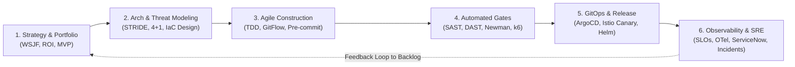
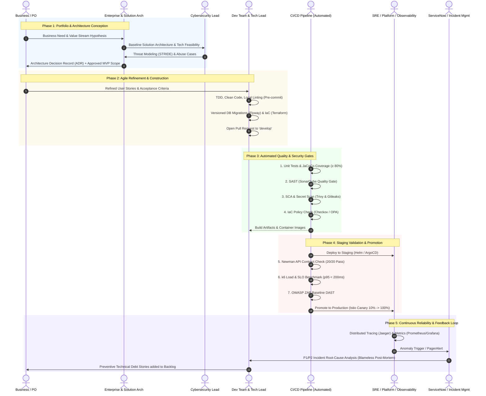
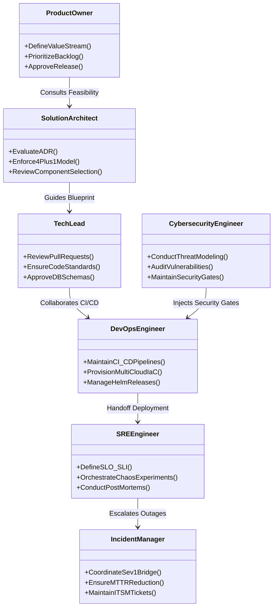

# 🏛️ Enterprise DevSecOps Governance & Operating Model

> [!TIP]
> 🧭 **[Enterprise Platform Hub](../../README.md)** > **03. DevSecOps & Testing** > `DEVSECOPS_GOVERNANCE_AND_MODEL.md`

---

## 🎯 Executive Overview

This document formalizes the **Enterprise DevSecOps Operating Model & Governance Framework** for the Microservices Architecture platform. It translates strategic business requirements into secure, resilient, and observable cloud-native services by bridging the gap between:

1. **Strategic & Business Governance** (Product Management, PMO, Enterprise Architecture)
2. **Shift-Left Engineering** (Development Teams, Technical Leads, Secure Code Quality)
3. **Automated Continuous Assurance** (CI/CD Pipelines, SAST, DAST, IaC, Contract & Performance Gates)
4. **Resilient Production Operations** (Platform/SRE, Observability, Incident Management, ServiceNow)



---

## 🔄 The 5-Phase End-to-End Delivery Lifecycle



---

## 📊 Comprehensive DevSecOps RACI Matrix

The following RACI matrix specifies organizational accountability across the multi-cloud platform:
- **R (Responsible):** The role that executes the task.
- **A (Accountable):** The individual with final approval and veto authority (only one `A` per activity).
- **C (Consulted):** Subject matter expert providing inputs, review, or validation.
- **I (Informed):** Kept updated on progress, outcomes, or releases.

| Lifecycle Stage | Activity / Milestone | Business / PO | Enterprise / Solution Arch | Tech Lead (Fabric) | Dev Team | QA / Automation | SecOps / CyberSec | Platform / DevOps | SRE / Observability | Incident / Support | Automated CI/CD |
| :--- | :--- | :---: | :---: | :---: | :---: | :---: | :---: | :---: | :---: | :---: | :---: |
| **1. Strategy & Conception** | Business Need & Value Stream | **A / R** | C | I | I | I | I | I | I | I | - |
| | Technical Feasibility & MVP | C | **A** | R | C | I | C | C | I | - | - |
| | Architecture Decision Record (ADR) | I | **A** | R | C | I | C | C | I | - | - |
| | Threat Modeling & Abuse Cases | I | C | C | I | C | **A / R** | I | I | - | - |
| **2. Sprint Planning** | User Stories & Definition of Done | **A** | C | R | R | C | C | I | I | - | - |
| | Infrastructure & Cloud Capacity Planning | I | C | C | I | I | I | **A** | R | I | - |
| **3. Construction** | Test-Driven Development (TDD) | I | I | C | **R** | C | I | I | I | - | - |
| | Database Migrations & Versioning | I | C | **A** | R | I | I | C | I | - | - |
| | IaC Provisioning (Terraform) | I | C | C | I | I | C | **A / R** | C | - | - |
| | Real-time Lint & Security Pre-commits | I | I | **A** | R | I | C | I | - | - | R |
| | Pull Request Code Review | I | I | **A** | R | I | C | C | - | - | - |
| **4. Automated Gates** | Build & Container Packaging | I | I | I | I | I | I | C | I | - | **A / R** |
| | SAST & SonarQube Quality Gate | I | I | C | R | I | **A** | I | - | - | **R** |
| | Container & Dependency CVE Scanning | I | I | I | R | I | **A** | C | - | - | **R** |
| | IaC Security Linting (Checkov / Trivy) | I | C | I | I | I | **A** | R | - | - | **R** |
| | API Contract Testing (Newman) | I | I | C | C | **A / R** | I | I | - | - | **R** |
| | Load & Performance Testing (k6) | I | C | C | C | **A / R** | I | C | C | - | **R** |
| | Dynamic Application Security (OWASP ZAP) | I | I | I | I | C | **A** | I | - | - | **R** |
| **5. Deployment** | Staging Promotion & Validation | I | I | C | I | C | C | **A / R** | C | - | **R** |
| | Production Gate Approval (CAB) | **A** | C | C | I | C | C | R | C | I | - |
| | Canary Traffic Shift (Istio 10% $\rightarrow$ 100%) | I | I | I | I | I | I | **A / R** | C | - | **R** |
| | Post-Deployment Smoke Probes | I | I | I | I | C | I | R | **A** | I | **R** |
| **6. Operations** | Metrics, Logs & Tracing Monitoring | I | I | I | I | I | I | C | **A / R** | I | - |
| | Incident Response (Sev 1 / Sev 2) | I | I | C | C | I | C | R | **A** | R | - |
| | Emergency Rollback Decision | I | C | C | I | I | I | R | **A** | I | **R** |
| | Blameless Post-Mortem & Remediation | C | C | R | R | I | C | R | **A** | C | - |

---

## 👥 Strategic Role Profiles & Accountabilities



### 1. Platform / DevOps Engineer
- **Mission:** Build and maintain immutable, self-healing multi-cloud infrastructure and high-velocity CI/CD delivery pipelines.
- **Key Responsibilities:**
  - Maintain Terraform code across Minikube, AWS EKS, Azure AKS, and GCP GKE.
  - Standardize Helm charts, KEDA scaling policies, and Istio service mesh configs.
  - Empower developers with automated, platform-specific local tooling (`platform-minikube.ps1`).

### 2. SRE (Site Reliability Engineer)
- **Mission:** Bridge software engineering and operations to ensure SLO compliance, resilience, and operational excellence.
- **Key Responsibilities:**
  - Establish SLIs and Error Budgets (e.g. 99.9% uptime, p95 latency < 500ms).
  - Execute chaos experiments and automated failovers.
  - Facilitate blameless post-mortems for major outages.

### 3. Observability Lead
- **Mission:** Provide unified visibility across telemetry signals (distributed traces, metrics, structured logs).
- **Key Responsibilities:**
  - Standardize OpenTelemetry instrumentations in GraphQL Router and Java/Go microservices.
  - Maintain Prometheus, Grafana, and Jaeger dashboards.
  - Configure dynamic alert thresholds to prevent alert fatigue.

### 4. Incident Manager & Support (L1/L2/L3)
- **Mission:** Minimize Mean Time to Resolution (MTTR) and protect customer experience during outages.
- **Key Responsibilities:**
  - Coordinate emergency response war rooms for Severity-1 and Severity-2 incidents.
  - Synchronize incident lifecycle through ServiceNow / PagerDuty.
  - Ensure action items from incidents feed back into the product backlog.

---

## ⚖️ Architecture Decision Framework: Pugh Decision Matrix

For evaluating architectural candidates (e.g., choosing between Service Mesh providers, GraphQL Routers, or Messaging Brokers), teams must use the **Weighted Pugh Multi-Criteria Decision Matrix**.

### Example: GraphQL Federation Gateway Selection

| Decision Criteria | Weight (1-5) | Baseline: Apollo Gateway (Node.js) | Alternative A: WunderGraph Cosmo Router (Go) | Alternative B: Envoy GraphQL Filter |
| :--- | :---: | :---: | :---: | :---: |
| **High Throughput & Low Latency** | 5 | 0 (Baseline) | **+1** (Go native, 10x throughput) | +1 (C++ Envoy native) |
| **Apollo Federation v2 Compatibility** | 5 | 0 (Baseline) | **+1** (Full Federation v2 spec) | -1 (Partial / custom syntax) |
| **Observability & OpenTelemetry** | 4 | 0 (Baseline) | **+1** (Native OTel metrics & traces) | 0 (Standard Envoy metrics) |
| **Enterprise JWT / Keycloak Auth** | 4 | 0 (Baseline) | **+1** (JWKS caching & claims inject) | 0 (Lua/Wasm filter required) |
| **Operational Simplicity & Footprint** | 3 | 0 (Baseline) | **+1** (< 50MB RAM vs 300MB Node.js) | 0 (Envoy binary) |
| **Custom Plugin Extensibility** | 3 | 0 (Baseline) | **0** (Go / TypeScript plugins) | -1 (Complex C++/Wasm) |
| **Weighted Score** | - | **0.00** | **+21 (WINNER)** | +2.00 |

> [!NOTE]
> All architecture changes impacting cross-service communication or storage backends require an approved **ADR** backed by a Pugh Matrix before merging into `develop`.

---

## 🔁 Continuous Improvement & Feedback Loop

The DevSecOps lifecycle is circular:

```
  [ServiceNow Incident / Jira Ticket]
                 │
                 ▼
     [Severity Assessment (P1 - P4)]
                 │
                 ▼
  [SRE War Room & Mitigation (Hotfix / Rollback)]
                 │
                 ▼
  [Blameless Post-Mortem within 48h]
                 │
                 ▼
  [Automated Regression Test Added to Newman / k6]
                 │
                 ▼
   [Preventive Architectural Enabler in Sprint Backlog]
```

1. **Incident Resolution:** SRE and Dev collaborate to restore service within SLO.
2. **Root Cause Analysis (RCA):** The team identifies systemic flaws (e.g., missing network policy, unindexed database query).
3. **Automated Protection:** An automated test (Postman contract test, k6 load scenario, or SonarQube rule) is created so the defect cannot recur.
4. **Backlog Refinement:** The Product Owner allocates capacity in the next sprint for architectural hardening.
