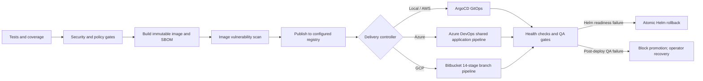

# 🛡️ Enterprise DevSecOps Platform & CI/CD Automation

> [!TIP]
> 🧭 **[Enterprise Platform Hub](../../README.md)** > **03. DevSecOps & Testing** > `DEVSECOPS_PIPELINES.md`

> Comprehensive specification of Policy-as-Code (OPA / Gatekeeper), Vulnerability Scanning (Trivy, Gitleaks, Semgrep), Dynamic DAST (OWASP ZAP), and Multi-CI/CD Pipelines (GitHub Actions, Azure DevOps, Bitbucket, ArgoCD GitOps).

---

## 🛡️ Local DevSecOps Platform and delivery paths

The architecture includes a production-parity **DevSecOps ecosystem** designed to run **100% locally** on workstation hardware (8+ CPU cores, 16+ GB RAM, 100+ GB SSD) with **zero cloud costs** using a Windows GitHub Actions Self-Hosted Runner (`winsvc`), **Minikube** (6 CPUs / 12 GB RAM), and **Terraform**:



### 🖥️ Local Platform Endpoints & Access Matrix

Core platform services, Swagger UIs, and dashboards are available on Windows `localhost` through managed port-forwards in Minikube. The same microservice ports are host-published by Docker Compose:

| Service / Tool | URL | Credentials / Auth | Role in Ecosystem |
| :--- | :--- | :--- | :--- |
| 🌐 **Frontend React 19 SPA** | [`http://localhost:5173`](http://localhost:5173) | Public Storefront | Storefront UI (React 19, Tailwind v4, Tactical DDD) |
| 🚀 **Cosmo Router (Sandbox & Supergraph)** | [`http://localhost:8080`](http://localhost:8080) | Bearer JWT / Public | Interactive GraphQL Schema Explorer & Sandbox IDE |
| 📖 **Products Swagger UI** | [`http://localhost:8004/swagger-ui.html`](http://localhost:8004/swagger-ui.html) | Public Docs | OpenAPI v3 interactive documentation for Products REST APIs |
| 📖 **Orders Swagger UI** | [`http://localhost:8003/swagger-ui.html`](http://localhost:8003/swagger-ui.html) | Public Docs | OpenAPI v3 interactive documentation for Orders REST APIs |
| 📖 **Inventory Swagger UI** | [`http://localhost:8001/swagger-ui.html`](http://localhost:8001/swagger-ui.html) | Public Docs | OpenAPI v3 interactive documentation for Inventory REST APIs |
| 📖 **Notification Swagger UI** | [`http://localhost:8002/swagger-ui.html`](http://localhost:8002/swagger-ui.html) | Public Docs | OpenAPI v3 interactive documentation for Notification REST APIs |
| 🔑 **Keycloak IAM** | [`http://localhost:8181`](http://localhost:8181) | `admin` / `admin` | Identity Provider, OAuth2/OIDC, PKCE Realm |
| 🔒 **HashiCorp Vault UI** | [`http://localhost:8200`](http://localhost:8200) | Token: `root` | Enterprise Secrets Engine & Dynamic Credentials |
| 🧭 **Kiali Mesh Topology** | [`http://localhost:20001/kiali`](http://localhost:20001/kiali) | Anonymous (Local) | Real-time Istio Service Mesh Visualizer & mTLS |
| 🐙 **ArgoCD GitOps** | [`https://localhost:8088`](https://localhost:8088) | `admin` / `admin` | GitOps Controller & Declarative Deployments |
| 📊 **Grafana Observability** | [`http://localhost:3000`](http://localhost:3000) | `admin` / `admin` | Curated SRE & Business Intelligence Dashboards (Prometheus + Loki + Tempo) |
| 📈 **Prometheus Targets** | [`http://localhost:9090/targets`](http://localhost:9090/targets) | Public Scraping | In-cluster Metric Scraping Health Verification |
| 📊 **OpenCost UI** | [`http://localhost:7000`](http://localhost:7000) | *(No auth required)* | Kubernetes workload allocation (Minikube/cloud via Helm; not installed by Compose) |

The application and observability URLs above use Docker Compose host ports or the managed Minikube tunnels, depending on the active platform. In Minikube the microservices remain ClusterIP endpoints; the tunnel supervisor forwards ports `8001`–`8004` for the four Swagger UIs. OpenCost is available only when its Kubernetes Helm release is installed. The Postman collection uses frontend Nginx and does not call host ports `8001`–`8004`.

### ⚙️ Platform Operational Lifecycle Commands (Unified Master CLI & 4 Isolated Versions)

The platform provides a master entrypoint [`platform.ps1`](../../platform.ps1) covering **3 environments (`dev`, `staging`, `prod`)**.

> The naming model is intentionally split: Git branches are `develop`, `staging`, `master`, while cluster namespaces are `dev`, `staging`, `prod`. The deployment pipeline maps branch to namespace, but the scripts keep them distinct to avoid operational ambiguity.
>
> 📖 **Full Git Collaboration Guide:** For complete branching policies, PR lifecycle, force-push conflict resolution, and disaster recovery playbooks, see [GIT_WORKFLOW_AND_COLLABORATION.md](./GIT_WORKFLOW_AND_COLLABORATION.md).

The validation path is also unified: `verify-platform.ps1` handles both local Minikube checks and cloud provider validation through a shared Istio mesh audit, instead of maintaining redundant cloud-specific wrappers.

| Platform Script | Target Environment | Git Branch | Cloud & Container Runtime | CI/CD Engine |
| :--- | :--- | :--- | :--- | :--- |
| [`platform.ps1`](../../platform.ps1) | `dev` (Local) | `develop` | Minikube (containerd, 6 CPUs, 12 GB RAM) | GitHub Actions CI + ArgoCD CD |
| [`platform.ps1`](../../platform.ps1) | `dev`, `staging`, `prod` | Provider-specific workflow branches | AWS EKS, Azure AKS, GCP GKE | Shared platform CLI; cloud operations require a configured remote backend |

#### 1. Quick Start with Master CLI (`platform.ps1`)

```powershell
# 1. Audit and install Windows CLI tools via Winget (excluding 9 ignored tools)
.\platform.ps1 tools
.\platform.ps1 tools -Install

# 2. Bootstrap full Minikube ecosystem (Istio, Vault, Keycloak, db-keycloak, Apps, Tunnels)
.\platform.ps1 up
.\platform.ps1 up -Build        # Compile Java & React Dockerfiles from source & sideload to Minikube
.\platform.ps1 build            # Standalone image build & rolling update in Minikube
.\platform.ps1 up -WithIstio     # With Istio mTLS and Kiali
.\platform.ps1 up -WithoutIstio  # Pure Kubernetes native mode
.\platform.ps1 up -DeployCanary -CanaryImageTag "<immutable-image-tag>"  # Start at 10% canary traffic
.\platform.ps1 canary -Action rollout -Namespace dev -Steps 10,25,50,75,100
.\platform.ps1 canary -Action promote -Namespace dev  # stage tested tag into stable values after reaching 100% v2
# Commit/push the values change, wait for ArgoCD + stable Deployment Ready, then retire:
.\platform.ps1 canary -Action retire -Namespace dev

# 3. Multi-Cloud Terraform Planning & Deployment
.\platform.ps1 plan -Platform aws -Environment staging
.\platform.ps1 apply -Platform aws -Environment staging -AutoApprove

.\platform.ps1 plan -Platform azure -Environment prod
.\platform.ps1 apply -Platform azure -Environment prod -AutoApprove

.\platform.ps1 plan -Platform gcp -Environment staging
.\platform.ps1 apply -Platform gcp -Environment staging -AutoApprove

# 4. Deep Diagnostic Health Check & Smoke Tests
.\platform.ps1 doctor
.\platform.ps1 smoke

# 5. Live OpenCost allocation and offline architecture estimates
.\platform.ps1 cost
.\platform.ps1 finops -Environment minikube
.\platform.ps1 finops -Environment staging
.\platform.ps1 finops -Environment prod

# 6. Interactive Endpoints Table & Tunnels
.\platform.ps1 urls
.\platform.ps1 tunnels

# 7. Gracefully Pause Minikube (preserves state) or Complete Purge
.\platform.ps1 down
.\platform.ps1 down -Destroy
```

#### 2. Direct Execution of Platform-Specific Scripts

```powershell
# Minikube Direct
.\platform-minikube.ps1 up
.\platform-minikube.ps1 up -Build      # Build Dockerfiles & sideload to Minikube
.\platform-minikube.ps1 build          # Rebuild and rollout restart pods in dev
.\platform-minikube.ps1 security-scan  # Runs Gitleaks, TFLint, Trivy
.\platform-minikube.ps1 graph          # Generates visual Graphviz PNG in docs/terraform-graph.png
.\platform-minikube.ps1 down

# AWS Cloud Direct
.\platform-aws.ps1 plan staging
.\platform-aws.ps1 apply staging -AutoApprove
.\platform-aws.ps1 rollback staging    # Releases state locks and rolls back ArgoCD/EKS

# Azure Cloud Direct
.\platform-azure.ps1 plan prod
.\platform-azure.ps1 apply prod -AutoApprove
.\platform-azure.ps1 rollback prod     # Unlocks Azure Blob leases and rolls back AKS

# GCP Cloud Direct
# GCP Direct (same master CLI; requires terraform/backend-config/gcp.hcl)
.\platform.ps1 plan -Platform gcp -Environment staging
.\platform.ps1 apply -Platform gcp -Environment staging
```

#### 3. GitHub Actions Commands

```powershell
gh workflow run service-orders.yml --ref develop
gh workflow run service-products.yml --ref develop
gh workflow run service-notifications.yml --ref develop
gh workflow run service-frontend.yml --ref develop
gh workflow run service-inventory.yml --ref develop
gh run list --limit 5
```

### 🛡️ DevSecOps & Governance Hub

This section centralizes all security, compliance, quality, and dynamic testing assets and policies for the `microservices-architecture` ecosystem, alongside the complete 100% local deployment and operations runbook on Minikube.

#### 📂 Directory Structure

```
devsecops/
├── dast/                      # 🕵️ Dynamic Application Security Testing (DAST)
│   └── zap/
│       ├── rules.tsv          # OWASP ZAP threshold calibration & alert overrides
│       ├── zap-report.html    # Baseline DAST scan security report
│       └── zap.yaml           # ZAP automation plan definition
│
├── policies/                  # 📜 Policy-as-Code (OPA / Rego)
│   ├── conftest/
│   │   └── kubernetes.rego    # Shift-Left: Pre-deployment Helm manifests audit (OPA v1)
│   └── gatekeeper/            # Admission Controller: Runtime enforcement on Minikube
│       ├── templates/         # ConstraintTemplates (Custom Rego CRDs)
│       └── constraints/       # Constraints applied to target namespaces (staging / prod)
│
├── sast/                      # 🔍 Static Application Security Testing (SAST & Secrets)
│   ├── gitleaks/
│   │   └── .gitleaks.toml     # Hardcoded secret, API key, and token detection
│   └── Semgrep auto rules are selected in CI; custom Semgrep rules are not checked into this repository
│
├── compliance/                # 🧰 Software Supply Chain Security
│   ├── trivy/
│   │   ├── trivy.yaml         # Container vulnerability scanner configuration
│   │   └── .trivyignore       # Formal risk acceptance and CVE exception registry
│   └── sbom/                  # Metadata schemas for CycloneDX / SPDX SBOMs
│
└── testing/                   # ⚡ Dynamic & Performance Testing
    ├── k6/
    │   └── load-test.js       # Stress testing & p95 latency SLO verification via Istio Gateway
    └── newman/
        └── microservices.postman_collection.json # API integration test suite
```

#### ⚙️ Security Operating Modes: Audit vs. Enforce

| Tool | Current Mode (Audit / Soft-Gate) | Maturity Mode (Enforce / Hard-Gate) |
| :--- | :--- | :--- |
| **Trivy** | The shared config applies severity and `.trivyignore`; local/GitHub report without blocking, Bitbucket blocks HIGH/CRITICAL, and Azure blocks on protected branches. | Use reviewed exceptions and the same config while moving audit/advisory gates to blocking. |
| **Gitleaks** | Blocking (`exit 1` on real credentials detection). | Blocking. |
| **Conftest (OPA)** | Blocking on privileged containers or missing memory/CPU limits. | Extended blocking (enforces mandatory labels, network policies). |
| **OWASP ZAP** | Fails on rules marked `FAIL` in `rules.tsv`; advisory on `WARN`. | Strict blocking on security headers and CSP violations. |

#### 🚀 Deployment & Operations Guide: 100% Local Enterprise DevSecOps on Minikube

Deploy and operate the complete enterprise **DevSecOps** ecosystem locally on your workstation (Intel/AMD, 16+ GB RAM, 100+ GB SSD) using **Minikube**, **Terraform**, **Docker Hub Registry (`georgegxx/*`)**, **Gatekeeper (OPA)**, **ArgoCD**, **Istio Service Mesh**, **Prometheus/Grafana/Loki/Alloy**, and **OWASP ZAP** with a **GitHub Actions Self-Hosted Runner**.

##### 📋 1. Resource Allocation & Minikube Startup

Open PowerShell as Administrator and initialize Minikube with the allocated resource budget (6 CPUs, 12 GB RAM, 40 GB disk):

```powershell
minikube start `
  --cpus=6 `
  --memory=12288 `
  --disk-size=40g `
  --driver=docker `
  --addons=ingress,metrics-server,dashboard
```

Verify that the cluster is healthy:
```powershell
kubectl get nodes
```

##### 🐳 2. Docker Hub Authentication & Secrets Configuration

Container images are standardized under the Docker Hub namespace `georgegxx/<service>:1.0.0`.

1. To enable automated image publishing upon passing all CI and Staging Quality Gates, ensure your GitHub repository has the following secrets configured (**Settings** -> **Secrets and variables** -> **Actions**):
   * `DOCKERHUB_USERNAME`: `georgegxx`
   * `DOCKERHUB_TOKEN`: `<your-dockerhub-access-token>`

2. If testing or pushing manually from your local terminal:
   ```powershell
   docker login -u georgegxx
   ```

##### 🏗️ 3. Platform Deployment with Terraform

Navigate to the Minikube Terraform environment:

```powershell
cd terraform\environments\local-minikube
terraform init
terraform plan
terraform apply -auto-approve
```

Terraform and bootstrap automation provision:
* **Gatekeeper (OPA)** in namespace `gatekeeper-system`
* **ArgoCD** in namespace `argocd` (Web UI at `https://localhost:8088`, credentials: `admin` / `admin`)
* **Prometheus & Grafana** in namespace `observability` (Grafana at `http://localhost:3000`, credentials: `admin` / `admin`)
* **Loki & Alloy** log aggregation daemonset in namespace `observability`
* **Tempo** trace storage and OTLP ingestion in namespace `observability`
* **Vault** in namespace `vault` (Web UI at `http://localhost:8200`, dev token: `root`)
* **Keycloak IAM** in namespace `auth` (Web UI at `http://localhost:8181`, credentials: `admin` / `admin`)
* Namespaces `staging` and `prod` with Istio sidecar injection enabled (`istio-injection=enabled`).

##### 📊 Local Observability Retention & Resource Controls

Compose and Minikube keep the telemetry stores on persistent storage so a container or pod restart does not erase recent data. Their local retention budgets are intentionally bounded:

| Store | Compose | Minikube | Retention behavior |
| --- | --- | --- | --- |
| Prometheus | Named `prometheus_data` volume; 7 days or 2 GB, whichever is reached first | 5 GiB PVC; 7 days or 4 GB, whichever is reached first | Older TSDB blocks are expired automatically |
| Loki | Named `loki_data` volume | 2 GiB PVC | 30 days; compactor deletes expired chunks and indexes |
| Tempo | Named `tempo_data` volume | 2 GiB PVC | 7 days; compactor expires old trace blocks |

The Minikube Prometheus scrape/evaluation interval is 15 seconds. Prometheus scrapes itself, Loki, Tempo, and Alloy in both local modes; an alert fires if one of those targets stays down for five minutes. Kubernetes Alloy avoids using pod UID/name as a Loki index label to keep label cardinality bounded. Grafana still correlates traces and logs through the existing service and trace-ID links.

Spring trace sampling uses `TRACING_SAMPLING_PROBABILITY`: it defaults to `1.0` (all traces) in Compose and local Minikube, is set to `0.25` in the AWS staging values, and `0.1` in AWS/Azure production values. Adjust the same Helm ConfigMap key for other cloud environments. Deleting a Minikube observability namespace also deletes its PVCs and retained telemetry; normal pod restarts do not.

The standalone kube-prometheus-stack values also persist Prometheus data: development uses a 10 GiB claim with a 7-day/8 GB limit, while production uses a 50 GiB claim with a 30-day/40 GB limit. The cloud Prometheus chart values cap its 8 GiB claim at 6 GB with 15-day retention. The local OpenTelemetry Collector has a 192 MiB memory limit configured in its memory limiter and a 256 MiB container budget to reduce local memory spikes.

##### 🛡️ 4. Apply Gatekeeper Templates & Constraints

Apply the centralized OPA admission policies located in `devsecops/policies/gatekeeper/`:

```powershell
# 1. Apply Rego constraint templates
kubectl apply -f devsecops/policies/gatekeeper/templates/

# 2. Apply runtime constraints to staging and prod
kubectl apply -f devsecops/policies/gatekeeper/constraints/
```

Gatekeeper validates:
- **Resource Limits**: CPU & memory requests/limits on all containers.
- **Trusted Registries**: Only images from `georgegxx/`, `docker.io/georgegxx/`, `gcr.io/distroless`, or `localhost` are admitted.

##### 🏃 5. Launch the GitHub Actions Self-Hosted Runner

In your GitHub repository:
1. Navigate to **Settings** -> **Actions** -> **Runners** -> **New self-hosted runner** (select **Windows**).
2. Download and extract the runner package to a local folder (e.g. `C:\actions-runner`).
3. Configure the runner with your token:
   ```powershell
   .\config.cmd --url https://github.com/georgegxx/microservices-architecture --token <YOUR_TOKEN>
   ```
4. Start the runner:
   ```powershell
   .\run.cmd # You can optionally configure it as a service.
   ```
5. Test Runner on Windows:
   ```powershell
   Get-Service -Name "actions.runner.*"   
   ```

The runner leverages all available hardware threads of the Intel/AMD processor to compile and test Maven/Node modules in parallel (`-T 1C`).

##### 🔄 GitHub Actions service workflow

The reusable service workflow currently has seven numbered job groups, followed by a conditional recovery job. Its implemented path is:

1. **🧪 Unit/build verification**: Maven tests and JaCoCo for Spring services, or npm build for the web frontend.
2. **🔍 SAST and secrets**: Gitleaks, Semgrep and Checkov. Optional SonarQube Cloud analysis runs with unit/build verification.
3. **⚙️ Image and SBOM**: BuildKit produces an image archive and Trivy generates CycloneDX SBOM.
4. **🧰 Container scan**: Trivy audits critical/high findings in soft-gate mode (`exit-code: 0`).
5. **🧾 Policy gate**: Helm renders the chart and Conftest evaluates Rego policies.
6. **📦 Registry publish**: Publishes the immutable commit tag when Docker Hub credentials are configured; local evaluation can continue without pushing.
7. **🐙 GitOps delivery**: Attempts ArgoCD sync/health verification, or a direct Helm path when a cluster is reachable. Configure the runner and credentials for the intended target before relying on this job as a deployment gate.

The reusable GitHub workflow can run Newman, storefront smoke, k6, and ZAP after a `develop` push when `DEVSECOPS_POST_DEPLOY_ENABLED=true`. It requires reachable `DEVSECOPS_BASE_URL`, `DEVSECOPS_FRONTEND_URL`, and `DEVSECOPS_KEYCLOAK_URL` repository/environment variables. Keep it disabled until the selected runner can reach the deployed services. The job runs for runtime validation only; it is not a substitute for the 14-stage Azure DevOps or Bitbucket flows.

##### 🎯 7. Transitioning to Maturity Mode (Strict Enforce / Hard-Gate)

When you are ready to enforce strict blocking in production:

1. **Trivy**: Update `devsecops/compliance/trivy/trivy.yaml` and the gate policy in the relevant workflow:
   ```yaml
   exit-code: '1' # Fails builds on unpatched critical vulnerabilities
   ```
2. **ZAP DAST**: Review `devsecops/dast/zap/rules.tsv`; ZAP consumes this same policy file in the local command and CI stages.
3. **Risk Exceptions**: Document any accepted CVE in `devsecops/compliance/trivy/.trivyignore`.

---


---

## 🤖 Multi-CI/CD & GitOps Automation

### SonarQube Cloud configuration (GitHub Actions, Azure DevOps, Bitbucket)

All three CI providers use the same project keys so results converge into the same SonarQube Cloud projects:

| Component | Sonar project key |
| --- | --- |
| Products | `msa-products-service` |
| Orders | `msa-orders-service` |
| Inventory | `msa-inventory-service` |
| Notifications | `msa-notification-service` |
| React storefront | `msa-frontend` |

Configure these values in each CI provider before enabling Sonar analysis:

- `SONAR_TOKEN`: secret token with permission to analyze the projects.
- `SONAR_ORGANIZATION`: SonarQube Cloud organization key (plain variable).
- `SONAR_HOST_URL`: optional; defaults to `https://sonarcloud.io` (GitHub secret, Azure pipeline variable, or Bitbucket repository/deployment variable).

Without `SONAR_TOKEN`, each pipeline skips the Sonar step and continues. With a token configured, a missing organization key or a failed Quality Gate fails the pipeline. The scanners wait for the Quality Gate result. Spring projects import JaCoCo XML from `target/site/jacoco/jacoco.xml`. The React scan currently performs static analysis only; configure LCOV generation/import separately if frontend coverage is added. Create/import the matching projects in the SonarQube Cloud organization, and install/authorize SonarQube Cloud's GitHub App if PR decoration is desired.

### 1. GitHub Actions ➔ AWS Cloud
Located in `.github/workflows/`:
- **Reusable service workflow ([`_service-ci-cd-template.yml`](../../.github/workflows/_service-ci-cd-template.yml))**: Seven numbered job groups cover tests/build, SAST, image/SBOM, Trivy, Conftest, optional registry publishing and ArgoCD/direct-cluster delivery. The opt-in post-deployment job runs Newman, storefront smoke, k6 and ZAP for `develop` pushes when the runner has network access and the three `DEVSECOPS_*_URL` variables are configured. It does not run Cypress or claim the Azure/Bitbucket 14-stage sequence.
- **Terraform Pipeline ([`terraform-aws.yml`](../../.github/workflows/terraform-aws.yml))**: Manually dispatched, saved-plan workflow; applies require the protected GitHub environment and state-lock recovery is operator-led.

### 2. Azure DevOps Pipelines ➔ Azure Cloud
Located in `azure-devops/`:
- **Shared application template ([`app-stages.yml`](../../azure-devops/templates/app-stages.yml))**: Defines 14 numbered delivery stages plus separate rollback stages. Each application entry point supplies the component, port, Azure connection, and environment-specific ACR names. `develop` publishes to the dev ACR; release/main builds first publish to staging, and `main` copies the QA-approved immutable image into the production ACR before deployment.
- **Application entry points**: [`inventory-service.yml`](../../azure-devops/pipelines/inventory-service.yml), [`orders-service.yml`](../../azure-devops/pipelines/orders-service.yml), [`products-service.yml`](../../azure-devops/pipelines/products-service.yml), [`notification-service.yml`](../../azure-devops/pipelines/notification-service.yml), and [`frontend.yml`](../../azure-devops/pipelines/frontend.yml) use the shared template. [`cosmo-router.yml`](../../azure-devops/pipelines/cosmo-router.yml) remains a separate configuration/supergraph validation pipeline because Cosmo Router has no project Dockerfile to build.
- **Terraform validation ([`infra.yml`](../../azure-devops/pipelines/infra.yml))**: Runs format/init/validate checks for local workspace selectors `dev`, `staging`, and `prod`; it does not plan or apply cloud changes until Azure remote state and Blob locking are provisioned. [`infra-stages.yml`](../../azure-devops/templates/infra-stages.yml) is a saved-plan/apply helper and is not an active pipeline entry point.
- The app pipelines use the `azure-service-connection` service connection and Terraform's environment-scoped registries (`msaazuredevacr`, `msaazurestagingacr`, `msaazureprodacr`). Configure that connection for ACR push and AKS deployment access, and set exclusive locks/approvals on the `dev`, `staging`, and `production` Azure DevOps environments. Set secured, read-only `GHCR_USERNAME`/`GHCR_TOKEN` variables for chart pulls; the shared deploy step installs the exact chart version from `Chart.yaml` in GHCR. Production canary is disabled in the current service entry points until production-specific Istio manifests exist.

### 3. Bitbucket Pipelines (CI/CD) + ArgoCD (GitOps) ➔ GCP
- **Bitbucket Pipelines ([`bitbucket-pipelines.yml`](../../bitbucket-pipelines.yml))**:
  - Branch flows contain 14 numbered delivery stages: tests, security, image/SBOM, image scan, policy, Terraform validation, GAR publish, GKE deploy, API contract, storefront smoke, performance, DAST, rollout verification, and release evidence/promotion.
  - Set `SERVICE_NAME`/`SERVICE_DIR` for the service being built; the default is `products-service`. Configure secured deployment variables for GCP identity, project, region, GAR repository, cluster, ingress, frontend, and Keycloak endpoints. Missing required deploy/test values fail closed.
  - Set secured `GHCR_USERNAME` and read-only `GHCR_TOKEN` deployment variables. The deploy step pulls the exact `Chart.yaml` version from GHCR; it does not rebuild or publish a chart.
  - Production is manually approved and deploys the same commit SHA with a rolling Helm upgrade. `--atomic` handles failures during Helm readiness; QA failures after deployment block progress but require operator-led rollback.
  - Terraform validation runs with `-backend=false`; no cloud plan/apply is performed in this pipeline. The local platform CLI permits cloud operations only after a real GCP backend config is supplied.
- **ArgoCD GitOps ([`argocd/`](../../argocd/))**:
  - Continuous, declarative sync to **Google Kubernetes Engine (GKE)** across all 3 environments:
    - [`appproject.yaml`](../../argocd/appproject.yaml)
    - [`application-dev.yaml`](../../argocd/application-dev.yaml)
    - [`application-staging.yaml`](../../argocd/application-staging.yaml)
    - [`application-prod.yaml`](../../argocd/application-prod.yaml)

---

## 🔄 Multi-Cloud CI/CD & Automated Rollback Architecture

Production umbrella charts are released as immutable, versioned GHCR OCI artifacts through [`helm-chart-release.yml`](../../.github/workflows/helm-chart-release.yml); see the [Helm chart release procedure](../02-operations/HELM_AND_CANARY.md). Azure DevOps and Bitbucket consume the exact committed chart version from GHCR; AWS, Azure, and GCP Terraform roots expose matching chart coordinates in their outputs. Service image pipelines remain separate from chart releases.

The project uses provider-specific CI/CD workflows and recovery controls; rollback automation is limited to the configured deployment steps:

### 1. GitHub Actions (CI) + ArgoCD (CD) - AWS & Minikube
- **GitHub Actions (`.github/workflows/`)**: Runs service CI, image publishing to AWS ECR, and declarative GitOps synchronization. The Terraform workflow is a separately dispatched saved-plan flow; review the workflow before assuming an application rollback runs for every post-deploy QA failure.
- **ArgoCD (`argocd/`)**: Strictly governs **Continuous Deployment (CD)** declaratively:
  - **`develop` branch**: Deploys via `application-dev.yaml` to namespace **`dev`** on Minikube with `values-minikube.yaml`.
  - **`staging` branch**: Deploys via `application-staging.yaml` to namespace **`staging`** on AWS EKS with medium-performance resources (`values-eks-staging.yaml`).
  - **`master` branch**: Deploys via `application-prod.yaml` to namespace **`production`** on AWS EKS with high-performance resources (`values-eks-prod.yaml`: 3-10 replicas with HPA, PDB, NLB, and Istio Canary 90/10).
  - **Recovery**: Git revert is the source-controlled recovery path; ArgoCD CLI/UI rollback is an emergency operator action.
- **AWS Terraform Pipeline (`.github/workflows/terraform-aws.yml`)**: Cloud plans are manually dispatched and applies require the saved plan plus the protected GitHub environment. State-lock recovery is a deliberate operator action using the real lock ID.

### 2. Azure DevOps - Single Unified Pipeline (Azure Cloud)
- **Shared application pipeline (`azure-devops/templates/app-stages.yml`)**: Each component entry point executes the same **14 numbered stages** plus rollback stages:
  - Stages 1-5: Unit Tests (Maven/React, JaCoCo), SAST (Semgrep, Gitleaks, Checkov, SonarQube), BuildKit Container Build & CycloneDX SBOM, Trivy Scan, Conftest OPA.
  - **Dev Tier (Stage 5.5)**: Deploys to AKS namespace **`dev`** on `develop` branch with **`RollbackDev`** on failure.
  - **Staging Tier (Stage 6)**: Deploys to AKS namespace **`staging`** with full QA validation (Newman API tests, Cypress E2E, k6 latency/stress, OWASP ZAP DAST) and **`RollbackStaging`** on any test failure.
  - **Promotion**: Certified image promotion to Azure Container Registry (ACR).
  - **Production Tier (Stage 14)**: On `main`/`master`, deploys the approved image copied from the staging ACR into the production ACR, then deploys to AKS namespace **`production`**. The canary hook is conditional and disabled in the current service entry points until production-specific Istio manifests are supplied.
- **Azure Terraform validation (`azure-devops/pipelines/infra.yml`)**: Runs format/init/validate checks only for **`dev`**, **`staging`**, and **`prod`**; cloud planning and apply remain disabled until durable remote state and locking are configured. The old duplicate product pipeline and retired Terraform validation pipeline have been removed; all service entry points now use the same application template.

### 3. Bitbucket Pipelines - Google Cloud Platform
- **Unified pipeline ([`bitbucket-pipelines.yml`](../../bitbucket-pipelines.yml))**: Uses 14 numbered stages on `develop` and `staging`; both `main` and the repository's current `master` production branch share the same manually approved production flow. Stages cover test, security, build/SBOM, image scan, policy checks, Terraform validation, environment-specific GAR publish, GKE deploy, API contract, storefront smoke, performance, DAST, rollout verification, and release evidence/promotion. Production is a rolling Helm release; GCP credentials and endpoints are required and failures stop the pipeline. Cloud Terraform apply remains disabled in Bitbucket until its GCP state workflow is intentionally enabled.

### 4. Automated Rollback & Incident Recovery Summary
| Disaster Scenario | Recovery Mechanism | Recovery Time Objective (RTO) |
| :--- | :--- | :--- |
| **Terraform State Lock** | Inspect the failed run, confirm no active operation, then manually unlock using the actual backend lock ID | Operator-led |
| **ArgoCD Sync/Health Failure** | Revert the desired-state Git commit and allow ArgoCD to reconcile; emergency CLI rollback is operator-led | Operator-led |
| **Helm readiness failure during upgrade** | Helm `--atomic` restores the prior release | Bounded by configured Helm timeout |
| **Post-deploy QA failure** | Pipeline blocks promotion; operator inspects and may run `helm rollback` | Operator-led |
| **Production degradation** | Provider-specific rollback or Git revert/ArgoCD reconciliation; Bitbucket is rolling, not canary | Operator-led |

---
