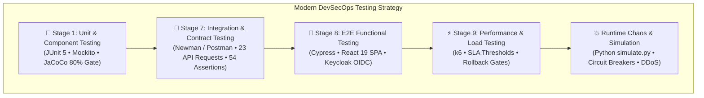

# 🧪 Automated Testing, Load Simulation & Chaos Engineering Guide

> [!TIP]
> 🧭 **[Enterprise Platform Hub](../../README.md)** > **03. DevSecOps & Testing** > `DYNAMIC_AND_CHAOS_TESTING.md`

> Practical execution handbook for synthetic shopper traffic, GraphQL load probes, checkout validation, E2E smoke checks, and the Newman API test suite.

---

## 🎯 Testing Ecosystem Architecture & Technology Selection Rationale

The platform follows a modern **Cloud-Native DevSecOps Testing Pyramid**, distributing test responsibilities across purpose-built tools instead of relying on legacy monolithic suites:



### 1. Technology Purpose & Responsibility Matrix

| Technology | Layer / Stage | Purpose & Operational Scope | Execution Environment |
| :--- | :--- | :--- | :--- |
| **JUnit 5 + Mockito** | **Stage 1 (Unit)** | Validates individual Java classes, business domain validation, and Saga state transitions in complete isolation with mock dependencies. | Maven Runner (`mvn test`) |
| **JaCoCo** | **Stage 1 (Coverage)** | Enforces code quality gates requiring ≥80% line and branch coverage before code can be packaged into containers. | Maven Plugin (`jacoco:report`) |
| **Newman (Postman CLI)** | **Stage 7 (Integration)** | Runs the repository collection through the frontend Nginx proxy, covering GraphQL/REST responses, Keycloak logins, and order lifecycle assertions. | Container / CLI (`newman run`) |
| **Cypress** | **Stage 8 (E2E)** | Executes real end-to-end user journeys inside the browser: login via Keycloak PKCE, product catalog browsing, cart operations, and order placement. | Headless Chrome/Electron in CI/CD |
| **Grafana k6** | **Stage 9 (Performance)** | Generates concurrent load to validate system throughput, latency percentiles ($p_{95} < 500\text{ms}$), and Resilience4j circuit breaker thresholds. | Lightweight Go binary in CI/CD |
| **`simulate.py` / `smoke.py`** | **Runtime / Chaos** | `simulate.py` generates shopper/chaos traffic; `smoke.py` provides functional, read-only deployment, and bounded GraphQL resilience modes. | Minikube CLI (`.\platform-minikube.ps1 smoke`) |

---

### 2. Architectural Decisions: Why Not Apache JMeter or Selenium?

#### A. Grafana k6 vs. Apache JMeter (Load & Performance Testing)

* **Lightweight Container Footprint:** JMeter requires a heavy Java Virtual Machine (JVM) and significant memory just to boot the test runner. **k6** is a single compiled Go binary (~30 MB) that executes with minimal CPU and memory overhead, ideal for ephemeral CI/CD runners.
* **Test-as-Code vs. Monolithic XML:** JMeter tests are saved in complex, fragile XML (`.jmx`) files that are difficult to review in Pull Requests and prone to merge conflicts. **k6** scripts are written in standard JavaScript/TypeScript, enabling modularization, clean Git versioning, and shared libraries.
* **Native LGTM Stack Integration:** k6 streams metrics natively to **Prometheus** and **Grafana**, plotting real-time virtual users, request duration percentiles ($p_{90}, p_{95}, p_{99}$), and HTTP error rates directly on the platform's SRE dashboards.
* **Automated CI/CD Quality Gates & Rollbacks:** k6 supports declarative SLA thresholds in code (e.g. `http_req_duration: ['p(95)<500']`). If performance degrades under load, k6 exits with a non-zero code that immediately trips **Automated Rollback (Stage 10.1 / Stage 12.1)**.

#### B. Cypress vs. Selenium WebDriver (E2E Functional Testing)

* **React 19 Concurrent Rendering Compatibility:** Selenium operates out-of-process, sending remote HTTP commands via WebDriver protocol (`chromedriver`), introducing network latency and frequent timing issues (*flaky tests* due to `StaleElementReferenceException`). **Cypress** runs directly inside the browser's execution loop, automatically synchronizing with React 19 fiber reconciler transitions, hooks, Context state, and DOM updates without arbitrary `Thread.sleep()`.
* **Keycloak OIDC & Network Interception:** Cypress provides native network interception (`cy.intercept()`), allowing seamless inspection of Keycloak Bearer tokens, token refresh simulation, and deterministic API stubbing without running external HTTP proxies (like BrowserMob).
* **Developer Experience & CI/CD Artifacts:** Cypress automatically captures DOM snapshots, video recordings, and screenshots upon test failure, enabling instant root-cause analysis in CI/CD artifact tabs without configuring third-party listeners.

---

## 🧪 Automated Testing, Load Simulation & Chaos Engineering

For a bounded two-VU GraphQL latency/error baseline and a non-destructive local
PostgreSQL backup/restore drill, see [Quality Gates & DoD](./QUALITY_GATES_AND_DOD.md).
The local bounded GraphQL baseline is available through `smoke.py --resilience`; it does not place orders or generate attack traffic. CI performance gates continue using k6, and neither baseline replaces an explicitly planned capacity test.

Enterprise testing scripts located in `scripts/testing/`:

### 1. 🛒 Legitimate E-Commerce Traffic Generator (`simulate.py --scenario traffic`)
Simulates shopping journeys through Cosmo Router GraphQL, sends funnel events through the frontend REST proxy, and places authenticated orders.

```powershell
# Run a quick batch of 15 orders with 3 worker threads:
python scripts/testing/simulate.py --scenario traffic

# Place custom number of orders with specified concurrency:
python scripts/testing/simulate.py --scenario traffic --orders 50 --concurrency 5

# Run continuous background shopper simulation:
python scripts/testing/simulate.py --scenario traffic --continuous
```

### 2. ⚡ Resilience4j Circuit Breaker State Verification
Test the automatic failure detection and self-healing lifecycle:
$$\text{🟢 CLOSED (Green)} \xrightarrow[\text{Failures}]{\text{Downstream outage}} \text{🔴 OPEN (Red, 15s window)} \xrightarrow[\text{15s timer}]{\text{Auto-recovery probe}} \text{🟡 HALF\_OPEN (Yellow)} \xrightarrow[\text{2 trial orders OK}]{\text{Health restored}} \text{🟢 CLOSED (Green)}$$

> [!NOTE]
> **Why Red only lasts 15 seconds:** `waitDurationInOpenState` is set to 15 seconds with `automaticTransitionFromOpenToHalfOpenEnabled: true`. Once tripped into **🔴 RED (`OPEN`)**, it will automatically transition to **🟡 YELLOW (`HALF_OPEN`)** after 15s of silence to test for backend recovery.

#### Step-by-Step Test Procedure:

##### 🔴 Step A: Trip Circuit Breaker into OPEN (Red `#ef4444`)
Simulate downstream outage by stopping `inventory-service` and generating continuous traffic so the Red state remains continuously visible on Grafana without expiring:
```powershell
# 1. Stop inventory dependency:
# For Docker Compose:
docker compose stop inventory-service

# For Kubernetes / Minikube:
kubectl scale deployment inventory-service --replicas=0 -n dev

# 2. Run continuous traffic to keep the circuit in steady OPEN (Red #ef4444):
python scripts/testing/simulate.py --scenario traffic --continuous
```
* **Grafana Verification:** The panel **⚡ Resilience4j Circuit Breakers Health** will display **`OPEN / TRIPPED` (🔴 Red)**.

---

##### 🟡 Step B: Observe Transition into HALF_OPEN (Yellow `#f59e0b`)
Pause incoming traffic for 15 seconds to allow Resilience4j's self-healing timer to transition into trial probe mode:
```powershell
# 1. Stop the continuous simulator in your terminal with: Ctrl + C

# 2. Wait 16 seconds (waitDurationInOpenState = 15s):
Start-Sleep -Seconds 16
```
* **Grafana Verification:** The panel automatically switches to **`HALF_OPEN / TESTING` (🟡 Yellow)**, awaiting 2 trial calls to evaluate backend health.

---

##### 🟢 Step C: Restore Backend Health and Return to CLOSED (Green `#10b981`)
Restart `inventory-service` and send 2 trial orders through the gateway to prove backend recovery:
```powershell
# 1. Restore the inventory microservice:
# For Docker Compose:
docker compose start inventory-service

# For Kubernetes / Minikube:
kubectl scale deployment inventory-service --replicas=1 -n dev

# 2. Send 2 trial orders (sequential concurrency) to satisfy the 2-call probe:
python scripts/testing/simulate.py --scenario traffic --orders 2 --concurrency 1
```
* **Grafana Verification:** Both trial orders succeed with HTTP 201, and the panel instantly resets to **`CLOSED / HEALTHY` (🟢 Green)**.


### 3. 🧪 GraphQL Checkout Validation (`simulate.py --scenario chaos`)
Exercises valid, out-of-stock, and unknown SKU checkout mutations through Cosmo Router and reports successful orders, business rejections, and upstream HTTP failures:
```powershell
python scripts/testing/simulate.py --scenario chaos
```

### 4. 🛡️ GraphQL Load and Rate-Limit Probe (`simulate.py --scenario ddos`)
Sends concurrent GraphQL requests through frontend Nginx and reports observed HTTP responses. It obtains a JWT from Keycloak by default and stops without sending load if token acquisition fails. This default path traverses the same per-peer edge limiter used by the frontend in Compose and Minikube. For another deployed frontend edge, override `--ddos-url`:
```powershell
# Generate observable HTTP 429 responses through the shared frontend edge limiter:
python scripts/testing/simulate.py --scenario ddos --duration 30 --workers 32

# Probe a separately exposed frontend edge (the script still requires a Keycloak token):
python scripts/testing/simulate.py --scenario ddos --ddos-url http://127.0.0.1:5173 --duration 30 --workers 32

# Do not rotate synthetic X-Forwarded-For headers:
python scripts/testing/simulate.py --scenario ddos --single-source

# Send anonymous GraphQL requests:
python scripts/testing/simulate.py --scenario ddos --no-auth
```

The DDoS probe targets frontend Nginx (default `http://127.0.0.1:5173`) so it traverses the shared `20 req/s` per-peer limiter with a burst of 30. A single worker or a short low-volume check will not cross that limit and therefore will not create 429 log records. The dashboard threat LED averages 429 events over one minute: it turns amber above 1 blocked request/second and red at 5/second; expect a short ingestion/refresh delay and up to one minute of decay after the load stops. `--distributed` sends synthetic `X-Forwarded-For` headers only to confirm they cannot evade the socket-peer limit; it does not create independent clients or alter the logged source IP. Grafana reads actual HTTP 429 JSON records and peer IPs from Alloy/Loki. Anonymous traffic is intentionally available only for this DDoS/rate-limit probe and requires the explicit `--no-auth` flag. Traffic and chaos scenarios require a Keycloak JWT and will not proceed anonymously.

### 5. 🔍 Automated Smoke Tests & OpenAPI Auditing
```powershell
# Run frontend, Cosmo Router GraphQL, proxied catalog/order REST, and auth smoke checks:
python scripts/testing/smoke.py

# Verify OpenAPI v3 / Swagger docs availability:
python scripts/testing/diagnose.py components --target swagger

# Verify Prometheus metrics & Grafana dashboards:
python scripts/testing/diagnose.py components --target all
```

### 6. 🛒 Funnel Event Activity Verification

The **Observed Funnel Event Activity** panel in **E-Commerce Business Intelligence & Inventory Operations** reports event counts in the selected time range. The Orders Service increments counters only when it receives `CART_ADD`, `CHECKOUT_START`, or `CHECKOUT_STEP`. These counters are process-local and reset when the service restarts.

The event contract does not carry a shared shopper/session identifier. The dashboard therefore does not calculate conversion or cart abandonment. Completed orders are database snapshots and are shown separately from funnel event counters.

#### Method 1: Send CART_ADD demo events

```powershell
python scripts/update_dashboards.py funnel-demo --count 30 --category Electronics
```

The command sends 30 observed cart-add events through the frontend endpoint. It does not synthesize checkout stages, orders, or an abandonment percentage. After the next Prometheus scrape, select the matching time range in Grafana to see the event count.

#### Method 2: Exercise the observed funnel stages

The multi-threaded traffic scenario sends `CART_ADD`, `CHECKOUT_START`, and `CHECKOUT_STEP` events before a subset of shopper journeys place orders:

```powershell
python scripts/testing/simulate.py --scenario traffic --orders 20 --concurrency 4
```

The panel shows stage-event activity and completed-order snapshot change over the selected range. It does not attribute an order to a particular cart.

To support a true conversion or abandonment rate, the event contract must add a stable session/cart identifier and persist timestamped stage events so each journey can be correlated.

### 📦 Postman & Newman Test Suite (Unified Collection):
The repository maintains a 23-request Postman collection in [`devsecops/testing/newman/microservices.postman_collection.json`](../../devsecops/testing/newman/microservices.postman_collection.json) for headless CI/CD execution with Newman (54 automated assertions, 100% pass rate). Its JSON export is generated by `scripts/generate_postman_collection.py`. The suite targets **Cosmo Router with GraphQL Federation v2**, **Keycloak OIDC**, and **MLOps Demand Forecasting**:

* **Keycloak Login Requests:** The standard/admin requests save separate JWTs in `{{user_jwt_token}}` and `{{admin_jwt_token}}` via the public client (`microservices_frontend`). Provision the realm, enable the development test users and direct grants with `scripts/bootstrap-keycloak.ps1` before running them; the collection does not need a client secret.
* **Federated GraphQL Operations:** Native queries and mutations against Cosmo Router (`POST {{base_url}}/graphql`):
  * **Supergraph Catalog:** Resolves `products` with real-time stock availability federated from the `inventory` subgraph (`isInStock`, `quantity`).
  * **Order Placement:** Generates dynamic `idempotency_key` (UUIDv4) and automated DHL tracking number (`DHL-[A-Z0-9]+`), saving `order_id` into collection variables.
  * **Logistics State Machine:** Progresses orders through `shipOrder` (`SHIPPED`) and `deliverOrder` (`DELIVERED`).
  * **Saga Compensation:** Creates a second order, then cancels it while it is still `PLACED` to verify compensation and inventory restoration.
* **MLOps & Demand Forecast API:** Automated verification of the 7-day SKU forecasting engine (`GET {{base_url}}/api/forecast`):
  * **Admin Happy Path:** Validates 200 OK, `horizonDays: 7`, provenance `dataSource` (`captured-sales` / `synthetic`), model run ID and SKU predictions.
  * **RBAC Enforcement:** Verifies that standard users lacking the `ADMIN` role are rejected with HTTP 403 Forbidden.
  * **Authentication Gate:** Verifies that unauthenticated requests receive HTTP 401 Unauthorized (`Bearer token required`).
* **Telemetry & SSE Streams:** Funnel event ingestion (`POST {{base_url}}/api/order/funnel`) and live Server-Sent Events (`GET {{base_url}}/api/notifications/stream`). Requests use the frontend Nginx reverse proxy, so they work without separate host port-forwards to each ClusterIP service. Set `BASE_URL` to the reachable frontend URL (default `http://127.0.0.1:5173`, also used by the Minikube tunnel supervisor). The SSE stream is long-lived; run it individually rather than in the full Newman collection.
* **CI/CD Quality Gate (Newman CLI):** Fully compatible with automated pipeline execution in GitHub Actions, Azure DevOps, and Bitbucket Pipelines (`newman run $COLLECTION --env-var "BASE_URL=${TARGET_URL}"`). Pre-request scripts automatically harmonize `base_url` and `BASE_URL`.

### 7. 🔎 Read-Only Authenticated Order Check (`diagnose.py orders-readonly`)
Acquires a Keycloak token with the confidential `microservices_client` and performs `GET /api/order` through frontend Nginx. It requires `KEYCLOAK_CLIENT_SECRET` from the environment or project `.env` and does not create or mutate orders:
```powershell
python scripts/testing/diagnose.py orders-readonly
```

### 8. 🧪 MLOps Unit & Model Governance Suite (`mlops/tests/`)
Validates the inference API resilience, caching TTLs, Champion vs. Challenger model promotion rules, SHA-256 partition fingerprinting, and Kafka streaming deduplication (15 automated tests):
```powershell
$env:PYTHONPATH = "mlops"
python -m unittest discover -s mlops/tests -v
```
* **Timing & Lifecycle Stage:** Executed automatically during Stage 1 (Unit Testing) in GitHub Actions (`_service-ci-cd-template.yml`) on every PR/push touching `mlops/**`, and locally before building MLOps container images.
* **Objective:** Verifies that candidate models degrading RMSE are rejected as challengers, that MLflow service restarts trigger graceful fallback without 503 errors, and that API metrics gauges are exposed to Prometheus.

---

