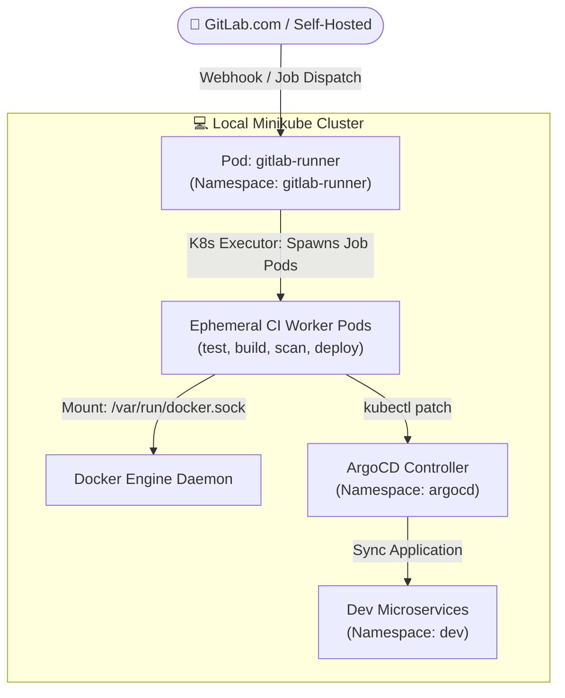

# 🦊 GitLab Runner & GitOps Integration on Minikube

> [!TIP]
> 🧭 **[Enterprise Platform Hub](../../README.md)** > **03. DevSecOps & Testing** > `GITLAB_RUNNER_GITOPS.md`

This guide details the integration of **GitLab Runner on Minikube** using the Kubernetes executor, allowing local self-hosted CI/CD execution with direct connectivity to Minikube clusters, Docker daemons, and ArgoCD GitOps pipelines.

---

## 🏗️ Architecture Overview



---

## 🚀 Lifecycle Management via Platform CLI

The platform CLI provides first-class commands to manage the runner lifecycle:

```powershell
# 1. Check status of the runner in Minikube:
.\platform.ps1 gitlab-runner -Action status

# 2. Install the runner with Kubernetes executor & RBAC:
.\platform.ps1 gitlab-runner -Action install

# 3. View runner logs:
.\platform.ps1 gitlab-runner -Action logs

# 4. Restart runner deployment:
.\platform.ps1 gitlab-runner -Action restart

# 5. Uninstall runner:
.\platform.ps1 gitlab-runner -Action uninstall
```

---

## 🔒 Security & RBAC Configuration

The runner executes with a dedicated ServiceAccount bound to a `ClusterRole` defined in [`k8s/gitlab-runner/runner-rbac.yaml`](../../k8s/gitlab-runner/runner-rbac.yaml), providing:
* Least-privilege access to manage job pods within its execution namespace.
* Scoped access to patch ArgoCD applications for GitOps deployments.
* Non-root pod execution adhering to Pod Security Standards.
