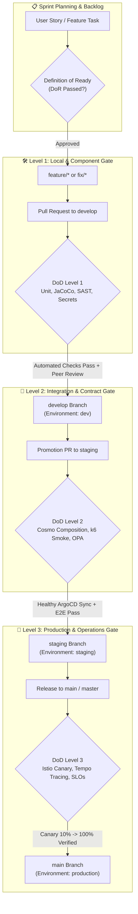

# 🎯 Definition of Ready (DoR) & Definition of Done (DoD) Framework

> [!TIP]
> 🧭 **[Enterprise Platform Hub](../../README.md)** > **03. DevSecOps & Testing** > `QUALITY_GATES_AND_DOD.md`

> Enterprise engineering governance framework for microservices architecture: aligning agile maturity gates, contract-first design, shift-left security, and GitOps release lifecycles.

---

## 📌 Executive Summary & Architecture Alignment

In a distributed, event-driven microservices architecture composed of independent runtimes (Spring Boot, Novashop React SPA, Cosmo Router GraphQL federation, PostgreSQL databases, Kafka/RabbitMQ events, and multi-cloud Kubernetes clusters), defects rarely originate from isolated unit code errors. Instead, the majority of critical outages stem from:

1. **Schema and Contract Drift:** Breaking changes in federated GraphQL subgraphs or event payloads.
2. **Destructive Database Mutations:** Premature column drops or synchronous migration locks.
3. **Premature Deployments:** Merging incomplete specifications or untested cross-service dependencies.
4. **Lack of Automated Observability:** Missing tracing spans (`traceparent`), metrics, or health probes.

To prevent these failure modes, this project implements a **Decoupled Quality Gate Model** synchronized with our **Hybrid Trunk-Based with Environment Promotion** branching strategy (defined in [GIT_WORKFLOW_AND_COLLABORATION.md](./GIT_WORKFLOW_AND_COLLABORATION.md)).



---

## 🚦 Definition of Ready (DoR)

The **Definition of Ready (DoR)** represents the explicit quality contract that an engineering task must satisfy *before* any engineer checks out a feature branch or begins active coding.

### 📋 DoR Mandatory Checklist

An issue or user story is considered **Ready for Implementation** only when every gate below is satisfied and verified:

| Domain | Ready Gate Criteria | Validation Method / Artifact |
| :--- | :--- | :--- |
| **1. Contract-First API Specification** | If GraphQL, REST, or messaging events are added/modified: the schema change must be drafted and pre-validated.<br/>• GraphQL: Subgraph `.graphql` schema additions must not introduce federation conflicts.<br/>• Async: Event payload schemas (JSON/Avro) must specify versioning headers. | Contract diff attached to Jira/Issue; reviewed against `cosmo-router` capabilities. |
| **2. Non-Destructive Database Evolution** | Database migrations must adhere strictly to the **Expand and Contract (Parallel Run)** pattern.<br/>• Adding new nullable or defaulted columns is permitted.<br/>• Renaming/dropping active columns or immediate destructive drops are strictly prohibited. | SQL migration script planned or annotated with rollback strategy. |
| **3. Acceptance Criteria & Resiliencies** | Acceptance criteria must be documented in BDD format (Given-When-Then / Gherkin), including edge cases:<br/>• Downstream network latency or timeout behavior.<br/>• Circuit breaker fallback mechanisms (Resilience4j). | Documented in issue description under `Acceptance Criteria`. |
| **4. Inter-Service Dependency Mapping** | If the task requires coordinated changes across multiple services (e.g., `orders-service` and `inventory-service`):<br/>• Deployment sequence must be specified.<br/>• If simultaneous deployment is impossible, backwards-compatibility or Feature Flags must decouple the services. | Tagged dependencies in issue management system. |
| **5. Non-Functional Requirements (NFRs)** | Performance bounds and observability budgets must be established:<br/>• Latency target: e.g., p95 $\le$ 2000 ms.<br/>• Distributed tracing: propagation of standard W3C `traceparent` context.<br/>• Security context: user roles/scopes required (Keycloak RBAC). | Explicitly stated in technical notes of the ticket. |

---

## 🛡️ Definition of Done (DoD): Graduated 3-Tier Model

Because microservices operate across isolated containers, federated gateways, GitOps controllers, and multi-cloud Kubernetes clusters, a single global DoD checklist is inadequate. We enforce a **Graduated 3-Tier DoD** mapped directly to the Git lifecycle.

---

### 🟢 DoD Level 1: Feature Branch $\to$ Pull Request into `develop`

* **Objective:** Ensure individual service integrity, compile-time correctness, shift-left static security, and local clean builds without external dependencies.
* **Target Branch:** Merging `feature/*` or `fix/*` into `develop`.
* **Execution:** Local machine + Automated CI pull request workflow (`_service-ci-cd-template.yml`).

#### Mandatory Verification Criteria:
- [ ] **Clean Build & Compilation:**
  - Java/Maven microservices compile with zero fatal warnings (`mvn clean compile`).
  - Novashop React frontend compiles under strict TypeScript mode (`npm run build`).
- [ ] **Automated Unit Testing & Coverage:**
  - Unit tests run and pass cleanly (`mvn test` / `npm run test` or `npm run test:coverage`).
  - Code line coverage meets or exceeds **80%** as verified by **JaCoCo** and **Vitest** reports.
- [ ] **Static Code & Secret Analysis (Shift-Left SAST):**
  - **Secret Detection:** Zero unencrypted tokens or credentials flagged by **Gitleaks** (`gitleaks detect` against `.gitleaks.toml`).
  - **Static Analysis:** Zero critical/high security bugs detected by **Semgrep** and **SonarQube**.
  - **Dependency Scanning:** Container and library dependencies scanned with zero exploitable High/Critical CVEs (**Trivy**).
- [ ] **Local Maturity & Infrastructure Consistency:**
  - Docker Compose configuration passes validation (`docker compose config --quiet` with `.env.example`).
  - Terraform code formatted without discrepancies (`terraform fmt -check -recursive terraform`).
- [ ] **Git Hygiene & Peer Review:**
  - Rebased onto latest `origin/develop` with clean, atomic Conventional Commits (`feat:`, `fix:`, `refactor:`, `test:`).
  - Minimum of **1 approving peer code review** required.
  - Merged via **Squash and Merge** or **Rebase and Merge** (never fast-forward merge bubbles).

---

### 🟡 DoD Level 2: `develop` $\to$ Promotion to `staging`

* **Objective:** Validate inter-service runtime contracts, GraphQL subgraph federation, dynamic security testing, and bounded load resilience in a multi-replica Kubernetes cluster.
* **Target Branch:** Merging `develop` into `staging`.
* **Execution:** GitHub Actions / Azure DevOps / Bitbucket Pipelines $\to$ ArgoCD sync to namespace `staging`.

#### Mandatory Verification Criteria:
- [ ] **Cosmo Router GraphQL Federated Composition:**
  - Updated subgraph schemas composed successfully into the federated router without schema composition errors or unresolvable field types.
- [ ] **Automated GitOps Synchronization:**
  - ArgoCD synchronizes all affected Helm charts into the `staging` namespace with status `Synced` and health `Healthy`.
  - All Kubernetes pods achieve `Ready 1/1` without crash loops (`CrashLoopBackOff`) or OOM termination.
- [ ] **Bounded Load & Resilience Smoke Test:**
  - Execution of `python scripts/testing/smoke.py --resilience` passes baseline thresholds (p95 ≤ 2000 ms, failed requests < 2%); CI's dedicated performance stage continues to run k6:
    - **p95 Latency:** $\le$ 2000 ms.
    - **Error Rate:** $<$ 2% failed requests.
- [ ] **Integration & End-to-End Functional Test Suite:**
  - Automated API collections (Newman / Postman) execute against `staging` Keycloak OAuth2 tokens.
  - Asynchronous event delivery verified across message queues (e.g., cart addition telemetry and order confirmation notifications).
- [ ] **Dynamic & Policy Security Checks:**
  - Dynamic Application Security Testing (DAST) executed via OWASP ZAP without high-risk exploitations.
  - Open Policy Agent (OPA) / Gatekeeper policies pass: zero containers running as root; explicit CPU/memory requests and limits defined.

---

### 🔴 DoD Level 3: `staging` $\to$ Release to `main` (Production)

* **Objective:** Ensure operational readiness, high availability, Canary progressive rollout, full distributed telemetry, and automated rollback capability.
* **Target Branch:** Merging `staging` into `main` / `master` (tagged release `vX.Y.Z`).
* **Execution:** Production GitOps pipeline + Istio Service Mesh Canary traffic routing.

#### Mandatory Verification Criteria:
- [ ] **Progressive Canary Deployment:**
  - Istio VirtualService routes initial traffic (e.g., 10% Canary, 90% Baseline).
  - Error budget and 5xx HTTP rates remain within SLO thresholds before promoting traffic to 100%.
- [ ] **End-to-End Observability Verification:**
  - **Metrics:** Service metrics and latency percentiles scrape cleanly into Prometheus and render in Grafana (`observability/grafana/`).
  - **Distributed Tracing:** Spans propagate through Cosmo Router, API layer, down to Spring Boot database transactions in Tempo / Alloy.
  - **Structured Logging:** Contextual logs (including trace IDs and tenant context) index in Loki with zero unhandled exceptions.
- [ ] **Audited Backup & Rollback Readiness:**
  - Automated database backup verification executed (confirming script `scripts/bcdr-simulation.ps1 -Action VerifyBackups` compatibility).
  - Rollback plan documented and verified (e.g., Git revert commit or declarative ArgoCD image revision rollback).
- [ ] **Changelog & Release Notes:**
  - Semantic Versioning tag generated (`git tag -a v1.x.y -m "Release v1.x.y"`).
  - Automated changelog generated from Conventional Commits.

---

## 📊 Summary Matrix: Branch vs. Quality Gate

| Stage / Branch | Gate Level | Key Verification Tooling | Gatekeeper / Enforcer |
| :--- | :--- | :--- | :--- |
| **`feature/*` $\to$ `develop`** | **DoD Level 1** | JaCoCo, Maven, Gitleaks, Semgrep, Trivy, `docker compose config` | Automated CI Pull Request Checks + 1 Peer Approval |
| **`develop` $\to$ `staging`** | **DoD Level 2** | Cosmo Router CLI, ArgoCD GitOps, k6 performance pipeline, Newman, OPA | Automated CD Pipeline + Staging Health Checks |
| **`staging` $\to$ `main`** | **DoD Level 3** | Istio Canary Rollouts, Prometheus, Grafana, Tempo, Loki, Semantic Tagging | Tech Lead Sign-off + Canary SLO Evaluation |

---

## 🛠️ Executable Local Maturity Gates (Developer Pre-PR Runbook)

These local checks let any engineer exercise production-grade reliability, security, and delivery practices locally before submitting a Pull Request:

### 1. Resilience & Bounded Load Smoke Gate
Drives the storefront `/graphql` endpoint through Nginx and Cosmo Router with 2 VUs for 30 seconds, enforcing p95 $\le$ 2000 ms and error rate $<$ 2%:
```powershell
$env:FRONTEND_URL = 'http://127.0.0.1:5173'
python scripts/testing/smoke.py --resilience
python scripts/testing/smoke.py --resilience --vus 2 --duration-seconds 30 --p95-threshold-ms 2000 --max-error-rate-pct 2
```

### 2. Observability & Dashboard Rule Validation
Validates Prometheus recording/alerting rules and Grafana dashboard configurations:
```powershell
# Parse and validate Prometheus rules
promtool check rules observability/prometheus/prometheus-rules.yml
```

### 3. Non-Destructive Database Backup & Restore Drill
Creates a plain SQL backup of the `db-orders` database, restores it into an isolated temporary database in the same container, verifies table row counts, and cleans up the temporary database:
```powershell
.\scripts\bcdr-simulation.ps1 -Action VerifyBackups
```

### 4. Fast Pre-PR Local Quality Verification
Run these baseline checks before pushing your branch:
```powershell
# 1. Terraform formatting verification
terraform fmt -check -recursive terraform

# 2. Docker Compose interpolation check with .env.example
docker compose config --quiet

# 3. Python test scripts syntax validation
python -m compileall -q scripts/testing
```

---

## 📝 Unified Pull Request Checklist & Template

Copy and paste the template below when opening a Pull Request targeting `develop` or when promoting to higher environments:

```markdown
## 📋 Pull Request Summary
<!-- Concise overview of the problem solved and microservices altered -->

- **Affected Services / Modules:**
  - [ ] `products-service`
  - [ ] `orders-service`
  - [ ] `inventory-service`
  - [ ] `notification-service`
  - [ ] `cosmo-router`
  - [ ] `frontend`
  - [ ] `k8s` / `helm` / `argocd`
  - [ ] `terraform`
- **Change Category:** [ ] `feat` [ ] `fix` [ ] `refactor` [ ] `perf` [ ] `docs` [ ] `chore`

---

### 🚦 Definition of Ready (DoR) Compliance
- [ ] **Contract-First API:** GraphQL subgraphs or event schemas maintain backward compatibility with `cosmo-router` and downstream consumers.
- [ ] **Database Integrity:** SQL changes adhere to the non-destructive *Expand and Contract* pattern (no immediate breaking drops or locks).
- [ ] **Acceptance & Resiliency Criteria:** Scenarios documented in BDD format, including error handling and circuit breaker fallbacks.
- [ ] **Dependencies:** Cross-service deployment order or feature flags are coordinated.

---

### 🛡️ Definition of Done (DoD) - Level 1 (Required for `develop` Merge)
- [ ] **Compilation & Tests:** All unit and service integration tests pass (`mvn clean test` / `npm run test`).
- [ ] **Test Coverage:** JaCoCo / code coverage meets or exceeds the **80%** threshold.
- [ ] **Shift-Left Security:**
  - [ ] Gitleaks secret detection passed (0 credentials or private tokens).
  - [ ] Semgrep & Trivy static scans report zero Critical/High unaddressed issues.
- [ ] **Local Maturity Gates:**
  - [ ] `docker compose config --quiet` verified against `.env.example`.
  - [ ] `terraform fmt -check -recursive terraform` passes (if infrastructure altered).
- [ ] **Git Hygiene:** Rebased on latest `origin/develop`, Conventional Commits used, ready for Squash & Merge.

---

### 🚀 Staging & Production Verification (DoD Levels 2 & 3 - Promotion Checks)
- [ ] **Cosmo Router Composition:** Federated GraphQL schema composed cleanly without conflicts.
- [ ] **GitOps Sync:** ArgoCD reports status `Synced` and health `Healthy` in target namespace.
- [ ] **Bounded Load & Smoke:** `python scripts/testing/smoke.py --resilience` passes (p95 $\le$ 2000 ms, failed requests $<$ 2%).
- [ ] **Observability:** Distributed traces visible in Tempo, metrics in Prometheus/Grafana, logs in Loki.
- [ ] **Rollback Plan:** Revert commit or declarative ArgoCD tag rollback procedure verified.
```
