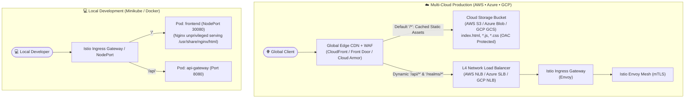
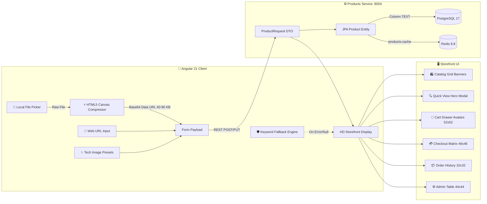
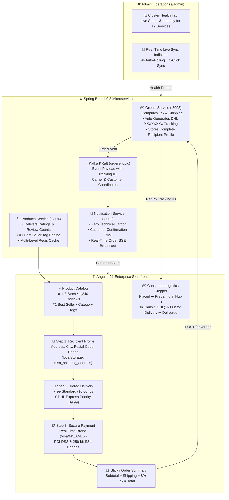
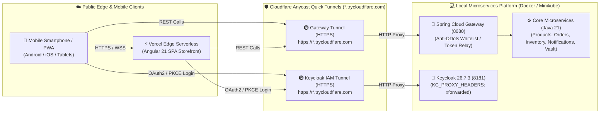

# 🏛️ Enterprise Microservices Architecture & Tactical Domain Guide

> Deep dive into Domain-Driven Design (DDD), Event-Driven Choreography, Security, Frontends, and E-Commerce workflows.

---

## 🏛️ Domain-Driven Design (DDD) & Microservices Tactical Patterns

The ecosystem adopts **Domain-Driven Design (DDD)** across all bounded contexts:

### 🧩 1. Bounded Contexts & Aggregate Roots
* **🛍️ Catalog & Multi-Currency Context (`products-service`):**
  * **Aggregate Root `Product`:** Encapsulates pricing rules across multiple currencies (USD, MXN) and guarantees catalog status invariants.
* **📦 Order Lifecycle & Fulfillment Context (`orders-service`):**
  * **Aggregate Root `Order`:** Directly guards state transitions (`cancel()`, `ship()`, `deliver()`, `assignItems()`). Prevents business conflicts such as cancelling already shipped/delivered orders or duplicate items.
* **🏭 Warehouse Stock Allocation Context (`inventory-service`):**
  * **Entity `Inventory`:** Handles atomic, thread-safe stock reservations, batch multi-item evaluations, and Saga compensations.
* **🔔 Notification & Real-Time Stream Context (`notification-service`):**
  * **Reactive Hub:** Implements idempotent event ingestion with Redis `SETNX` (7-day TTL) and dispatches real-time Server-Sent Events (SSE) to connected clients.

### 🛡️ 2. Functional Programming & RFC 7807 Error Handling
* **Monadic Try/Result Pipelines:** Elimination of procedural `try-catch` blocks in favor of Java 21 Streams and monadic Optional chains (`Optional.filter().map().ifPresentOrElse()`).
* **Typed Domain Exceptions:** `OrderNotFoundException` (404), `InsufficientStockException` (409), `ProductNotFoundException` (404), and `ServiceUnavailableException` (503).
* **RFC 7807 Problem Details:** Unified `GlobalExceptionHandler` returning consistent JSON error payloads across all 4 microservices.

---

## 📡 Microservices Catalog & API Routing

| Service | Path Prefix | Key Endpoints | Responsibilities |
| :--- | :--- | :--- | :--- |
| **API Gateway** | `/api/*` | `/actuator/health`, `/actuator/prometheus` | Reverse proxy, token validation, rate limiter |
| **Products Service** | `/api/product` | `POST /api/product`, `GET /api/product` | Product catalog, pricing, Redis caching |
| **Orders Service** | `/api/order` | `POST /api/order`, `GET /api/order`, `PUT /api/order/{id}/cancel` | Order placement & cancellation, multi-tenant user isolation, inventory validation, Kafka producer, compulsive buyer telemetry |
| **Inventory Service** | `/api/inventory`| `GET /api/inventory/{sku}`, `POST /api/inventory/in-stock`, `POST /api/inventory/decrement`, `POST /api/inventory/increment`, `PUT /api/inventory/{sku}` | Real-time SKU stock verification, $O(1)$ atomic delta allocation, Saga compensation & selective Redis cache eviction |
| **Notification Service**| N/A | Kafka Topic `orders-topic` | Consumes `OrderPlacedEvent`, customer email simulation |

---

## 🔌 Ports & Service Matrix

| Service | Local / Docker Port | Minikube Port | AWS / Azure / GCP Target | Credentials / Notes |
| :--- | :---: | :---: | :---: | :--- |
| **Angular 21 Frontend** | `4200` / `80` | `30080` | Ingress (`/`) | Modern Angular SPA UI |
| **Spring Cloud API Gateway** | `8080` | `30088` | Ingress (`/api/*`) | Edge Gateway, Token Relay, Rate Limiting |
| **Products Service** | `8004` | `30004` | ClusterIP | Product catalog domain + PostgreSQL |
| **Orders Service** | `8003` | `30003` | ClusterIP | Order orchestration + Kafka Producer |
| **Inventory Service** | `8001` | `30001` | ClusterIP | Stock control & atomic verification |
| **Notification Service** | `8002` | `30002` | ClusterIP | Kafka Consumer & customer alerts |
| **Keycloak IAM** | `8181` | `30181` | Ingress (`/auth/*`) | `admin` / `admin` |
| **HashiCorp Vault** | `8200` | `30200` | Ingress / NodePort | `root` / v2.0.4 Secret Management |
| **OPA Gatekeeper** | `8888` / `8443` | ClusterIP | Admission Controller | Policy-as-Code Engine (v3.23.0) |
| **Istio Ingress Gateway** | `80` / `443` | `30080` / `30443` | Ingress / LoadBalancer | Envoy Proxy Service Mesh (v1.31.1) |
| **Kiali Visual Mesh** | `20001` | `32001` | Ingress / NodePort | Istio Service Mesh Visualizer (v2.31.0, `/kiali`) |
| **Grafana** | `3000` | `30300` | Ingress / NodePort | `admin` / `admin` (v13.2.1) |
| **Grafana Tempo** | `3200` | ClusterIP | ClusterIP | Distributed tracing backend (v3.0.3) |
| **Prometheus** | `9090` | `30090` | Prometheus Operator | Metrics scraping engine (v3.14.0) |
| **Grafana Loki** | `3100` | `30100` | ClusterIP | Centralized logging engine (v3.7.4) |
| **Grafana Alloy** | `3300` | DaemonSet | DaemonSet | Telemetry & log collector (v1.19.1) |
| **Redis & Exporter** | `6379` / `9121` | `30379` | Managed Cache / ClusterIP | Redis 8.8 + Exporter v1.82.0 |
| **PostgreSQL Databases** | `5432` | `30432` | RDS / Flexible / Cloud SQL | Managed multi-tenant DB |
| **Apache Kafka Broker** | `9094` (SASL) / `9092` / `29092` | `30092` | KRaft Broker / Strimzi Operator | KRaft broker (SASL PLAIN, Topic: `orders-topic`) |
| **KEDA Operator & Metrics** | N/A (In-Cluster) | ClusterIP | Kubernetes Operator | Event-Driven Autoscaler v2.20.1 (Kafka Lag & Prometheus RPS) |

---

## 🔐 Identity & Access Management (Keycloak 26.7.3)

- **Protocol:** OAuth2 / OpenID Connect (OIDC) with PKCE flow in Angular 21 SPA.
- **User Self-Registration:** Public registration is fully enabled (`registrationAllowed: true`, `resetPasswordAllowed: true`) in realm configuration, enabling storefront visitors to sign up directly via the "Sign Up / Crear Cuenta" flow.
- **Default Role Assignment:** Self-registered accounts automatically receive the standard `USER` role through composite assignment on `default-roles-microservices-realm`.
- **Multi-Tenant Order Isolation & Ownership Guards:**
  - `orders-service` securely extracts the caller's JWT claims (`sub` for User ID and `preferred_username` for Customer Handle).
  - Basic users (`ROLE_USER`) only have visibility over their own placed orders (`GET /api/order` automatically filters by authenticated `userId`), strictly preventing cross-account order leaks.
  - Store administrators (`ROLE_ADMIN`) possess global visibility across all customer orders, including real-time customer handle attribution in the Admin Dashboard.
  - Order cancellation (`PUT /api/order/{id}/cancel`) enforces strict ownership validation: attempting to cancel another customer's order triggers an immediate `403 Forbidden` rejection.
- **Token Relay:** Spring Cloud Gateway validates incoming JWT tokens against Keycloak JWKS and forwards claims downstream via `Authorization: Bearer <token>`.
- **Automated Realm Import:** Configuration pre-loaded via [`docs/realm-export.json`](./docs/realm-export.json) with client `frontend-client`, roles `USER` / `ADMIN`, and default credentials.

---

## 🔒 Secret Management with HashiCorp Vault (Multi-Cloud & Local)

The platform provides enterprise-grade secret management across 4 distinct implementation patterns with **Least-Privilege Policies**:

### 1. Approach A: Local Development with Docker Compose (Zero-Touch)
- **Vault Web UI:** [http://localhost:8200](http://localhost:8200) (Dev Token: `root`)
- **Zero-Touch Auto-Initialization:** When running `docker compose up -d`, the ephemeral [`vault-init`](./compose.yaml) container automatically creates the KV-v2 engine, seeds database credentials, Kafka parameters, Keycloak secrets, and configures Least-Privilege access policies.
- **Optional Manual Re-seed Tool:** `.\platform.ps1 secrets` is available if you ever need to generate high-entropy secrets and synchronize Vault credentials:
  ```powershell
  pwsh .\platform.ps1 secrets
  ```

### 2. Approach B: Native Java Spring Boot Integration (All 5 Services)
- **Zero-Friction Activation:** Microservices run natively by default. To connect directly to Vault via Spring Cloud Config:
  ```powershell
  # Run any microservice with the 'vault' profile:
  cd products-service;     mvn spring-boot:run -Dspring-boot.run.profiles=vault
  cd orders-service;       mvn spring-boot:run -Dspring-boot.run.profiles=vault
  cd inventory-service;    mvn spring-boot:run -Dspring-boot.run.profiles=vault
  cd notification-service; mvn spring-boot:run -Dspring-boot.run.profiles=vault
  cd api-gateway;          mvn spring-boot:run -Dspring-boot.run.profiles=vault
  ```
- **Configuration Profile:** Managed via `application-vault.yml` in each service with support for `TOKEN` (Local), `KUBERNETES` (Cluster), and `APPROLE` (CI/CD) authentication.

### 3. Approach C: Kubernetes External Secrets Operator (ESO - Recommended)
- **Zero-Sidecar Footprint:** Synchronizes secrets directly from Vault into native Kubernetes `Secret` resources (`microservices-secrets`) without requiring sidecar containers.
- **Manifests:** Located in [`k8s/minikube/vault/external-secrets/`](./k8s/minikube/vault/external-secrets/).
  ```powershell
  # Apply SecretStore & ExternalSecret sync:
  kubectl apply -f k8s/minikube/vault/external-secrets/
  ```

### 4. Approach D: Kubernetes Multi-Cloud Vault Agent Sidecar Injector
- **Minikube:** Manifests in [`k8s/minikube/vault/`](./k8s/minikube/vault/) with RBAC and [`vault-k8s-auth-setup.ps1`](./k8s/minikube/vault/vault-k8s-auth-setup.ps1) for Least-Privilege roles (`products-service-role`, `orders-service-role`, etc.).
- **AWS EKS:** Production Helm values in [`k8s/eks/vault/vault-helm-values-eks.yaml`](./k8s/eks/vault/vault-helm-values-eks.yaml) featuring **AWS KMS Auto-Unseal** and **IRSA**.
- **Azure AKS:** Production Helm values in [`k8s/aks/vault/vault-helm-values-aks.yaml`](./k8s/aks/vault/vault-helm-values-aks.yaml) featuring **Azure Key Vault KMS Auto-Unseal** and **Workload Identity**.
- **Google Cloud GKE:** Production Helm values in [`k8s/gke/vault/vault-helm-values-gke.yaml`](./k8s/gke/vault/vault-helm-values-gke.yaml) featuring **Cloud KMS Auto-Unseal** and **GCP Workload Identity**.
- **Demo Deployment:** Test sidecar injection with [`k8s/minikube/vault/demo-vault-agent-inject.yaml`](./k8s/minikube/vault/demo-vault-agent-inject.yaml).

---

## 🗺️ Multi-Cloud & Multi-CI/CD Matrix (Model 2: L4 NLB + Dedicated Ingress + Istio Mesh)

| Target Cloud | Ingress Controller (L7) | Cloud Load Balancer (L4) | Edge WAF & DDoS Protection | Service Mesh & Observability | CI / CD Engine |
| :--- | :--- | :--- | :--- | :--- | :--- |
| **AWS Cloud (EKS)** | **Istio Ingress Gateway** (`istio-system/istio-ingressgateway`) | **AWS Network Load Balancer (NLB)** | **AWS WAFv2** (CloudFront Edge Rulesets) | **Istio Envoy** (`mTLS STRICT`) + Kiali | GitHub Actions + ArgoCD |
| **Azure Cloud (AKS)** | **Istio Ingress Gateway** (`istio-system/istio-ingressgateway`) | **Azure Standard Load Balancer (SLB)** | **Azure Front Door Premium WAF** (OWASP DRS 2.1) | **Istio Envoy** (`mTLS STRICT`) + Kiali | Azure DevOps Unified Pipeline |
| **Google Cloud (GCP)** | **Istio Ingress Gateway** (`istio-system/istio-ingressgateway`) | **GCP Passthrough Network Load Balancer** | **Google Cloud Armor** (Security Policy + CDN) | **Istio Envoy** (`mTLS STRICT`) + Kiali | Bitbucket Pipelines + ArgoCD |

### ✅ Canonical Edge Standard (Production Rule)
The project uses a single public ingress pattern across all environments:

- Public cloud provider load balancer remains the L4 entrypoint
- Istio ingress gateway is the sole L7 ingress controller
- Gateway and VirtualService define routing, policies and canary behavior
- Legacy provider-specific ingress manifests are treated as historical examples only, not as active production routing
- Local Minikube and remote cloud clusters follow the same Istio ingress model; the difference is only the underlying provider and the operational context

This avoids conflicts between NGINX, Traefik, Kong and Istio and keeps policy enforcement, traffic shaping and mTLS in one standard mesh control plane.

> Branch naming and cluster naming are intentionally separated: `develop`/`staging`/`master` describe Git flow, while `dev`/`staging`/`prod` describe Kubernetes namespaces and runtime environments. They are mapped by deployment pipelines, not merged into a single naming convention.

---

## 🔄 End-to-End Edge-to-Mesh Traffic Flow (Ingress ➔ Keycloak ➔ Gateway ➔ Istio ➔ Kiali)

The platform implements an enterprise defense-in-depth traffic flow combining a single standard edge layer based on the **Istio Ingress Gateway**, **Keycloak IAM**, **Spring Cloud API Gateway**, **Istio Envoy Service Mesh (`mTLS STRICT`)**, and **Kiali Topology Visualization**:

```mermaid
sequenceDiagram
    autonumber
    actor Client as 👤 Angular 21 Client
    participant Ingress as 🚪 Istio Ingress Gateway<br/>(L4 NLB + Envoy)
    participant Keycloak as 🔐 Keycloak IAM<br/>(OIDC / PKCE / JWKS)
    participant Envoy as 🛡️ Istio Envoy Sidecars<br/>(mTLS STRICT SPIFFE)
    participant Gateway as ⚡ Spring Cloud Gateway<br/>(JWT Filter / TokenRelay)
    participant Microservice as 📦 Orders / Products Service<br/>(Spring Boot 3.4)
    participant Kiali as 📊 Kiali Dashboard

    Note over Client, Keycloak: Phase 1: Authentication & Token Issuance
    Client->>Ingress: 1. POST /realms/microservices-realm/protocol/openid-connect/token (PKCE)
    Ingress->>Envoy: 2. Route authentication request to Keycloak service
    Envoy->>Keycloak: 3. Deliver request encrypted over mTLS
    Keycloak-->>Client: 4. Returns signed JWT Access Token (roles, 'sub', RSA keys)

    Note over Client, Microservice: Phase 2: Business Execution (Defense-in-Depth)
    Client->>Ingress: 5. POST /api/orders (Authorization: Bearer <JWT>, traceparent)
    Note over Ingress: Perimeter L7 Filtering:<br/>• Rate limiting (100 RPS)<br/>• WAF / Input sanitization<br/>• Security Headers injection
    Ingress->>Envoy: 6. Forward egress traffic to api-gateway:8080
    Note over Envoy: Istio Service Mesh (mTLS STRICT):<br/>• Envoy interception<br/>• VirtualService / DestinationRule validation<br/>• Cryptographic mTLS with SPIFFE X.509 certs
    Envoy->>Gateway: 7. Deliver decrypted HTTP request to Spring Cloud Gateway
    Note over Gateway: Application Layer Processing:<br/>• Reactive JwtAuthenticationFilter (JWKS check)<br/>• TokenRelay (propagates 'sub', user roles)<br/>• Resilience4j Circuit Breaker & Retries
    Gateway->>Envoy: 8. Route internal request to orders-service:8003
    Envoy->>Microservice: 9. East-West mTLS encrypted leap to backend container
    Microservice-->>Gateway: 10. HTTP 201 Created + JSON payload
    Gateway-->>Ingress-->>Client: 11. Response returned to Angular 21 Storefront

    Note over Kiali: Real-Time Observability
    Envoy-->>Kiali: 12. Kiali renders live nodes: [Ingress] ➔ [api-gateway] ➔ [orders-service] with green 🔒 mTLS lock
```

### Flow Breakdown & Separation of Concerns:
1. **Perimeter Ingress (North-South):** the **Istio Ingress Gateway** is the single entry point in every cloud environment; cloud-native L4 load balancers sit in front of it for public exposure, while Envoy enforces rate limits, CORS policies, security headers, and route dispatching.
2. **Identity & Access Management:** **Keycloak 26** serves OIDC/OAuth2 tokens and publishes its JWKS public keys. The Istio gateway routes `/auth/**` and `/realms/**` directly to Keycloak.
3. **Transport Security (Mesh Boundary):** Egress from the Ingress Controller is intercepted by its **Istio Envoy Sidecar**, initiating **`mTLS STRICT`** using short-lived X.509 SPIFFE identities issued by `istiod`.
4. **Application API Gateway:** **Spring Cloud Gateway** performs deep application-level filtering (reactive JWT claim extraction, user context propagation via `TokenRelay`, Resilience4j circuit breaking, and anti-DDoS IP rate limiting).
5. **Core Microservices (East-West):** Gateway dispatches traffic to downstream microservices (`orders-service`, `products-service`) across the mesh with **`mTLS STRICT`** and canary routing dictated by **`VirtualService`** and **`DestinationRule`**.
6. **Unified Observability in Kiali:** Kiali visualizes the continuous traffic graph, displaying the Ingress node communicating with `api-gateway` and onward to microservices, accompanied by green mutual TLS verification locks and golden signal metrics (RPS, latency $p95$, HTTP error rates).

---

## 🌐 Dual-Origin Cloud Edge vs. Local Minikube Frontend Architecture

To balance enterprise cloud scalability with zero-cost local developer ergonomics, the platform implements a hybrid frontend delivery model:



| Deployment Environment | Frontend Delivery Mechanism | Backend Ingress Target | CDN & Edge Caching | Infrastructure Cost |
| :--- | :--- | :--- | :--- | :--- |
| **AWS EKS (`staging`/`prod`)** | **AWS S3 Assets Bucket** (`module.s3_assets`) | AWS NLB (`module.nlb`) | **CloudFront Distribution + WAFv2** (`s3Origin` + `nlbOrigin`) | Edge cached, zero pod CPU/RAM footprint |
| **Azure AKS (`staging`/`prod`)** | **Azure Storage Account Blob** (`module.storage_account`) | Azure SLB (`istio_gateway_public_ip`) | **Azure Front Door Premium** (`static-frontend-group` + `aks-api-group`) | Edge cached, zero pod CPU/RAM footprint |
| **Google Cloud GKE (`staging`/`prod`)** | **Google Cloud Storage Bucket** (`module.gcs`) | GCP Passthrough NLB (`api_backend`) | **Google Cloud Armor + Cloud CDN** (Backend Bucket + Backend Service) | Edge cached, zero pod CPU/RAM footprint |
| **Local Minikube (`dev`)** | **Data Plane Pod** (`frontend.yaml` in `dev` ns) | Spring Cloud Gateway (`:8080`) | Minikube Ingress / Istio Gateway | **$0.00 / 100% Offline** |

---

## ⚡ Modern Angular 21 Reactive SPA Architecture

The frontend storefront is engineered with **Angular 21** utilizing state-of-the-art performance and reactive patterns:

```
┌─────────────────────────────────────────────────────────────┐
│                 Angular 21 Reactive SPA                     │
│                                                             │
│   ┌──────────────────┐  ┌──────────────────┐  ┌──────────┐  │
│   │   CartStore      │  │ ChangeDetection  │  │  @defer  │  │
│   │ (Signal Pattern) │  │     .OnPush      │  │  Chunks  │  │
│   └──────────────────┘  └──────────────────┘  └──────────┘  │
│                                                             │
│   • PreloadAllModules: 0ms background route preloading      │
│   • Modern Signal Primitives: input<T>() / output<T>()      │
└──────────────────────────────┬──────────────────────────────┘
```

1. **Signal Store Pattern (`CartStore`):** Pure immutable reactive state management using `signal()` and memoized `computed()` derivations.
2. **`ChangeDetectionStrategy.OnPush` Everywhere:** Applied across all smart and presentation components to minimize browser CPU cycles.
3. **Deferrable Views (`@defer` Pattern):** Heavy secondary UI components are partitioned into independent lazy `.js` chunks and loaded on demand:
   * `@defer (when isQuickViewOpen()) { <app-quick-view-modal> }`: Modal chunk loaded only upon user click.
   * `@defer (when isQrModalOpen()) { <app-product-qr-modal> }`: QR SVG generator loaded on demand.
   * `@defer (when selectedOrderForReceipt()) { <app-receipt-modal> }`: Printable invoice loaded upon checkout completion.
4. **Instant Route Transitions (`PreloadAllModules`):** Preloads `/orders`, `/checkout`, and `/admin` in the background with zero UI freeze.

---

## 🖼️ Dual-Mode Product Media & Visual Storefront Architecture

The system features an enterprise, zero-dependency **Media Ingestion & Rendering Engine** supporting both offline/local file uploads and external CDN URLs:



### 1. 📂 Client-Side Canvas Compression & Base64 Data URL Engine
* **Offline-First Local File Uploads:** Upload raw `.jpg`, `.png`, or `.webp` images directly from your computer or mobile device without requiring third-party cloud storage (e.g. AWS S3 buckets or Cloudinary).
* **Automated Canvas Rescaling ([`product-image.helper.ts`](./frontend/src/app/core/utils/product-image.helper.ts)):** Raw photos (5–15 MB) are scaled to a maximum dimension of $800\text{ px}$ with $82\%$ lossy quality encoding on an offscreen HTML5 Canvas element, converting large images into lightweight **Base64 Data URLs** ($40\text{--}90\text{ KB}$) in milliseconds.
* **1-Click Curated Presets:** Instant template selector for high-end hardware categories (*Apple Vision Pro, PlayStation 5 Pro, RTX 4090 OC, Dell XPS 16 OLED, Bose QC Ultra, Server Racks*).
* **Smart Keyword Fallback Resolver:** Dynamic keyword detection across product name and SKU ensures every item in the catalog always renders a high-definition photo even if no custom image was provided.

### 2. 💾 PostgreSQL Unlimited TEXT Persistence & Redis Cache
* **JPA Entity Schema ([`Product.java`](./products-service/src/main/java/com/georgegxx/products_service/model/entities/Product.java)):** Configured with `@Column(columnDefinition = "TEXT") private String imageUrl;` to support arbitrary-length Base64 strings or HTTPS URLs up to $1\text{ GB}$ in PostgreSQL without database truncation errors.
* **DTO Mapping & Seed DataLoader:** Mapped across [`ProductRequest.java`](./products-service/src/main/java/com/georgegxx/products_service/model/dtos/ProductRequest.java) and [`ProductResponse.java`](./products-service/src/main/java/com/georgegxx/products_service/model/dtos/ProductResponse.java) with initial HD seed imagery in [`DataLoader.java`](./products-service/src/main/java/com/georgegxx/products_service/utils/DataLoader.java).
* **Redis Serialization:** Full caching support in Redis 8.8 (`products-cache`) for sub-millisecond retrieval through Spring Cloud Gateway.

### 3. 🎨 High-Fidelity Storefront Visual Integration
* **Catalog Grid ([`product-list`](./frontend/src/app/features/products/)):** 16:10 responsive aspect ratio image banners (`aspect-ratio: 16 / 10; object-fit: contain;`) with hover zoom transitions, glassmorphism overlay badges, and verified customer ratings.
* **Quick View Hero Modal ([`quick-view`](./frontend/src/app/shared/components/quick-view/)):** High-resolution hero display with dynamic category labels, real-time stock indicators, 2-Year SLA guarantees, and express dispatch chips.
* **Cart, Checkout & Order History:** Consistent square visual thumbnails ($52\times52\text{ px}$ in Cart Drawer, $46\times46\text{ px}$ in Checkout Summary, and $32\times32\text{ px}$ in Order History rows).
* **Admin Dashboard ([`admin-dashboard`](./frontend/src/app/features/admin/)):** File picker, URL input, live image preview card, and product table thumbnail column.

---

## 🏷️ End-to-End QR Code & Point of Sale (POS) Workflow

The platform provides a complete hardware-agnostic **Point of Sale (POS) and QR code management system**:


---

## 🛒 Enterprise E-Commerce & Logistics Architecture (Amazon & Mercado Libre)

The storefront and backend microservices are fully aligned with tier-1 enterprise e-commerce paradigms (such as **Amazon** and **Mercado Libre**), eliminating arcade or unstandardized prototypes in favor of production-grade customer journeys, real-time logistics tracking, social proof, and operational supervision:



### 1. 📦 Multi-Step Checkout & Persistent Recipient Profile
* **3-Step Frictionless Funnel:** Replaces monolithic forms with a structured, guided sequence:
  1. **Shipping Destination & Contact:** Full Name, Email, Mobile Phone, Street Address, City, Postal Code, and Country.
  2. **Delivery Speed Tiering:** Instant choice between **Free Standard Shipping** ($0.00, 3–5 business days) and **⚡ DHL Express Priority** ($9.99, 24–48 hours) with dynamic delivery date estimates.
  3. **Payment Method & Card Brand Recognition:** Real-time IIN/BIN regex detection identifying **Visa**, **Mastercard**, and **American Express**, coupled with expiration date masking (`MM/YY`), CVV security, and PCI-DSS / 256-bit SSL compliance badges.
* **1-Click LocalStorage Persistence (`msa_shipping_address`):** Frequently returning customers have their shipping coordinates stored securely on their local device, enabling instant auto-fill upon subsequent visits.
* **Sticky Financial Summary:** Right-hand pane displaying dynamic calculations: `Subtotal + Shipping Fee + Estimated Tax (8%) = Total Order Amount`.

### 2. 🚚 Real-Time Logistics Tracking & Consumer Stepper
* **Interactive 5-Stage Live Delivery Pipeline:** Replaces static client-only status text with an interactive, end-to-end simulated parcel fulfillment journey:
  $$\text{Order Placed} \longrightarrow \text{Preparing in Hub} \longrightarrow \text{In Transit (DHL Express)} \longrightarrow \text{Out for Delivery} \longrightarrow \text{Delivered \& Signed}$$
  Triggered via the **"▶ Start Live Delivery Flow"** button on any active order in the customer dashboard.
* **Animated Courier Runner & Dynamic Icon Morphing:**
  - CSS-engineered runner (`.delivery-courier-runner`) that smoothly travels across the progress connector ($0\% \rightarrow 25\% \rightarrow 50\% \rightarrow 75\% \rightarrow 100\%$) synchronized with each fulfillment milestone.
  - Real-time icon morphing illustrating physical logistics:
    - **Stage 1 (Order Placed):** `📦` Parcel minted and inventory locked.
    - **Stage 2 (Preparing in Hub):** `📦` Warehouse sorting, pick & pack operations.
    - **Stage 3 (In Transit - DHL):** `🚚` Regional trunk line dispatch via DHL Express carrier.
    - **Stage 4 (Out for Delivery):** `🚚` Local courier vehicle en route to customer doorstep.
    - **Stage 5 (Delivered & Signed):** `✨` Delivery celebration, verified doorstep signature, and final receipt sealing.
  - Active light-beam connector animation (`.step-connector.active-pulse`) emitting a glowing pulse along the active transit segment.
* **Automated Backend State Persistence & Kafka Events:**
  - **Stage 3 Integration:** Automatically executes `PUT /api/orders/{id}/ship` against [`OrderService`](../orders-service/src/main/java/com/georgegxx/orders_service/services/OrderService.java), setting `orderStatus = SHIPPED`, persisting to PostgreSQL `t_orders`, and emitting an enriched event to Kafka `orders-topic`.
  - **Stage 5 Integration:** Automatically executes `PUT /api/orders/{id}/deliver`, setting `orderStatus = DELIVERED`, recording delivery timestamp, synchronizing PostgreSQL Micrometer database gauges (`syncDatabaseMetrics()`), and unlocking the **"Delivered & Signed"** seal.
* **Real-Time Customer Milestones & Multi-Channel Alerts:**
  - Milestone floating toasts dispatched at every physical handover stage (e.g. *"🚚 Package in Transit with DHL Express"*).
  - Synchronous push into the **Customer Notification Center** drawer (`msa_customer_notifications` in `sessionStorage`), updating the top navigation badge counter with zero technical jargon.
* **Automated DHL Tracking Generation:** Upon order placement, [`OrderService`](../orders-service/src/main/java/com/georgegxx/orders_service/services/OrderService.java) automatically mints a carrier-compliant tracking number (e.g. `DHL-A8E29C1F`) and assigns the carrier.
* **Interactive Logistics Badging & Digital Receipt:** Orders history displays a priority express pill, clickable tracking code badge, and digital invoice receipt (`AUTH-XXXX-VERIFIED`) with printable QR verification and itemized line items.

### 3. ⭐ Social Proof, Verified Ratings & Best Seller Engine
* **Customer Confidence Metrics:** Every catalog product showcases verified buyer ratings (`★ 4.8 / 5.0`), total ratings volume (`(1,240 customer ratings)`), and authenticity verification (`• 100% Authentic`).
* **Ecommerce Amber `#1 Best Seller` Badge:** Distinctive `#e67a00` badge applied to top-tier SKUs in both catalog cards and Quick View modals.
* **Backend Database Schema:** Enriched fields in [`Product`](../products-service/src/main/java/com/georgegxx/products_service/model/entities/Product.java) persisted in the catalog domain:
  ```sql
  ALTER TABLE t_products ADD COLUMN IF NOT EXISTS rating DOUBLE PRECISION DEFAULT 4.8;
  ALTER TABLE t_products ADD COLUMN IF NOT EXISTS review_count INTEGER DEFAULT 1200;
  ALTER TABLE t_products ADD COLUMN IF NOT EXISTS is_best_seller BOOLEAN DEFAULT false;
  ALTER TABLE t_products ADD COLUMN IF NOT EXISTS category VARCHAR(100) DEFAULT 'Electronics';
  ```

### 4. 🛡️ Admin Operations Console, Live Sync & Cluster Health
* **Cluster Health Supervision Tab:** Direct integration of [`SystemStatusComponent`](./frontend/src/app/features/status/system-status.component.ts) into the administrative dashboard, polling `/actuator/health` across all **12 system microservices and infrastructure components** (Gateway, Keycloak, Products, Orders, Inventory, Notifications, PostgreSQL clusters, Kafka, Redis, Vault).
* **Modern Live Sync Indicator:** Replaced legacy unstyled refresh buttons with an animated, pulsing glassmorphism `● LIVE SYNC` widget that auto-synchronizes catalog and warehouse stock every 4 seconds or on manual click.

### 5. 🔔 Customer-Centric Notification Center (Zero-Jargon)
* **Buyer-Oriented Messaging:** Removed internal architecture jargon (such as *"Saga orchestrator"*, *"distributed compensation"*, *"Kafka stream active"*).
* **Clear Commercial Notifications:** Buyers receive clean status updates directly in the notification drawer:
  * 📦 *"Order #d8f4163d Confirmed! We are preparing your shipment via DHL Express to Monterrey."*
  * 🚚 *"Tracking Number Assigned: DHL-A8E29C1F — Estimated delivery in 24-48h."*
  * 💳 *"Payment Verified — Secure 256-bit SSL transaction complete."*

### 6. 📱 Responsive Media & Aspect-Ratio Scaling
* **Dynamic Aspect-Ratio Optimization (`16 / 10`):** Replaced hardcoded heights (`height: 165px`) on product cards with fluid aspect ratios and `object-fit: contain;`, guaranteeing that laptops, keyboards, and accessories are 100% visible without clipping on mobile screens.
* **Single-Viewport Modal Scrolling:** Quick View modal cards enforce `max-height: 90dvh; overflow-y: auto;` with zero secondary or nested scrollbars, ensuring seamless touch momentum scrolling across iOS and Android browsers.

---

## 📱 Mobile Application & Google Play Store Architecture Guide

The backend microservices are **100% Client-Agnostic** and fully prepared for native Android / iOS or cross-platform deployment:

### 1. 🚀 Mobile Packaging Options:
* **Capacitor / Ionic (Recommended):** Wrap the existing Angular 21 codebase into native Android Studio and Xcode projects without rewriting business logic:
  ```bash
  npm install @capacitor/core @capacitor/cli @capacitor/android
  npx cap init "MicroStore" "com.georgegxx.microstore"
  npx cap add android
  npm run build && npx cap sync
  ```
* **Hardware Camera Integration:** Access native 60 fps barcode scanning with flashlight/autofocus using `@capacitor-community/barcode-scanner`.

### 2. 🔐 Mobile Security & OIDC Integration:
* **Keycloak Deep Linking:** Register custom redirect URIs (e.g. `com.georgegxx.microstore://auth/callback`) in `microservices-realm` for seamless OAuth2 PKCE login.
* **HTTPS/TLS Termination:** Android enforces `cleartextTrafficPermitted="false"`. The API Gateway must be fronted by a valid TLS certificate.

### 3. 📦 Google Play Store Publication Checklist:
1. **Google Play Console Account:** $25 USD one-time developer registration.
2. **Package Format:** Android App Bundle (`.aab`) signed via `keytool` and Google Play App Signing.
3. **Camera Permissions:** Declared in `AndroidManifest.xml`: `<uses-permission android:name="android.permission.CAMERA" />`.
4. **Testing Track:** Deploy first to **Internal Testing Track** for instant device verification without Google manual review wait times.

---

## 🌐 Edge Cloud Tunneling & Serverless Frontend (Cloudflare & Vercel)

The platform provides an out-of-the-box hybrid integration to expose local microservices (Docker Compose or Minikube) securely to public internet clients, serverless platforms (Vercel), and mobile smartphones without requiring public static IPs, router port forwarding, or firewall tampering:



### 1. 🚇 Cloudflare Quick Tunnels Automation (`start-cloudflare-tunnels.ps1`)
* **Zero-Configuration Anonymous Tunneling:** Exposes **Spring Cloud Gateway** (`:8080`) and **Keycloak IAM** (`:8181`) with valid Cloudflare TLS certificates using [`scripts/cloud/cloudflare/start-cloudflare-tunnels.ps1`](./scripts/cloud/cloudflare/start-cloudflare-tunnels.ps1).
* **Automated Frontend Environment Sync:** Running with `-UpdateFrontendEnv` automatically injects the active ephemeral HTTPS endpoints into `frontend/src/environments/environment.prod.ts` and `environment.ts`:
  ```powershell
  # For Local Use / Temporary Testing
  pwsh scripts/cloud/cloudflare/start-cloudflare-tunnels.ps1
  # For Deployment to Vercel or Remote Production, be careful, it overwrite your environment.prod.ts and environment.ts files.
  pwsh scripts/cloud/cloudflare/start-cloudflare-tunnels.ps1 -UpdateFrontendEnv
  # API Gateway with Products Endpoint Example
  https://destination-neon-ent-coral.trycloudflare.com/api/product
  ```
* **Keycloak Reverse Proxy Compliance:** Configured with `KC_PROXY_HEADERS: "xforwarded"`, `KC_HOSTNAME_STRICT: "false"`, and `KC_HOSTNAME_STRICT_HTTPS: "false"` across [`compose.yaml`](./compose.yaml) and [`keycloak.yaml`](./k8s/minikube/infra/keycloak.yaml) to eliminate untrusted proxy header rejections.

### 2. 🚀 Vercel Monorepo Deployment & Output Directory Configuration
* **Angular 21 Application Builder Output:** Configured in [`frontend/vercel.json`](./frontend/vercel.json) to point directly to `"outputDirectory": "dist/frontend/browser"` with root SPA rewrites (`"source": "/(.*)", "destination": "/index.html"`), preventing `404: NOT_FOUND` errors upon deployment.
* **Dual Client IAM Architecture:**
  * **`microservices_frontend` (Public Client / PKCE):** `client_secret: OFF` for browser Single Page Applications and mobile devices with wildcard web origins (`*`, `+`).
  * **`microservices_client` (Confidential Client):** `client_secret: ON` with dynamic Client Secret generation and sync for Spring Cloud Gateway and machine-to-machine clients.

### 3. 📱 Full-Stack Mobile PWA Responsiveness & Touch Optimization
* **Universal Smartphone & Tablet Viewports:** Dedicated responsive media queries (`max-width: 768px` and `max-width: 480px`) across all views:
  * **Floating Action Button (FAB):** Ergonomic bottom-right quick scanner trigger on mobile devices.
  * **Touch Momentum Scrolling:** Horizontal smooth scrolling for order status filter tabs without page clipping.
  * **Touch-Friendly Modals:** Responsive Quick View and QR barcode labels with unified single-viewport touch momentum scrolling (`max-height: 90dvh`).
* **Vector SVG Favicon & PWA Icons:** Crisp $512\times512\text{ px}$ vector icon ([`frontend/public/favicon.svg`](./frontend/public/favicon.svg)) integrated with Apple Touch Icons and Web App Manifest ([`frontend/public/manifest.webmanifest`](./frontend/public/manifest.webmanifest)).
* **Clean Enterprise E-Commerce Standard:** Decommissioned arcade synthesizer sound effects and 3D card gimmicks, standardizing on silent, high-performance interactions matching Amazon and Mercado Libre.
* **Resilient Network Tolerance:** Staggered health checks and automatic RxJS retry backoff (`retry({ count: 2, delay: 1000 })`) preventing false-positive connectivity drops over high-latency mobile networks.
* **API Gateway Anti-DDoS Exclusions:** [`IpBlacklistFilter.java`](./api-gateway/src/main/java/com/georgegxx/api_gateway/filters/IpBlacklistFilter.java) excludes `/actuator/**` health probes and `OPTIONS` preflight queries from rate limit ban counters with an expanded burst threshold ($120$ requests/5s).

---

### ✅ Production-Grade Hardening Checklist
For a production-grade rollout, I would keep this as the minimum bar before promoting the platform beyond dev/staging:

- **Single ingress standard:** public L4 load balancer + Istio ingress gateway only; no active NGINX/Traefik/Kong L7 routes in production manifests
- **Clear environment model:** Git branch names (`develop`, `staging`, `master`) stay separate from Kubernetes namespaces (`dev`, `staging`, `prod`); they are related but not the same concept
- **Mutual TLS everywhere:** `STRICT` mTLS across the mesh, with `PeerAuthentication` and `DestinationRule` enforced for critical workloads
- **Policy gating:** Gatekeeper + OPA constraints for privileged containers, resource limits, required labels, and restricted host networking
- **Secrets and identity:** Vault as the default secret source, Keycloak OIDC/JWKS validation, workload identity or IRSA for cloud access
- **Observability and SLOs:** Prometheus, Grafana, Kiali, Loki, Tempo, and SLA dashboards for latency, error budget, and mesh health
- **Resilience controls:** HPA, PDB, circuit breakers, retries, rate limits, and rollback automation on canary failure
- **Security scanning in pipeline:** SAST, dependency scanning, container scanning, DAST, and signed artifacts before release
- **Infrastructure discipline:** remote state, lock files, least-privilege IAM roles, private networking, WAF/CDN on public edge, and environment segregation

This is a strong production baseline, and the repository is already close to it.