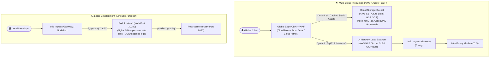
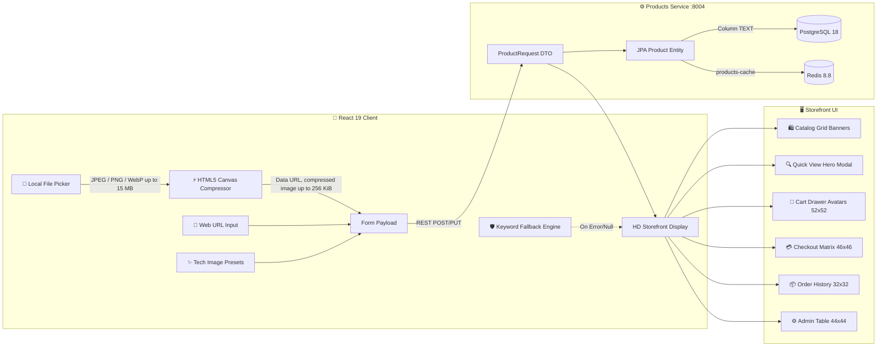
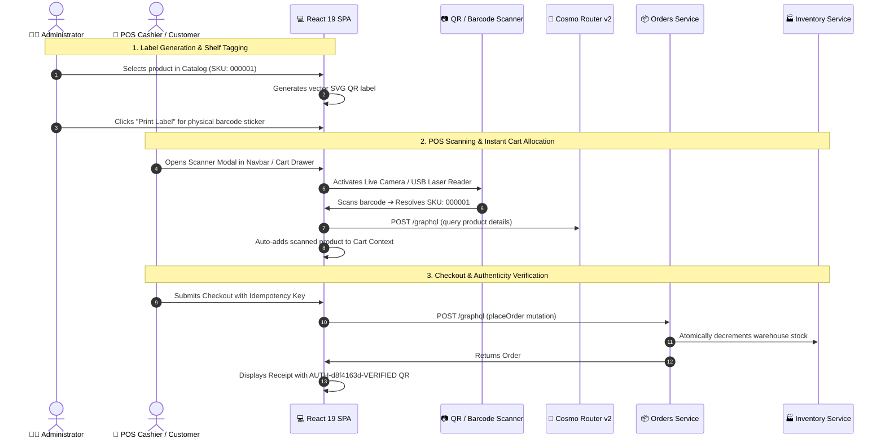
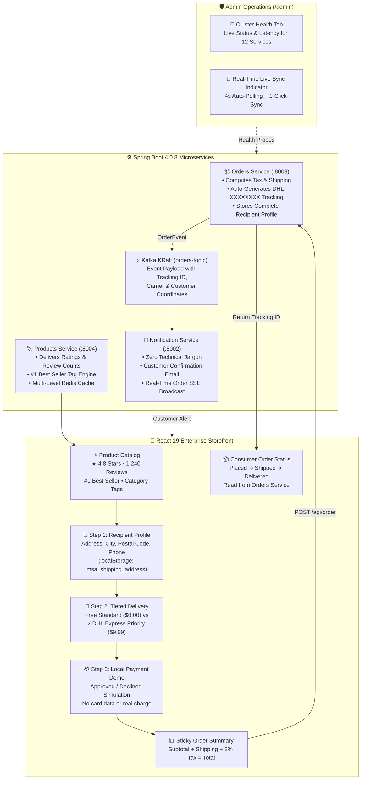
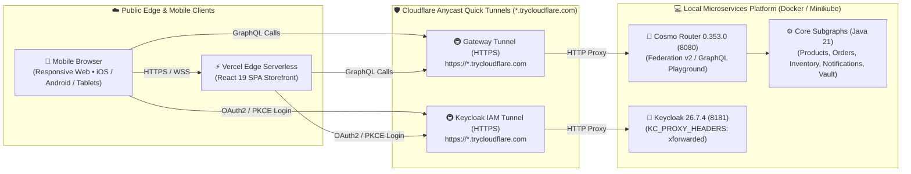

# 🏛️ Enterprise Microservices Architecture & Tactical Domain Guide

> Deep dive into Domain-Driven Design (DDD), Event-Driven Choreography, Security, Frontends, and E-Commerce workflows.

---

## 🏛️ Domain-Driven Design (DDD) & Microservices Tactical Patterns

The ecosystem adopts **Domain-Driven Design (DDD)** across all bounded contexts:

### 🧩 1. Bounded Contexts & Aggregate Roots
* **🛍️ Catalog & Multi-Currency Context (`products-service`):**
  * **Aggregate Root `Product`:** Encapsulates pricing rules across multiple currencies (USD, MXN) and guarantees catalog status invariants.
* **📦 Order Lifecycle & Fulfillment Context (`orders-service`):**
  * **Aggregate Root `Order`:** Directly guards state transitions (`cancel()`, `ship()`, `deliver()`, `assignItems()`). Prevents business conflicts such as cancelling already shipped/delivered orders or duplicate items.
* **🏭 Warehouse Stock Allocation Context (`inventory-service`):**
  * **Entity `Inventory`:** Handles atomic, thread-safe stock reservations, batch multi-item evaluations, and Saga compensations.
* **🔔 Notification & Real-Time Stream Context (`notification-service`):**
  * **Reactive Hub:** Implements idempotent event ingestion with Redis `SETNX` (7-day TTL) and dispatches real-time Server-Sent Events (SSE) to connected clients.

### 🛡️ 2. Functional Programming & RFC 7807 Error Handling
* **Monadic Try/Result Pipelines:** Elimination of procedural `try-catch` blocks in favor of Java 21 Streams and monadic Optional chains (`Optional.filter().map().ifPresentOrElse()`).
* **Typed Domain Exceptions:** `OrderNotFoundException` (404), `InsufficientStockException` (409), `ProductNotFoundException` (404), and `ServiceUnavailableException` (503).
* **RFC 7807 Problem Details:** Unified `GlobalExceptionHandler` returning consistent JSON error payloads across all 4 microservices.

---

## 📡 Microservices Catalog & API Routing

| Service | Path Prefix | Key Endpoints | Responsibilities |
| :--- | :--- | :--- | :--- |
| **Cosmo Router Gateway** | `/graphql`, `/health`, `/health/ready`, `/health/live` | `POST /graphql`, local `GET /` (GraphQL Playground) | Go Supergraph Gateway (Federation v2; Orders subgraph v2.5), query planning, Keycloak JWKS JWT validation, OTLP tracing |
| **Products Service** | `/api/product`, `/graphql` | `POST /api/product`, `GET /api/product`, `/swagger-ui.html` | Product catalog, pricing, Redis caching, Subgraph entity resolver, OpenAPI v3 documentation |
| **Orders Service** | `/api/order`, `/graphql` | `POST /api/order`, `GET /api/order`, `POST /api/order/funnel`, `/swagger-ui.html` | Order placement & cancellation, multi-tenant user isolation, inventory validation, Kafka producer, compulsive buyer telemetry, OpenAPI v3 documentation |
| **Inventory Service** | `/api/inventory`, `/graphql`| `GET /api/inventory/{sku}`, `POST /api/inventory/in-stock`, `POST /api/inventory/decrement`, `/swagger-ui.html` | Real-time SKU stock verification, $O(1)$ atomic delta allocation, Saga compensation & selective Redis cache eviction, OpenAPI v3 documentation |
| **Notification Service**| `/api/notifications` | `/api/notifications/stream`, `/swagger-ui.html` | Consumes `OrderPlacedEvent`, customer email simulation, SSE real-time event streaming, OpenAPI v3 documentation |

---

## 🔌 Ports & Service Matrix

| Service | Local / Docker Port | Minikube Service / Access | AWS / Azure / GCP Target | Credentials / Notes |
| :--- | :---: | :---: | :---: | :--- |
| **React Frontend** | Vite host `5173` / Nginx container `8080` / Service `80` | `30080` | Ingress (`/`) | Modern React 19 + Tailwind v4 SPA |
| **Cosmo Router** | `8080` | ClusterIP `http-router:8080`; metrics `http-metrics:9090` | Ingress/frontend proxy (`/graphql`) | Federation v2.3 GraphQL router; Service port names follow Istio protocol naming |
| **Products Service** | `8004` | ClusterIP `8004`; tunnel/port-forward only | ClusterIP | Product catalog domain + PostgreSQL |
| **Orders Service** | `8003` | ClusterIP `8003`; tunnel/port-forward only | ClusterIP | Order orchestration + Kafka Producer |
| **Inventory Service** | `8001` | ClusterIP `8001`; tunnel/port-forward only | ClusterIP | Stock control & atomic verification |
| **Notification Service** | `8002` | ClusterIP `8002`; tunnel/port-forward only | ClusterIP | Kafka Consumer & customer alerts |
| **Keycloak IAM** | `8181` | NodePort `30181`; management port `9000` is also exposed through the currently auto-assigned `31827` | Istio ingress (`/realms/*`, `/resources/*`, `/admin/*`, `/js/*`) | `admin` / `admin`; avoid relying on auto-assigned NodePorts |
| **HashiCorp Vault** | `8200` | NodePort `30820` | Ingress / NodePort | `root` / v2.0.4 Secret Management |
| **OPA Gatekeeper** | `8888` / `8443` | ClusterIP | Admission Controller | Policy-as-Code Engine (v3.23.0) |
| **Istio Ingress Gateway** | `80` / `443` | Kubernetes-assigned NodePorts for Minikube | Ingress / LoadBalancer | Envoy Proxy Service Mesh (v1.31.1) |
| **Kiali Visual Mesh** | `20001` | NodePort `32001`; metrics port `9090` has auto-assigned NodePort `31628` in the current cluster | Ingress / NodePort | Istio Service Mesh Visualizer (v2.31.0, `/kiali`) |
| **Grafana** | `3000` | NodePort `30030`; local tunnel `3000` → Service `80` | Ingress / NodePort | `admin` / `admin` (v13.2.1) |
| **Grafana Tempo** | `3200` | NodePort `30200` for HTTP; OTLP ports are also NodePort-exposed with cluster-assigned values | ClusterIP | Distributed tracing backend (v3.0.3); assigned OTLP NodePorts can change after recreation |
| **Prometheus** | `9090` | ClusterIP `9090`; local tunnel `9090` → Service `9090` | Prometheus Operator | Metrics scraping engine (v3.14.0); legacy standalone manifest's `30090` is not used by the active Terraform install |
| **OpenCost** | — (not installed by Compose) | ClusterIP exporter `9003` + UI `9090`; local tunnel `7000` → UI Service `9090` | Argo CD + Helm; cloud billing needs provider billing data | Local Kubernetes allocation; cloud cost remains unavailable on Minikube |
| **Grafana Loki** | `3100` | ClusterIP `3100`; local tunnel `3100` → Service `3100` | ClusterIP | Centralized logging engine (v3.7.4) |
| **Grafana Alloy** | `3300` | DaemonSet | DaemonSet | Telemetry & log collector (v1.19.1) |
| **Redis & Exporter** | `6379` / `9121` | ClusterIP `6379` / `9121` | Managed Cache / ClusterIP | Redis 8.8 + Exporter v1.82.0 |
| **PostgreSQL Databases** | Compose host ports `5431`–`5434` → container `5432` | Four ClusterIP Services on `5432` in `data`/`auth` | RDS / Flexible / Cloud SQL | Separate DB per service; host ports are distinct in Compose |
| **Apache Kafka Broker** | `9094` (SASL) / `9092` / `29092` | ClusterIP `9092`, `9093`, `9094` | KRaft Broker / Strimzi Operator | KRaft broker (SASL PLAIN, Topic: `orders-topic`) |
| **KEDA Operator & Metrics** | N/A (In-Cluster) | ClusterIP | Kubernetes Operator | Event-Driven Autoscaler v2.20.1 (Kafka Lag & Prometheus RPS) |

---

## 🔐 Identity & Access Management (Keycloak 26.7.4)

- **Protocol:** OAuth2 / OpenID Connect (OIDC) with PKCE flow in React 19 SPA.
- **User Self-Registration:** Public registration is fully enabled (`registrationAllowed: true`, `resetPasswordAllowed: true`) in realm configuration, enabling storefront visitors to sign up directly via the "Sign Up / Crear Cuenta" flow.
- **Default Role Assignment:** Self-registered accounts automatically receive the standard `USER` role through composite assignment on `default-roles-microservices-realm`.
- **Multi-Tenant Order Isolation & Ownership Guards:**
  - `orders-service` securely extracts the caller's JWT claims (`sub` for User ID and `preferred_username` for Customer Handle).
  - Basic users (`ROLE_USER`) only have visibility over their own placed orders (`GET /api/order` automatically filters by authenticated `userId`), strictly preventing cross-account order leaks.
  - Store administrators (`ROLE_ADMIN`) possess global visibility across all customer orders, including real-time customer handle attribution in the Admin Dashboard.
  - Order cancellation (`PUT /api/order/{id}/cancel`) enforces strict ownership validation: attempting to cancel another customer's order triggers an immediate `403 Forbidden` rejection.
- **Federated Identity & Token Propagation:** Cosmo Router v2 propagates the incoming `Authorization` header to federated subgraphs. Protected Spring services validate bearer tokens against Keycloak JWKS; public GraphQL fields and public REST routes remain accessible without a token according to each service's security configuration.
- **Keycloak Provisioning:** [`scripts/bootstrap-keycloak.ps1`](../scripts/bootstrap-keycloak.ps1) provisions `microservices-realm`, the public frontend client (`microservices_frontend`), the confidential automation client (`microservices_client`), realm roles, and local test users. Run it after Keycloak is available; `docs/realm-export.json` is a realm snapshot, not the source of those bootstrap-created users and clients.

---

## 🔒 Secret Management with HashiCorp Vault (Multi-Cloud & Local)

The platform provides enterprise-grade secret management across 4 distinct implementation patterns with **Least-Privilege Policies**:

### 1. Approach A: Local Development with Docker Compose (Zero-Touch)
- **Vault Web UI:** [http://localhost:8200](http://localhost:8200) (Dev Token: `root`)
- **Zero-Touch Auto-Initialization:** When running `docker compose up -d`, the ephemeral [`vault-init`](./compose.yaml) container automatically creates the KV-v2 engine, seeds database credentials, Kafka parameters, Keycloak secrets, and configures Least-Privilege access policies.
- **Optional Manual Re-seed Tool:** `.\platform.ps1 secrets` is available if you ever need to generate high-entropy secrets and synchronize Vault credentials:
  ```powershell
  pwsh .\platform.ps1 secrets
  ```

### 2. Approach B: Native Java Spring Boot Integration (Core Subgraphs)
- **Zero-Friction Activation:** Microservices run natively by default. To connect directly to Vault via Spring Cloud Config:
  ```powershell
  # Run any microservice with the 'vault' profile:
  cd products-service;     mvn spring-boot:run -Dspring-boot.run.profiles=vault
  cd orders-service;       mvn spring-boot:run -Dspring-boot.run.profiles=vault
  cd inventory-service;    mvn spring-boot:run -Dspring-boot.run.profiles=vault
  cd notification-service; mvn spring-boot:run -Dspring-boot.run.profiles=vault
  ```
- **Configuration Profile:** Managed via `application-vault.yml` in each service with support for `TOKEN` (Local), `KUBERNETES` (Cluster), and `APPROLE` (CI/CD) authentication.

### 3. Approach C: Kubernetes External Secrets Operator (ESO - Recommended)
- **Zero-Sidecar Footprint:** Synchronizes secrets directly from Vault into native Kubernetes `Secret` resources (`microservices-secrets`) without requiring sidecar containers.
- **Manifests:** Located in [`k8s/minikube/vault/external-secrets/`](./k8s/minikube/vault/external-secrets/).
  ```powershell
  # Apply SecretStore & ExternalSecret sync:
  kubectl apply -f k8s/minikube/vault/external-secrets/
  ```

### 4. Approach D: Kubernetes Multi-Cloud Vault Agent Sidecar Injector
- **Minikube:** Manifests in [`k8s/minikube/vault/`](./k8s/minikube/vault/) with RBAC and [`vault-k8s-auth-setup.ps1`](./k8s/minikube/vault/vault-k8s-auth-setup.ps1) for Least-Privilege roles (`products-service-role`, `orders-service-role`, etc.).
- **AWS EKS:** Production Helm values in [`k8s/eks/vault/vault-helm-values-eks.yaml`](./k8s/eks/vault/vault-helm-values-eks.yaml) featuring **AWS KMS Auto-Unseal** and **IRSA**.
- **Azure AKS:** Production Helm values in [`k8s/aks/vault/vault-helm-values-aks.yaml`](./k8s/aks/vault/vault-helm-values-aks.yaml) featuring **Azure Key Vault KMS Auto-Unseal** and **Workload Identity**.
- **Google Cloud GKE:** Production Helm values in [`k8s/gke/vault/vault-helm-values-gke.yaml`](./k8s/gke/vault/vault-helm-values-gke.yaml) featuring **Cloud KMS Auto-Unseal** and **GCP Workload Identity**.
- **Demo Deployment:** Test sidecar injection with [`k8s/minikube/vault/demo-vault-agent-inject.yaml`](./k8s/minikube/vault/demo-vault-agent-inject.yaml).

---

## 🗺️ Multi-Cloud & Multi-CI/CD Matrix (Model 2: L4 NLB + Dedicated Ingress + Istio Mesh)

| Target Cloud | Ingress Controller (L7) | Cloud Load Balancer (L4) | Edge WAF & DDoS Protection | Service Mesh & Observability | CI / CD Engine |
| :--- | :--- | :--- | :--- | :--- | :--- |
| **AWS Cloud (EKS)** | **Istio Ingress Gateway** (`istio-system/istio-ingressgateway`) | **AWS Network Load Balancer (NLB)** | **AWS WAFv2** (CloudFront Edge Rulesets) | **Istio Envoy** (`mTLS STRICT`) + Kiali | GitHub Actions + ArgoCD |
| **Azure Cloud (AKS)** | **Istio Ingress Gateway** (`istio-system/istio-ingressgateway`) | **Azure Standard Load Balancer (SLB)** | **Azure Front Door Premium WAF** (OWASP DRS 2.1) | **Istio Envoy** (`mTLS STRICT`) + Kiali | Azure DevOps Unified Pipeline |
| **Google Cloud (GCP)** | **Istio Ingress Gateway** (`istio-system/istio-ingressgateway`) | **GCP Passthrough Network Load Balancer** | **Google Cloud Armor** (Security Policy + CDN) | **Istio Envoy** (`mTLS STRICT`) + Kiali | Bitbucket Pipelines + ArgoCD |

### ✅ Canonical Edge Standard (Production Rule)
The project uses a single public ingress pattern across all environments:

- Public cloud provider load balancer remains the L4 entrypoint
- Istio ingress gateway is the sole L7 ingress controller
- Gateway and VirtualService define routing, policies and canary behavior
- Legacy provider-specific ingress manifests are treated as historical examples only, not as active production routing

### Kubernetes cluster topology

Terraform defines **12 cloud clusters**, four per cloud provider. Each provider
root uses the `dev`, `staging`, and `prod` workspaces: dev and staging each
provision one cluster, while prod provisions two independent production data
planes. Shared networking and managed data services remain single resources
per environment. The second production Azure cluster has a dedicated subnet;
the second production GKE cluster has dedicated Pod/Service secondary ranges
and a separate control-plane CIDR. See the [multi-cloud Terraform guide](./MULTI_CLOUD_TERRAFORM.md)
for names, workspace setup, and plan-before-apply guidance.
- Local Minikube and remote cloud clusters follow the same Istio ingress model; the difference is only the underlying provider and the operational context

This avoids conflicts between NGINX, Traefik, Kong and Istio and keeps policy enforcement, traffic shaping and mTLS in one standard mesh control plane.

> Branch naming and cluster naming are intentionally separated: `develop`/`staging`/`master` describe Git flow, while `dev`/`staging`/`prod` describe Kubernetes namespaces and runtime environments. They are mapped by deployment pipelines, not merged into a single naming convention.

---

## 🔄 End-to-End Edge-to-Mesh Traffic Flow (Ingress ➔ Keycloak ➔ Cosmo Router ➔ Istio)

The platform implements an enterprise defense-in-depth traffic flow combining a single standard edge layer based on the **Istio Ingress Gateway**, **Keycloak IAM**, **Cosmo Router**, **Istio Envoy Service Mesh (`mTLS STRICT`)**, and **Kiali Topology Visualization**:

```mermaid
sequenceDiagram
    autonumber
    actor Client as 👤 React 19 Client
    participant Ingress as 🚪 Istio Ingress Gateway<br/>(L4 NLB + Envoy)
    participant Keycloak as 🔐 Keycloak IAM<br/>(OIDC / PKCE / JWKS)
    participant Envoy as 🛡️ Istio Envoy Sidecars<br/>(mTLS STRICT SPIFFE)
    participant Gateway as 🚀 Cosmo Router v2<br/>(Query Planner / Fed 2.3)
    participant Microservice as 📦 Subgraphs (Orders/Products/Inv)<br/>(Spring Boot 4.0.8)
    participant Kiali as 📊 Kiali Dashboard

    Note over Client, Keycloak: Phase 1: Authentication & Token Issuance
    Client->>Ingress: 1. POST /realms/microservices-realm/protocol/openid-connect/token (PKCE)
    Ingress->>Envoy: 2. Route authentication request to Keycloak service
    Envoy->>Keycloak: 3. Deliver request encrypted over mTLS
    Keycloak-->>Client: 4. Returns signed JWT Access Token (roles, 'sub', RSA keys)

    Note over Client, Microservice: Phase 2: Business Execution (Defense-in-Depth)
    Client->>Ingress: 5. GraphQL POST / (Authorization: Bearer <JWT>, traceparent)
    Note over Ingress: Perimeter L7 Filtering:<br/>• Rate limiting (100 RPS)<br/>• WAF / Input sanitization<br/>• Security Headers injection
    Ingress->>Envoy: 6. Forward egress traffic to cosmo-router:8080
    Note over Envoy: Istio Service Mesh (mTLS STRICT):<br/>• Envoy interception<br/>• VirtualService / DestinationRule validation<br/>• Cryptographic mTLS with SPIFFE X.509 certs
    Envoy->>Gateway: 7. Deliver decrypted GraphQL request to Cosmo Router
    Note over Gateway: Application Layer Processing:<br/>• Native JWT verification against Keycloak JWKS<br/>• Supergraph Federated Query Planning<br/>• Header propagation (Authorization & Idempotency)
    Gateway->>Envoy: 8. Dispatch concurrent subgraph queries to orders-service:8003 over mTLS
    Envoy->>Microservice: 9. East-West mTLS encrypted leap to backend container
    Microservice-->>Gateway: 10. GraphQL entity data returned
    Gateway-->>Ingress-->>Client: 11. Consolidated GraphQL response returned to React 19 Storefront

    Note over Kiali: Real-Time Observability
    Envoy-->>Kiali: 12. Kiali renders live nodes: [Ingress] ➔ [cosmo-router] ➔ [orders-service] with green 🔒 mTLS lock
```

### Flow Breakdown & Separation of Concerns:
1. **Perimeter Ingress (North-South):** the **Istio Ingress Gateway** is the single entry point in every cloud environment; cloud-native L4 load balancers sit in front of it for public exposure, while Envoy enforces rate limits, CORS policies, security headers, and route dispatching.
2. **Identity & Access Management:** **Keycloak 26** serves OIDC/OAuth2 tokens and publishes its JWKS public keys. The Istio gateway routes `/realms/**`, `/resources/**`, `/admin/**`, and `/js/**` directly to Keycloak. The React client uses the local forwarded Keycloak port on loopback and the shared Istio origin in ingress deployments.
3. **Transport Security (Mesh Boundary):** Egress from the Ingress Controller is intercepted by its **Istio Envoy Sidecar**, initiating **`mTLS STRICT`** using short-lived X.509 SPIFFE identities issued by `istiod`.
4. **Federated GraphQL Gateway:** **Cosmo Router 0.353.0** verifies Keycloak JWTs against JWKS, applies `@authenticated` to order operations while preserving anonymous catalog access, bounds GraphQL complexity and request sizes, propagates bearer/correlation/trace headers, emits structured access logs, exports OTLP traces and Prometheus metrics, and uses bounded retries/timeouts. Production cloud overlays enable per-subgraph circuit breakers; local profiles leave them off for cold-start resilience. See [Cosmo Router capability matrix](COSMO_ROUTER_CAPABILITIES.md).
5. **Core Microservices Subgraphs (East-West):** Cosmo Router dispatches traffic to downstream subgraphs (`orders-service`, `products-service`, `inventory-service`) across the mesh with **`mTLS STRICT`** and canary routing dictated by **`VirtualService`** and **`DestinationRule`**.
6. **Unified Observability in Kiali:** Kiali visualizes the continuous traffic graph, displaying the Ingress node communicating with `cosmo-router` and onward to microservices, accompanied by green mutual TLS verification locks and golden signal metrics (RPS, latency $p95$, HTTP error rates).

---

## 🌐 Dual-Origin Cloud Edge vs. Local Minikube Frontend Architecture

To balance enterprise cloud scalability with zero-cost local developer ergonomics, the platform implements a hybrid frontend delivery model:



In Docker Compose and Minikube, the frontend Nginx is the shared local edge for GraphQL and proxied API routes. It enforces a socket-peer token bucket of 20 requests/second with a burst of 30, returns HTTP 429 when exceeded, and writes JSON access records to stdout. Alloy forwards those records to Loki for blocked-request and observed-peer dashboards. Caller-provided `X-Forwarded-For` is not trusted for limiting or identifying the peer. Public cloud ingress controls remain environment-specific.

| Deployment Environment | Frontend Delivery Mechanism | Backend Ingress Target | CDN & Edge Caching | Infrastructure Cost |
| :--- | :--- | :--- | :--- | :--- |
| **AWS EKS (`staging`/`prod`)** | **AWS S3 Assets Bucket** (`module.s3_assets`) | AWS NLB (`module.nlb`) | **CloudFront Distribution + WAFv2** (`s3Origin` + `nlbOrigin`) | Edge cached, zero pod CPU/RAM footprint |
| **Azure AKS (`staging`/`prod`)** | **Azure Storage Account Blob** (`module.storage_account`) | Azure SLB (`istio_gateway_public_ip`) | **Azure Front Door Premium** (`static-frontend-group` + `aks-api-group`) | Edge cached, zero pod CPU/RAM footprint |
| **Google Cloud GKE (`staging`/`prod`)** | **Google Cloud Storage Bucket** (`module.gcs`) | GCP Passthrough NLB (`api_backend`) | **Google Cloud Armor + Cloud CDN** (Backend Bucket + Backend Service) | Edge cached, zero pod CPU/RAM footprint |
| **Local Minikube (`dev`)** | **Data Plane Pod** (`frontend.yaml` in `dev` ns) | Cosmo Router Gateway (`:8080`) | Minikube Ingress / Istio Gateway | **$0.00 / 100% Offline** |

---

## ⚡ Modern React 19 + TailwindCSS v4 SPA Architecture (Tactical DDD & Clean Architecture)

The frontend storefront is engineered with **React 19**, **TailwindCSS v4**, and **Vite 6** following **Domain-Driven Design (DDD)** and **Clean Architecture (Hexagonal Architecture / Ports & Adapters)** principles:

```
┌─────────────────────────────────────────────────────────────┐
│ 1. Presentation Layer (React 19 + TailwindCSS v4)           │
│    • Compound Components (<ProductCard>, <ProductCard.Image>)│
│    • Drawers (Cart, Notifications), Modals (QuickView, QR)  │
│    • Command Palette (Ctrl+K) & Glassmorphism Design Tokens │
└──────────────────────────────┬──────────────────────────────┘
                               │ interacts via Facades / Hooks
┌──────────────────────────────▼──────────────────────────────┐
│ 2. Application Layer (Use Cases & Finite State Machines)    │
│    • PlaceOrderUseCase (Cryptographic UUIDv4 Idempotency)   │
│    • CheckoutStateMachine (FSM: Info ➔ Delivery ➔ Payment)  │
└──────────────────────────────┬──────────────────────────────┘
                               │ orchestrates domain models
┌──────────────────────────────▼──────────────────────────────┐
│ 3. Domain Layer (Pure TypeScript - Zero React / Zero HTTP)  │
│    • Aggregate: CartAggregate (Stock limits, Free shipping) │
│    • Value Objects: Money (Multi-currency), TrackingNumber  │
│    • Ports (Interfaces): IProductRepository, IOrderRepo     │
└──────────────────────────────┬──────────────────────────────┘
                               │ implements ports via adapters
┌──────────────────────────────▼──────────────────────────────┐
│ 4. Infrastructure Layer (Adapters)                          │
│    • GraphQLProductRepository & GraphQLOrderRepository      │
│    • LocalStorageCartRepository (Session Persistence)       │
│    • EventSource SSE Adapter (/api/notifications/subscribe) │
│    • Keycloak 26 OIDC PKCE Adapter (JWT Bearer Token Relay) │
└─────────────────────────────────────────────────────────────┘
```

### Core Tactical DDD & Clean Architecture Highlights:

1. **Immutable Value Objects:**
   * [`Money`](../frontend/src/domain/value-objects/Money.ts): Encapsulates monetary arithmetic (`add`, `subtract`, `multiply`), automated conversion between **USD**, **EUR**, and **MXN**, and localized formatting via `Intl.NumberFormat`.
   * [`TrackingNumber`](../frontend/src/domain/value-objects/TrackingNumber.ts): Validates international shipping codes and dynamically generates live DHL Express tracking URLs.
2. **Domain Aggregate Pattern ([`CartAggregate`](../frontend/src/domain/aggregates/CartAggregate.ts)):**
   * Protects warehouse stock invariants (cannot exceed available units reported by `inventory-service`).
   * Computes subtotal, tiered shipping rate ($0 if subtotal $\ge \$100$, else $\$9.99$), $8\%$ sales tax, and free shipping progress percentage.
   * Pure and immutable: each mutation returns a new `CartAggregate` instance.
3. **Ports & Adapters (Decoupled Infrastructure):**
   * Domain ports ([`IProductRepository`](../frontend/src/domain/repositories/IProductRepository.ts), [`IOrderRepository`](../frontend/src/domain/repositories/IOrderRepository.ts)) define contracts independently of network frameworks.
   * Infrastructure adapters ([`GraphQLProductRepository`](../frontend/src/infrastructure/adapters/GraphQLProductRepository.ts), [`GraphQLOrderRepository`](../frontend/src/infrastructure/adapters/GraphQLOrderRepository.ts)) communicate with Cosmo Router v2 Supergraph (`POST /graphql`).
4. **Finite State Machine (FSM) Checkout ([`CheckoutFSM`](../frontend/src/application/use-cases/CheckoutFSM.ts)):**
   * Eliminates invalid or skipped checkout states: `CUSTOMER_INFO` ➔ `DELIVERY_TIER` ➔ `PAYMENT` ➔ `PROCESSING` ➔ `CONFIRMED` / `FAILED`.
   * Enforces domain field validations before advancing between stages.
5. **Compound Components Pattern ([`ProductCard`](../frontend/src/components/ui/ProductCard.tsx)):**
   * Deconstructs monolithic card UI into composable subcomponents: `<ProductCard.Image>`, `<ProductCard.Category>`, `<ProductCard.Title>`, `<ProductCard.Rating>`, `<ProductCard.StockBadge>`, `<ProductCard.Price>`, `<ProductCard.Actions>`.
6. **Command Pattern & Idempotency Key Injection ([`PlaceOrderUseCase`](../frontend/src/application/use-cases/PlaceOrderUseCase.ts)):**
   * Automatically generates a cryptographically secure client UUIDv4 (`X-Idempotency-Key`) per transaction, preventing duplicate charges upon multiple clicks or transient network retries.
7. **Real-Time Event-Driven Subscriptions (SSE):**
   * Background EventSource connection streaming live Kafka notifications from `notification-service` (`/api/notifications/subscribe`) directly to toast alerts and the slide-out drawer without HTTP polling.

---

## 🖼️ Dual-Mode Product Media & Visual Storefront Architecture

The system features an enterprise, zero-dependency **Media Ingestion & Rendering Engine** supporting both offline/local file uploads and external CDN URLs:



### 1. 📂 Client-Side Canvas Compression & Base64 Data URL Engine
* **Local File Selection:** Select `.jpg`, `.png`, or `.webp` images directly from your computer or mobile device. The browser compresses the image before sending product creation to `products-service`, without requiring a third-party image host.
* **Automated Canvas Rescaling:** The browser accepts JPEG, PNG, and WebP source images up to $15\text{ MB}$, scales them to a maximum dimension of $800\text{ px}$, and encodes WebP at up to $82\%$ quality. It retries at smaller dimensions and lower quality until the compressed image is at most $256\text{ KiB}$ before converting it to a **Base64 Data URL**. No separate upload service or object-store configuration is needed.
* **1-Click Curated Presets:** Instant template selector for high-end hardware categories (*Apple Vision Pro, PlayStation 5 Pro, RTX 4090 OC, Dell XPS 16 OLED, Bose QC Ultra, Server Racks*).
* **Smart Keyword Fallback Resolver:** Dynamic keyword detection across product name and SKU ensures every item in the catalog always renders a high-definition photo even if no custom image was provided.

### 2. 💾 PostgreSQL Unlimited TEXT Persistence & Redis Cache
* **JPA Entity Schema ([`Product.java`](./products-service/src/main/java/com/georgegxx/products_service/model/entities/Product.java)):** Configured with `@Column(columnDefinition = "TEXT") private String imageUrl;` to persist a compressed image Data URL or an external image URL in PostgreSQL. The React form caps compressed uploads to $256\text{ KiB}$ to keep product and GraphQL payload sizes bounded. Docker Compose persists the products database in `products-pgdata`; Minikube uses the products PostgreSQL StatefulSet PVC.
* **DTO Mapping & Seed DataLoader:** Mapped across [`ProductRequest.java`](./products-service/src/main/java/com/georgegxx/products_service/model/dtos/ProductRequest.java) and [`ProductResponse.java`](./products-service/src/main/java/com/georgegxx/products_service/model/dtos/ProductResponse.java) with initial HD seed imagery in [`DataLoader.java`](./products-service/src/main/java/com/georgegxx/products_service/utils/DataLoader.java).
* **Redis Serialization:** Full caching support in Redis 8.8 (`products-cache`) for sub-millisecond retrieval through the products service.

### 3. 🎨 High-Fidelity Storefront Visual Integration
* **Catalog Grid:** 16:10 responsive aspect ratio image banners with hover zoom transitions, glassmorphism overlay badges, and verified customer ratings.
* **Quick View Hero Modal:** High-resolution hero display with dynamic category labels, real-time stock indicators, 2-Year SLA guarantees, and express dispatch chips.
* **Cart, Checkout & Order History:** Consistent square visual thumbnails ($52\times52\text{ px}$ in Cart Drawer, $46\times46\text{ px}$ in Checkout Summary, and $32\times32\text{ px}$ in Order History rows).
* **Admin Dashboard:** File picker, URL input, live image preview card, and product table thumbnail column.

---

## 🏷️ End-to-End QR Code & Point of Sale (POS) Workflow

The platform provides a complete hardware-agnostic **Point of Sale (POS) and QR code management system**:



---

## 🛒 Enterprise E-Commerce & Logistics Architecture (Amazon & Mercado Libre)

The storefront and backend microservices are fully aligned with tier-1 enterprise e-commerce paradigms (such as **Amazon** and **Mercado Libre**), eliminating arcade or unstandardized prototypes in favor of production-grade customer journeys, real-time logistics tracking, social proof, and operational supervision:



### 1. 📦 Multi-Step Checkout & Persistent Recipient Profile
* **3-Step Guided Funnel:** Uses a structured, guided sequence:
  1. **Shipping Destination & Contact:** Full Name, Email, Mobile Phone, Street Address, City, Postal Code, and Country.
  2. **Delivery Speed Tiering:** Instant choice between **Free Standard Shipping** ($0.00, 3–5 business days) and **⚡ DHL Express Priority** ($9.99, 24–48 hours) with dynamic delivery date estimates.
  3. **Local Payment Simulation:** Choose a demo-approved or demo-declined outcome. No card number, expiry, or CVV is requested or stored, and no payment provider or real charge is involved. A declined outcome stops before order creation and inventory decrement.
* **1-Click LocalStorage Persistence (`msa_shipping_address`):** Frequently returning customers have their shipping coordinates stored securely on their local device, enabling instant auto-fill upon subsequent visits.
* **Sticky Financial Summary:** Right-hand pane displaying dynamic calculations: `Subtotal + Shipping Fee + Estimated Tax (8%) = Total Order Amount`.

### 2. 🚚 Order Fulfillment Status & Tracking Reference
* **Backend-authoritative order stepper:** The customer page renders persisted `PLACED`, `SHIPPED`, `DELIVERED`, or `CANCELLED` status returned by Orders Service. It refreshes orders every 30 seconds while visible; it does not invent warehouse or courier events in the browser.
* **Administrative fulfillment actions:** An administrator can call federated `shipOrder(id)` and `deliverOrder(id)` GraphQL mutations. Orders Service enforces the `ADMIN` role, persists status in PostgreSQL, and emits status events to Kafka `orders-topic`.
* **Cancellation and inventory compensation:** Customer cancellation is restricted in the UI to eligible placed orders; the backend owns the cancellation invariant and Saga stock compensation.
* **Carrier reference, not live carrier integration:** Orders include a generated DHL-labelled tracking reference, but the project does not integrate the DHL tracking API or provide live carrier telemetry, proof of delivery, or carrier-sourced milestone updates.
* **Digital receipt:** Order history provides an itemized receipt with the order and payment-demo details.

### 3. ⭐ Social Proof, Verified Ratings & Best Seller Engine
* **Customer Confidence Metrics:** Every catalog product showcases verified buyer ratings (`★ 4.8 / 5.0`), total ratings volume (`(1,240 customer ratings)`), and authenticity verification (`• 100% Authentic`).
* **Ecommerce Amber `#1 Best Seller` Badge:** Distinctive `#e67a00` badge applied to top-tier SKUs in both catalog cards and Quick View modals.
* **Backend Database Schema:** Enriched fields in [`Product`](../products-service/src/main/java/com/georgegxx/products_service/model/entities/Product.java) persisted in the catalog domain:
  ```sql
  ALTER TABLE t_products ADD COLUMN IF NOT EXISTS rating DOUBLE PRECISION DEFAULT 4.8;
  ALTER TABLE t_products ADD COLUMN IF NOT EXISTS review_count INTEGER DEFAULT 1200;
  ALTER TABLE t_products ADD COLUMN IF NOT EXISTS is_best_seller BOOLEAN DEFAULT false;
  ALTER TABLE t_products ADD COLUMN IF NOT EXISTS category VARCHAR(100) DEFAULT 'Electronics';
  ```

### 4. 🛡️ Admin Operations Console, Live Sync & Storefront API LED
* **Dynamic Storefront API LED:** The brand indicator in the navbar checks a lightweight `products { sku }` GraphQL query every 30 seconds. 🟢 means the browser → frontend Nginx → Cosmo Router → Products subgraph path is responding; 🟠 means the check is in progress; 🔴 means that path is unavailable. This indicator does not claim to represent every service or the Kubernetes cluster; use Grafana and Kubernetes health probes for platform-wide status.
* **Modern Live Sync Indicator:** The `/admin` operations console auto-synchronizes catalog inventory, warehouse stock levels, and order states every 4 seconds or on manual click with a glassmorphism `● LIVE SYNC` widget.
* **Separation of Concerns (Grafana Observability):** Complex infrastructure telemetry (Kubernetes cluster nodes, KRaft partition lags, and Istio Envoy service mesh mTLS traffic) is strictly delegated to Grafana LGTM dashboards (Port 3000) and Kiali (Port 20001), keeping the frontend clean, focused, and free of redundant telemetry docks.

### 5. 🔔 Customer-Centric Notification Center (Zero-Jargon)
* **Buyer-Oriented Messaging:** Removed internal architecture jargon (such as *"Saga orchestrator"*, *"distributed compensation"*, *"Kafka stream active"*).
* **Clear Commercial Notifications:** Buyers receive clean status updates directly in the notification drawer:
  * 📦 *"Order #d8f4163d Confirmed! We are preparing your shipment via DHL Express to Monterrey."*
  * 🚚 *"Tracking Number Assigned: DHL-A8E29C1F — Estimated delivery in 24-48h."*
  * 💳 *"Demo payment approved — no real charge was made."*

### 6. 📱 Responsive Media & Aspect-Ratio Scaling
* **Dynamic Aspect-Ratio Optimization (`16 / 10`):** Replaced hardcoded heights (`height: 165px`) on product cards with fluid aspect ratios and `object-fit: contain;`, guaranteeing that laptops, keyboards, and accessories are 100% visible without clipping on mobile screens.
* **Single-Viewport Modal Scrolling:** Quick View modal cards enforce `max-height: 90dvh; overflow-y: auto;` with zero secondary or nested scrollbars, ensuring seamless touch momentum scrolling across iOS and Android browsers.

---

## 📱 Native Mobile Client & Google Play Store Architecture Guide

The backend microservices are **100% Client-Agnostic** and fully prepared for native Android / iOS or cross-platform deployment:

### 1. 🚀 React Native Application Boundary:
* The current `frontend/` is a React 19 + Vite web application. Responsive CSS and a web manifest do not make it a React Native application.
* Build a separate React Native client (Expo is a suitable starting point) and share only platform-independent TypeScript domain/use-case code through a dedicated workspace package. Keep web UI, browser storage, DOM APIs, camera access, and navigation adapters platform-specific.
* Treat mobile camera and barcode access as native capabilities with a React Native-compatible library; do not reuse browser WebRTC or `navigator.vibrate` code directly.

### 2. 🔐 Mobile Security & OIDC Integration:
* **Keycloak Deep Linking:** Register custom redirect URIs (e.g. `com.georgegxx.microstore://auth/callback`) in `microservices-realm` for seamless OAuth2 PKCE login.
* **HTTPS/TLS Termination:** Android enforces `cleartextTrafficPermitted="false"`. Public GraphQL traffic must be fronted by the Istio ingress gateway with a valid TLS certificate.

### 3. 📦 Google Play Store Publication Checklist:
1. **Google Play Console Account:** $25 USD one-time developer registration.
2. **Package Format:** Android App Bundle (`.aab`) signed via `keytool` and Google Play App Signing.
3. **Camera Permissions:** Declared in `AndroidManifest.xml`: `<uses-permission android:name="android.permission.CAMERA" />`.
4. **Testing Track:** Deploy first to **Internal Testing Track** for instant device verification without Google manual review wait times.

---

## 🌐 Edge Cloud Tunneling & Serverless Frontend (Cloudflare & Vercel)

The platform provides an out-of-the-box hybrid integration to expose local microservices (Docker Compose or Minikube) securely to public internet clients, serverless platforms (Vercel), and mobile smartphones without requiring public static IPs, router port forwarding, or firewall tampering:



### 1. 🚇 Resilient Port-Forward Tunneling Automation (`supervise-tunnels.py`)
* **Zero-Drop Background Supervision:** Exposes and maintains active connections to **Cosmo Router Gateway** (`:8080`), **Keycloak IAM** (`:8181`), **Frontend** (`:5173`), **Vault** (`:8200`), and **Grafana** (`:3000`) using [`scripts/supervise-tunnels.py`](../scripts/supervise-tunnels.py) or `.\platform.ps1 tunnels`:
  ```powershell
  # Launch the resilient background port-forwarding supervisor daemon:
  .\platform.ps1 tunnels
  # Direct script execution:
  python scripts/supervise-tunnels.py
  ```
* **Keycloak Reverse Proxy Compliance:** Configured with `KC_PROXY_HEADERS: "xforwarded"`, `KC_HOSTNAME_STRICT: "false"`, and `KC_HOSTNAME_STRICT_HTTPS: "false"` across [`compose.yaml`](./compose.yaml) and [`keycloak.yaml`](./k8s/minikube/infra/keycloak.yaml) to eliminate untrusted proxy header rejections.

### 2. 🚀 Vercel Monorepo Deployment & Output Directory Configuration
* **React 19 / Vite Application Builder Output:** Configured in [`frontend/vercel.json`](./frontend/vercel.json) to point directly to `"outputDirectory": "dist"` with root SPA rewrites (`"source": "/(.*)", "destination": "/index.html"`), preventing `404: NOT_FOUND` errors upon deployment.
* **Dual Client IAM Architecture:**
  * **`microservices_frontend` (Public Client / PKCE):** `client_secret: OFF` for browser Single Page Applications. The standard Authorization Code + PKCE flow redirects the browser to Keycloak's hosted sign-in page; use a branded Keycloak theme if that page needs to match the storefront. Do not collect Keycloak passwords in the SPA or use Direct Access Grants to hide the identity provider.
  * **`microservices_client` (Confidential Client):** `client_secret: ON` with generated secret synced to `.env`; Python automation (`smoke.py`, `simulate.py`, `test_order.py`) uses it for Keycloak password-grant test-user tokens. Newman uses the public frontend client for its local development login requests.

### 3. 📱 Responsive Web Storefront
* **Universal Smartphone & Tablet Viewports:** Dedicated responsive media queries (`max-width: 768px` and `max-width: 480px`) across all views:
  * **Floating Action Button (FAB):** Ergonomic bottom-right quick scanner trigger on mobile devices.
  * **Touch Momentum Scrolling:** Horizontal smooth scrolling for order status filter tabs without page clipping.
  * **Touch-Friendly Modals:** Responsive Quick View and QR barcode labels with unified single-viewport touch momentum scrolling (`max-height: 90dvh`).
* **Web Manifest:** The app includes a manifest and SVG favicon. A service worker and offline cache are not currently implemented; treat this as a responsive web app until those pieces are added and verified.

The current React web SPA is not a React Native app. For a native mobile client, create a separate React Native/Expo app and share platform-independent domain/use-case modules through a dedicated package; keep browser UI, storage, camera, and OIDC adapters separate.

---

## ☕ Modern Java 21 & Spring Boot 4.0.8 Platform Architecture

The backend microservices ecosystem leverages modern Java 21 LTS and Spring Boot 4.0.8 capabilities to deliver high throughput, sub-millisecond GC pauses, and clean domain models:

### 1. 🌐 Modern HTTP Client with HTTP/2 & Virtual Threads (`JdkClientHttpRequestFactory`)
- Replaced legacy blocking `HttpURLConnection` (`SimpleClientHttpRequestFactory`) with Java 21's native [`JdkClientHttpRequestFactory`](../orders-service/src/main/java/com/georgegxx/orders_service/config/RestClientConfig.java) powered by `java.net.http.HttpClient`.
- **Features:** Built-in connection pooling, HTTP/2 multiplexing, native non-blocking scheduling on Project Loom Virtual Threads, and zero external HTTP client dependencies.
- **Declarative Proxy:** Mapped directly to Spring's `@HttpExchange` interfaces (`InventoryClient`, `ProductsClient`) via `HttpServiceProxyFactory`.

### 2. 🧩 Exhaustive Pattern Matching & Record Patterns (JEP 440 & 441)
- Implemented in event listeners such as [`OrderEventListener.java`](../notification-service/src/main/java/com/georgegxx/notification_service/listeners/OrderEventListener.java):
  - **Record Pattern Deconstruction:** Direct extraction of record components (`case OrderEvent(var orderNum, var items, var status, ...) ->`) avoiding verbose accessor boilerplate.
  - **Exhaustive Switch on Enums:** Comprehensive pattern matching over `OrderStatus` (`PLACED`, `CANCELLED`, `SHIPPED`, `DELIVERED`, and `case null`), ensuring compile-time safety and differentiated notification dispatching.

### 3. ⚡ Generational ZGC & Virtual Thread Concurrency (JEP 439)
- **Sub-millisecond GC Pauses:** Configured across `.env`, Helm charts, and Kubernetes manifests via `JAVA_TOOL_OPTIONS`:
  ```bash
  JAVA_TOOL_OPTIONS="-XX:+UseZGC -XX:+ZGenerational -XX:+ExitOnOutOfMemoryError -XX:MaxRAMPercentage=75.0"
  ```
- **Virtual Threads Integration:** Paired with `spring.threads.virtual.enabled: true`, ensuring millions of concurrent I/O operations (Kafka consumers, Tomcat servlets, Redis queries) execute without platform thread starvation or GC stop-the-world spikes.

### 4. 🛡️ Resilient Distributed Fault Tolerance (Saga Compensation & Circuit Breakers)
- **Resilience4j Integration:** Retained for critical inter-service boundaries in `OrderService` and `OrderController` (`@CircuitBreaker`).
- **Distributed Saga Compensation:** In the event of downstream inventory decrement or validation failures, automated rollback triggers (`compensateInventoryStock`) with atomic Redis lock release.

---

### ✅ Production-Grade Hardening Checklist
For a production-grade rollout, I would keep this as the minimum bar before promoting the platform beyond dev/staging:

- **Single ingress standard:** public L4 load balancer + Istio ingress gateway only; no active NGINX/Traefik/Kong L7 routes in production manifests
- **Clear environment model:** Git branch names (`develop`, `staging`, `master`) stay separate from Kubernetes namespaces (`dev`, `staging`, `prod`); they are related but not the same concept
- **Mutual TLS everywhere:** `STRICT` mTLS across the mesh, with `PeerAuthentication` and `DestinationRule` enforced for critical workloads
- **Policy gating:** Gatekeeper + OPA constraints for privileged containers, resource limits, required labels, and restricted host networking
- **Secrets and identity:** Vault as the default secret source, Keycloak OIDC/JWKS validation, workload identity or IRSA for cloud access
- **Observability and SLOs:** Prometheus, Grafana, Kiali, Loki, Tempo, and SLA dashboards for latency, error budget, and mesh health
- **Resilience controls:** HPA, PDB, circuit breakers, retries, rate limits, and rollback automation on canary failure
- **Security scanning in pipeline:** SAST, dependency scanning, container scanning, DAST, and signed artifacts before release
- **Infrastructure discipline:** remote state, lock files, least-privilege IAM roles, private networking, WAF/CDN on public edge, and environment segregation

This is a strong production baseline, and the repository is already close to it.
