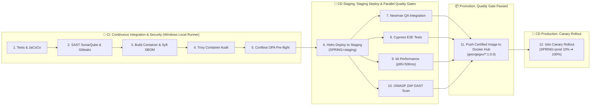

# 🛡️ Enterprise DevSecOps Platform & 12-Stage CI/CD Automation

> Comprehensive specification of Policy-as-Code (OPA / Gatekeeper), Vulnerability Scanning (Trivy, Gitleaks, Semgrep), Dynamic DAST (OWASP ZAP), and Multi-CI/CD Pipelines (GitHub Actions, Azure DevOps, Bitbucket, ArgoCD GitOps).

---

## 🛡️ 100% Local Enterprise DevSecOps Platform (12-Stage CI/CD & Minikube)

The architecture includes a production-parity **DevSecOps ecosystem** designed to run **100% locally** on workstation hardware (8+ CPU cores, 16+ GB RAM, 100+ GB SSD) with **zero cloud costs** using a Windows GitHub Actions Self-Hosted Runner (`winsvc`), **Minikube** (6 CPUs / 12 GB RAM), and **Terraform**:



### 🖥️ Local Platform Endpoints & Access Matrix

All services and dashboards are automated via background port-forwarding and available on Windows `localhost`:

| Service / Tool | URL | Credentials / Auth | Role in Ecosystem |
| :--- | :--- | :--- | :--- |
| 🌐 **Frontend React 19 SPA** | [`http://localhost:4200`](http://localhost:4200) | Public Storefront | Storefront UI (React 19, Tailwind v4, Tactical DDD) |
| 🚀 **Apollo Router (Sandbox & Supergraph)** | [`http://localhost:8080`](http://localhost:8080) | Bearer JWT / Public | Interactive GraphQL Schema Explorer & Sandbox IDE |
| 📖 **Products Swagger UI** | [`http://localhost:8004/swagger-ui.html`](http://localhost:8004/swagger-ui.html) | Public Docs | OpenAPI v3 interactive documentation for Products REST APIs |
| 📖 **Orders Swagger UI** | [`http://localhost:8003/swagger-ui.html`](http://localhost:8003/swagger-ui.html) | Public Docs | OpenAPI v3 interactive documentation for Orders REST APIs |
| 📖 **Inventory Swagger UI** | [`http://localhost:8001/swagger-ui.html`](http://localhost:8001/swagger-ui.html) | Public Docs | OpenAPI v3 interactive documentation for Inventory REST APIs |
| 📖 **Notification Swagger UI** | [`http://localhost:8002/swagger-ui.html`](http://localhost:8002/swagger-ui.html) | Public Docs | OpenAPI v3 interactive documentation for Notification REST APIs |
| 🔑 **Keycloak IAM** | [`http://localhost:8181`](http://localhost:8181) | `admin` / `admin` | Identity Provider, OAuth2/OIDC, PKCE Realm |
| 🔒 **HashiCorp Vault UI** | [`http://localhost:8200`](http://localhost:8200) | Token: `root` | Enterprise Secrets Engine & Dynamic Credentials |
| 🧭 **Kiali Mesh Topology** | [`http://localhost:20001/kiali`](http://localhost:20001/kiali) | Anonymous (Local) | Real-time Istio Service Mesh Visualizer & mTLS |
| 🐙 **ArgoCD GitOps** | [`https://localhost:8088`](https://localhost:8088) | `admin` / `admin` | GitOps Controller & Declarative Deployments |
| 📊 **Grafana Observability** | [`http://localhost:3000`](http://localhost:3000) | `admin` / `admin` | Curated SRE & Business Intelligence Dashboards (Prometheus + Loki) |
| 📈 **Prometheus Targets** | [`http://localhost:9090/targets`](http://localhost:9090/targets) | Public Scraping | In-cluster Metric Scraping Health Verification |

### ⚙️ Platform Operational Lifecycle Commands (Unified Master CLI & 4 Isolated Versions)

The platform provides a master entrypoint [`platform.ps1`](../platform.ps1) alongside **4 isolated platform orchestrators** covering **3 environments (`dev`, `staging`, `prod`)**.

> The naming model is intentionally split: Git branches are `develop`, `staging`, `master`, while cluster namespaces are `dev`, `staging`, `prod`. The deployment pipeline maps branch to namespace, but the scripts keep them distinct to avoid operational ambiguity.
>
> 📖 **Full Git Collaboration Guide:** For complete branching policies, PR lifecycle, force-push conflict resolution, and disaster recovery playbooks, see [GIT_WORKFLOW_AND_COLLABORATION.md](./GIT_WORKFLOW_AND_COLLABORATION.md).

The validation path is also unified: `verify-platform.ps1` handles both local Minikube checks and cloud provider validation through a shared Istio mesh audit, instead of maintaining redundant cloud-specific wrappers.

| Platform Script | Target Environment | Git Branch | Cloud & Container Runtime | CI/CD Engine |
| :--- | :--- | :--- | :--- | :--- |
| [`platform-minikube.ps1`](../platform-minikube.ps1) | `dev` (Local) | `develop` | Minikube (containerd, 6 CPUs, 12 GB RAM) | GitHub Actions CI + ArgoCD CD |
| [`platform-aws.ps1`](../platform-aws.ps1) | `dev`, `staging`, `prod` | `develop`, `staging`, `master` | AWS EKS, ALB, RDS, ElastiCache, MSK | GitHub Actions CI + ArgoCD CD + Rollback |
| [`platform-azure.ps1`](../platform-azure.ps1) | `dev`, `staging`, `prod` | `develop`, `staging`, `master` | Azure AKS, App Gateway, Flexible PostgreSQL | Azure DevOps Unified 12+ Stages + Rollback |
| [`platform-gcp.ps1`](../platform-gcp.ps1) | `dev`, `staging`, `prod` | `develop`, `staging`, `master` | GCP GKE Autopilot, Cloud Armor, Cloud SQL | Bitbucket Pipelines Unified 12+ Stages + Rollback |

#### 1. Quick Start with Master CLI (`platform.ps1`)

```powershell
# 1. Audit and install Windows CLI tools via Winget (excluding 9 ignored tools)
.\platform.ps1 tools
.\platform.ps1 tools -Install

# 2. Bootstrap full Minikube ecosystem (Istio, Vault, Keycloak, db-keycloak, Apps, Tunnels)
.\platform.ps1 up
.\platform.ps1 up -Build        # Compile Java & React Dockerfiles from source & sideload to Minikube
.\platform.ps1 build            # Standalone image build & rolling update in Minikube
.\platform.ps1 up -WithIstio     # With Istio mTLS and Kiali
.\platform.ps1 up -WithoutIstio  # Pure Kubernetes native mode
.\platform.ps1 up -DeployCanary  # With products-service v2 canary (10% traffic)

# 3. Multi-Cloud Terraform Planning & Deployment
.\platform.ps1 plan -Platform aws -Environment staging
.\platform.ps1 apply -Platform aws -Environment staging -AutoApprove

.\platform.ps1 plan -Platform azure -Environment prod
.\platform.ps1 apply -Platform azure -Environment prod -AutoApprove

.\platform.ps1 plan -Platform gcp -Environment staging
.\platform.ps1 apply -Platform gcp -Environment staging -AutoApprove

# 4. Deep Diagnostic Health Check & Smoke Tests
.\platform.ps1 doctor
.\platform.ps1 smoke

# 5. Air-Gapped FinOps Cost Calculator
.\platform.ps1 cost -Environment minikube
.\platform.ps1 cost -Environment staging
.\platform.ps1 cost -Environment prod

# 6. Interactive Endpoints Table & Tunnels
.\platform.ps1 urls
.\platform.ps1 tunnels

# 7. Gracefully Pause Minikube (preserves state) or Complete Purge
.\platform.ps1 down
.\platform.ps1 down -Destroy
```

#### 2. Direct Execution of Platform-Specific Scripts

```powershell
# Minikube Direct
.\platform-minikube.ps1 up
.\platform-minikube.ps1 up -Build      # Build Dockerfiles & sideload to Minikube
.\platform-minikube.ps1 build          # Rebuild and rollout restart pods in dev
.\platform-minikube.ps1 security-scan  # Runs Gitleaks, TFLint, Trivy
.\platform-minikube.ps1 graph          # Generates visual Graphviz PNG in docs/terraform-graph.png
.\platform-minikube.ps1 down

# AWS Cloud Direct
.\platform-aws.ps1 plan staging
.\platform-aws.ps1 apply staging -AutoApprove
.\platform-aws.ps1 rollback staging    # Releases state locks and rolls back ArgoCD/EKS

# Azure Cloud Direct
.\platform-azure.ps1 plan prod
.\platform-azure.ps1 apply prod -AutoApprove
.\platform-azure.ps1 rollback prod     # Unlocks Azure Blob leases and rolls back AKS

# GCP Cloud Direct
.\platform-gcp.ps1 plan staging
.\platform-gcp.ps1 apply staging -AutoApprove
.\platform-gcp.ps1 rollback staging    # Unlocks GCS state locks and rolls back GKE
```

### 🛡️ DevSecOps & Governance Hub

This section centralizes all security, compliance, quality, and dynamic testing assets and policies for the `microservices-architecture` ecosystem, alongside the complete 100% local deployment and operations runbook on Minikube.

#### 📂 Directory Structure

```
devsecops/
├── dast/                      # 🕵️ Dynamic Application Security Testing (DAST)
│   └── zap/
│       ├── rules.tsv          # OWASP ZAP threshold calibration & alert overrides
│       └── zap-baseline.conf  # Execution parameters against Istio Ingress Gateway
│
├── policies/                  # 📜 Policy-as-Code (OPA / Rego)
│   ├── conftest/
│   │   └── kubernetes.rego    # Shift-Left: Pre-deployment Helm manifests audit (OPA v1)
│   └── gatekeeper/            # Admission Controller: Runtime enforcement on Minikube
│       ├── templates/         # ConstraintTemplates (Custom Rego CRDs)
│       └── constraints/       # Constraints applied to target namespaces (staging / prod)
│
├── sast/                      # 🔍 Static Application Security Testing (SAST & Secrets)
│   ├── gitleaks/
│   │   └── .gitleaks.toml     # Hardcoded secret, API key, and token detection
│   └── semgrep/               # Custom source code security rules
│
├── compliance/                # 🧰 Software Supply Chain Security
│   ├── trivy/
│   │   ├── trivy.yaml         # Container vulnerability scanner configuration
│   │   └── .trivyignore       # Formal risk acceptance and CVE exception registry
│   └── sbom/                  # Metadata schemas for CycloneDX / SPDX SBOMs
│
└── testing/                   # ⚡ Dynamic & Performance Testing
    ├── k6/
    │   └── load-test.js       # Stress testing & p95 latency SLO verification via Istio Gateway
    └── newman/
        └── microservices.postman_collection.json # API integration test suite
```

#### ⚙️ Security Operating Modes: Audit vs. Enforce

| Tool | Current Mode (Audit / Soft-Gate) | Maturity Mode (Enforce / Hard-Gate) |
| :--- | :--- | :--- |
| **Trivy** | `--exit-code 0` (Reports vulnerabilities without breaking initial builds). | `--exit-code 1` (Blocks on any unpatched `CRITICAL` CVE not listed in `.trivyignore`). |
| **Gitleaks** | Blocking (`exit 1` on real credentials detection). | Blocking. |
| **Conftest (OPA)** | Blocking on privileged containers or missing memory/CPU limits. | Extended blocking (enforces mandatory labels, network policies). |
| **OWASP ZAP** | Fails on rules marked `FAIL` in `rules.tsv`; advisory on `WARN`. | Strict blocking on security headers and CSP violations. |

#### 🚀 Deployment & Operations Guide: 100% Local Enterprise DevSecOps on Minikube

Deploy and operate the complete enterprise **DevSecOps** ecosystem locally on your workstation (Intel/AMD, 16+ GB RAM, 100+ GB SSD) using **Minikube**, **Terraform**, **Docker Hub Registry (`georgegxx/*`)**, **Gatekeeper (OPA)**, **ArgoCD**, **Istio Service Mesh**, **Prometheus/Grafana/Loki/Alloy**, and **OWASP ZAP** with a **GitHub Actions Self-Hosted Runner**.

##### 📋 1. Resource Allocation & Minikube Startup

Open PowerShell as Administrator and initialize Minikube with the allocated resource budget (6 CPUs, 12 GB RAM, 40 GB disk):

```powershell
minikube start `
  --cpus=6 `
  --memory=12288 `
  --disk-size=40g `
  --driver=docker `
  --addons=ingress,metrics-server,dashboard
```

Verify that the cluster is healthy:
```powershell
kubectl get nodes
```

##### 🐳 2. Docker Hub Authentication & Secrets Configuration

Container images are standardized under the Docker Hub namespace `georgegxx/<service>:1.0.0`.

1. To enable automated image publishing upon passing all CI and Staging Quality Gates, ensure your GitHub repository has the following secrets configured (**Settings** -> **Secrets and variables** -> **Actions**):
   * `DOCKERHUB_USERNAME`: `georgegxx`
   * `DOCKERHUB_TOKEN`: `<your-dockerhub-access-token>`

2. If testing or pushing manually from your local terminal:
   ```powershell
   docker login -u georgegxx
   ```

##### 🏗️ 3. Platform Deployment with Terraform

Navigate to the Minikube Terraform environment:

```powershell
cd terraform\environments\local-minikube
terraform init
terraform plan
terraform apply -auto-approve
```

Terraform and bootstrap automation provision:
* **Gatekeeper (OPA)** in namespace `gatekeeper-system`
* **ArgoCD** in namespace `argocd` (Web UI at `https://localhost:8088`, credentials: `admin` / `admin`)
* **Prometheus & Grafana** in namespace `observability` (Grafana at `http://localhost:3000`, credentials: `admin` / `admin`)
* **Loki & Alloy** log aggregation daemonset in namespace `observability`
* **Vault** in namespace `vault` (Web UI at `http://localhost:8200`, dev token: `root`)
* **Keycloak IAM** in namespace `auth` (Web UI at `http://localhost:8181`, credentials: `admin` / `admin`)
* Namespaces `staging` and `prod` with Istio sidecar injection enabled (`istio-injection=enabled`).

##### 🛡️ 4. Apply Gatekeeper Templates & Constraints

Apply the centralized OPA admission policies located in `devsecops/policies/gatekeeper/`:

```powershell
# 1. Apply Rego constraint templates
kubectl apply -f devsecops/policies/gatekeeper/templates/

# 2. Apply runtime constraints to staging and prod
kubectl apply -f devsecops/policies/gatekeeper/constraints/
```

Gatekeeper validates:
- **Resource Limits**: CPU & memory requests/limits on all containers.
- **Trusted Registries**: Only images from `georgegxx/`, `docker.io/georgegxx/`, `gcr.io/distroless`, or `localhost` are admitted.

##### 🏃 5. Launch the GitHub Actions Self-Hosted Runner

In your GitHub repository:
1. Navigate to **Settings** -> **Actions** -> **Runners** -> **New self-hosted runner** (select **Windows**).
2. Download and extract the runner package to a local folder (e.g. `C:\actions-runner`).
3. Configure the runner with your token:
   ```powershell
   .\config.cmd --url https://github.com/georgegxx/microservices-architecture --token <YOUR_TOKEN>
   ```
4. Start the runner:
   ```powershell
   .\run.cmd # You can optionally configure it as a service.
   ```
5. Test Runner on Windows:
   ```powershell
   Get-Service -Name "actions.runner.*"   
   ```

The runner leverages all available hardware threads of the Intel/AMD processor to compile and test Maven/Node modules in parallel (`-T 1C`).

##### 🔄 6. The 12-Stage Enterprise Pipeline Execution

Every push to `develop`, `staging`, or `master` automatically triggers the 12-stage enterprise pipeline:

1. **🧪 Unit Tests**: Maven runs multi-threaded (`-T 1C`) and generates Surefire and JaCoCo coverage reports.
2. **🔍 SAST & Secret Scanning**: Gitleaks and Semgrep analyze code using `devsecops/sast/`.
3. **⚙️ Single Build & SBOM**: Docker Buildx builds the container image once and Trivy outputs a CycloneDX SBOM to `devsecops/compliance/sbom/`.
4. **🧰 Container Scan**: Trivy evaluates the image in **Audit Mode** (`exit-code: 0`, `--ignore-unfixed`) using `devsecops/compliance/trivy/`.
5. **🧾 Pre-flight Compliance**: Conftest audits rendered Helm manifests against `devsecops/policies/conftest/kubernetes.rego`.
6. **🚀 Deploy Staging**: Helm/ArgoCD synchronizes the deployment to the `staging` namespace with Istio sidecars injected.
7. **🔗 Integration Tests**: Newman executes the Postman test collection in `devsecops/testing/newman/` against the Istio Ingress Gateway.
8. **🧭 E2E Tests**: Cypress executes UI functional tests on the storefront.
9. **⚡ Performance Tests**: k6 runs `devsecops/testing/k6/load-test.js` validating p95 latency (< 500ms) and error rate (< 1%).
10. **🕵️ DAST Scan**: OWASP ZAP attacks the Istio Ingress Gateway using rules in `devsecops/dast/zap/rules.tsv`.
11. **📦 Push to Docker Hub**: Quality gate passed! Authenticates and publishes certified image `georgegxx/<service>:1.0.0` to Docker Hub.
12. **🚢 Canary Deploy (Prod)**: Progressive deployment to production using a 90/10 traffic split in the Istio VirtualService with Prometheus telemetry validation.

##### 🎯 7. Transitioning to Maturity Mode (Strict Enforce / Hard-Gate)

When you are ready to enforce strict blocking in production:

1. **Trivy**: Update `.github/workflows/_service-ci-cd-template.yml` or `devsecops/compliance/trivy/trivy.yaml`:
   ```yaml
   exit-code: '1' # Fails builds on unpatched critical vulnerabilities
   ```
2. **ZAP DAST**: Update Step 10 in `_service-ci-cd-template.yml`:
   ```yaml
   fail_action: true # Fails the job if ZAP encounters rules flagged with FAIL
   ```
3. **Risk Exceptions**: Document any accepted CVE in `devsecops/compliance/trivy/.trivyignore`.

---


---

## 🤖 Multi-CI/CD & GitOps Automation

### 1. GitHub Actions ➔ AWS Cloud
Located in `.github/workflows/`:
- **12-Stage Master Template ([`_service-ci-cd-template.yml`](./.github/workflows/_service-ci-cd-template.yml))**:
  1. `Unit Tests` (JUnit 5 / JaCoCo) $\rightarrow$ 2. `SAST & Secrets` (SonarCloud, Semgrep, Gitleaks, Checkov) $\rightarrow$ 3. `Build & SBOM` (BuildKit, CycloneDX) $\rightarrow$ 4. `Container Scan` (Trivy) $\rightarrow$ 5. `Push to ECR` $\rightarrow$ 6. `Deploy to EKS Staging` $\rightarrow$ 7. `Integration Tests` (Postman / Newman) $\rightarrow$ 8. `E2E Tests` (Cypress) $\rightarrow$ 9. `Performance Tests` (k6) $\rightarrow$ 10. `DAST` (OWASP ZAP) $\rightarrow$ 11. `Compliance Gate` $\rightarrow$ 12. `Deploy to EKS Production` (Canary Rollout).
- **Terraform Pipeline ([`terraform-aws.yml`](./.github/workflows/terraform-aws.yml))**: Automated IaC plan, apply, and drift detection.

### 2. Azure DevOps Pipelines ➔ Azure Cloud
Located in `azure-devops/`:
- **Master Template ([`azure-pipelines.yml`](./azure-devops/templates/azure-pipelines.yml))**: Implements the hardened 12-stage DevSecOps cycle with multi-environment automated rollbacks, adapted for Spring Boot Java 21 and React 19, targeting Azure Container Registry (ACR) and Azure AKS.
- **Per-Service Pipelines**: [`apollo-router.yml`](./azure-devops/pipelines/apollo-router.yml), [`inventory-service.yml`](./azure-devops/pipelines/inventory-service.yml), [`orders-service.yml`](./azure-devops/pipelines/orders-service.yml), [`products-service.yml`](./azure-devops/pipelines/products-service.yml), [`notification-service.yml`](./azure-devops/pipelines/notification-service.yml), [`frontend.yml`](./azure-devops/pipelines/frontend.yml).
- **Terraform Pipeline ([`azure-pipelines-terraform.yml`](./azure-devops/azure-pipelines-terraform.yml))**: Deploys Azure AKS / VNet / PostgreSQL Flexible infrastructure.

### 3. Bitbucket Pipelines (CI) + ArgoCD (GitOps CD) ➔ GCP
- **Bitbucket Pipelines ([`bitbucket-pipelines.yml`](./bitbucket-pipelines.yml))**:
  - Builds with Maven 3.9 / Temurin 21, static scans with Checkov and Gitleaks, OCI image build with SBOM, vulnerability audit with Trivy, and authenticated push to **Google Artifact Registry (GAR)**.
  - Runs Terraform GCP in the `terraform-gcp-apply` pipeline.
- **ArgoCD GitOps ([`argocd/`](./argocd/))**:
  - Continuous, declarative sync to **Google Kubernetes Engine (GKE)** across all 3 environments:
    - [`appproject.yaml`](./argocd/appproject.yaml)
    - [`application-dev.yaml`](./argocd/application-dev.yaml)
    - [`application-staging.yaml`](./argocd/application-staging.yaml)
    - [`application-prod.yaml`](./argocd/application-prod.yaml)

---

## 🔄 Multi-Cloud CI/CD & Automated Rollback Architecture

The project features decoupled and single-unified CI/CD pipelines across major enterprise platforms with automated emergency rollback engines:

### 1. GitHub Actions (CI) + ArgoCD (CD) - AWS & Minikube
- **GitHub Actions (`.github/workflows/`)**: Strictly governs **Continuous Integration (CI)** (Stages 1-5: Unit tests, SAST/Gitleaks, BuildKit image build, CycloneDX SBOM, Trivy vulnerability audit, Conftest OPA policy audit), image publishing to AWS ECR, and triggers declarative GitOps synchronization. Includes automated rollback (`rollback-argocd`) on sync/cluster health failure.
- **ArgoCD (`argocd/`)**: Strictly governs **Continuous Deployment (CD)** declaratively:
  - **`develop` branch**: Deploys via `application-dev.yaml` to namespace **`dev`** on Minikube with `values-minikube.yaml`.
  - **`staging` branch**: Deploys via `application-staging.yaml` to namespace **`staging`** on AWS EKS with medium-performance resources (`values-eks-staging.yaml`).
  - **`master` branch**: Deploys via `application-prod.yaml` to namespace **`production`** on AWS EKS with high-performance resources (`values-eks-prod.yaml`: 3-10 replicas with HPA, PDB, NLB, and Istio Canary 90/10).
  - **Automated Rollback**: Configured with automated prune, selfHeal, exponential retry backoff, and instant revert via `argocd app rollback`.
- **AWS Terraform Pipeline (`.github/workflows/terraform-aws.yml`)**: Provisions AWS infrastructure across `staging` and `prod` with automated state lock release (`terraform force-unlock`) on failure.

### 2. Azure DevOps - Single Unified Pipeline (Azure Cloud)
- **Unified Pipeline (`azure-devops/templates/azure-pipelines.yml`)**: Executes **all 12+ stages** in a single end-to-end execution:
  - Stages 1-5: Unit Tests (Maven/React, JaCoCo), SAST (Semgrep, Gitleaks, Checkov, SonarQube), BuildKit Container Build & CycloneDX SBOM, Trivy Scan, Conftest OPA.
  - **Dev Tier (Stage 5.5)**: Deploys to AKS namespace **`dev`** on `develop` branch with **`RollbackDev`** on failure.
  - **Staging Tier (Stage 6)**: Deploys to AKS namespace **`staging`** with full QA validation (Newman API tests, Cypress E2E, k6 latency/stress, OWASP ZAP DAST) and **`RollbackStaging`** on any test failure.
  - **Promotion**: Certified image promotion to Azure Container Registry (ACR).
  - **Production Tier (Stage 12)**: Deploys to AKS namespace **`production`** with Istio Canary progressive traffic shifting (90/10) and **`RollbackProduction`** emergency rollback on canary health check failure.
- **Azure Terraform Pipeline (`azure-devops/azure-pipelines-terraform.yml`)**: Triggers on `develop`, `staging`, `master`, dynamically manages workspaces **`dev`**, **`staging`**, **`prod`**, provisions AKS namespaces, and automatically unlocks stranded Azure Blob Storage state leases on error.

### 3. Bitbucket Pipelines - Single Unified Pipeline (Google Cloud Platform)
- **Unified Pipeline (`bitbucket-pipelines.yml`)**: Executes **all 12+ stages** in a single pipeline across Google Cloud:
  - **`develop` branch**: CI (Stages 1-5) $\rightarrow$ GCP Terraform Dev (workspace `dev`) $\rightarrow$ GKE Dev deploy (namespace `dev`) $\rightarrow$ **`rollback-gke-dev`** on error.
  - **`staging` branch**: CI (Stages 1-5) $\rightarrow$ GCP Terraform Staging (workspace `staging`, medium performance) $\rightarrow$ GKE Staging deploy (namespace `staging`) $\rightarrow$ QA Validation (Newman, Cypress, k6, ZAP DAST) $\rightarrow$ GAR Push $\rightarrow$ **`rollback-gke-staging`** on test failure.
  - **`master` branch**: CI (Stages 1-5) $\rightarrow$ GCP Terraform Production (workspace `prod`, high performance HA) $\rightarrow$ Pre-flight QA $\rightarrow$ GAR Push $\rightarrow$ GKE Production Canary with Istio traffic shifting (90/10) $\rightarrow$ **`rollback-gke-production`** on rollout health failure.

### 4. Automated Rollback & Incident Recovery Summary
| Disaster Scenario | Recovery Mechanism | Recovery Time Objective (RTO) |
| :--- | :--- | :--- |
| **Terraform State Lock** | `terraform force-unlock` in backend cleanup step | Immediate (< 10 seconds) |
| **ArgoCD Sync/Health Failure** | `argocd app rollback` to previous Git SHA | < 1 minute |
| **Staging Integration/DAST Failure** | Automated Helm rollback (`helm rollback microservices`) | < 30 seconds |
| **Production Canary Degradation** | Emergency Istio route reset (100% v1) + Helm rollback | < 15 seconds |

---

