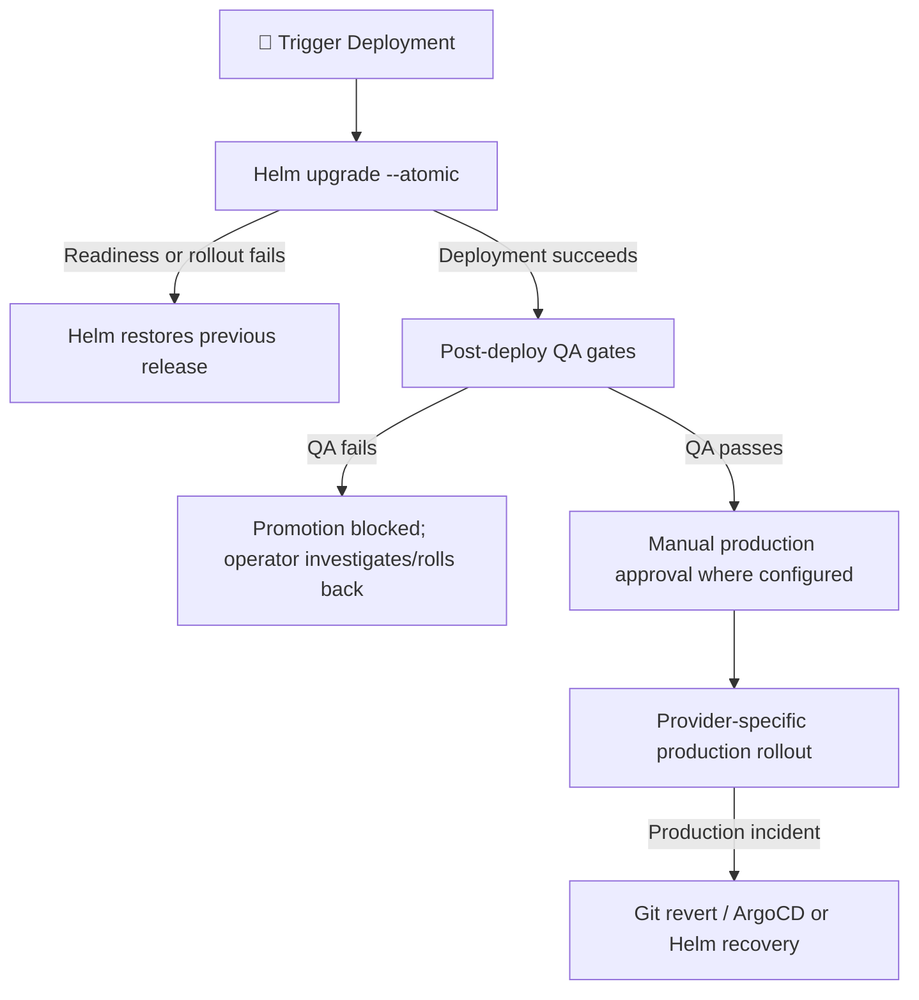

# ☁️ Multi-Cloud Terraform Infrastructure & Recovery Guide

> Architecture specification for AWS (EKS / RDS / VPC), Azure (AKS / PostgreSQL / KeyVault), and GCP (GKE / CloudSQL / Memorystore), including environment-isolated Terraform state and application recovery procedures.

---

## 🔄 Automated & Manual Rollback Operations Guide (Multi-Cloud & Multi-CI/CD)

Recovery behavior depends on the deployment path. Helm atomic upgrades restore the prior release when deployment readiness fails; later QA failures block promotion and require an operator to redeploy/rollback. ArgoCD recovery is performed by reverting Git or using its rollback controls. Do not assume every CI provider executes the same rollback hooks or that a production canary is enabled:



### 1. 🛡️ Deployment and recovery behavior

| Tier | Layer | Trigger Condition | Automated Action |
| :--- | :--- | :--- | :--- |
| **Helm deployment** | Readiness/rollout failure during upgrade | `--atomic` waits and rolls back the failed release. Bitbucket also attempts `helm rollback` for deployment-step errors when a prior release exists. |
| **Post-deploy QA** | Newman, storefront smoke, k6, or ZAP gate fails after deploy | Pipeline blocks further promotion. These current Bitbucket gates do not run an automatic rollback after deployment; inspect the release and use the manual Helm runbook below if rollback is warranted. |
| **Production** | Production release fails or causes an incident | Use the provider's configured rollout and recovery process. Bitbucket production is a manually approved rolling Helm release, not an Istio canary. |
| **GitOps** | Declarative configuration drift or release issue | Revert the Git commit and allow ArgoCD to reconcile, or use the documented emergency ArgoCD rollback procedure. |

---

### 2. 🕹️ How to Execute Manual Rollbacks (CLI & UI Runbooks)

#### A. Direct Kubernetes / Helm CLI (Universal):
To immediately inspect revision history and roll back in any cluster (Minikube, EKS, AKS, GKE):
```bash
# 1. View deployment revision history:
helm history microservices -n staging
helm history microservices -n production

# 2. Roll back to the immediately preceding revision:
helm rollback microservices -n staging
helm rollback microservices -n production

# 3. Roll back to a specific revision (e.g. revision 3):
helm rollback microservices 3 -n production --wait --timeout 5m
```

#### B. GitOps Rollback in ArgoCD:
* **The GitOps Way (Recommended):** Revert the commit in Git so that the Git history remains the single source of truth:
  ```bash
  git revert HEAD
  git push origin main
  ```
  ArgoCD will detect the revert and automatically reconcile (`selfHeal: true`) the cluster to the restored state.
* **Emergency UI / CLI Rollback:**
  * In the **ArgoCD Web Console**: Navigate to the application (`microservices-prod`) ➔ Click **History and Rollback** ➔ Select the desired revision ➔ Click **Rollback** (this temporarily pauses auto-sync until the incident is investigated).
  * Via ArgoCD CLI:
    ```bash
    argocd app rollback microservices-prod <revision-id>
    ```

#### C. GitHub Actions:
* If a release fails during staging verification, the `rollback-staging` job executes automatically.
* To redeploy an earlier release manually, open the **Actions** tab ➔ Select the service workflow ➔ Click **Run workflow** ➔ Select the target branch or tag.

#### D. Azure DevOps:
* The `RollbackStaging` stage automatically triggers whenever `IntegrationTests`, `E2ETests`, `PerformanceTests`, or `DASTScan` fail.
* To redeploy a previous build: Open **Pipelines** ➔ Select a previous successful build run ➔ Click **Run new** or **Redeploy stage**.

#### E. Bitbucket Pipelines:
* A failed Helm upgrade uses `--atomic`; deployment-step errors also attempt rollback when an earlier release exists.
* Later API, storefront, performance, or DAST gate failures stop the pipeline but do not automatically revert the already deployed staging revision. Inspect the failure, then use `helm history microservices -n <namespace>` and `helm rollback microservices <revision> -n <namespace> --wait` when appropriate.
* Production promotion/deployment is an explicit manual stage and uses the immutable commit SHA; it is a rolling Helm release, not an Istio canary.

---

## ☁️ Terraform Multi-Cloud Infrastructure (AWS, Azure, GCP)

### Cluster and workspace topology

The target topology is **12 Kubernetes clusters**: four for each provider. Each
provider root keeps the same three Terraform workspaces (`dev`, `staging`,
`prod`); the `prod` workspace provisions two independent clusters/data planes.
This avoids treating the two production clusters as separate environments or
duplicating shared databases, networking, and edge resources.

| Provider | `dev` workspace | `staging` workspace | `prod` workspace | Total |
| --- | --- | --- | --- | ---: |
| AWS | `msa-aws-dev` | `msa-aws-staging` | `msa-aws-prod`, `msa-aws-dp2-prod` | 4 |
| Azure | `msa-azure-dev-aks` | `msa-azure-staging-aks` | `msa-azure-prod-aks`, `msa-azure-dp2-prod-aks` | 4 |
| GCP | `msa-gcp-dev-cluster` | `msa-gcp-staging-cluster` | `msa-gcp-prod-cluster`, `msa-gcp-dp2-prod-cluster` | 4 |

The second production cluster has independent Kubernetes control plane and
worker capacity. AWS shares the environment VPC/subnets; Azure receives a
dedicated AKS subnet; GKE receives dedicated secondary Pod/Service ranges and a
separate control-plane CIDR. Supporting databases and shared edge services
remain provisioned once per environment workspace.

Create/select the three workspaces independently in each provider root before
planning. For example:

```powershell
foreach ($provider in @('aws', 'azure', 'gcp')) {
  Push-Location "terraform/environments/$provider"
  terraform workspace new dev 2>$null; terraform workspace select dev
  terraform workspace new staging 2>$null; terraform workspace select staging
  terraform workspace new prod 2>$null; terraform workspace select prod
  Pop-Location
}
```

Each provider root uses the same workspace names: `dev`, `staging`, and `prod`.
AWS uses one S3 bucket and DynamoDB lock table across those workspaces; the
GitHub workflow and `platform.ps1` must use the same bucket/table pair. Azure
uses one Blob container with lease locking, and GCP uses one GCS bucket with
native state locking. Before running Azure/GCP cloud commands, provision their
state stores and copy/fill the ignored partial-backend files:

```powershell
Copy-Item terraform/backend-config/azure.hcl.example terraform/backend-config/azure.hcl
Copy-Item terraform/backend-config/gcp.hcl.example terraform/backend-config/gcp.hcl
```

The example files contain placeholders and are not ready for use until you
replace them with real storage identifiers. Do not commit the filled files.
The new backend declarations do not migrate existing local state. If you have
state already in use, back it up and plan a deliberate `terraform init
-migrate-state` for each provider/workspace before any cloud plan or apply.
Terraform initialization and plans were not run against cloud credentials as
part of this code change. Review all production plans and costs before apply.

### 1. AWS Provider (Amazon EKS / RDS / VPC)
Located in `terraform/environments/aws/` and `terraform/modules/aws/`:
```powershell
cd terraform/environments/aws
terraform init
terraform workspace select staging || terraform workspace new staging
terraform plan -var-file=staging/terraform.tfvars
terraform apply -var-file=staging/terraform.tfvars
```

### 2. Azure Provider (Azure AKS / ACR / PostgreSQL)
Located in `terraform/environments/azure/` and `terraform/modules/azure/`:
```powershell
cd terraform/environments/azure
terraform init -backend-config=../../backend-config/azure.hcl
terraform workspace select staging || terraform workspace new staging
terraform plan -var-file=staging/terraform.tfvars
terraform apply -var-file=staging/terraform.tfvars
```

### 3. GCP Provider (Google GKE / Artifact Registry / Cloud SQL)
Located in `terraform/environments/gcp/` and `terraform/modules/gcp/`:
```powershell
cd terraform/environments/gcp
terraform init -backend-config=../../backend-config/gcp.hcl
terraform workspace select staging || terraform workspace new staging
terraform plan -var-file=staging/terraform.tfvars
terraform apply -var-file=staging/terraform.tfvars
```

---

## ☁️ Multi-Cloud Terraform 12-Module Matrix (AWS • Azure • GCP)

The infrastructure layer in `terraform/` provides **100% architectural parity** across Amazon Web Services, Microsoft Azure, and Google Cloud Platform for environments **`dev`**, **`staging`**, and **`prod`**:

```text
terraform/
├── environments/
│   ├── aws/       (locals.tf, main.tf, outputs.tf, variables.tf)
│   ├── azure/     (locals.tf, main.tf, outputs.tf, variables.tf)
│   └── gcp/       (locals.tf, main.tf, outputs.tf, variables.tf)
└── modules/
    ├── aws/       (cloudfront, cloudwatch, ecr, eks, elasticache, iam-irsa, kms, msk, nlb, oidc_github, rds, route53_acm, s3, s3-backend, vpc)
    ├── azure/     (acr, aks, dns_zone, eventhubs, frontdoor, keyvault, monitor, postgresql, redis, storage_account, vnet, workload_identity)
    └── gcp/       (cloud_armor_lb, cloud_cdn, cloud_dns, cloud_monitoring, cloudsql, gar, gcs, gke, kms, managed_kafka, memorystore, vpc, workload_identity)
```

| Architectural Layer | AWS Native Module | Azure Native Module | GCP Native Module |
| :--- | :--- | :--- | :--- |
| **1. VPC / Networking** | `modules/aws/vpc` | `modules/azure/vnet` | `modules/gcp/vpc` |
| **2. Kubernetes (K8s)** | `modules/aws/eks` | `modules/azure/aks` | `modules/gcp/gke` |
| **3. Relational Database** | `modules/aws/rds` | `modules/azure/postgresql` | `modules/gcp/cloudsql` |
| **4. Redis Cache** | `modules/aws/elasticache` | `modules/azure/redis` | `modules/gcp/memorystore` |
| **5. Event Streaming (Kafka)** | `modules/aws/msk` | `modules/azure/eventhubs` | `modules/gcp/managed_kafka` |
| **6. Object Storage** | `modules/aws/s3` | `modules/azure/storage_account` | `modules/gcp/gcs` |
| **7. KMS / Key Management** | `modules/aws/kms` | `modules/azure/keyvault` | `modules/gcp/kms` |
| **8. Workload Identity (IRSA)** | `modules/aws/iam-irsa` | `modules/azure/workload_identity` | `modules/gcp/workload_identity` |
| **9. L4 Ingress / Gateway Target** | `modules/aws/nlb` | `modules/azure/vnet` (AKS SLB) | `modules/gcp/cloud_armor_lb` |
| **10. CDN & Edge Perimeter (L7)** | `modules/aws/cloudfront` | `modules/azure/frontdoor` | `modules/gcp/cloud_cdn` |
| **11. Observability & Alarms** | `modules/aws/cloudwatch` | `modules/azure/monitor` | `modules/gcp/cloud_monitoring` |
| **12. DNS & Certificates** | `modules/aws/route53_acm` | `modules/azure/dns_zone` | `modules/gcp/cloud_dns` |

---

## ☁️ Enterprise AWS Architecture Reference Suite (`devsecops/reference/aws-eks/`)

This directory provides enterprise-grade reference templates for **Amazon Web Services (AWS)**, adhering to Zero-Trust security, GitOps best practices, and immutable delivery standards.

> [!NOTE]
> **Inert Reference State:** These files use the `.example` extension and are intentionally located outside `.github/workflows/`. **GitHub Actions will NOT trigger them** and **ArgoCD will NOT reconcile them** automatically. They serve as production-ready blueprints for AWS cloud deployments.

### Included Reference Architecture Templates

* **[github-actions-eks-pipeline.yml.example](./devsecops/reference/aws-eks/github-actions-eks-pipeline.yml.example):**
  * **Dynamic S3 `.tfstate` Discovery:** Queries remote Terraform S3 state and DynamoDB lock to automatically extract EKS cluster name, ECR URLs, ALB ingress endpoints, frontend S3 bucket, and CloudFront distribution ID.
  * **Zero-Trust IAM OIDC:** Uses `aws-actions/configure-aws-credentials@v4` with web identity federation (zero static keys).
  * **Frontend SPA Deployment (React 19):** S3 sync with immutable caching headers (`max-age=31536000, immutable`), `no-cache` for `index.html`, and atomic CloudFront CDN invalidation (`/*`).
  * **Amazon ECR Hardening:** Immutable tagging with Trivy vulnerability scanning gates.
  * **Automated Rollbacks:** Dedicated `rollback-staging-eks` job and canary health check auto-rollback.
* **[argocd-application-eks.yaml.example](./devsecops/reference/aws-eks/argocd-application-eks.yaml.example):**
  * Declarative GitOps Application manifest for external AWS EKS clusters.
  * Configures **AWS Load Balancer Controller (ALB)** with ACM TLS certificate ARN, AWS WAFv2 WebACL ARN, and SSL redirection.
  * Injects **IRSA (IAM Roles for Service Accounts)** role ARN, **EBS CSI `gp3`** storage class, and **External Secrets Operator (ESO)** AWS Secrets Manager parameters.
* **[argocd-applicationset-eks.yaml.example](./devsecops/reference/aws-eks/argocd-applicationset-eks.yaml.example):**
  * Multi-environment matrix automating both `staging` (automated sync) and `prod` (manual gate with canary routing).

### 🛠️ AWS Blueprint Step-by-Step Activation Guide

#### 1. AWS IAM OIDC Configuration (Zero-Trust)
To allow GitHub Actions to deploy to AWS without static access keys:
1. Create an OpenID Connect (OIDC) identity provider in AWS IAM with provider URL `https://token.actions.githubusercontent.com` and audience `sts.amazonaws.com`.
2. Create an IAM Role (e.g., `GitHubActions-EKS-Deployer`) with an assume role policy trusting `repo:GeorgeGxx/microservices-architecture:*`.
3. Add the ARN as a repository secret: `AWS_ROLE_ARN`.

#### 2. Frontend S3 & CloudFront Setup
* Configure an S3 Bucket with **Origin Access Control (OAC)** enabled so that direct public HTTP access to the bucket is blocked.
* CloudFront serves all traffic over HTTPS with TLS 1.3.
* During CI/CD, hashed bundles (`*.js`, `*.css`) are uploaded with `max-age=31536000, immutable`, while `index.html` is uploaded with `no-cache` to ensure instant updates.

#### 3. Deploying to Amazon EKS via GitHub Actions
1. Copy `github-actions-eks-pipeline.yml.example` to `.github/workflows/aws-eks-pipeline.yml`.
2. Commit and push to Git. The workflow can now be triggered manually via the **Actions** tab or configured for automated push/merge triggers.

#### 4. Deploying to Amazon EKS via ArgoCD
1. Register your AWS EKS cluster in ArgoCD:
   ```bash
   aws eks update-kubeconfig --region us-east-1 --name msa-aws-prod-eks
   argocd cluster add <cluster-context> --name aws-eks-prod
   ```
2. Apply the application manifest:
   ```bash
   kubectl apply -f ./devsecops/reference/aws-eks/argocd-application-eks.yaml.example
   ```

---

