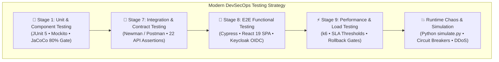

# 🧪 Automated Testing, Load Simulation & Chaos Engineering Guide

> Practical execution handbook for synthetic shopper traffic, GraphQL load probes, checkout validation, E2E smoke checks, and the Newman API test suite.

---

## 🎯 Testing Ecosystem Architecture & Technology Selection Rationale

The platform follows a modern **Cloud-Native DevSecOps Testing Pyramid**, distributing test responsibilities across purpose-built tools instead of relying on legacy monolithic suites:



### 1. Technology Purpose & Responsibility Matrix

| Technology | Layer / Stage | Purpose & Operational Scope | Execution Environment |
| :--- | :--- | :--- | :--- |
| **JUnit 5 + Mockito** | **Stage 1 (Unit)** | Validates individual Java classes, business domain validation, and Saga state transitions in complete isolation with mock dependencies. | Maven Runner (`mvn test`) |
| **JaCoCo** | **Stage 1 (Coverage)** | Enforces code quality gates requiring ≥80% line and branch coverage before code can be packaged into containers. | Maven Plugin (`jacoco:report`) |
| **Newman (Postman CLI)** | **Stage 7 (Integration)** | Executes 22 automated API contract checks validating JSON schemas, HTTP status codes, and Keycloak JWT validation across microservices without browser overhead. | Container / CLI (`newman run`) |
| **Cypress** | **Stage 8 (E2E)** | Executes real end-to-end user journeys inside the browser: login via Keycloak PKCE, product catalog browsing, cart operations, and order placement. | Headless Chrome/Electron in CI/CD |
| **Grafana k6** | **Stage 9 (Performance)** | Generates concurrent load to validate system throughput, latency percentiles ($p_{95} < 500\text{ms}$), and Resilience4j circuit breaker thresholds. | Lightweight Go binary in CI/CD |
| **`simulate.py` / `smoke.py`** | **Runtime / Caos** | Generates shopper traffic and GraphQL load, checks checkout business errors, and probes frontend, REST proxy routes, and GraphQL. It reports observed rate-limit responses without assuming a limiter implementation. | Platform CLI (`.\platform.ps1 smoke`) |

---

### 2. Architectural Decisions: Why Not Apache JMeter or Selenium?

#### A. Grafana k6 vs. Apache JMeter (Load & Performance Testing)

* **Lightweight Container Footprint:** JMeter requires a heavy Java Virtual Machine (JVM) and significant memory just to boot the test runner. **k6** is a single compiled Go binary (~30 MB) that executes with minimal CPU and memory overhead, ideal for ephemeral CI/CD runners.
* **Test-as-Code vs. Monolithic XML:** JMeter tests are saved in complex, fragile XML (`.jmx`) files that are difficult to review in Pull Requests and prone to merge conflicts. **k6** scripts are written in standard JavaScript/TypeScript, enabling modularization, clean Git versioning, and shared libraries.
* **Native LGTM Stack Integration:** k6 streams metrics natively to **Prometheus** and **Grafana**, plotting real-time virtual users, request duration percentiles ($p_{90}, p_{95}, p_{99}$), and HTTP error rates directly on the platform's SRE dashboards.
* **Automated CI/CD Quality Gates & Rollbacks:** k6 supports declarative SLA thresholds in code (e.g. `http_req_duration: ['p(95)<500']`). If performance degrades under load, k6 exits with a non-zero code that immediately trips **Automated Rollback (Stage 10.1 / Stage 12.1)**.

#### B. Cypress vs. Selenium WebDriver (E2E Functional Testing)

* **React 19 Concurrent Rendering Compatibility:** Selenium operates out-of-process, sending remote HTTP commands via WebDriver protocol (`chromedriver`), introducing network latency and frequent timing issues (*flaky tests* due to `StaleElementReferenceException`). **Cypress** runs directly inside the browser's execution loop, automatically synchronizing with React 19 fiber reconciler transitions, hooks, Context state, and DOM updates without arbitrary `Thread.sleep()`.
* **Keycloak OIDC & Network Interception:** Cypress provides native network interception (`cy.intercept()`), allowing seamless inspection of Keycloak Bearer tokens, token refresh simulation, and deterministic API stubbing without running external HTTP proxies (like BrowserMob).
* **Developer Experience & CI/CD Artifacts:** Cypress automatically captures DOM snapshots, video recordings, and screenshots upon test failure, enabling instant root-cause analysis in CI/CD artifact tabs without configuring third-party listeners.

---

## 🧪 Automated Testing, Load Simulation & Chaos Engineering

Enterprise testing scripts located in `scripts/testing/`:

### 1. 🛒 Legitimate E-Commerce Traffic Generator (`simulate.py --scenario traffic`)
Simulates shopping journeys through Apollo Router GraphQL, sends funnel events through the frontend REST proxy, and places authenticated orders.

```powershell
# Run a quick batch of 15 orders with 3 worker threads:
python scripts/testing/simulate.py --scenario traffic

# Place custom number of orders with specified concurrency:
python scripts/testing/simulate.py --scenario traffic --orders 50 --concurrency 5

# Run continuous background shopper simulation:
python scripts/testing/simulate.py --scenario traffic --continuous
```

### 2. ⚡ Resilience4j Circuit Breaker State Verification
Test the automatic failure detection and self-healing lifecycle:
$$\text{🟢 CLOSED (Green)} \xrightarrow[\text{Failures}]{\text{Downstream outage}} \text{🔴 OPEN (Red, 15s window)} \xrightarrow[\text{15s timer}]{\text{Auto-recovery probe}} \text{🟡 HALF\_OPEN (Yellow)} \xrightarrow[\text{2 trial orders OK}]{\text{Health restored}} \text{🟢 CLOSED (Green)}$$

> [!NOTE]
> **Why Red only lasts 15 seconds:** `waitDurationInOpenState` is set to 15 seconds with `automaticTransitionFromOpenToHalfOpenEnabled: true`. Once tripped into **🔴 RED (`OPEN`)**, it will automatically transition to **🟡 YELLOW (`HALF_OPEN`)** after 15s of silence to test for backend recovery.

#### Step-by-Step Test Procedure:

##### 🔴 Step A: Trip Circuit Breaker into OPEN (Red `#ef4444`)
Simulate downstream outage by stopping `inventory-service` and generating continuous traffic so the Red state remains continuously visible on Grafana without expiring:
```powershell
# 1. Stop inventory dependency:
# For Docker Compose:
docker compose stop inventory-service

# For Kubernetes / Minikube:
kubectl scale deployment inventory-service --replicas=0 -n dev

# 2. Run continuous traffic to keep the circuit in steady OPEN (Red #ef4444):
python scripts/testing/simulate.py --scenario traffic --continuous
```
* **Grafana Verification:** The panel **⚡ Resilience4j Circuit Breakers Health** will display **`OPEN / TRIPPED` (🔴 Red)**.

---

##### 🟡 Step B: Observe Transition into HALF_OPEN (Yellow `#f59e0b`)
Pause incoming traffic for 15 seconds to allow Resilience4j's self-healing timer to transition into trial probe mode:
```powershell
# 1. Stop the continuous simulator in your terminal with: Ctrl + C

# 2. Wait 16 seconds (waitDurationInOpenState = 15s):
Start-Sleep -Seconds 16
```
* **Grafana Verification:** The panel automatically switches to **`HALF_OPEN / TESTING` (🟡 Yellow)**, awaiting 2 trial calls to evaluate backend health.

---

##### 🟢 Step C: Restore Backend Health and Return to CLOSED (Green `#10b981`)
Restart `inventory-service` and send 2 trial orders through the gateway to prove backend recovery:
```powershell
# 1. Restore the inventory microservice:
# For Docker Compose:
docker compose start inventory-service

# For Kubernetes / Minikube:
kubectl scale deployment inventory-service --replicas=1 -n dev

# 2. Send 2 trial orders (sequential concurrency) to satisfy the 2-call probe:
python scripts/testing/simulate.py --scenario traffic --orders 2 --concurrency 1
```
* **Grafana Verification:** Both trial orders succeed with HTTP 201, and the panel instantly resets to **`CLOSED / HEALTHY` (🟢 Green)**.


### 3. 🧪 GraphQL Checkout Validation (`simulate.py --scenario chaos`)
Exercises valid, out-of-stock, and unknown SKU checkout mutations through Apollo Router and reports successful orders, business rejections, and upstream HTTP failures:
```powershell
python scripts/testing/simulate.py --scenario chaos
```

### 4. 🛡️ GraphQL Load and Rate-Limit Probe (`simulate.py --scenario ddos`)
Sends concurrent GraphQL requests to Apollo Router and reports observed HTTP responses. The default local port-forward reaches Router directly and bypasses Istio ingress policies. To include ingress controls, target the ingress URL:
```powershell
# Direct local Apollo Router load probe:
python scripts/testing/simulate.py --scenario ddos --duration 30

# Probe the public GraphQL route through Istio ingress:
python scripts/testing/simulate.py --scenario ddos --router-url https://graphql.example.com --duration 30

# Do not rotate synthetic X-Forwarded-For headers:
python scripts/testing/simulate.py --scenario ddos --single-source

# Send anonymous GraphQL requests:
python scripts/testing/simulate.py --scenario ddos --no-auth
```
### 5. 🔍 Automated Smoke Tests & OpenAPI Auditing
```powershell
# Run frontend, Apollo Router GraphQL, proxied catalog/order REST, and auth smoke checks:
python scripts/testing/smoke.py

# Verify OpenAPI v3 / Swagger docs availability:
python scripts/testing/verify.py --target swagger

# Verify Prometheus metrics & Grafana dashboards:
python scripts/testing/verify.py --target all
```

### 6. 📉 Cart Abandonment Rate KPI Verification & Testing
The **📉 Cart Abandonment Rate** panel in the **`🏢 Business Intelligence & Inventory Operations`** Grafana dashboard evaluates the proportion of buyer journeys where items were added to the shopping cart but never converted into finalized purchases:

$$\text{Cart Abandonment Rate (\%)} = \text{clamp}\left(\left(1 - \frac{\sum \text{Orders Completed}}{\sum \text{Cart Additions}}\right) \times 100,\, 0,\, 100\right)$$

* **🟢 0% – 50% (Green):** High sales conversion efficiency (healthy e-commerce funnel).
* **🟡 50% – 75% (Yellow):** Moderate abandonment indicating checkout friction or drop-off.
* **🔴 75% – 100% (Red):** Critical commercial warning (high drop-off rate, uncompleted purchases).

#### Step-by-Step Testing Procedures (3 Verified Methods):

##### 🚀 Method 1: Instant CLI / PowerShell Event Injection (Simulate Mass Abandonment)
Rapidly pump asynchronous "Cart Addition" funnel telemetry events (`CART_ADD`) without completing checkouts:

```powershell
# Inject 30 abandoned cart events via the public Orders Funnel API:
1..30 | ForEach-Object {
    Invoke-RestMethod -Uri "http://localhost:4200/api/order/funnel" `
      -Method POST `
      -ContentType "application/json" `
      -Body '{"eventType":"CART_ADD","category":"Electronics"}'
}
```

* **Grafana Verification:** Open **http://localhost:3000** &rarr; Dashboards &rarr; **`🏢 Business Intelligence & Inventory Operations`**.
* The **`📉 Cart Abandonment Rate`** gauge instantly spikes into the **🟡 Yellow** / **🔴 Red** zone (~70% – 85%), reflecting the sudden drop in conversion.

---

##### 🖥️ Method 2: Interactive Browser Testing via React 19 Frontend SPA
1. Open the storefront in your web browser: **[http://localhost:4200](http://localhost:4200)**.
2. Browse the product catalog and click **"Add to Cart"** repeatedly on various items without proceeding to checkout (each button click emits a real-time `CART_ADD` telemetry event to `orders-service` via Apollo Router).
3. Leave the session idle or close the shopping cart drawer (abandoning the purchase).
4. Refresh the **`🏢 Business Intelligence & Inventory Operations`** dashboard in Grafana to observe the gauge needle climb upward.
5. Next, proceed through the checkout flow and click **"Place Order & Pay"**: once the order completes with `HTTP 201 Created`, the gauge needle immediately swings back down toward the **🟢 Green** zone.

---

##### ⚡ Method 3: Multi-Threaded Realistic Funnel Generation (`simulate.py --scenario traffic`)
Run the autonomous e-commerce load generator to exercise the complete funnel stages (`CART_ADD` $\rightarrow$ `CHECKOUT_START` $\rightarrow$ `CHECKOUT_STEP` $\rightarrow$ `PLACED` $\rightarrow$ `DELIVERED`):

```powershell
# Simulate 20 realistic shopper journeys with 4 parallel threads:
python scripts/testing/simulate.py --scenario traffic --orders 20 --concurrency 4
```

* **Behavior:** The script realistically blends abandoned carts, partial checkouts, completed purchases, and Saga cancellations, dynamically balancing the abandonment metric in real time.

### 📦 Postman & Newman Test Suite (Unified Collection):
The repository maintains a comprehensive Postman collection in [`devsecops/testing/newman/microservices.postman_collection.json`](./devsecops/testing/newman/microservices.postman_collection.json) aligned with **Apollo Router (GraphQL Federation 2.3)**, designed for both interactive desktop usage in Postman and headless automated CI/CD pipeline execution with Newman:

* **Zero-Config 1-Click Authentication:** Run `🔑 Authentication ➔ 1. Login as Admin` to fetch and store the JWT into `{{jwt_token}}` via Keycloak's public client (`microservices_frontend`). **No `client_secret` required!**
* **Federated GraphQL Operations:** Native queries and mutations against Apollo Router (`POST {{base_url}}/graphql`):
  * **Supergraph Catalog:** Resolves `products` with real-time stock availability federated from the `inventory` subgraph (`isInStock`, `quantity`).
  * **Order Placement:** Generates dynamic `idempotency_key` (UUIDv4) and automated DHL tracking number (`DHL-[A-Z0-9]+`), saving `order_id` into collection variables.
  * **Logistics State Machine:** Progresses orders through `shipOrder` (`SHIPPED`) and `deliverOrder` (`DELIVERED`).
  * **Saga Compensation:** Triggers `cancelOrder` to execute distributed rollbacks and release inventory.
* **Telemetry & SSE Streams:** Funnel event ingestion (`POST {{base_url}}/api/order/funnel`) and live Server-Sent Events (`GET {{base_url}}/api/notifications/stream`).
* **CI/CD Quality Gate (Newman CLI):** Fully compatible with automated pipeline execution in GitHub Actions, Azure DevOps, and Bitbucket Pipelines (`newman run $COLLECTION --env-var "BASE_URL=${TARGET_URL}"`). Pre-request scripts automatically harmonize `base_url` and `BASE_URL`.

---

