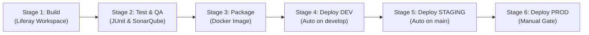

# Liferay DXP GitLab CI/CD Pipeline Reference

This directory provides an enterprise-grade reference implementation for setting up continuous integration and continuous deployment (CI/CD) pipelines for **Liferay DXP / Portal** projects using **GitLab CI/CD**.

---

## 📋 Overview

Liferay projects typically follow the **Liferay Workspace** structure (using Gradle or Maven). Deployments can vary depending on target infrastructure:
1. **Containerized Deployments (Kubernetes / Docker)**: Building custom images containing customized OSGi modules, fragments, configurations, and themes.
2. **Traditional VM / Bare-Metal Deployments**: Transferring compiled artifacts (`.jar` / `.war`) directly into the Tomcat `/opt/liferay/deploy/` directory.
3. **Liferay Cloud (DXP Cloud)**: Leveraging the `lcp` CLI tool or GitOps workflows.

The reference configuration file is located at [`.gitlab-ci.yml`](./docs/reference/liferay-pipeline/.gitlab-ci.yml).

---

## 🛠️ Pipeline Stages Breakdown



### 1. Build (`build:workspace`)
- Uses a containerized JDK 11 or JDK 17 environment (`eclipse-temurin:11-jdk-alpine`).
- Executes `./gradlew clean compileJava compileJSP jar war bundle`.
- Preserves compiled OSGi bundle JARs (`modules/**/build/libs/*.jar`), legacy WARs (`wars/**/build/libs/*.war`), and configurations as GitLab artifacts.
- Employs Gradle caching (`.gradle/caches`) and Node.js caching for frontend themes.

### 2. Test & Quality (`test:unit` & `test:sonarqube`)
- Runs test suites with JUnit XML report parsing directly in GitLab merge requests.
- Integrates with SonarQube Scanner to verify code quality metrics, security hotspots, and code coverage.

### 3. Packaging (`package:docker-image`)
- Uses Docker-in-Docker (`dind`) to build custom Liferay runtime images using standard base images (e.g., `liferay/portal:7.4.3.x` or `liferay/dxp`).
- Pushes images tagged with `$CI_COMMIT_SHORT_SHA` and `:latest` to the GitLab Container Registry.

### 4. Deployments (`deploy:dev`, `deploy:staging`, `deploy:production`)
- Uses `kubectl` (or Helm) to apply zero-downtime rolling updates (`kubectl rollout status`).
- **DEV**: Automatically triggered on commits to the `develop` branch.
- **STAGING**: Automatically triggered on commits to the `main` branch.
- **PRODUCTION**: Gated by manual approval (`when: manual`), requiring a Lead or DevOps engineer to trigger the rollout.

---

## 🚀 Alternative Deployment Targets

### Option A: Direct SSH / Hot-Deploy (Tomcat On-Premise)
If targeting traditional Tomcat servers rather than Kubernetes:

```yaml
deploy:on-prem:
  stage: deploy-dev
  image: alpine:latest
  before_script:
    - apk add --no-cache openssh-client rsync
    - eval $(ssh-agent -s)
    - echo "$SSH_PRIVATE_KEY" | tr -d '\r' | ssh-add -
  script:
    # Synchronize compiled OSGi bundles into Liferay auto-deploy directory
    - rsync -avz --delete modules/**/build/libs/*.jar $SSH_USER@$SERVER_IP:/opt/liferay/deploy/
```

### Option B: Liferay Cloud (DXP Cloud) Deployments
If utilizing Liferay Cloud infrastructure, use the `lcp` CLI:

```yaml
deploy:liferay-cloud:
  stage: deploy-dev
  image: alpine:latest
  before_script:
    - apk add --no-cache curl bash
    - curl -fsSL https://cdn.liferay.cloud/lcp/latest/lcp-linux-amd64 -o /usr/local/bin/lcp
    - chmod +x /usr/local/bin/lcp
  script:
    - lcp login --token "$LCP_PROJECT_TOKEN"
    - lcp deploy --projectId "$LCP_PROJECT_ID" --environment dev
```

---

## 🔒 Recommended GitLab CI/CD Variables

Configure the following variables under **Settings > CI/CD > Variables**:

| Variable Name | Type | Description |
| :--- | :--- | :--- |
| `SONAR_HOST_URL` | Variable | Base URL of your SonarQube / SonarCloud instance |
| `SONAR_TOKEN` | Masked Variable | Authentication token for SonarQube Scanner |
| `KUBECONFIG` | File | Kubeconfig authentication file for target cluster access |
| `LCP_PROJECT_TOKEN` | Masked Variable | API token for Liferay Cloud authentication (if applicable) |
